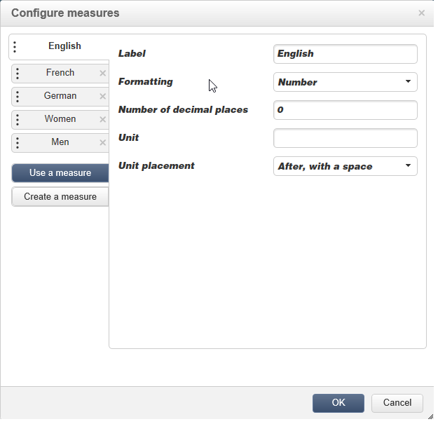

# Best practice per i cubi{#concepts-and-methodology}

## Binning dati {#data-binning}

Il binning consente di semplificare la visualizzazione dei dati raggruppando i valori in base ai criteri. A seconda delle informazioni disponibili, puoi definire gruppi di età, raggruppare i domini e-mail, limitare l’enumerazione dei valori, limitare esplicitamente i dati in modo da visualizzare e raggruppare tutti gli altri dati in una riga o colonna dedicata, ecc.

Nel complesso, sono disponibili tre tipi di binning:

1. Utilizzo di intervalli di valori definiti manualmente. Ad esempio, età, carrello medio, numero di consegne aperte, ecc.). Per ulteriori informazioni, fare riferimento a [Definizione di ogni contenitore](#defining-each-bin).
1. Dinamicamente, a seconda dei valori di un’enumerazione: visualizza solo i valori contenuti nell’enumerazione, tutti gli altri valori sono raggruppati in &quot;Altri&quot;. Per ulteriori informazioni, consulta [Gestione dinamica dei contenitori](#dynamically-managing-bins).
1. Utilizzando intervalli di valori, raggruppando tutti gli altri. Ad esempio, i giovani tra i 18 e i 25 anni, tra i 26 e i 59 anni e gli altri. Per ulteriori informazioni, consulta [Creazione di intervalli di valori](#creating-value-ranges).

Per abilitare il binning, selezionate la casella appropriata durante la creazione della quota.

È possibile creare i raccoglitori manualmente o collegarli a un&#39;enumerazione esistente.

Adobe Campaign fornisce anche un assistente per il binning automatico: i valori possono essere suddivisi in N gruppi o raggruppati in base ai valori più frequenti nel database.

### Definisci ogni raccoglitore {#defining-each-bin}

Per creare ogni raccoglitore singolarmente, selezionare l&#39;opzione **[!UICONTROL Define each bin]** e utilizzare la tabella per creare i vari raccoglitori.

Fare clic sul pulsante **[!UICONTROL Add]** per creare un nuovo raccoglitore ed elencare i valori che verranno raggruppati nel raccoglitore.

Nell&#39;esempio seguente, le lingue sono raggruppate in tre categorie: inglese/tedesco/olandese, francese/italiano/spagnolo e altri.

È possibile utilizzare una maschera SQL per combinare più valori in un filtro. A tale scopo, selezionare **[!UICONTROL Yes]** nella colonna **[!UICONTROL Use an SQL mask]** e immettere il filtro SQL da applicare nella colonna **[!UICONTROL Value or expression]**.

Nell&#39;esempio seguente, tutti i domini e-mail che iniziano con **yahoo** (yahoo.fr, yahoo.com, yahoo.be, ecc.) o con **ymail** (ymail.com, ymail.eu, ecc.) verranno raggruppati sotto l&#39;etichetta **YAHOO!**, nonché gli indirizzi con il dominio **rocketmail.com**.

### Gestione dinamica dei contenitori {#dynamically-managing-bins}

I valori possono essere gestiti dinamicamente tramite enumerazioni. Ciò significa che verranno visualizzati solo i valori contenuti nell’enumerazione. Quando i valori di enumerazione cambiano, il contenuto del cubo viene adattato automaticamente.

Per creare questo tipo di binning di valore, attieniti alla procedura seguente:

1. Crea una nuova dimensione e abilita il binning.
1. Selezionare l&#39;opzione **[!UICONTROL Dynamically link the values to an enumeration]** e l&#39;enumerazione corrispondente.

   

   Ogni volta che i valori di enumerazione vengono aggiornati, i raccoglitori corrispondenti vengono adattati automaticamente.

### Creare intervalli di valori {#creating-value-ranges}

Puoi raggruppare i valori in intervalli in base a un intervallo desiderato.

Per definire manualmente gli intervalli, fare clic sul pulsante **[!UICONTROL Add]** e selezionare **[!UICONTROL Define a range]**:

Specificare quindi i limiti inferiore e superiore e fare clic su **[!UICONTROL Ok]** per confermare.

### Genera automaticamente raccoglitori {#generating-bins-automatically}

È inoltre possibile generare automaticamente i raccoglitori. A tale scopo, fare clic sul collegamento **[!UICONTROL Generate bins...]**.

Puoi effettuare le seguenti operazioni:

* Recupera i valori utilizzati più di frequente

  Nell’esempio seguente, vengono visualizzati i 4 valori utilizzati più di frequente, mentre gli altri vengono contati e raggruppati nella categoria &quot;Altri&quot;.

* Generare raccoglitori sotto forma di slot

  Nell’esempio seguente, Adobe Campaign crea automaticamente 4 slot di valori delle stesse dimensioni per visualizzare i valori nel database.

In questo caso, il filtro selezionato nello schema dei fatti viene ignorato.

### Enumerazioni {#enumerations}

Per migliorare la pertinenza e la leggibilità di un rapporto, Adobe Campaign consente di creare enumerazioni specifiche per raggruppare valori diversi nello stesso raccoglitore. Queste enumerazioni, riservate al binning, sono referenziate nei cubi e quindi visualizzate nei rapporti.

Adobe Campaign offre anche un’enumerazione sui domini che consente di visualizzare un elenco dei domini e-mail di tutti i contatti nel database, raggruppati per ISP, come illustrato nell’esempio seguente:

Viene creato utilizzando il seguente modello:

Per creare un report utilizzando questa enumerazione, creare un cubo utilizzando la dimensione **[!UICONTROL Email domain]**. Scegliere l&#39;opzione **[!UICONTROL Enable binning]** e quindi **[!UICONTROL Dynamically link the values to an enumeration]**. Selezionare quindi l&#39;enumerazione **Domains** come illustrato in precedenza. Tutti i valori senza alias specificato verranno raggruppati sotto l&#39;etichetta **Altri**.

Quindi, crea un report basato su questo cubo per visualizzare i valori.

È sufficiente modificare l’enumerazione per aggiornare il rapporto correlato. Ad esempio, crea il valore **Adobe** e aggiungi l&#39;alias **adobe.com**. Il report verrà aggiornato automaticamente con il valore Adobe a livello di enumerazione.

L&#39;enumerazione **[!UICONTROL Domains]** viene utilizzata per generare report incorporati che visualizzano l&#39;elenco dei domini. Per adattare il contenuto di questi rapporti, puoi modificare questo elenco.

È possibile creare altre enumerazioni riservate per il binning e utilizzarle in altri cubi: tutti i valori alias verranno raggruppati nei raccoglitori specificati nella prima scheda di enumerazione.

## Calcolare e utilizzare gli aggregati {#calculating-and-using-aggregates}

I volumi di dati più grandi possono essere calcolati in aggregati.

Gli aggregati sono utili quando si manipolano grandi volumi di dati. Vengono aggiornati automaticamente in base alle impostazioni definite nella casella del flusso di lavoro dedicato, per integrare negli indicatori i dati raccolti più di recente

Gli aggregati vengono definiti nella scheda relativa di ciascun cubo.

>[!NOTE]
>
>Il flusso di lavoro per l’aggiornamento dei calcoli aggregati può essere configurato nell’aggregato stesso, oppure l’aggregato può essere aggiornato tramite un flusso di lavoro esterno collegato al cubo pertinente.

Per creare un nuovo aggregato, attenersi alla procedura descritta di seguito.

1. Fare clic sulla scheda **[!UICONTROL Aggregates]** del cubo, quindi sul pulsante **[!UICONTROL Add]**.

   

1. Inserisci un’etichetta per l’aggregato, quindi aggiungi le dimensioni da calcolare.

   

1. Selezionate una quota e un livello. Ripetere questo processo per ogni dimensione e livello.
1. Fare clic sulla scheda **[!UICONTROL Workflow]** per creare il flusso di lavoro di aggregazione.

   

   * L&#39;attività **[!UICONTROL Scheduler]** consente di definire la frequenza degli aggiornamenti di calcolo. La pianificazione è descritta in [questa sezione](../../workflow/using/scheduler.md).
   * L&#39;attività **[!UICONTROL Aggregate update]** consente di selezionare la modalità di aggiornamento da applicare: completo o parziale.

     Per impostazione predefinita, durante ogni calcolo viene eseguito un aggiornamento completo. Per abilitare un aggiornamento parziale, seleziona l’opzione pertinente e definisci le condizioni di aggiornamento.

     

## Definire le misure {#defining-measures}

I tipi di misure sono definiti nella scheda **[!UICONTROL Measures]** del cubo. Puoi calcolare somme, medie, deviazioni, ecc.

È possibile creare tutte le misure necessarie, quindi selezionare la misura da mostrare o nascondere nella tabella. Per ulteriori informazioni, consulta [Visualizzazione delle misure](#displaying-measures).

Per definire una nuova misura, attenersi alla seguente procedura:

1. Fare clic sul pulsante **[!UICONTROL Add]** sopra l&#39;elenco delle misure e selezionare il tipo di misura e la formula da calcolare.

   

1. Se necessario, e a seconda dell’operatore, scegli l’espressione interessata dall’operazione.

   Il pulsante **[!UICONTROL Advanced selection]** consente di creare formule di calcolo complesse. Per ulteriori informazioni al riguardo, consulta [questa sezione](../../platform/using/adobe-campaign-workspace.md#about-queries-in-campaign).

   

1. Il collegamento **[!UICONTROL Filter the measure data...]** consente di limitare il campo di calcolo e di applicarlo solo a dati specifici nel database.

   

1. Immettere l&#39;etichetta della misura e aggiungere una descrizione, quindi fare clic su **[!UICONTROL Finish]** per crearla.

## Visualizza misure {#displaying-measures}

Puoi configurare la visualizzazione delle misure nella tabella in base alle tue esigenze:

* la sequenza di visualizzazione delle misure (fare riferimento a [Sequenza di visualizzazione](#display-sequence)),
* le informazioni da mostrare/nascondere nel report (fare riferimento a [Configurare la visualizzazione](#configuring-the-display))
* quali misure visualizzare: percentuale, totale, numero di decimali, ecc. (fare riferimento a [Modificare il tipo di misura visualizzato](#changing-the-type-of-measure-displayed)).

### Sequenza di visualizzazione {#display-sequence}

Le misure calcolate nel cubo vengono configurate tramite il pulsante **[!UICONTROL Measures]**.

Spostate le linee per modificare la sequenza di visualizzazione. Nell&#39;esempio seguente, i dati francesi vengono spostati in fondo all&#39;elenco, ovvero vengono visualizzati nell&#39;ultima colonna.

### Configurare la visualizzazione {#configuring-the-display}

La configurazione di misure, linee e colonne può essere eseguita singolarmente per ciascuna misura o in generale. Un’icona specifica ti consente di accedere alla finestra di selezione della modalità di visualizzazione.

* Fare clic sull&#39;icona **[!UICONTROL Edit the configuration of the pivot table]** per accedere alla finestra di configurazione.

  È possibile scegliere se visualizzare o meno le etichette delle misure e configurarne il layout (righe o colonne).

Le opzioni di colore consentono di evidenziare valori importanti per facilitarne la lettura.

### Modificare il tipo di misura visualizzato {#changing-the-type-of-measure-displayed}

All’interno di ogni misura, puoi definire l’unità e la formattazione da applicare.

## Condividere il rapporto {#sharing-a-report}

Una volta configurato il rapporto, puoi salvarlo e condividerlo con altri operatori.

A tale scopo, fare clic sull&#39;icona **[!UICONTROL Show the report properties]** e abilitare l&#39;opzione **[!UICONTROL Share this report]**.

Specifica la categoria a cui appartiene il rapporto e la relativa pertinenza. Per ulteriori informazioni, consulta in [questa pagina](../../reporting/using/configuring-access-to-the-report.md#report-display-context) le sezioni **Sequenza di visualizzazione** e **Definizione delle opzioni di filtro**.

Per confermare queste modifiche, devi salvare il rapporto.

## Creare i filtri {#creating-filters}

È possibile creare filtri per la visualizzazione di una sezione dei dati.

Per eseguire questa operazione:

1. Fare clic sull&#39;icona **[!UICONTROL Add a filter]**.

   

1. Seleziona la dimensione interessata dal filtro

   

1. Selezionare il tipo di filtro e il relativo livello di precisione.

   

1. Una volta creato, il filtro viene visualizzato sopra il rapporto.

   

   Fai clic sul filtro per modificarlo.

   Fai clic sulla croce per eliminarla.

   Puoi combinare tutti i filtri necessari: verranno tutti visualizzati in quest’area.

   

Ogni volta che si modifica un filtro (aggiungi, rimuovi, modifica), il rapporto deve essere ricalcolato.

I filtri possono essere creati anche in base a una selezione. A tale scopo, selezionare le celle, le righe e le colonne di origine, quindi fare clic sull&#39;icona **[!UICONTROL Add a filter]**.

Per selezionare una riga, una colonna o una cella, fare clic su di essa con il pulsante sinistro del mouse. Per deselezionare, fai di nuovo clic su.

Il filtro viene applicato automaticamente e aggiunto alla zona del filtro sopra il rapporto.

