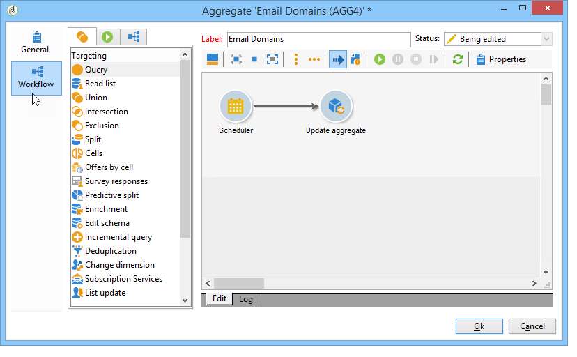

# Best practice per i cubi{#concepts-and-methodology}

## Associazione dei dati {#data-binning}

Il binding consente di semplificare la visualizzazione dei dati raggruppando i valori in base ai criteri. A seconda delle informazioni disponibili, puoi definire gruppi di età, raggruppare domini e-mail, limitare a un’enumerazione di valori, limitare esplicitamente i dati per visualizzare e raggruppare tutti gli altri dati in una riga o colonna dedicata, ecc.

Nel complesso sono disponibili tre tipi di legatura:

1. Utilizzo di intervalli di valori definiti manualmente. Ad esempio, età, carrello acquisti medio, numero di consegne aperte, ecc.). Per ulteriori informazioni, consulta [Definizione di ciascun contenitore](#defining-each-bin).
1. In modo dinamico, a seconda dei valori di un’enumerazione: visualizza solo i valori contenuti nell&#39;enumerazione; tutti gli altri valori sono raggruppati in &quot;Altri&quot;. Per ulteriori informazioni, consulta [Gestione dinamica dei contenitori](#dynamically-managing-bins).
1. Utilizzando intervalli di valori, tutti gli altri vengono raggruppati insieme. Ad esempio, dai 18 ai 25 anni, dai 26 ai 59 anni e gli altri. Per ulteriori informazioni, consulta [Creazione di intervalli di valori](#creating-value-ranges).

Per abilitare il binding, seleziona la casella appropriata durante la creazione della dimensione.

Puoi creare i contenitori manualmente o collegarli a un’enumerazione esistente.

Adobe Campaign fornisce anche un assistente per il binning automatico: I valori possono essere suddivisi in gruppi N o raggruppati in base ai valori più frequenti nel database.

### Definire ciascun contenitore {#defining-each-bin}

Per creare ogni bin singolarmente, seleziona la **[!UICONTROL Define each bin]** e utilizza la tabella per creare i vari contenitori.

Fai clic sul pulsante **[!UICONTROL Add]** per creare un nuovo bin ed elencare i valori che verranno raggruppati nel bin.

Nell’esempio seguente, le lingue sono raggruppate in tre categorie: Inglese/tedesco/olandese, francese/italiano/spagnolo e altri.

È possibile utilizzare una maschera SQL per combinare più valori in un filtro. Per eseguire questa operazione, controlla **[!UICONTROL Yes]** in **[!UICONTROL Use an SQL mask]** e immetti il filtro SQL da applicare nella colonna **[!UICONTROL Value or expression]** colonna.

Nell’esempio seguente, tutti i domini e-mail con cui inizia **yahoo** (yahoo.fr, yahoo.com, yahoo.be, ecc.), o con **ymail** (ymail.com, ymail.eu, ecc.) sarà raggruppato sotto l&#39;etichetta **AHO!**, nonché gli indirizzi con **rocketmail.com** dominio.

### Gestione dinamica dei contenitori {#dynamically-managing-bins}

I valori possono essere gestiti in modo dinamico tramite enumerazioni. Ciò significa che verranno visualizzati solo i valori contenuti nell’enumerazione. Quando i valori di enumerazione cambiano, il contenuto del Cubo viene adattato automaticamente.

Per creare questo tipo di binding dei valori, procedi come segue:

1. Crea una nuova dimensione e abilita il binding.
1. Seleziona la **[!UICONTROL Dynamically link the values to an enumeration]** e seleziona l&#39;enumerazione corrispondente.

   

   Ogni volta che i valori di enumerazione vengono aggiornati, i contenitori corrispondenti vengono adattati automaticamente.

### Creazione di intervalli di valori {#creating-value-ranges}

Puoi raggruppare i valori in intervalli in base a un intervallo desiderato.

Per definire manualmente gli intervalli, fai clic sul pulsante **[!UICONTROL Add]** e seleziona **[!UICONTROL Define a range]** :

Quindi specifica i limiti inferiore e superiore e fai clic su **[!UICONTROL Ok]** per confermare.

### Genera i bins automaticamente {#generating-bins-automatically}

È anche possibile generare automaticamente i bins. A questo scopo, fai clic sul pulsante **[!UICONTROL Generate bins...]** link.

Puoi effettuare le seguenti operazioni:

* Recupera i valori più utilizzati

   Nell’esempio seguente vengono visualizzati i 4 valori più utilizzati, mentre gli altri vengono conteggiati e raggruppati nella categoria &quot;Altri&quot;.

* Generare contenitori sotto forma di slot

   Nell’esempio seguente, Adobe Campaign crea automaticamente 4 slot per valori delle stesse dimensioni per visualizzare i valori nel database.

In questo caso, il filtro selezionato nello schema dei fatti viene ignorato.

### Enumerazioni {#enumerations}

Per migliorare la pertinenza e la leggibilità di un rapporto, Adobe Campaign consente di creare enumerazioni specifiche per raggruppare valori diversi nello stesso contenitore. Queste enumerazioni, riservate al binning, sono indicate nei cubi che vengono poi visualizzati nei rapporti.

Adobe Campaign offre anche un’enumerazione sui domini che ti consente di visualizzare un elenco dei domini e-mail di tutti i contatti nel database, raggruppati da ISP, come mostrato nell’esempio seguente:

Viene generato utilizzando il seguente modello:

Per creare un rapporto utilizzando questa enumerazione, crea un cubo utilizzando **[!UICONTROL Email domain]** dimensione. Scegli la **[!UICONTROL Enable binning]** opzione then **[!UICONTROL Dynamically link the values to an enumeration]**. Quindi seleziona la **Domini** enumerazione come illustrato in precedenza. Tutti i valori privi di alias specificati verranno raggruppati sotto la variabile **Altro** etichetta.

Quindi, crea un rapporto basato su questo Cubo per visualizzare i valori.

È sufficiente modificare l’enumerazione per aggiornare il rapporto correlato. Ad esempio, crea **Adobe** e aggiungi il **adobe.com** alias e il report viene aggiornato automaticamente con il valore Adobe a livello di enumerazione.

La **[!UICONTROL Domains]** L’enumerazione viene utilizzata per generare rapporti incorporati che visualizzano l’elenco dei domini. Per adattare il contenuto di questi rapporti, è possibile modificare questo elenco.

Puoi creare altre enumerazioni riservate al binding e utilizzarle in altri Cubi: tutti i valori alias verranno raggruppati nei contenitori specificati nella prima scheda enumerazione.

## Calcolare e utilizzare gli aggregati {#calculating-and-using-aggregates}

I maggiori volumi di dati possono essere calcolati in aggregati.

Gli aggregati sono utili per la manipolazione di grandi volumi di dati. Vengono aggiornati automaticamente in base alle impostazioni definite nella casella del flusso di lavoro dedicata, per integrare i dati raccolti più di recente negli indicatori

Gli aggregati sono definiti nella scheda pertinente di ciascun cubo.

>[!NOTE]
>
>Il flusso di lavoro per l’aggiornamento dei calcoli aggregati può essere configurato nell’aggregato stesso, oppure l’aggregato può essere aggiornato tramite un flusso di lavoro esterno collegato al cubo pertinente.

Per creare un nuovo aggregato, effettua le seguenti operazioni:

1. Fai clic sul pulsante **[!UICONTROL Aggregates]** scheda del cubo, quindi fai clic sul pulsante **[!UICONTROL Add]** pulsante .

   

1. Inserisci un’etichetta per l’aggregato, quindi aggiungi le dimensioni da calcolare.

   

1. Seleziona una dimensione e un livello. Ripeti questo processo per ogni dimensione e livello.
1. Fai clic sul pulsante **[!UICONTROL Workflow]** per creare il flusso di lavoro di aggregazione.

   

   * La **[!UICONTROL Scheduler]** L’attività ti consente di definire la frequenza degli aggiornamenti di calcolo. Lo scheduler è descritto in [questa sezione](../../workflow/using/scheduler.md).
   * La **[!UICONTROL Aggregate update]** activity ti consente di selezionare la modalità di aggiornamento che desideri applicare: completo o parziale.

      Per impostazione predefinita, durante ogni calcolo viene eseguito un aggiornamento completo. Per abilitare un aggiornamento parziale, seleziona l’opzione pertinente e definisci le condizioni di aggiornamento.

      

## Definire le misure {#defining-measures}

I tipi di misure sono definiti nella **[!UICONTROL Measures]** scheda del cubo. Puoi calcolare somme, medie, deviazioni, ecc.

Puoi creare tutte le misure necessarie: quindi selezionate la misura da visualizzare o nascondere nella tabella. Per ulteriori informazioni, consulta [Visualizzazione delle misure](#displaying-measures).

Per definire una nuova misura, effettua le seguenti operazioni:

1. Fai clic sul pulsante **[!UICONTROL Add]** al di sopra dell&#39;elenco delle misure e selezionare il tipo di misura e la formula da calcolare.

   

1. Se necessario, e a seconda dell&#39;operatore, scegliere l&#39;espressione che l&#39;operazione riguarda.

   La **[!UICONTROL Advanced selection]** consente di creare formule di calcolo complesse. Per ulteriori informazioni al riguardo, consulta [questa sezione](../../platform/using/about-queries-in-campaign.md).

   

1. La **[!UICONTROL Filter the measure data...]** link ti consente di limitare il campo di calcolo e di applicarlo solo a dati specifici nel database.

   

1. Inserisci l’etichetta della misura e aggiungi una descrizione, quindi fai clic su **[!UICONTROL Finish]** per crearlo.

## Misure di visualizzazione {#displaying-measures}

Puoi configurare la visualizzazione delle misure nella tabella in base alle tue esigenze:

* la sequenza di visualizzazione delle misure (fare riferimento a [Sequenza di visualizzazione](#display-sequence)),
* le informazioni da mostrare o nascondere nel rapporto (consulta [Configurare la visualizzazione](#configuring-the-display))
* quali misure sono indicate: percentuale, totale, numero di decimali, ecc. (fare riferimento a [Modificare il tipo di misura visualizzato](#changing-the-type-of-measure-displayed)).

### Sequenza di visualizzazione {#display-sequence}

Le misure calcolate nel cubo sono configurate tramite il **[!UICONTROL Measures]** pulsante .

Spostare le linee per modificare la sequenza di visualizzazione. Nell’esempio seguente, i dati francesi vengono spostati in fondo all’elenco: questo significa che verrà visualizzato nell’ultima colonna.

### Configurare la visualizzazione {#configuring-the-display}

La configurazione delle misure, delle linee e delle colonne può essere effettuata singolarmente per ogni misura o complessivamente. Un’icona specifica consente di accedere alla finestra di selezione della modalità di visualizzazione.

* Fai clic sul pulsante **[!UICONTROL Edit the configuration of the pivot table]** per accedere alla finestra di configurazione.

   È possibile scegliere se visualizzare o meno le etichette delle misure e configurarne il layout (linee o colonne).

Le opzioni colore consentono di evidenziare valori importanti per una facile lettura.

### Modificare il tipo di misura visualizzato {#changing-the-type-of-measure-displayed}

All’interno di ogni misura, è possibile definire l’unità e la formattazione da applicare.

## Condividere il rapporto {#sharing-a-report}

Una volta configurato il rapporto, puoi salvarlo e condividerlo con altri operatori.

A questo scopo, fai clic sul pulsante **[!UICONTROL Show the report properties]** e abilita **[!UICONTROL Share this report]** opzione .

Specifica la categoria a cui appartiene il rapporto e la sua rilevanza. Per ulteriori informazioni, consulta [questa pagina](../../reporting/using/configuring-access-to-the-report.md#report-display-context) al **Sequenza di visualizzazione** e **Definizione delle opzioni di filtro** sezioni.

Per confermare queste modifiche, è necessario salvare il rapporto.

## Creare i filtri {#creating-filters}

È possibile creare filtri per la visualizzazione di una sezione dei dati.

Per eseguire questa operazione:

1. Fai clic sul pulsante **[!UICONTROL Add a filter]** icona.

   

1. Selezionare la dimensione di cui si occupa il filtro

   

1. Selezionare il tipo di filtro e il relativo livello di precisione.

   

1. Una volta creato, il filtro viene visualizzato sopra il rapporto.

   

   Fai clic sul filtro per modificarlo.

   Fate clic sulla croce per eliminarla.

   Puoi combinare quanti filtri sono necessari: verranno mostrati tutti in quest&#39;area.

   

Ogni volta che un filtro viene modificato (aggiungi, rimuovi, modifica), il rapporto deve essere ricalcolato.

È inoltre possibile creare filtri in base a una selezione. A questo scopo, seleziona le celle, le linee e le colonne di origine, quindi fai clic sul pulsante **[!UICONTROL Add a filter]** icona.

Per selezionare una riga, una colonna o una cella, fare clic con il pulsante sinistro del mouse su di essa. Per deselezionare, fai di nuovo clic su .

Il filtro viene applicato automaticamente e aggiunto alla zona filtro sopra il rapporto.

