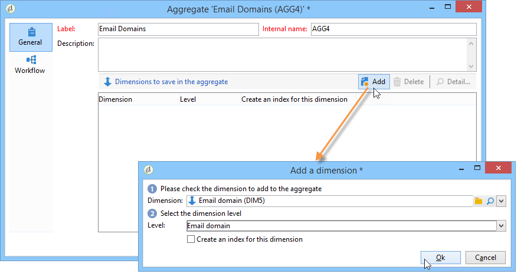
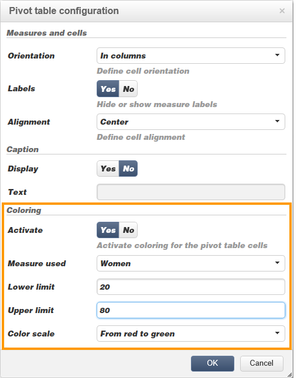

# Best practice per i cubi{#concepts-and-methodology}

## Binding dei dati {#data-binning}

Il binding consente di semplificare la visualizzazione dei dati raggruppando i valori in base ai criteri. A seconda delle informazioni disponibili, è possibile definire gruppi di età, raggruppare domini e-mail, limitare l&#39;enumerazione di valori, limitare esplicitamente i dati per visualizzare e raggruppare tutti gli altri dati in una riga o colonna dedicata, ecc.

Nel complesso, sono disponibili tre tipi di binding:

1. Utilizzo di intervalli di valori definiti manualmente. Ad esempio, età, carrello acquisti medio, numero di consegne aperte, ecc.). For more on this, refer to [Defining each bin](#defining-each-bin).
1. In modo dinamico, a seconda dei valori di un&#39;enumerazione: visualizza solo i valori contenuti nell&#39;enumerazione, tutti gli altri valori sono raggruppati in &#39;Others&#39;. Per ulteriori informazioni, vedere Gestione [dinamica dei](#dynamically-managing-bins)contenitori.
1. Utilizzando intervalli di valori, tutti gli altri vengono raggruppati. Ad esempio, bambini dai 18 ai 25 anni, dai 26 ai 59 anni e gli altri. Per ulteriori informazioni, vedere [Creazione di intervalli](#creating-value-ranges)di valori.

Per abilitare il binning, selezionare la casella appropriata al momento della creazione della quota.

È possibile creare i contenitori manualmente oppure collegarli a un&#39;enumerazione esistente.

 Adobe Campaign fornisce anche un assistente per il binning automatico: i valori possono essere suddivisi in gruppi N o raggruppati in base ai valori più frequenti nel database.

### Definizione di ciascun raccoglitore {#defining-each-bin}

Per creare ciascun raccoglitore singolarmente, selezionate l&#39; **[!UICONTROL Define each bin]** opzione e utilizzate la tabella per creare i vari contenitori.

Fate clic sul **[!UICONTROL Add]** pulsante per creare un nuovo raccoglitore ed elencare i valori che verranno raggruppati nel raccoglitore.

Nell&#39;esempio seguente, le lingue sono raggruppate in tre categorie: Inglese/tedesco/olandese, francese/italiano/spagnolo e altri.

Potete usare una maschera SQL per combinare più valori in un filtro. A questo scopo, controllate **[!UICONTROL Yes]** nella **[!UICONTROL Use an SQL mask]** colonna e immettete il filtro SQL da applicare nella **[!UICONTROL Value or expression]** colonna.

Nell&#39;esempio seguente, tutti i domini e-mail che iniziano con **yahoo** (yahoo.fr, yahoo.com, yahoo.be, ecc.), o con **ymail** (ymail.com, ymail.eu, ecc.) verranno raggruppati sotto l&#39;etichetta **YAHOO!**, nonché gli indirizzi con il dominio **rocketmail.com** .

### Gestione dinamica dei contenitori {#dynamically-managing-bins}

I valori possono essere gestiti in modo dinamico tramite enumerazioni. Ciò significa che verranno visualizzati solo i valori contenuti nell&#39;enumerazione. Quando i valori di enumerazione cambiano, il contenuto del cubo viene adattato automaticamente.

Per creare questo tipo di associazione di valori, procedere come segue:

1. Crea una nuova dimensione e abilita il collegamento.
1. Selezionare l&#39; **[!UICONTROL Dynamically link the values to an enumeration]** opzione e selezionare l&#39;enumerazione corrispondente.

   

   Ogni volta che i valori di enumerazione vengono aggiornati, i contenitori corrispondenti vengono adattati automaticamente.

### Creazione di intervalli di valori {#creating-value-ranges}

Potete raggruppare i valori in intervalli in base a un intervallo desiderato.

Per definire manualmente gli intervalli, fate clic sul **[!UICONTROL Add]** pulsante e selezionate **[!UICONTROL Define a range]** :

Quindi specificate i limiti inferiore e superiore e fate clic **[!UICONTROL Ok]** per confermare.

### Generazione automatica dei raccoglitori {#generating-bins-automatically}

È inoltre possibile generare automaticamente i raccoglitori. A tale scopo, fare clic sul **[!UICONTROL Generate bins...]** collegamento.

Potete effettuare le seguenti operazioni:

* Recuperare i valori più utilizzati

   Nell&#39;esempio seguente, verranno visualizzati i 4 valori utilizzati più di frequente, mentre gli altri saranno contati e raggruppati nella categoria &quot;Altri&quot;.

* Generazione di raccoglitori sotto forma di slot

   Nell&#39;esempio seguente,  Adobe Campaign crea automaticamente 4 slot per valori delle stesse dimensioni per visualizzare i valori nel database.

In questo caso, il filtro selezionato nello schema dei fatti viene ignorato.

### Enumerazioni {#enumerations}

Per migliorare la pertinenza e la leggibilità di un rapporto,  Adobe Campaign consente di creare enumerazioni specifiche per raggruppare valori diversi nello stesso raccoglitore. Queste enumerazioni, riservate al binning, fanno riferimento ai cubi visualizzati nei report.

 Adobe Campaign offre anche un&#39;enumerazione sui domini che consente di visualizzare un elenco dei domini e-mail di tutti i contatti nel database, raggruppati da ISP, come illustrato nell&#39;esempio seguente:

Viene creato utilizzando il seguente modello:

Per creare un rapporto utilizzando questa enumerazione, crea un cubo utilizzando la **[!UICONTROL Email domain]** dimensione. Choose the **[!UICONTROL Enable binning]** option then **[!UICONTROL Dynamically link the values to an enumeration]**. Quindi selezionate l&#39;enumerazione **Domains** come mostrato sopra. Tutti i valori privi di alias specificato verranno raggruppati sotto l&#39;etichetta **Altri** .

Quindi, crea un rapporto basato su questo Cubo per visualizzare i valori.

È sufficiente modificare l&#39;enumerazione per aggiornare il rapporto correlato. Ad esempio, create il valore **Adobe** e aggiungete l&#39;alias **adobe.com** ; il rapporto viene aggiornato automaticamente con il valore  Adobe a livello di enumerazione.

L&#39; **[!UICONTROL Domains]** enumerazione viene utilizzata per generare rapporti incorporati che visualizzano l&#39;elenco dei domini. Per adattare il contenuto di questi rapporti, potete modificare questo elenco.

Puoi creare altre enumerazioni riservate al binning e utilizzarle in altri Cubi: tutti i valori alias verranno raggruppati nei contenitori specificati nella prima scheda di enumerazione.

## Calcolo e utilizzo degli aggregati {#calculating-and-using-aggregates}

I maggiori volumi di dati possono essere calcolati in aggregati.

Gli aggregati sono utili per la manipolazione di grandi volumi di dati. Vengono aggiornati automaticamente in base alle impostazioni definite nella casella dedicata al flusso di lavoro, per integrare i dati raccolti più di recente negli indicatori

Gli aggregati sono definiti nella scheda pertinente di ciascun cubo.

>[!NOTE]
>
>Il flusso di lavoro per l&#39;aggiornamento dei calcoli aggregati può essere configurato nell&#39;aggregazione stessa, oppure l&#39;aggregazione può essere aggiornata tramite un flusso di lavoro esterno collegato al cubo interessato.

Per creare un nuovo aggregato, procedere come segue:

1. Fare clic sulla **[!UICONTROL Aggregates]** scheda del cubo, quindi fare clic sul **[!UICONTROL Add]** pulsante.

   

1. Immettete un&#39;etichetta per l&#39;aggregazione, quindi aggiungete le dimensioni da calcolare.

   

1. Selezionare una dimensione e un livello. Ripetete questo processo per ogni dimensione e livello.
1. Fare clic sulla **[!UICONTROL Workflow]** scheda per creare il flusso di lavoro di aggregazione.

   

   * L&#39; **[!UICONTROL Scheduler]** attività consente di definire la frequenza degli aggiornamenti di calcolo. Il pianificatore è dettagliato in [questa sezione](../../workflow/using/scheduler.md).
   * L&#39; **[!UICONTROL Aggregate update]** attività consente di selezionare la modalità di aggiornamento da applicare: pieno o parziale.

      Per impostazione predefinita, durante ogni calcolo viene eseguito un aggiornamento completo. Per abilitare un aggiornamento parziale, selezionate l&#39;opzione pertinente e definite le condizioni di aggiornamento.

      

## Definizione delle misure {#defining-measures}

I tipi di misure sono definiti nella **[!UICONTROL Measures]** scheda del cubo. Potete calcolare somme, medie, deviazioni, ecc.

Potete creare tutte le misure necessarie: quindi selezionate la misura da visualizzare o nascondere nella tabella. For more on this, refer to [Displaying measures](#displaying-measures).

Per definire una nuova misura, procedere come segue:

1. Fare clic sul **[!UICONTROL Add]** pulsante sopra l&#39;elenco delle misure e selezionare il tipo di misura e la formula da calcolare.

   

1. Se necessario, e a seconda dell&#39;operatore, scegliere l&#39;espressione interessata dall&#39;operazione.

   Il **[!UICONTROL Advanced selection]** pulsante consente di creare formule di calcolo complesse. Per ulteriori informazioni al riguardo, consulta [questa sezione](../../platform/using/about-queries-in-campaign.md).

   

1. Il **[!UICONTROL Filter the measure data...]** collegamento consente di limitare il campo di calcolo e di applicarlo solo a dati specifici nel database.

   

1. Immettete l’etichetta della misura e aggiungete una descrizione, quindi fate clic **[!UICONTROL Finish]** per crearla.

## Visualizzazione delle misure {#displaying-measures}

Puoi configurare la visualizzazione delle misure nella tabella in base alle tue esigenze:

* la sequenza di visualizzazione delle misure (fare riferimento alla sequenza [di](#display-sequence)visualizzazione),
* le informazioni da visualizzare/nascondere nel rapporto (vedere [Configurazione della visualizzazione](#configuring-the-display))
* quali misure visualizzare: percentuale, totale, numero di decimali, ecc. (vedere [Modifica del tipo di misura visualizzato](#changing-the-type-of-measure-displayed)).

### Sequenza di visualizzazione {#display-sequence}

Le misure calcolate nel cubo sono configurate tramite il **[!UICONTROL Measures]** pulsante.

Spostare le righe per cambiare la sequenza di visualizzazione. Nell&#39;esempio seguente, i dati francesi vengono spostati in fondo all&#39;elenco: questo significa che verrà visualizzato nell&#39;ultima colonna.

### Configurazione della visualizzazione {#configuring-the-display}

La configurazione di misure, linee e colonne può essere effettuata individualmente per ogni misura o nel complesso. Un&#39;icona specifica consente di accedere alla finestra di selezione della modalità di visualizzazione.

* Fate clic sull&#39; **[!UICONTROL Edit the configuration of the pivot table]** icona per accedere alla finestra di configurazione.

   Potete scegliere se visualizzare o meno le etichette delle misure e configurarne il layout (righe o colonne).

Le opzioni colore consentono di evidenziare valori importanti per una lettura semplice.

### Modifica del tipo di misura visualizzato {#changing-the-type-of-measure-displayed}

All&#39;interno di ogni misura, è possibile definire l&#39;unità e la formattazione da applicare.

## Condivisione di un rapporto {#sharing-a-report}

Una volta configurato il rapporto, puoi salvarlo e condividerlo con altri operatori.

A questo scopo, fate clic sull&#39; **[!UICONTROL Show the report properties]** icona e abilitate l&#39; **[!UICONTROL Share this report]** opzione.

Specifica la categoria a cui appartiene il rapporto e la sua rilevanza. Per ulteriori informazioni, vedere in [questa pagina](../../reporting/using/configuring-access-to-the-report.md#report-display-context) la **sequenza Visualizza** e **Definizione delle sezioni relative alle opzioni** di filtro.

Per confermare queste modifiche, è necessario salvare il rapporto.

## Creazione di filtri {#creating-filters}

È possibile creare filtri per la visualizzazione di una sezione dei dati.

Per eseguire questa operazione:

1. Fate clic sull&#39; **[!UICONTROL Add a filter]** icona.

   

1. Selezionare la dimensione interessata dal filtro

   

1. Selezionare il tipo di filtro e il suo livello di precisione.

   

1. Una volta creato, il filtro viene visualizzato sopra il rapporto.

   

   Fate clic sul filtro per modificarlo.

   Fate clic sulla croce per eliminarla.

   Potete combinare tutti i filtri necessari: verranno visualizzati tutti in quest&#39;area.

   

Ogni volta che un filtro viene modificato (aggiungi, rimuovi, modifica), il rapporto deve essere ricalcolato.

I filtri possono essere creati anche in base a una selezione. A questo scopo, seleziona le celle, le linee e le colonne di origine, quindi fai clic sull&#39; **[!UICONTROL Add a filter]** icona .

Per selezionare una riga, una colonna o una cella, fare clic su di essa con il pulsante sinistro del mouse. Per deselezionare, fate di nuovo clic.

Il filtro viene applicato automaticamente e aggiunto alla zona del filtro sopra il rapporto.

