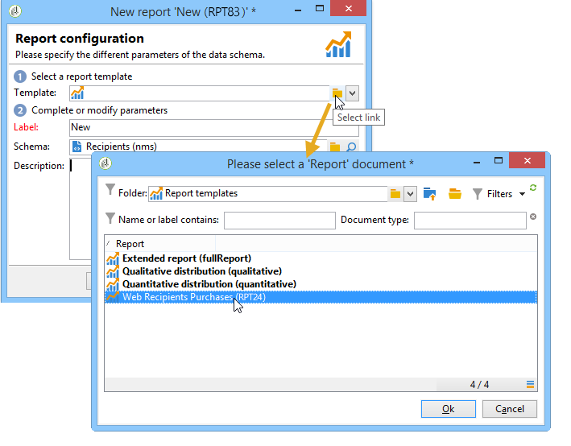

# Configurare l’accesso al rapporto{#configuring-access-to-the-report}

## Contesto di visualizzazione del rapporto {#report-display-context}

Definire il contesto di visualizzazione del report nella piattaforma Adobe Campaign utilizzando la scheda **[!UICONTROL Display]**. L’accesso a un rapporto dipende dal tipo di selezione, dalle condizioni di visualizzazione e dalle autorizzazioni di accesso corrispondenti.

### Tipo di selezione {#selection-type}

L’accesso al rapporto può essere limitato a un contesto specifico o a uno spazio dell’offerta, ad esempio una consegna, un destinatario, una selezione di destinatari e così via. Questo accesso è configurato nella sezione **[!UICONTROL Selection type]** della scheda **[!UICONTROL Display]**.

* **[!UICONTROL Single selection]** : il report è accessibile solo quando è selezionata un&#39;entità specifica.
* **[!UICONTROL Multiple selection]** : il report è accessibile quando sono selezionate più entità.
* **[!UICONTROL Global]** : il report è accessibile tramite l&#39;elenco dei report disponibili nella scheda **[!UICONTROL Reports]**.

### Sequenza di visualizzazione {#display-sequence}

Il campo **[!UICONTROL Sequence]** consente di immettere un valore numerico che specifica la sequenza di visualizzazione del report nell&#39;elenco.

Per impostazione predefinita, i rapporti vengono visualizzati in base alla rilevanza: il valore inserito in questo campo consente di ordinare i rapporti dal valore più (valore più alto) al valore meno (valore più piccolo) pertinente.

È possibile selezionare la scala da utilizzare in base alle proprie esigenze: da 1 a 10, da 0 a 100, da -10 a 10, ecc.

### Condizioni di visualizzazione {#display-conditions}

Puoi anche condizionare la visualizzazione del rapporto tramite una query.

Nell’esempio seguente, il rapporto viene visualizzato se il canale della campagna principale è l’e-mail.

Ciò significa che se il canale principale della campagna è la direct mailing, il rapporto non sarà disponibile nei rapporti della campagna.

### Autorizzazione di accesso {#access-authorization}

Il rapporto può essere condiviso con altri operatori.

Per rendere accessibile il report, selezionare l&#39;opzione **[!UICONTROL Report shared with other operators]**. Se questa opzione non è selezionata, solo l’operatore che ha creato il rapporto può accedere al rapporto.

Il rapporto può anche essere condiviso con operatori specifici o gruppi di operatori aggiunti tramite la finestra autorizzazioni.

### Definire le opzioni di filtro {#defining-the-filtering-options}

Nella scheda **[!UICONTROL Reports]** vengono visualizzati tutti i report disponibili nella piattaforma e per i quali l&#39;operatore connesso dispone di un diritto di accesso.

Per impostazione predefinita, sono ordinati in base alla rilevanza, ma puoi applicare altri tipi di filtri: alfabetici, per età e così via.

Puoi anche filtrare la visualizzazione in base alla categoria del rapporto:

Per definire la categoria di un report, selezionarlo tramite la scheda **[!UICONTROL Display]**, come illustrato di seguito:

È possibile immettere una nuova categoria e aggiungerla all&#39;elenco delle categorie disponibili. L’enumerazione corrispondente viene aggiornata automaticamente.

## Creare un collegamento a un rapporto {#creating-a-link-to-a-report-}

È possibile rendere accessibile un rapporto tramite un nodo specifico della struttura, ad esempio un elenco, un destinatario, una consegna e così via. A tal fine, crea semplicemente un collegamento al rapporto in questione e specifica l’entità in cui desideri renderlo disponibile.

Ad esempio, creeremo un collegamento a un rapporto per renderlo accessibile tramite un elenco di destinatari.

1. Fare clic su **[!UICONTROL New]** e selezionare **[!UICONTROL Create a link to an existing report]** nella procedura guidata di creazione report.

   

1. Selezionare il report a cui si desidera creare un collegamento utilizzando l&#39;elenco a discesa. In questo esempio verrà selezionato il report **Raggruppamento per paese**.

   

1. Inserisci un’etichetta e seleziona lo schema. In questo esempio, selezioneremo la tabella degli elenchi dei destinatari.

   

   Ciò significa che il rapporto sarà accessibile tramite qualsiasi elenco di destinatari e che le statistiche riguarderanno i destinatari nell’elenco selezionato.

1. Salvataggio e visualizzazione del report.
1. Immetti la chiave del collegamento. In questo caso, la chiave esterna del collegamento &#39;Cartelle&#39;.

   

1. Publish il tuo rapporto.
1. Vai a uno degli elenchi dei destinatari e fai clic sul collegamento **[!UICONTROL Reports]**: il report appena creato è accessibile.

   

## Anteprima del rapporto {#preview-of-the-report}

Prima di pubblicare il report, verificare che sia visualizzato correttamente nella scheda **[!UICONTROL Preview]**.

Per visualizzare l&#39;anteprima del report, selezionare l&#39;opzione **[!UICONTROL Global]** o **[!UICONTROL Selection]**.

Queste due opzioni vengono selezionate in base alle impostazioni di visualizzazione del rapporto. Se l&#39;impostazione di visualizzazione è **[!UICONTROL Global]**, selezionare l&#39;opzione di anteprima **[!UICONTROL Global]**. Se le impostazioni di visualizzazione sono **[!UICONTROL Single selection]** o **[!UICONTROL Multiple selection]**, è necessario selezionare l&#39;opzione di anteprima **[!UICONTROL Selection]**.

Per ulteriori informazioni, consulta [Contesto di visualizzazione del report](#report-display-context).

Impostazioni specifiche consentono di controllare gli errori. L&#39;impostazione **_uuid** si trova nell&#39;URL del report. È possibile aggiungere le impostazioni **&amp;_preview** o **&amp;_debug**.

Per ulteriori informazioni su queste impostazioni, fare riferimento alla sezione **Definizione delle proprietà del modulo Web** del capitolo [Moduli Web](../../web/using/about-web-forms.md).

## Publish il rapporto {#publishing-the-report}

La pubblicazione del report è obbligatoria per condividerlo con altri operatori e visualizzarlo nell&#39;elenco dei report disponibili (fare riferimento anche a [Contesto di visualizzazione report](#report-display-context)). Questa operazione deve essere ripetuta ogni volta che il rapporto viene modificato.

1. Aprire la pubblicazione guidata facendo clic su **[!UICONTROL Publish]** nella barra degli strumenti.

   

1. Fai clic su **[!UICONTROL Start]** per pubblicare.

   

1. Fare clic sull&#39;icona **[!UICONTROL Enlarge]** per aprire il report in un browser Web.
