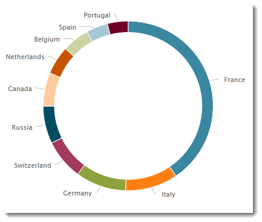
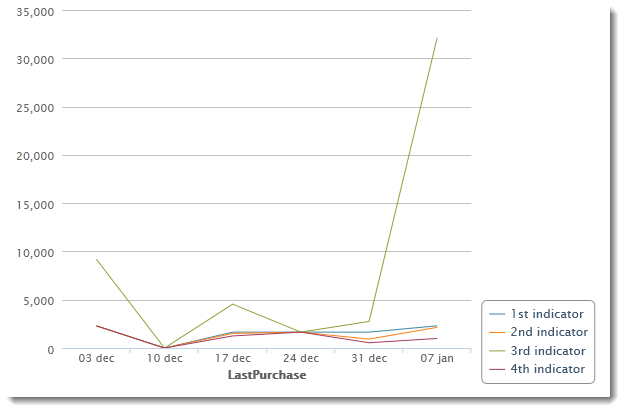
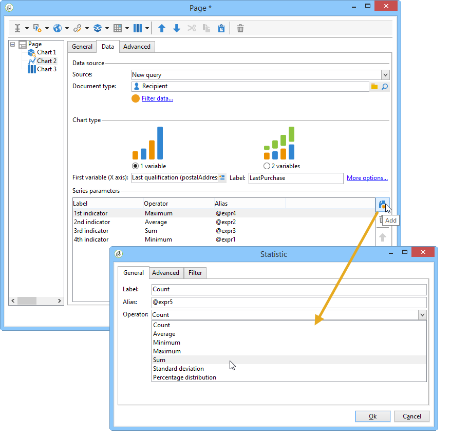

# Creare un grafico{#creating-a-chart}

I dati nel database possono anche essere raccolti e visualizzati in un grafico. Adobe Campaign fornisce una serie di rappresentazioni grafiche. La loro configurazione è descritta di seguito.

I grafici vengono inseriti direttamente in una pagina del rapporto tramite il menu di scelta rapida o la barra degli strumenti.

## Passaggi di creazione {#creation-steps}

Per creare un grafico in un report, attenersi alla procedura descritta di seguito.

1. Modificare la pagina in cui si desidera visualizzare il grafico e selezionare il tipo di grafico sulla barra degli strumenti.

   

1. Immettere un nome e una didascalia. Se necessario, è possibile modificare la posizione della didascalia utilizzando l&#39;elenco a discesa.

   

1. Fare clic sulla scheda **[!UICONTROL Data]** per definire l&#39;origine dati e la serie da calcolare.

   Le statistiche da visualizzare nel grafico possono essere calcolate in base a una query o ai dati contestuali, ovvero i dati forniti dalla transizione in entrata della pagina corrente. Per ulteriori informazioni, vedere [Utilizzo dei dati contestuali](../../reporting/using/using-the-context.md#using-context-data).

   * Fare clic sul collegamento **[!UICONTROL Filter data...]** per definire i criteri di filtro per i dati nel database.

     

   * Per utilizzare i dati contestuali, selezionare **[!UICONTROL Context data]** dal menu a discesa **[!UICONTROL Source]** e fare clic sul collegamento **[!UICONTROL Advanced settings...]**. Quindi seleziona i dati che saranno interessati dalle statistiche.

     

     Potrai quindi accedere ai dati contestuali per definire i valori da visualizzare nel grafico:

     

## Tipi di grafico e varianti {#chart-types-and-variants}

Adobe Campaign offre diversi tipi di rappresentazioni grafiche. Sono descritte di seguito.

Il tipo di grafico viene selezionato quando viene inserito nella pagina.

Può anche essere modificato tramite la sezione **[!UICONTROL Chart type]** della scheda **[!UICONTROL General]** nel grafico.

Le varianti dipendono dal tipo di grafico selezionato. Sono selezionati tramite il collegamento **[!UICONTROL Variants...]**.

### Raggruppamento: grafici a torta {#breakdown--pie-charts}

Questo tipo di rappresentazione grafica consente di visualizzare una panoramica degli elementi misurati.

I grafici a torta consentono di analizzare una sola variabile.

Il collegamento **[!UICONTROL Variants]** consente di personalizzare il rendering complessivo del grafico.

I grafici a torta consentono di immettere il valore del raggio interno nel campo appropriato.

Ad esempio:

0.00 traccia un cerchio completo.

0.40 traccia un cerchio con un raggio del 40%.

1.00 traccia solo l&#39;esterno del cerchio.

### Evoluzione: curve e aree {#evolution--curves-and-areas}

Questo tipo di rappresentazione grafica consente di comprendere l’evoluzione di una o più misure nel tempo.

### Confronto: istogrammi {#comparison--histograms}

Gli istogrammi consentono di confrontare i valori di una o più variabili.

Per questi tipi di grafici, nella finestra **[!UICONTROL Variants]** sono disponibili le seguenti opzioni:

Selezionare l&#39;opzione **[!UICONTROL Display caption]** per visualizzare la didascalia con il grafico e sceglierne la posizione:

Se appropriato, puoi impilare i valori insieme.

Se necessario, potete invertire la sequenza di visualizzazione dei valori. A tale scopo, selezionare l&#39;opzione **[!UICONTROL Reverse stacking]**.

### Conversione: funnel {#conversion--funnel}

Questo tipo di grafico consente di tenere traccia del tasso di conversazione degli elementi misurati.

## Interazione con il grafico {#interaction-with-the-chart}

Puoi definire un’azione quando l’utente fa clic sul grafico. Aprire la finestra **[!UICONTROL Interaction events]** e selezionare l&#39;azione che si desidera eseguire.

I possibili tipi di interazione e le relative configurazioni sono descritti in [questa sezione](../../web/using/static-elements-in-a-web-form.md#inserting-html-content).

## Statistiche di calcolo {#calculating-statistics}

I grafici consentono di visualizzare le statistiche sui dati raccolti.

Queste statistiche sono definite tramite la sezione **[!UICONTROL Series parameters]** della scheda **[!UICONTROL Data]**.

Per creare una nuova statistica, fare clic sull&#39;icona **[!UICONTROL Add]** e configurare la finestra appropriata. I tipi di calcolo disponibili sono descritti di seguito.

Per ulteriori informazioni al riguardo, consulta [questa sezione](../../reporting/using/using-the-descriptive-analysis-wizard.md#statistics-calculation).
