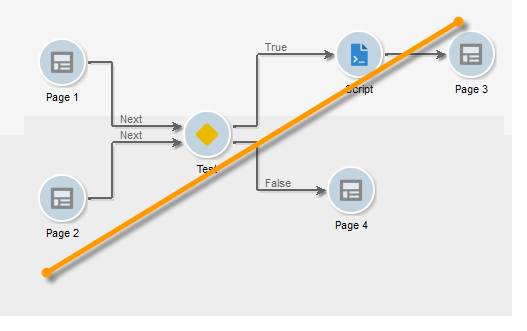

# Creazione di un nuovo report{#creating-a-new-report}

Per creare un rapporto, effettua i seguenti passaggi:

1. Aprite  Adobe Campaign Explorer e dal **[!UICONTROL Administration > Configuration]** nodo, quindi selezionate la **[!UICONTROL Reports]** cartella.
1. Fate clic sul **[!UICONTROL New]** pulsante sopra l’elenco dei rapporti.
1. Seleziona **[!UICONTROL Create a new report from a template]** e fai clic su **[!UICONTROL Next]**.

   

1. Selezionate il modello di rapporto nell’elenco a discesa.

   * Consente di **[!UICONTROL Extended report]** creare un rapporto configurato con un grafico.
   * Il **[!UICONTROL Qualitative distribution]** rapporto consente di creare statistiche basate su tutti i tipi di dati (nome società, dominio e-mail, ecc.).
   * Il **[!UICONTROL Quantitative distribution]** rapporto consente di creare statistiche sui dati misurabili o conteggiabili (importo fattura, età destinatario, ecc.).

   Per ulteriori informazioni su questi modelli di report, consulta [questa sezione](../../reporting/using/about-descriptive-analysis.md).

1. Immettete il nome del rapporto e la relativa descrizione nei campi corrispondenti. Specifica **[!UICONTROL schema]** in quale rapporto verrà applicato.

   

1. Salva il rapporto.

## Modellazione del grafico {#modelizing-the-chart}

Dopo aver salvato il rapporto, questo verrà visualizzato. Ora puoi creare il grafico del report.

Il grafico per la creazione del rapporto è costituito da una serie di attività.

Le attività sono collegate tramite transizioni, rappresentate da frecce.

Per creare un rapporto, a seconda della natura e del contesto, è necessario identificare gli elementi utili e modellare la loro sequenza logica.

1. Utilizzate l&#39; **[!UICONTROL Start]** attività per concretizzare il primo processo da eseguire per creare il rapporto. Puoi utilizzare solo una di queste attività per report.

   È obbligatorio se il grafico include un ciclo.

1. Aggiungi una o più **[!UICONTROL Query]** attività per raccogliere i dati utili per la creazione del rapporto. I dati possono essere raccolti direttamente tramite una query su uno schema del database o tramite un elenco importato o un cubo esistente.

   Per ulteriori informazioni, vedere [Raccolta dei dati da analizzare](../../reporting/using/collecting-data-to-analyze.md).

   Questi dati verranno visualizzati (o meno) nel rapporto a seconda della configurazione della pagina.

1. Inserire una o più **[!UICONTROL Page]** attività per definire la rappresentazione grafica dei dati raccolti. È possibile inserire tabelle, grafici, campi di immissione e condizionare la visualizzazione di una o più pagine o elementi della pagina. Il contenuto visualizzato è completamente configurabile.

   For more on this, refer to [Static elements](#static-elements).

1. Utilizzare un&#39; **[!UICONTROL Test]** attività per definire le condizioni per la visualizzazione o l&#39;accesso ai dati.

   For more on this, refer to [Conditioning page display](../../reporting/using/defining-a-conditional-content.md#conditioning-page-display).

1. Se necessario, aggiungete script personalizzati tramite l&#39; **[!UICONTROL Script]** attività, ad esempio per calcolare il nome di un rapporto, per filtrare la visualizzazione del risultato all&#39;interno di un contesto specifico, ecc.

   For more on this, refer to [Script activity](../../reporting/using/advanced-functionalities.md#script-activity).

1. Infine, per semplificare la lettura di report complessi, puoi inserire una o più attività di **[!UICONTROL Jump]** tipo. Questo consente di passare da un&#39;attività all&#39;altra senza materializzare la transizione nel rapporto. L&#39; **[!UICONTROL Jump]** attività può essere utilizzata anche per visualizzare un altro rapporto.

   For more on this, refer to [Jump activity](../../reporting/using/advanced-functionalities.md#jump-activity).

Non è possibile eseguire più rami contemporaneamente. Ciò significa che un report costruito in questo modo non funzionerà:

Tuttavia, è possibile inserire più rami. Verrà eseguito solo uno di essi:

## Creazione di una pagina {#creating-a-page}

Il contenuto è configurato tramite le attività inserite nel grafico. Per ulteriori informazioni, vedere [Modellizzazione del grafico](#modelizing-the-chart).

Per configurare un&#39;attività, fate doppio clic sulla relativa icona.

Il contenuto visualizzato è definito nelle attività di tipo **Pagina** .

Un rapporto può includere una o più pagine. Le pagine vengono create tramite un editor dedicato che consente di inserire, in una struttura ad albero, campi di input, campi di selezione, elementi statici, grafici o tabelle. I contenitori consentono di definire il layout. For more on this, refer to [Element layout](../../reporting/using/element-layout.md).

Per aggiungere un componente alla pagina, utilizzate le icone nella sezione in alto a sinistra della barra degli strumenti.

È inoltre possibile fare clic con il pulsante destro del mouse sul nodo in cui si desidera aggiungere il componente e selezionarlo dall’elenco.

>[!CAUTION]
>
>Se il rapporto è destinato all&#39;esportazione in formato Excel, si consiglia di non utilizzare la formattazione HTML complessa. Per ulteriori informazioni, vedere [Esportazione di un rapporto](../../reporting/using/actions-on-reports.md#exporting-a-report).

A **[!UICONTROL Page]** può includere i seguenti elementi:

* Barre, torta, tipo di curva **[!UICONTROL charts]**, ecc.
* Pivot; Elenco con gruppo o Suddivisione **[!UICONTROL tables]**.
* Testo o tipo di numero **[!UICONTROL Input controls]**.
* Elenco a discesa, casella di controllo, pulsante di scelta, scelta multipla, data o tipo di matrice **[!UICONTROL Selection controls]**.
* Editor collegamenti, Costante, Tipo di selezione cartella **[!UICONTROL Advanced controls]**.
* Valore, Collegamento, HTML, Immagine, ecc. **[!UICONTROL Static elements]**.
* **[!UICONTROL Containers]** che consentono di controllare il layout del componente.

La modalità di configurazione di una pagina e dei relativi componenti è descritta in [questa sezione](../../web/using/about-web-forms.md).

La barra degli strumenti consente di aggiungere o rimuovere controlli e di organizzarne la sequenza nelle pagine del rapporto.

### Elementi statici {#static-elements}

Gli elementi statici consentono di visualizzare informazioni nel rapporto, come elementi grafici o script, con cui l&#39;utente non interagisce. Per ulteriori informazioni, consulta [questa sezione](../../web/using/static-elements-in-a-web-form.md#inserting-html-content) .

### Filtrare le informazioni in un rapporto {#filtering-information-in-a-report}

I controlli di input e selezione consentono di filtrare le informazioni visualizzate nel rapporto. Per ulteriori informazioni sull&#39;implementazione di questo tipo di filtro, vedere Opzioni di [filtro nelle query](../../reporting/using/collecting-data-to-analyze.md#filtering-options-in-the-queries).

Per ulteriori informazioni sulla creazione e configurazione di campi di input e di selezione, consultare [questa sezione](../../web/using/about-web-forms.md).

Puoi integrare uno o più controlli di input nei tuoi rapporti. Questo tipo di controllo consente di filtrare le informazioni visualizzate in base al valore immesso.

Potete inoltre integrare uno o più controlli di selezione nei rapporti. Questo tipo di controllo consente di filtrare le informazioni contenute nel rapporto, in base ai valori selezionati, ad esempio:

* tramite pulsanti di scelta o caselle di controllo:

   

* tramite un elenco a discesa:

   

* tramite un calendario:

   

Infine, è possibile integrare uno o più controlli avanzati nei report. Questo tipo di controllo consente di inserire un collegamento, una costante o di selezionare una cartella.

Qui puoi filtrare i dati nel rapporto per visualizzare solo le informazioni contenute in una delle cartelle della struttura:

