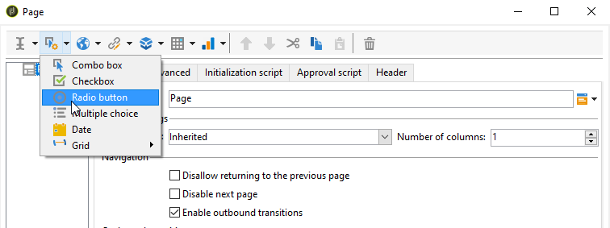

# Creare un nuovo rapporto{#creating-a-new-report}

Per creare un rapporto, effettua le seguenti operazioni:

1. Apri Adobe Campaign Explorer e da **[!UICONTROL Administration > Configuration]** , quindi seleziona il **[!UICONTROL Reports]** cartella.
1. Fai clic sul pulsante **[!UICONTROL New]** sopra l&#39;elenco dei report.
1. Seleziona **[!UICONTROL Create a new report from a template]** e fai clic su **[!UICONTROL Next]**.

   

1. Seleziona il modello di rapporto nell’elenco a discesa.

   * La **[!UICONTROL Extended report]** consente di creare un rapporto configurato utilizzando un grafico.
   * La **[!UICONTROL Qualitative distribution]** report ti consente di creare statistiche basate su tutti i tipi di dati (nome società, dominio e-mail, ecc.).
   * La **[!UICONTROL Quantitative distribution]** report ti consente di creare statistiche sui dati misurabili o conteggiabili (importo fattura, età destinatario, ecc.).

   Per ulteriori informazioni su questi modelli di rapporto, consulta [questa sezione](../../reporting/using/about-descriptive-analysis.md).

1. Immetti il nome del rapporto e la relativa descrizione nei campi corrispondenti. Specifica la **[!UICONTROL schema]** su cui sarà applicato il rapporto.

   

1. Salva il rapporto.

## Modellare il grafico {#modelizing-the-chart}

Dopo aver salvato il rapporto, questo verrà visualizzato. Ora puoi creare il grafico del rapporto.

Il grafico per la creazione del rapporto è costituito da una serie di attività.

Le attività sono collegate tramite transizioni, rappresentate da frecce.

Per creare un rapporto, a seconda della sua natura e del suo contesto, devi identificare gli elementi utili e modellare la loro sequenza logica.

1. Utilizza la **[!UICONTROL Start]** attività per concretizzare il primo processo da eseguire per generare il rapporto. Puoi utilizzare solo una di queste attività per rapporto.

   È obbligatorio se il grafico include un ciclo.

1. Aggiungi uno o più **[!UICONTROL Query]** attività per raccogliere dati utili per la creazione del rapporto. I dati possono essere raccolti direttamente tramite una query su uno schema del database o tramite un elenco importato o un cubo esistente.

   Per ulteriori informazioni, consulta [Raccogliere dati da analizzare](../../reporting/using/collecting-data-to-analyze.md).

   Questi dati verranno visualizzati (o meno) nel rapporto a seconda della configurazione della pagina.

1. Inserire uno o più **[!UICONTROL Page]** attività per definire la rappresentazione grafica dei dati raccolti. È possibile inserire tabelle, grafici, campi di input e condizionare la visualizzazione di una o più pagine o elementi della pagina. Il contenuto visualizzato è completamente configurabile.

   Per ulteriori informazioni, consulta [Elementi statici](#static-elements).

1. Utilizza un **[!UICONTROL Test]** attività per definire le condizioni di visualizzazione o accesso ai dati.

   Per ulteriori informazioni, consulta [Visualizzazione della pagina di condizionamento](../../reporting/using/defining-a-conditional-content.md#conditioning-page-display).

1. Se necessario, aggiungi script personalizzati tramite la **[!UICONTROL Script]** , ad esempio per calcolare il nome di un rapporto, per filtrare la visualizzazione del risultato all’interno di un contesto specifico, ecc.

   Per ulteriori informazioni, consulta [Attività script](../../reporting/using/advanced-functionalities.md#script-activity).

1. Infine, puoi inserire uno o più rapporti complessi per facilitarne la lettura **[!UICONTROL Jump]** attività di tipo . Ciò ti consente di passare da un’attività all’altra senza materializzare la transizione nel rapporto. La **[!UICONTROL Jump]** può essere utilizzata anche per visualizzare un altro rapporto.

   Per ulteriori informazioni, consulta [Attività Jump](../../reporting/using/advanced-functionalities.md#jump-activity).

Non è possibile eseguire più rami contemporaneamente. Ciò significa che un report costruito in questo modo non funzionerà:

Tuttavia, è possibile posizionare diversi rami. Verrà eseguito solo uno di questi:

## Creare una pagina {#creating-a-page}

Il contenuto viene configurato tramite le attività inserite nel grafico. Per ulteriori informazioni, consulta [Modellare il grafico](#modelizing-the-chart).

Per configurare un’attività, fai doppio clic sulla relativa icona.

Il contenuto visualizzato è definito nella **Pagina** attività di tipo .

Un rapporto può includere una o più pagine. Le pagine vengono create tramite un editor dedicato che consente di inserire, in una struttura ad albero, campi di input, campi di selezione, elementi statici, grafici o tabelle. I contenitori consentono di definire il layout. Per ulteriori informazioni, consulta [Layout degli elementi](../../reporting/using/element-layout.md).

Per aggiungere un componente alla pagina, utilizza le icone nella sezione in alto a sinistra della barra degli strumenti.

Puoi anche fare clic con il pulsante destro del mouse sul nodo in cui desideri aggiungere il componente e selezionarlo dall’elenco.

>[!CAUTION]
>
>Se il rapporto è destinato all’esportazione in formato Excel, si consiglia di non utilizzare la formattazione complessa di HTML. Per ulteriori informazioni, consulta [Esportare un rapporto](../../reporting/using/actions-on-reports.md#exporting-a-report).

A **[!UICONTROL Page]** possono includere i seguenti elementi:

* Barre, torta, tipo di curva **[!UICONTROL charts]**, ecc.
* Pivot; Elenco con gruppo o raggruppamento **[!UICONTROL tables]**.
* Tipo di testo o di numero **[!UICONTROL Input controls]**.
* Elenco a discesa, casella di controllo, pulsante di scelta, scelta multipla, data o tipo di matrice **[!UICONTROL Selection controls]**.
* Editor collegamenti, Costante, Tipo di selezione cartelle **[!UICONTROL Advanced controls]**.
* Valore, Collegamento, HTML, Immagine, ecc. **[!UICONTROL Static elements]**.
* **[!UICONTROL Containers]** che consentono di controllare il layout del componente.

La modalità di configurazione di una pagina e dei relativi componenti è descritta in [questa sezione](../../web/using/about-web-forms.md).

La barra degli strumenti consente di aggiungere o rimuovere controlli e di organizzarne la sequenza nelle pagine del rapporto.

### Elementi statici {#static-elements}

Gli elementi statici consentono di visualizzare nel rapporto informazioni quali elementi grafici o script con cui l’utente non interagisce. Fai riferimento a [questa sezione](../../web/using/static-elements-in-a-web-form.md#inserting-html-content) per ulteriori informazioni.

### Filtrare le informazioni in un rapporto {#filtering-information-in-a-report}

I controlli di input e selezione consentono di filtrare le informazioni visualizzate nel rapporto. Per ulteriori informazioni sull’implementazione di questo tipo di filtro, consulta [Opzioni di filtro nelle query](../../reporting/using/collecting-data-to-analyze.md#filtering-options-in-the-queries).

Per ulteriori informazioni sulla creazione e la configurazione dei campi di input e dei campi di selezione, consulta [questa sezione](../../web/using/about-web-forms.md).

Puoi integrare uno o più controlli di input nei rapporti. Questo tipo di controllo consente di filtrare le informazioni visualizzate in base a un valore inserito.

Puoi anche integrare uno o più controlli di selezione nei rapporti. Questo tipo di controllo consente di filtrare le informazioni contenute nel rapporto in base ai valori selezionati, ad esempio:

* tramite pulsanti di scelta o caselle di controllo:

   

* tramite un elenco a discesa:

   

* tramite un calendario:

   

Infine, puoi integrare uno o più controlli avanzati nei rapporti. Questo tipo di controllo consente di inserire un collegamento, una costante o selezionare una cartella.

Qui puoi filtrare i dati nel rapporto per visualizzare solo le informazioni contenute in una delle cartelle della struttura:

