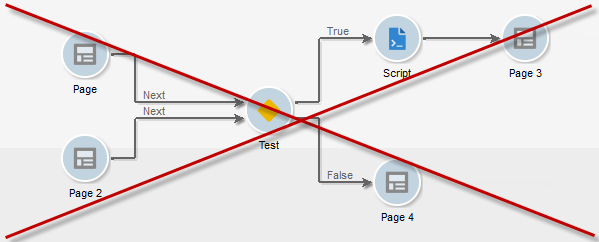

# Creare un nuovo rapporto{#creating-a-new-report}

Per creare un rapporto, effettua le seguenti operazioni:

1. Apri Adobe Campaign Explorer e dal menu **[!UICONTROL Administration > Configuration]** , quindi selezionare il **[!UICONTROL Reports]** cartella.
1. Fai clic su **[!UICONTROL New]** sopra l’elenco dei rapporti.
1. Seleziona **[!UICONTROL Create a new report from a template]** e fai clic su **[!UICONTROL Next]**.

   

1. Selezionare il modello di report nell&#39;elenco a discesa.

   * Il **[!UICONTROL Extended report]** consente di creare un rapporto configurato utilizzando un grafico.
   * Il **[!UICONTROL Qualitative distribution]** report consente di creare statistiche in base a tutti i tipi di dati (nome società, dominio e-mail, ecc.).
   * Il **[!UICONTROL Quantitative distribution]** report consente di creare statistiche sui dati che possono essere misurati o conteggiati (importo fattura, età destinatario, ecc.).

   Per ulteriori informazioni su questi modelli di rapporto, consulta [questa sezione](../../reporting/using/about-descriptive-analysis.md).

1. Inserire il nome del rapporto e la relativa descrizione nei campi corrispondenti. Specifica la **[!UICONTROL schema]** su cui verrà applicato il rapporto.

   

1. Salva questo report.

## Modellare il grafico {#modelizing-the-chart}

Dopo aver salvato il report, questo dovrebbe essere visualizzato. Ora puoi creare il grafico del rapporto.

Il grafico per la creazione del rapporto è costituito da una successione di attività.

Le attività vengono collegate mediante transizioni, rappresentate da frecce.

Per creare un rapporto, a seconda della natura e del contesto, è necessario identificare gli elementi utili e modellarne la sequenza logica.

1. Utilizza il **[!UICONTROL Start]** attività per materializzare il primo processo da eseguire per generare il rapporto. Puoi utilizzare solo una di queste attività per rapporto.

   È obbligatorio se il grafico include un loop.

1. Aggiungi uno o più **[!UICONTROL Query]** attività per la raccolta di dati utili per la creazione del rapporto. I dati possono essere raccolti direttamente tramite una query su uno schema del database oppure tramite un elenco importato o un cubo esistente.

   Per ulteriori informazioni, consulta [Raccogliere dati da analizzare](../../reporting/using/collecting-data-to-analyze.md).

   Questi dati verranno visualizzati (o meno) nel rapporto a seconda della configurazione della pagina.

1. Inserisci uno o più **[!UICONTROL Page]** attività per definire la rappresentazione grafica dei dati raccolti. È possibile inserire tabelle, grafici, campi di input e condizionare la visualizzazione di una o più pagine o elementi della pagina. Il contenuto visualizzato è completamente configurabile.

   Per ulteriori informazioni, consulta [Elementi statici](#static-elements).

1. Utilizza un **[!UICONTROL Test]** per definire le condizioni per la visualizzazione o l’accesso ai dati.

   Per ulteriori informazioni, consulta [Visualizzazione pagina di condizionamento](../../reporting/using/defining-a-conditional-content.md#conditioning-page-display).

1. Se necessario, aggiungi script personalizzati tramite **[!UICONTROL Script]** attività, ad esempio per calcolare il nome di un rapporto, per filtrare la visualizzazione del risultato all’interno di un contesto specifico, ecc.

   Per ulteriori informazioni, consulta [Attività script](../../reporting/using/advanced-functionalities.md#script-activity).

1. Infine, è possibile inserire uno o più rapporti complessi per agevolarne la lettura **[!UICONTROL Jump]** attività di tipo. Questo consente di passare da un’attività all’altra senza materializzare la transizione sul rapporto. Il **[!UICONTROL Jump]** L’attività può essere utilizzata anche per visualizzare un altro rapporto.

   Per ulteriori informazioni, consulta [Attività Salta](../../reporting/using/advanced-functionalities.md#jump-activity).

Non è possibile eseguire più rami contemporaneamente. Ciò significa che un rapporto generato come questo non funzionerà:

Tuttavia, puoi inserire diversi rami. Solo uno di questi verrà eseguito:

## Creare una pagina {#creating-a-page}

Il contenuto viene configurato tramite le attività inserite nel grafico. Per ulteriori informazioni, consulta [Modellare il grafico](#modelizing-the-chart).

Per configurare un’attività, fai doppio clic sulla relativa icona.

Il contenuto visualizzato è definito nel **Pagina** attività di tipo.

Un rapporto può includere una o più pagine. Le pagine vengono create tramite un editor dedicato che consente di inserire, in una struttura ad albero, campi di input, campi di selezione, elementi statici, grafici o tabelle. I contenitori consentono di definire il layout. Per ulteriori informazioni, consulta [Layout degli elementi](../../reporting/using/element-layout.md).

Per aggiungere un componente alla pagina, utilizza le icone nella sezione superiore sinistra della barra degli strumenti.

Puoi anche fare clic con il pulsante destro del mouse sul nodo in cui desideri aggiungere il componente e selezionarlo dall’elenco.

>[!CAUTION]
>
>Se il rapporto è destinato all’esportazione in formato Excel, si consiglia di non utilizzare una formattazione HTML complessa. Per ulteriori informazioni, consulta [Esportare un rapporto](../../reporting/using/actions-on-reports.md#exporting-a-report).

A **[!UICONTROL Page]** può includere i seguenti elementi:

* Barre, torta, tipo di curva **[!UICONTROL charts]**, ecc.
* Pivot, elenco con gruppo o raggruppamento **[!UICONTROL tables]**.
* Tipo di testo o numero **[!UICONTROL Input controls]**.
* Elenco a discesa, casella di controllo, pulsante di scelta, scelta multipla, data o tipo di matrice **[!UICONTROL Selection controls]**.
* Editor collegamenti, Costante, tipo di selezione cartella **[!UICONTROL Advanced controls]**.
* Valore, collegamento, HTML, immagine, ecc. **[!UICONTROL Static elements]**.
* **[!UICONTROL Containers]** che consentono di controllare il layout dei componenti.

La modalità di configurazione di una pagina e dei relativi componenti è descritta in [questa sezione](../../web/using/about-web-forms.md).

La barra degli strumenti consente di aggiungere o rimuovere controlli e di organizzarne la sequenza nelle pagine del report.

### Elementi statici {#static-elements}

Gli elementi statici consentono di visualizzare nel rapporto informazioni quali elementi grafici o script con cui l&#39;utente non interagisce. Fai riferimento a [questa sezione](../../web/using/static-elements-in-a-web-form.md#inserting-html-content) per ulteriori informazioni.

### Filtrare le informazioni in un rapporto {#filtering-information-in-a-report}

I controlli di input e selezione consentono di filtrare le informazioni visualizzate nel report. Per ulteriori informazioni sull’implementazione di questo tipo di filtro, consulta [Opzioni di filtro nelle query](../../reporting/using/collecting-data-to-analyze.md#filtering-options-in-the-queries).

Per ulteriori informazioni sulla creazione e la configurazione dei campi di input e dei campi di selezione, consulta [questa sezione](../../web/using/about-web-forms.md).

È possibile integrare uno o più controlli di input nei report. Questo tipo di controllo consente di filtrare le informazioni visualizzate in base al valore immesso.

È inoltre possibile integrare uno o più controlli di selezione nei report. Questo tipo di controllo consente di filtrare le informazioni contenute nel rapporto in base ai valori selezionati, ad esempio:

* tramite pulsanti di scelta o caselle di controllo:

  

* tramite un elenco a discesa:

  

* tramite un calendario:

  

Infine, è possibile integrare uno o più controlli avanzati nei report. Questo tipo di controllo consente di inserire un collegamento, una costante o di selezionare una cartella.

Qui puoi filtrare i dati nel rapporto per visualizzare solo le informazioni contenute in una delle cartelle della struttura:

