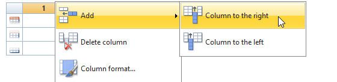
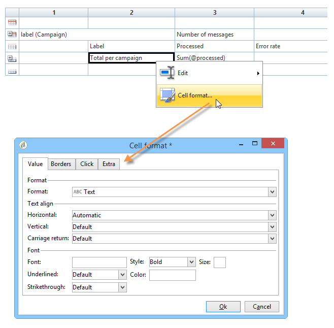
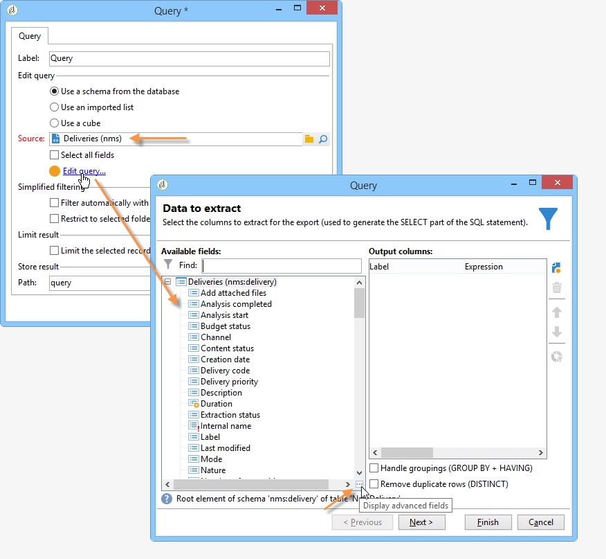
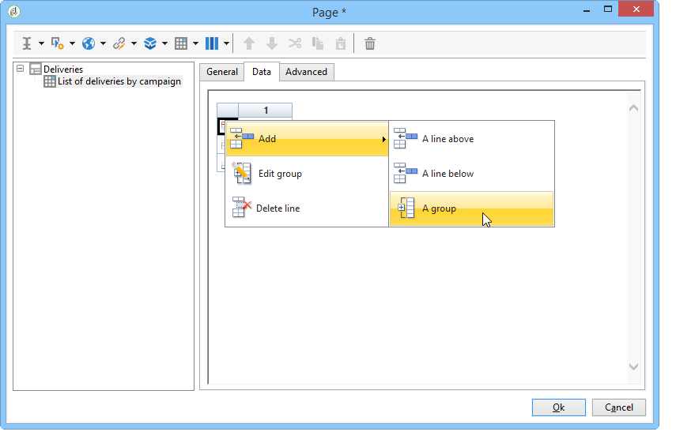
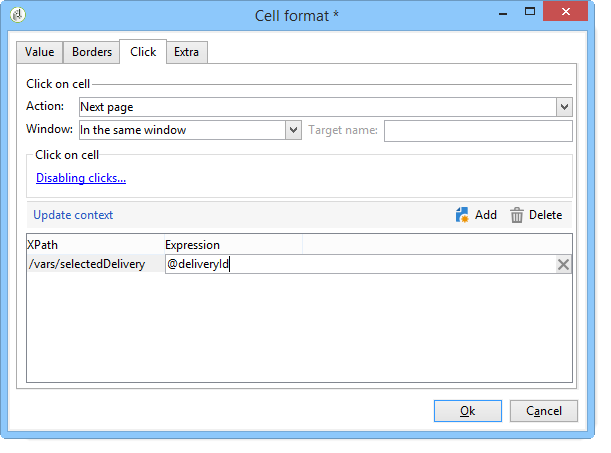
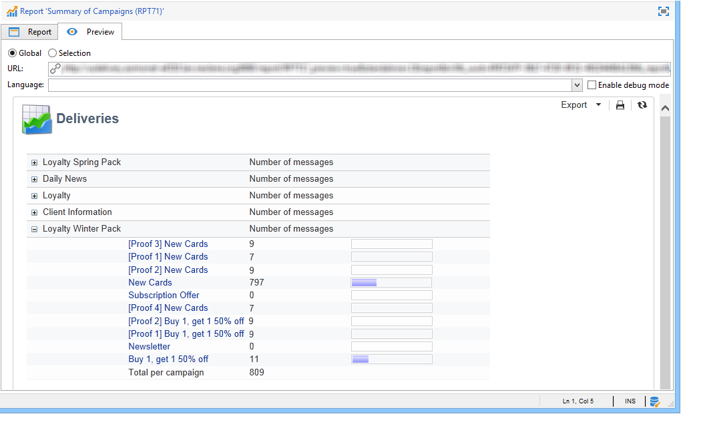

# Creare una tabella{#creating-a-table}


È possibile aggiungere una tabella a un report per visualizzare i dati. Può trattarsi di una tabella pivot creata in base alle misurazioni del cubo, di un elenco con gruppo o di una tabella contenente una suddivisione dei valori.


## Crea un elenco con gruppo {#creating-a-list-with-group}

Una tabella di tipo **[!UICONTROL List with group]** consente di raggruppare i dati nella tabella e di produrre statistiche su di essa. Ad esempio, puoi creare totali e subtotali per i dati. Ogni gruppo ha una propria linea di intestazione, dettagli e piè di pagina.

>[!CAUTION]
>
>Per raccogliere i dati da analizzare nel report, l&#39;attività **[!UICONTROL Page]** contenente la tabella deve essere preceduta da un&#39;attività **[!UICONTROL Query]** o **[!UICONTROL Script]**. Per ulteriori informazioni su queste attività, consulta [Raccogliere dati da analizzare](../../reporting/using/collecting-data-to-analyze.md) e [Attività script](../../reporting/using/advanced-functionalities.md#script-activity).

### Principio di funzionamento {#operating-principle}

Potrebbe essere necessario analizzare diverse categorie di dati contemporaneamente. Un elenco con gruppo consente di combinare i dati e creare statistiche su vari gruppi di dati all’interno della stessa tabella. A questo scopo, potete creare un gruppo nella tabella.

Nell’esempio seguente, il gruppo mostra tutte le campagne nel database, le consegne e il numero di messaggi inviati per consegna e per campagna.

Ti consente di elencare le campagne (**[!UICONTROL Label (Campaign)]**, l&#39;elenco delle consegne (**[!UICONTROL Label]** ) collegate alla campagna e di contare il numero di messaggi inviati per consegna (**[!UICONTROL Processed)]**, prima di aggiungerli per ogni campagna (**[!UICONTROL Sum(@processed)]** ).


### Passaggi di implementazione {#implementation-steps}

Un esempio di implementazione completa è fornito qui: [Caso d&#39;uso: creare un report con un elenco di gruppi](#use-case--create-a-report-with-a-group-list).

Per creare una tabella di tipo &quot;Elenco con gruppo&quot;, tieni presente quanto segue:

1. Passare al grafico del report e inserire un&#39;attività **[!UICONTROL Query]**. Consulta [Raccogliere dati da analizzare](../../reporting/using/collecting-data-to-analyze.md).
1. Compila la tabella di origine e seleziona i campi della tabella che saranno interessati dalle statistiche.
1. Inserire un&#39;attività **[!UICONTROL Page]** nel grafico. Per ulteriori informazioni, consulta [Elementi statici](../../reporting/using/creating-a-new-report.md#static-elements).
1. Inserire una tabella di tipo **[!UICONTROL List with group]** nella pagina.
1. Specificare il percorso dei dati o la tabella selezionata come origine dati nella query.

   Questo passaggio è obbligatorio se si desidera recuperare i campi nella tabella di origine in un secondo momento e inserirli nelle celle della tabella.

1. Creazione della tabella e del relativo contenuto.
1. Visualizza il report finalizzato nella scheda **[!UICONTROL Preview]**. Puoi quindi pubblicare il rapporto ed esportarlo in un formato diverso, se necessario. Per ulteriori informazioni, consulta [Esportare un report](../../reporting/using/actions-on-reports.md#exporting-a-report).

### Aggiungi righe e colonne {#adding-lines-and-columns}

Per impostazione predefinita, una tabella di tipo **[!UICONTROL List with group]** include un&#39;intestazione, una riga di dettaglio e una riga piè di pagina.

Il gruppo include linee di intestazione, dettagli e piè di pagina.

* **Riga intestazione**: questa riga consente di assegnare un titolo alle colonne della tabella.

  

* **Riga dettagli**: questa riga contiene valori statistici.

  

* **Riga piè di pagina**: questa riga consente di visualizzare i valori totali.

  

È possibile aggiungere linee e colonne in base alle proprie esigenze.

Il gruppo può essere posizionato su qualsiasi riga della tabella e include le proprie linee di intestazione, dettagli e piè di pagina.


**Riga e colonna**: per aggiungere o eliminare una riga o colonna, passare a una riga o colonna esistente e utilizzare il menu di scelta rapida.



La natura della riga aggiunta dipende dalla posizione del cursore. Ad esempio, per aggiungere una riga di intestazione, posizionare i cursori su un&#39;intestazione, quindi fare clic su **[!UICONTROL Add > A line above/below]**.


È possibile modificare la larghezza delle colonne tramite l&#39;elemento **[!UICONTROL Column format]**.

**Gruppo**: per aggiungere un gruppo, passare a una riga e selezionare l&#39;elemento corrispondente nel menu a discesa.


### Definire il contenuto della cella {#defining-cell-content}

Per modificare una cella della tabella e definirne il contenuto e il formato, passare alla cella e utilizzare il menu di scelta rapida.

Utilizzare la voce di menu **[!UICONTROL Expression]** per selezionare i valori da visualizzare.


* Per inserire i valori da analizzare direttamente nella tabella, selezionali tra i campi disponibili.

  L’elenco dei campi disponibili coincide con il contenuto della query prima della tabella nel grafico di costruzione del rapporto.

  

* Immettere un&#39;etichetta per una cella, ad esempio l&#39;intestazione 1.

  A questo scopo, utilizza lo stesso processo utilizzato per inserire un campo nel database, ma non seleziona un’espressione. Immettere l&#39;etichetta nel campo **[!UICONTROL Label]**. Verrà visualizzato così com’è.

* Calcolo di un aggregato (media, somma, ecc.) e visualizzarla nella cella.

  A tale scopo, utilizzare la voce di menu **[!UICONTROL Aggregates]** e selezionare la campagna desiderata.

  

### Definire il formato delle celle {#defining-cell-format}



Per definire il formato della cella, il menu **[!UICONTROL Cell format...]** consente di accedere a tutte le opzioni di formattazione disponibili per la cella selezionata.

Queste opzioni consentono di personalizzare il rendering finale del rapporto e di semplificare la lettura delle informazioni.

Utilizza il campo **[!UICONTROL Carriage return]** per esportare i dati in Excel: seleziona il valore **[!UICONTROL Yes]** per forzare il ritorno a capo. Questo valore verrà mantenuto durante l’esportazione. Per ulteriori informazioni, consulta [Esportare un report](../../reporting/using/actions-on-reports.md#exporting-a-report).

La finestra **[!UICONTROL Cell format]** consente di accedere alla scheda seguente:

* Scheda **[!UICONTROL Value]**
* Scheda **[!UICONTROL Borders]**
* Scheda **[!UICONTROL Click]**
* Scheda **[!UICONTROL Extra]**

La scheda **[!UICONTROL Value]** consente di modificare il tipo di carattere e i vari attributi di valore o di definire un formato in base alla loro natura.


Il formato cambia la visualizzazione dei dati: ad esempio, i formati **[!UICONTROL Number]**, **[!UICONTROL Monetary]** e **[!UICONTROL Percentage]** consentono di allineare le figure a destra e visualizzare i punti decimali.

Esempio di configurazione di un formato di valuta: puoi specificare la valuta in cui sono espressi i valori, scegliere se separare le migliaia o meno e visualizzare i valori negativi in rosso. La posizione del simbolo di valuta dipende dalla lingua dell’operatore definita nel suo profilo.


Esempio di configurazione per le date: puoi scegliere se visualizzare o meno l’ora.


La scheda **Bordi** consente di aggiungere bordi alle righe e alle colonne della tabella. L’aggiunta di bordi alle celle può causare problemi di prestazioni durante l’esportazione di rapporti di grandi dimensioni in Excel.


Se necessario, è possibile definire i bordi nel modello di tabella (**[!UICONTROL Administration > Configuration > Form rendering]** ).

In questo caso, la sintassi è la seguente:

Nella scheda Web:

```
 .tabular td {
 border: solid 1px #000000;
 }
```

Nella scheda Excel:

```
 <style name="odd" fillColor="#fdfdfd">
  <border>
   <borderTop value="solid 0.05pt #000000" />
   <borderBottom value="solid 0.05pt #000000" />
   <borderLeft value="solid 0.05pt #000000" />
   <borderRight value="solid 0.05pt #000000" />
  </border>
 </style> 
 
 <style name="even" fillColor="#f7f8fa">
  <border>
   <borderTop value="solid 0.05pt #000000" />
   <borderBottom value="solid 0.05pt #000000" />
   <borderLeft value="solid 0.05pt #000000" />
   <borderRight value="solid 0.05pt #000000" />
  </border>
 </style> 
```

La scheda **[!UICONTROL Click]** consente di definire un&#39;azione quando l&#39;utente fa clic sul contenuto di una cella o della tabella.

Nell’esempio seguente, facendo clic sul valore nella cella, puoi visualizzare la seconda pagina del rapporto: conterrà informazioni sulla consegna nella cella.


La scheda **Extra** consente di collegare un elemento visivo ai dati, ad esempio un contrassegno colorato o una barra dei valori. Il contrassegno colorato viene utilizzato quando la tabella viene visualizzata come legenda in un grafico. Per ulteriori informazioni, consulta l&#39;esempio di implementazione: [Passaggio 5 - Creare la seconda pagina](#step-5---create-the-second-page)


## Caso d’uso: creare un rapporto con un elenco di gruppi {#use-case--create-a-report-with-a-group-list}

In questo esempio creeremo un rapporto di due pagine: la prima pagina conterrà l’elenco e il totale delle consegne per campagna, nonché il numero di messaggi inviati. I nomi delle consegne saranno collegamenti selezionabili che ti consentiranno di passare alla seconda pagina del rapporto per visualizzare il raggruppamento delle consegne per dominio e-mail per la consegna selezionata, con una tabella e un grafico. Nella seconda pagina, la tabella fungerà da legenda per il grafico.


### Passaggio 1: creare un rapporto {#step-1---create-a-report}

Creare un nuovo report relativo allo schema della campagna, **[!UICONTROL Campaigns (nms)]**.


Fare clic su **[!UICONTROL Save]** per creare il report.

Vai al grafico e aggiungi i primi componenti da utilizzare per progettare il contenuto del rapporto: una prima query e una prima pagina.


### Passaggio 2: creare la prima query {#step-2---create-the-first-query}

La prima query ti consente di raccogliere le consegne collegate a ogni campagna. L’obiettivo è quello di visualizzare un rapporto sulle varie consegne del database di Adobe Campaign collegato a ogni campagna.

Fai doppio clic sulla prima query per modificarla, quindi applica i seguenti passaggi per configurarla:

1. Inizia modificando lo schema in cui viene applicata l&#39;origine della query: seleziona lo schema **[!UICONTROL Deliveries (nms)]**.
1. Fare clic sul collegamento **[!UICONTROL Edit query]** e visualizzare i campi avanzati.

   

1. Selezionare i campi seguenti:

   * l’etichetta di consegna,
   * la chiave primaria della consegna,
   * l’etichetta della campagna,
   * l’indicatore delle consegne trasformate,
   * la chiave esterna del collegamento Campaign,
   * l’indicatore del tasso di errore.

   

   Collega un alias a ciascun campo: questa operazione è consigliata per facilitare la selezione dei dati dalla tabella che verranno aggiunti alla prima pagina del rapporto.

   Per questo esempio, utilizzeremo i seguenti alias:

   * Etichetta: **@label**
   * Chiave primaria: **@deliveryId**
   * Etichetta (campagna): **@label1**
   * Elaborato: **@processed**
   * Chiave esterna del collegamento &#39;Campagna&#39; (campo &#39;id&#39;): **@operationId**
   * Frequenza errori: **@errorRatio**

1. Fare clic due volte sul pulsante **[!UICONTROL Next]** per accedere al passaggio **[!UICONTROL Data filtering]**.

   Aggiungi una condizione di filtro per raccogliere solo le consegne collegate a una campagna.

   La sintassi di questo filtro è la seguente: &quot;Chiave esterna del collegamento &#39;Campagne&#39; maggiore di 0&quot;.

   

1. Fai clic su **[!UICONTROL Finish]** per salvare queste condizioni, quindi fai clic su **[!UICONTROL Ok]** per chiudere l&#39;editor delle query.

### Passaggio 3: creare la prima pagina {#step-3--create-the-first-page}

In questo passaggio verrà configurata la prima pagina del rapporto. Per configurarlo, effettua le seguenti operazioni:

1. Apri l&#39;attività **[!UICONTROL Page]** e immettine il titolo, ad esempio **Consegne** in questo caso.

   

1. Inserisci un elenco con gruppo tramite la barra degli strumenti e immettine l’etichetta, ad esempio: Elenco di consegne per campagna.

   

1. Fare clic sul collegamento **[!UICONTROL Table data XPath...]** e selezionare il collegamento di consegna, ovvero `[query/delivery]`.

   

1. Fare clic sulla scheda **[!UICONTROL Data]** e modificare il layout della tabella: aggiungere tre colonne a destra.

   

1. Aggiungi un gruppo.

   

   Questo gruppo consente di raggruppare le campagne e le consegne ad esse collegate.

1. Nella finestra del gruppo, fare riferimento alla **chiave esterna del collegamento &#39;Campaign&#39;** e chiudere la finestra.

   

1. Modifica la prima cella dell’intestazione del gruppo e inserisci il campo **[!UICONTROL Label]** delle campagne come espressione.

   

1. Modificare la seconda cella della riga dei dettagli e selezionare le consegne **[!UICONTROL Label]**.

   

1. Modificare il formato della cella e aprire la scheda **[!UICONTROL Click]**. Configura le opzioni appropriate in modo che, quando gli utenti fanno clic sul nome di una consegna, questa si apra nella stessa finestra.

   

   A tale scopo, selezionare un&#39;azione di tipo **[!UICONTROL Next page]** e selezionare **[!UICONTROL In the same window]** come opzione aperta.

   

1. Nella sezione inferiore della finestra, fai clic su **[!UICONTROL Add]** e specifica il percorso **`/vars/selectedDelivery`** e l&#39;espressione **[!UICONTROL @deliveryId]** che corrispondono all&#39;alias della chiave primaria della consegna, come definito nella query creata in precedenza. Questa formula ti consente di accedere alla consegna selezionata.

   

1. Modificare la seconda cella della linea del piè di pagina del gruppo e immettere **[!UICONTROL Total per campaign]** come etichetta.

   

1. Modificare la terza cella della riga di intestazione del gruppo e immettere **[!UICONTROL Number of messages sent]** come etichetta.

   

   Queste informazioni coincidono con il titolo della colonna.

1. Modificare la terza cella della riga di dettaglio e selezionare l&#39;indicatore del messaggio elaborato come espressione.

   

1. Modificare la terza cella della riga del piè di pagina del gruppo, selezionare l&#39;indicatore di consegna elaborato e applicare l&#39;aggregato **[!UICONTROL Sum]**.

   

1. Modificare la quarta cella della riga di dettaglio e selezionare come espressione il tasso di errore di consegna **error**.

   

1. Seleziona questa cella per visualizzare una barra dei valori che rappresenta il tasso di errore di consegna.

   A tale scopo, accedere al formato della cella, quindi passare alla scheda **[!UICONTROL More]**. Selezionare la voce **[!UICONTROL Value bar]** nell&#39;elenco a discesa e selezionare l&#39;opzione **[!UICONTROL Hide the cell value]**.

   

   Ora puoi visualizzare un rendering del rapporto. Fai clic sulla scheda **[!UICONTROL Preview]** e seleziona l&#39;opzione **[!UICONTROL Global]**: viene visualizzato l&#39;elenco di tutte le consegne collegate a una campagna presenti nel database di Adobe Campaign.

   

   È consigliabile utilizzare la scheda **[!UICONTROL Preview]** per verificare che i dati nella tabella siano selezionati e configurati correttamente. Al termine, puoi continuare a formattare la tabella.

1. Applica lo stile **[!UICONTROL Bold]** alle celle che mostrano il totale per campagna e il numero totale di messaggi elaborati.

   

1. Fare clic sulla prima cella della riga di intestazione del gruppo, quella in cui viene visualizzato il nome della campagna, quindi selezionare **[!UICONTROL Edit > Merge to right]**.

   

   L’unione delle prime due celle della riga di intestazione del gruppo riallinea il titolo della campagna e l’elenco delle consegne collegate.

   

   >[!CAUTION]
   >
   >È consigliabile attendere che il report venga generato prima di unire le celle, poiché l’unione è irreversibile.

### Passaggio 4: creare la seconda query {#step-4---create-the-second-query}

Vogliamo aggiungere una seconda query e una seconda pagina per visualizzare i dettagli di una consegna quando l’utente del rapporto fa clic su di essa. Prima di aggiungere la query, modifica la pagina creata e abilita la transizione in uscita in modo che possa essere collegata alla query.

1. Aggiungi una nuova query dopo l&#39;attività **[!UICONTROL Page]** e modificane lo schema: seleziona lo schema **[!UICONTROL Recipient delivery logs]**.

   

1. Modifica la query e definisci le colonne di output. Per visualizzare il numero di consegne per dominio e-mail, è necessario:

   * calcola la somma delle chiavi primarie per conteggiare il numero di registri di consegna:

     

   * raccogliere i domini e-mail dei destinatari e le informazioni sui gruppi in questo campo: a tale scopo, selezionare l&#39;opzione **[!UICONTROL Group]** nella colonna nome dominio.

   

   Collega i seguenti alias ai campi:

   * count(chiave primaria): **@count**
   * Dominio e-mail (destinatario): **@domain**

     

1. Fai clic due volte sul pulsante **[!UICONTROL Next]**: questo ti porta al passaggio **[!UICONTROL Data filtering]**.

   Aggiungi una condizione di filtro per raccogliere solo le informazioni collegate alla consegna selezionata.

   La sintassi è la seguente: Chiave esterna del collegamento &#39;Consegna&#39; è uguale al valore dell&#39;impostazione `$([vars/selectedDelivery])`

   

1. Chiudi la finestra di configurazione della query e aggiungi una pagina al grafico, subito dopo la seconda query.

### Passaggio 5: creare la seconda pagina {#step-5---create-the-second-page}

1. Modificare la pagina e immetterne l&#39;etichetta: **Domini e-mail**.
1. Deseleziona l&#39;opzione **[!UICONTROL Enable output transitions]**: questa è l&#39;ultima pagina del report e non sarà seguita da un&#39;altra attività.

   

1. Aggiungi un nuovo elenco con un gruppo utilizzando il menu di scelta rapida e chiamalo **Domini e-mail per destinatario**.
1. Fare clic su **[!UICONTROL Table data XPath...]** e selezionare il collegamento **[!UICONTROL Recipient delivery logs]**.

   

1. Nella scheda **[!UICONTROL Data]**, adattare la tabella come segue:

   * Aggiungi due colonne a destra.
   * Nella prima cella della riga di dettaglio, aggiungere l&#39;espressione **[!UICONTROL rowNum()-1]** per contare il numero di righe. Quindi modificare il formato della cella: nella scheda **[!UICONTROL Extra]**, selezionare **[!UICONTROL Color tab]** e fare clic su **[!UICONTROL Ok]**.

     

     Questa configurazione consente di utilizzare la tabella come didascalia del grafico.

   * Nella seconda cella della riga di dettaglio, aggiungere l&#39;espressione **[!UICONTROL Email domain(Recipient)]**.
   * Nella terza cella della riga di dettaglio, aggiungere l&#39;espressione **[!UICONTROL count(primary key)]**.

   

1. Aggiungi un grafico a torta alla pagina utilizzando il menu di scelta rapida e assegna l&#39;etichetta **Domini e-mail** alla pagina. Per ulteriori informazioni, consultare [Tipi di grafico e varianti](../../reporting/using/creating-a-chart.md#chart-types-and-variants).
1. Fare clic sul collegamento **[!UICONTROL Variants]** e deselezionare le opzioni **[!UICONTROL Display label]** e **[!UICONTROL Display caption]**.
1. Verifica che non sia configurato alcun ordinamento dei valori. Per ulteriori informazioni al riguardo, consulta [questa sezione](../../reporting/using/processing-a-report.md#configuring-the-layout-of-a-descriptive-analysis-report).

   

1. Nella scheda **[!UICONTROL Data]**, modificare l&#39;origine dati: selezionare **[!UICONTROL Context data]** dall&#39;elenco a discesa.

   

1. Quindi fai clic su **[!UICONTROL Advanced settings]** e seleziona il collegamento ai registri di consegna del destinatario.

   

1. Nella sezione **[!UICONTROL Chart type]** selezionare la variabile **[!UICONTROL Email domain]**.
1. Quindi aggiungi il calcolo da eseguire: seleziona la somma come operatore.

   

1. Fai clic sul pulsante **[!UICONTROL Detail]** per selezionare il campo che verrà interessato dal conteggio, quindi chiudi la finestra di configurazione.

   

1. Salva il rapporto.

   La pagina è ora configurata.

### Passaggio 6: visualizzare il rapporto {#step-6---viewing-the-report}

Per visualizzare il risultato di questa configurazione, fare clic sulla scheda **[!UICONTROL Preview]** e selezionare l&#39;opzione **[!UICONTROL Global]**.

La prima pagina del rapporto fornisce dettagli sull’elenco di tutte le consegne incluse nel database.


Se fai clic sul collegamento di una di queste consegne, viene visualizzato il grafico che mostra il raggruppamento dei domini e-mail per questa consegna. Ora ti trovi nella seconda pagina del rapporto e puoi tornare alla pagina precedente facendo clic sul pulsante appropriato.


## Creare una suddivisione o una tabella pivot {#creating-a-breakdown-or-pivot-table}

Questo tipo di tabella consente di visualizzare le statistiche calcolate sui dati nel database.

La configurazione di questi tipi di rapporti è simile a quella utilizzata per l’analisi guidata descrittiva. Per ulteriori informazioni, consulta [questa pagina](../../reporting/using/using-the-descriptive-analysis-wizard.md#configuring-the-quantitative-distribution-template).

Per ulteriori informazioni sulla creazione di una tabella pivot, consulta [questa sezione](../../reporting/using/ac-cubes.md).
