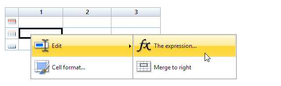

# Creazione di una tabella{#creating-a-table}


È possibile aggiungere una tabella a un rapporto per visualizzare i dati. Può trattarsi di una tabella pivot creata in base a misurazioni del cubo, di un elenco con gruppo o di una tabella contenente una suddivisione dei valori.


## Creazione di un elenco con un gruppo {#creating-a-list-with-group}

A **[!UICONTROL List with group]** la tabella dei tipi consente di raggruppare i dati nella tabella e di generare statistiche su di essa. Ad esempio, puoi creare totali e totali secondari per i dati. Ogni gruppo ha una propria riga di intestazione, dettaglio e piè di pagina.

>[!CAUTION]
>
>La **[!UICONTROL Page]** l’attività contenente la tabella deve essere preceduta da un **[!UICONTROL Query]** o **[!UICONTROL Script]** per raccogliere i dati da analizzare nel rapporto. Per ulteriori informazioni su queste attività, consulta [Raccolta di dati da analizzare](../../reporting/using/collecting-data-to-analyze.md) e [Attività script](../../reporting/using/advanced-functionalities.md#script-activity).

### Principio di funzionamento {#operating-principle}

Potrebbe essere necessario analizzare più categorie di dati contemporaneamente. Un elenco con gruppi consente di combinare i dati e creare statistiche su vari gruppi di dati all’interno della stessa tabella. A questo scopo, puoi creare un gruppo nella tabella.

Nell’esempio seguente, il gruppo mostra tutte le campagne nel database, le consegne e il numero di messaggi inviati per consegna e per campagna.

Ti consente di elencare le campagne (**[!UICONTROL Label (Campaign)]**, l&#39;elenco delle consegne (**[!UICONTROL Label]** ) collegata alla campagna e consente di contare il numero di messaggi inviati per consegna (**[!UICONTROL Processed)]**, prima di aggiungerli per ogni campagna (**[!UICONTROL Sum(@processed)]** ).


### Passaggi di implementazione {#implementation-steps}

Un esempio completo di implementazione è fornito qui: [Caso di utilizzo: Creare un rapporto con un elenco di gruppi](#use-case--create-a-report-with-a-group-list).

Per creare una tabella di tipo &quot;Elenco con gruppo&quot;, tieni presente quanto segue:

1. Passa al grafico dei report e inserisci un **[!UICONTROL Query]** attività. Fai riferimento a [Raccolta di dati da analizzare](../../reporting/using/collecting-data-to-analyze.md).
1. Compila la tabella di origine e seleziona i campi della tabella che riguardano le statistiche.
1. Posiziona un **[!UICONTROL Page]** nel grafico. Per ulteriori informazioni, consulta [Elementi statici](../../reporting/using/creating-a-new-report.md#static-elements).
1. Inserisci un **[!UICONTROL List with group]** digitare la tabella nella pagina.
1. Specifica il percorso dati o la tabella selezionata come origine dati nella query.

   Questo passaggio è obbligatorio se si desidera recuperare i campi nella tabella di origine in un secondo momento e inserirli nelle celle della tabella.

1. Creazione della tabella e del relativo contenuto.
1. Visualizza il rapporto finalizzato nel **[!UICONTROL Preview]** scheda . Puoi quindi pubblicare il rapporto ed esportarlo in un formato diverso, se necessario. Per ulteriori informazioni, consulta [Esportazione di un report](../../reporting/using/actions-on-reports.md#exporting-a-report).

### Aggiunta di righe e colonne {#adding-lines-and-columns}

Per impostazione predefinita, un **[!UICONTROL List with group]** La tabella dei tipi include un’intestazione, una riga di dettaglio e una riga piè di pagina.

Il gruppo stesso include righe di intestazione, dettagli e piè di pagina.

* **Riga di intestazione**: questa riga consente di assegnare un titolo alle colonne della tabella.

   

* **Linea di dettaglio**: questa riga contiene valori statistici.

   

* **Linea piè di pagina**: questa riga consente di visualizzare i valori totali.

   

È possibile aggiungere linee e colonne in base alle proprie esigenze.

Il gruppo può essere posizionato su qualsiasi riga della tabella e include righe di intestazione, dettagli e piè di pagina.


**Linea e colonna**: per aggiungere o eliminare una riga o una colonna, passare a una riga o colonna esistente e utilizzare il menu di scelta rapida.


La natura della linea aggiunta dipende dalla posizione del cursore. Ad esempio, per aggiungere una riga di intestazione, posiziona i cursori su un’intestazione, quindi fai clic su **[!UICONTROL Add > A line above/below]**.


La larghezza delle colonne può essere modificata tramite il **[!UICONTROL Column format]** oggetto.

**Gruppo**: per aggiungere un gruppo, passare a una riga e selezionare la voce corrispondente nel menu a discesa.


### Definizione del contenuto della cella {#defining-cell-content}

Per modificare una cella della tabella e definirne il contenuto e il formato, passare alla cella e utilizzare il menu di scelta rapida.

Utilizza la **[!UICONTROL Expression]** voce di menu per selezionare i valori da visualizzare.



* Per inserire i valori da analizzare direttamente nella tabella, selezionali tra i campi disponibili.

   L’elenco dei campi disponibili coincide con il contenuto della query prima della tabella nel grafico di costruzione del report.

   

* Inserisci un’etichetta per una cella, ad esempio l’intestazione.

   A questo scopo, utilizzare lo stesso processo utilizzato per inserire un campo nel database, ma non selezionare un&#39;espressione. Inserisci l’etichetta nella **[!UICONTROL Label]** campo . Viene visualizzato così com’è.

* Calcolo di un aggregato (una media, una somma, ecc.) e la visualizzazione nella cella.

   Per eseguire questa operazione, utilizza la variabile **[!UICONTROL Aggregates]** e seleziona la campagna desiderata.

   

### Definizione del formato delle celle {#defining-cell-format}


Per definire il formato della cella, il **[!UICONTROL Cell format...]** consente di accedere a tutte le opzioni di formattazione disponibili per la cella selezionata.

Queste opzioni ti consentono di personalizzare il rendering finale del rapporto e di semplificarne la lettura.

Utilizza la **[!UICONTROL Carriage return]** campo durante l&#39;esportazione dei dati in Excel: seleziona la **[!UICONTROL Yes]** valore per forzare il ritorno a capo. Questo valore verrà mantenuto durante l’esportazione. Per ulteriori informazioni, consulta [Esportazione di un report](../../reporting/using/actions-on-reports.md#exporting-a-report).

La **[!UICONTROL Cell format]** window consente di accedere alla scheda seguente:

* La **[!UICONTROL Value]** scheda
* La **[!UICONTROL Borders]** scheda
* La **[!UICONTROL Click]** scheda
* La **[!UICONTROL Extra]** scheda

La **[!UICONTROL Value]** consente di modificare il font e i vari attributi di valore o di definire un formato in base alla loro natura.


Il formato cambia la visualizzazione dei dati: ad esempio, il **[!UICONTROL Number]**, **[!UICONTROL Monetary]** e **[!UICONTROL Percentage]** I formati consentono di allineare le cifre a destra e visualizzare i punti decimali.

Esempio di configurazione di un formato di valuta: è possibile specificare la valuta in cui sono espressi i valori, scegliere se separare o meno migliaia e visualizzare valori negativi in rosso. La posizione del simbolo di valuta dipende dalla lingua dell’operatore definita nel suo profilo.


Esempio di configurazione per le date: è possibile scegliere se visualizzare o meno l&#39;ora.


La **Bordi** consente di aggiungere bordi alle righe e alle colonne della tabella. L’aggiunta di bordi alle celle potrebbe causare problemi di prestazioni durante l’esportazione di rapporti di grandi dimensioni in Excel.


Se necessario, è possibile definire i bordi nel modello di tabella (**[!UICONTROL Administration > Configuration > Form rendering]** ).

In questo caso, avrai la seguente sintassi:

Nella scheda Web:

```
 .tabular td {
 border: solid 1px #000000;
 }
```

Nella scheda Excel:

```
 <style name="odd" fillColor="#fdfdfd">
  <border>
   <borderTop value="solid 0.05pt #000000" />
   <borderBottom value="solid 0.05pt #000000" />
   <borderLeft value="solid 0.05pt #000000" />
   <borderRight value="solid 0.05pt #000000" />
  </border>
 </style> 
 
 <style name="even" fillColor="#f7f8fa">
  <border>
   <borderTop value="solid 0.05pt #000000" />
   <borderBottom value="solid 0.05pt #000000" />
   <borderLeft value="solid 0.05pt #000000" />
   <borderRight value="solid 0.05pt #000000" />
  </border>
 </style> 
```

La **[!UICONTROL Click]** consente di definire un’azione quando l’utente fa clic sul contenuto di una cella o di una tabella.

Nell’esempio seguente, facendo clic sul valore nella cella è possibile visualizzare la seconda pagina del rapporto: conterrà informazioni sulla consegna nella cella.


La **Extra** consente di collegare un elemento visivo ai dati, ad esempio un contrassegno colorato o una barra dei valori. Il contrassegno colorato viene utilizzato quando la tabella viene visualizzata come legenda in un grafico. Per ulteriori informazioni, consulta l’esempio di implementazione: [Passaggio 5: creare la seconda pagina](#step-5---create-the-second-page)


## Caso di utilizzo: Creare un rapporto con un elenco di gruppi {#use-case--create-a-report-with-a-group-list}

In questo esempio verrà creato un rapporto di due pagine: la prima pagina conterrà l’elenco e le consegne totali per campagna, nonché il numero di messaggi inviati. I nomi di consegna saranno collegamenti cliccabili e ti consentirà di passare alla seconda pagina del rapporto per visualizzare il raggruppamento delle consegne per dominio e-mail per la consegna selezionata con una tabella e un grafico. Nella seconda pagina, la tabella fungerà da legenda per il grafico.


### Passaggio 1: creare un rapporto {#step-1---create-a-report}

Creare un nuovo rapporto relativo allo schema della campagna, **[!UICONTROL Campaigns (nms)]**.


Fai clic su **[!UICONTROL Save]** per creare il rapporto.

Vai al grafico e aggiungi i primi componenti da utilizzare per la progettazione del contenuto del rapporto: una prima query e una prima pagina.


### Passaggio 2: creare la prima query {#step-2---create-the-first-query}

La prima query consente di raccogliere le consegne collegate a ogni campagna. L’obiettivo è quello di visualizzare un rapporto sulle varie consegne del database Adobe Campaign collegato a ogni campagna.

Fai doppio clic sulla prima query per modificarla, quindi applica i seguenti passaggi per configurarla:

1. Inizia modificando lo schema in cui viene applicata l&#39;origine della query: seleziona la **[!UICONTROL Deliveries (nms)]** schema.
1. Fai clic sul pulsante **[!UICONTROL Edit query]** collega e visualizza i campi avanzati.

   

1. Seleziona i campi seguenti:

   * l’etichetta di consegna,
   * la chiave primaria della consegna,
   * l’etichetta della campagna,
   * l’indicatore delle consegne elaborate,
   * la chiave esterna del collegamento Campaign,
   * l&#39;indicatore del tasso di errore.

   

   Collegare un alias a ciascun campo: si consiglia di selezionare più facilmente i dati della tabella che verranno aggiunti alla prima pagina del rapporto.

   Per questo esempio, utilizzeremo i seguenti alias:

   * Etichetta: **@label**
   * Chiave principale: **@deliveryId**
   * Etichetta (campagna): **@label1**
   * Elaborato: **@elaborati**
   * Chiave esterna del collegamento &quot;Campaign&quot; (&quot;id&quot;): **@operationId**
   * Frequenza errori: **@errorRatio**


1. Fai clic sul pulsante **[!UICONTROL Next]** pulsante due volte per accedere al **[!UICONTROL Data filtering]** passo.

   Aggiungi una condizione di filtro per raccogliere solo le consegne collegate a una campagna.

   La sintassi del filtro è la seguente: &quot;Chiave esterna del collegamento &quot;Campagne&quot; maggiore di 0&quot;.

   

1. Fai clic su **[!UICONTROL Finish]** per salvare queste condizioni, fai clic su **[!UICONTROL Ok]** per chiudere l’editor delle query.

### Passaggio 3: Creare la prima pagina {#step-3--create-the-first-page}

In questo passaggio, configureremo la prima pagina del rapporto. Per configurarlo, esegui i seguenti passaggi:

1. Apri **[!UICONTROL Page]** attività e inserisci il relativo titolo, ad esempio **Consegne** in questo caso.

   

1. Inserisci un elenco con un gruppo tramite la barra degli strumenti e inserisci la relativa etichetta, ad esempio: Elenco di consegne per campagna.

   

1. Fai clic sul pulsante **[!UICONTROL Table data XPath...]** e seleziona il collegamento di consegna, ovvero `[query/delivery]`.

   

1. Fai clic sul pulsante **[!UICONTROL Data]** e modificare il layout della tabella: aggiungi tre colonne a destra.

   

1. Aggiungi un gruppo.

   

   Questo gruppo ti consente di raggruppare le campagne e le consegne ad esse collegate.

1. Nella finestra del gruppo, fai riferimento alla **Chiave esterna del collegamento &quot;Campaign&quot;** e chiudi la finestra.

   

1. Modifica la prima cella dell&#39;intestazione del gruppo e inserisci il **[!UICONTROL Label]** campo delle campagne come espressione.

   

1. Modifica la seconda cella della riga dei dettagli e seleziona le consegne **[!UICONTROL Label]**.

   

1. Modifica il formato di questa cella e apri la **[!UICONTROL Click]** scheda . Configura le opzioni appropriate in modo che quando gli utenti fanno clic sul nome di una consegna, questa si apra nella stessa finestra.

   

   A questo scopo, seleziona una **[!UICONTROL Next page]** digitare action e selezionare **[!UICONTROL In the same window]** come opzione aperta.

   

1. Nella sezione inferiore della finestra, fai clic su **[!UICONTROL Add]** e specifica **`/vars/selectedDelivery`** e **[!UICONTROL @deliveryId]** espressione che corrisponde all’alias della chiave primaria della consegna, come definito nella query creata in precedenza. Questa formula ti consente di accedere alla consegna selezionata.

   

1. Modificare la seconda cella della riga piè di pagina del gruppo e immettere **[!UICONTROL Total per campaign]** come etichetta.

   

1. Modifica la terza cella della riga di intestazione del gruppo e immetti **[!UICONTROL Number of messages sent]** come etichetta.

   

   Queste informazioni coincidono con il titolo della colonna.

1. Modifica la terza cella della riga di dettaglio e seleziona l’indicatore del messaggio elaborato come espressione.

   

1. Modifica la terza cella della riga piè di pagina del gruppo, seleziona l’indicatore di consegna elaborato e applica il **[!UICONTROL Sum]** aggregarsi a esso.

   

1. Modifica la quarta cella della riga di dettaglio e seleziona la **frequenza degli errori di consegna** come espressione.

   

1. Seleziona questa cella per visualizzare una barra dei valori che rappresenta il tasso di errore di consegna.

   A questo scopo, accedi al formato della cella, quindi vai alla **[!UICONTROL More]** scheda . Seleziona la **[!UICONTROL Value bar]** nell’elenco a discesa e seleziona la **[!UICONTROL Hide the cell value]** opzione .

   

   Ora è possibile visualizzare un rendering del rapporto. Fai clic sul pulsante **[!UICONTROL Preview]** e seleziona la **[!UICONTROL Global]** opzione: mostra l’elenco di tutte le consegne nel database di Adobe Campaign collegate a una campagna.

   

   Si consiglia di utilizzare **[!UICONTROL Preview]** per verificare che i dati presenti nella tabella siano selezionati e configurati correttamente. Una volta fatto questo, puoi continuare a formattare la tabella.

1. Applica la **[!UICONTROL Bold]** alle celle che mostrano il totale per campagna e il numero totale di messaggi elaborati.

   

1. Fai clic sulla prima cella della riga di intestazione del gruppo, quella che visualizza il nome della campagna, e seleziona **[!UICONTROL Edit > Merge to right]**.

   

   L’unione delle prime due celle della riga di intestazione del gruppo riallinea il titolo della campagna e l’elenco delle consegne ad essa collegate.

   

   >[!CAUTION]
   >
   >È consigliabile attendere la generazione del rapporto prima di unire le celle, poiché l’unione è irreversibile.

### Passaggio 4: creare la seconda query {#step-4---create-the-second-query}

Desideriamo aggiungere una seconda query e una seconda pagina per visualizzare i dettagli di una consegna quando l’utente del report vi fa clic. Prima di aggiungere la query, modifica la pagina creata e abilita la transizione in uscita in modo che possa essere collegata alla query.

1. Aggiungi una nuova query dopo la **[!UICONTROL Page]** e modificane lo schema: seleziona la **[!UICONTROL Recipient delivery logs]** schema.

   

1. Modifica la query e definisci le colonne di output. Per visualizzare il numero di consegne per dominio e-mail, devi:

   * calcola la somma delle chiavi primarie per contare il numero di log di consegna:

      

   * raccoglie i domini e-mail dei destinatari e le informazioni sui gruppi in questo campo: a questo scopo, seleziona la **[!UICONTROL Group]** nella colonna del nome di dominio.

   

   Collega i seguenti alias ai campi:

   * count(chiave primaria): **@count**
   * Dominio e-mail (destinatario): **Dominio @a**

      


1. Fai clic sul pulsante **[!UICONTROL Next]** pulsante due volte: questo ti porta al **[!UICONTROL Data filtering]** passo.

   Aggiungi una condizione di filtro per raccogliere solo le informazioni collegate alla consegna selezionata.

   La sintassi è la seguente: La chiave esterna del collegamento &quot;Consegna&quot; è uguale al valore dell’impostazione `$([vars/selectedDelivery])`

   

1. Chiudi la finestra di configurazione della query e aggiungi una pagina al grafico, subito dopo la seconda query.

### Passaggio 5: creare la seconda pagina {#step-5---create-the-second-page}

1. Modificate la pagina e immettete la relativa etichetta: **Domini e-mail**.
1. Deseleziona **[!UICONTROL Enable output transitions]** opzione: si tratta dell’ultima pagina del rapporto e non sarà seguita da un’altra attività.

   

1. Aggiungi un nuovo elenco con un gruppo utilizzando il menu di scelta rapida e chiamalo **Domini e-mail per destinatario**.
1. Fai clic sul pulsante **[!UICONTROL Table data XPath...]** e seleziona la **[!UICONTROL Recipient delivery logs]** link.

   

1. In **[!UICONTROL Data]** , adatta la tabella come segue:

   * Aggiungi due colonne sul lato destro.
   * Nella prima cella della riga di dettaglio, aggiungi la **[!UICONTROL rowNum()-1]** espressione per contare il numero di righe. Quindi modificare il formato della cella: in **[!UICONTROL Extra]** scheda , seleziona **[!UICONTROL Color tab]** e fai clic su **[!UICONTROL Ok]**.

      

      Questa configurazione consente di utilizzare la tabella come didascalia per il grafico.

   * Nella seconda cella della riga di dettaglio, aggiungi la **[!UICONTROL Email domain(Recipient)]** espressione.
   * Nella terza cella della riga di dettaglio, aggiungi la **[!UICONTROL count(primary key)]** espressione.

   

1. Aggiungi un grafico a torta alla pagina utilizzando il menu di scelta rapida e assegna le **Domini e-mail** etichettarle. Per ulteriori informazioni, consulta [Tipi di grafico e varianti](../../reporting/using/creating-a-chart.md#chart-types-and-variants).
1. Fai clic sul pulsante **[!UICONTROL Variants]** e deselezionare **[!UICONTROL Display label]** e **[!UICONTROL Display caption]** opzioni.
1. Verifica che non sia configurato alcun ordinamento dei valori. Per ulteriori informazioni al riguardo, consulta [questa sezione](../../reporting/using/processing-a-report.md#configuring-the-layout-of-a-descriptive-analysis-report).

   

1. In **[!UICONTROL Data]** , modifica l’origine dati: select **[!UICONTROL Context data]** dall’elenco a discesa.

   

1. Quindi fai clic su **[!UICONTROL Advanced settings]** e seleziona il collegamento ai registri di consegna dei destinatari.

   

1. In **[!UICONTROL Chart type]** seleziona la sezione **[!UICONTROL Email domain]** variabile.
1. Quindi aggiungere il calcolo da eseguire: seleziona la somma come operatore.

   

1. Fai clic sul pulsante **[!UICONTROL Detail]** per selezionare il campo di cui si occuperà il conteggio, quindi chiudere la finestra di configurazione.

   

1. Salva il rapporto.

   La pagina è ora configurata.

### Passaggio 6: visualizzare il rapporto {#step-6---viewing-the-report}

Per visualizzare il risultato di questa configurazione, fai clic sul pulsante **[!UICONTROL Preview]** e seleziona la **[!UICONTROL Global]** opzione .

Nella prima pagina del report viene visualizzato l’elenco di tutte le consegne incluse nel database.


Se fai clic sul collegamento di una di queste consegne, viene visualizzato il grafico che mostra la suddivisione dei domini e-mail per questa consegna. Ora ti trovi nella seconda pagina del rapporto e puoi tornare alla pagina precedente facendo clic sul pulsante appropriato.


## Creazione di una tabella di suddivisione o pivot {#creating-a-breakdown-or-pivot-table}

Questo tipo di tabella consente di visualizzare le statistiche calcolate sui dati nel database.

La configurazione di questi tipi di report è simile a quella utilizzata per la procedura guidata di analisi descrittiva. Per ulteriori informazioni, consulta [questa pagina](../../reporting/using/using-the-descriptive-analysis-wizard.md#configuring-the-quantitative-distribution-template).

Per ulteriori informazioni sulla creazione di una tabella pivot, consulta [questa sezione](../../reporting/using/using-cubes-to-explore-data.md).
