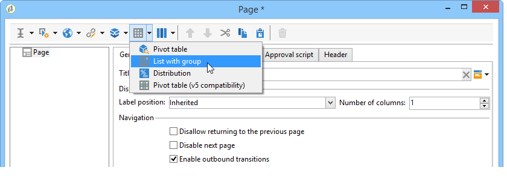
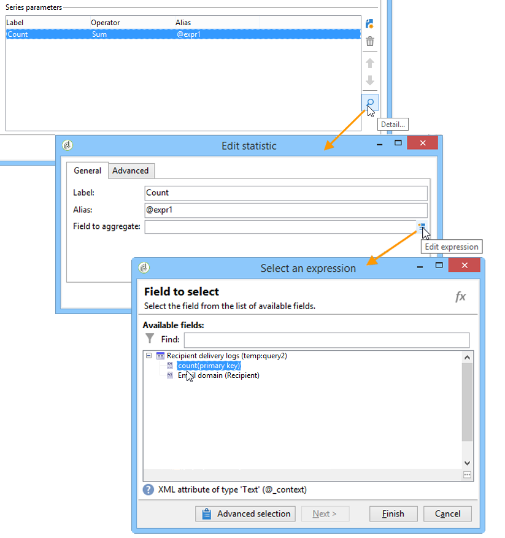

# Creazione di una tabella{#creating-a-table}

È possibile aggiungere una tabella a un rapporto per visualizzare i dati. Può trattarsi di una tabella pivot creata in base a misure del cubo, un elenco con un gruppo o una tabella contenente una suddivisione di valori.


## Creazione di un elenco con un gruppo {#creating-a-list-with-group}

Una **[!UICONTROL List with group]** tabella di tipo consente di raggruppare i dati nella tabella e di generare statistiche su di essa. Ad esempio, è possibile creare totali e subtotali per i dati. Ogni gruppo ha una propria riga di intestazione, dettaglio e piè di pagina.

>[!CAUTION]
>
>L&#39; **[!UICONTROL Page]** attività che contiene la tabella deve essere preceduta da un&#39; **[!UICONTROL Query]** attività o **[!UICONTROL Script]** attività per raccogliere i dati da analizzare nel rapporto. Per ulteriori informazioni su queste attività, vedere [Raccolta di dati per l&#39;analisi](../../reporting/using/collecting-data-to-analyze.md) e l&#39;attività [](../../reporting/using/advanced-functionalities.md#script-activity)Script.

### Principio di funzionamento {#operating-principle}

Può accadere che sia necessario analizzare più categorie di dati contemporaneamente. Un elenco con un gruppo consente di combinare i dati e creare statistiche su vari gruppi di dati all’interno della stessa tabella. A questo scopo, potete creare un gruppo nella tabella.

Nell&#39;esempio seguente, il gruppo mostra tutte le campagne nel database, le consegne e il numero di messaggi inviati per consegna e per campagna.

Consente di elencare le campagne (**[!UICONTROL Label (Campaign)]**, l&#39;elenco delle consegne (**[!UICONTROL Label]** ) collegate alla campagna e di calcolare il numero di messaggi inviati per consegna (**[!UICONTROL Processed)]**, prima di aggiungerli per ogni campagna (**[!UICONTROL Sum(@processed)]** ).


### Passaggi di implementazione {#implementation-steps}

Un esempio completo di implementazione è fornito qui: [Caso di utilizzo: Creare un rapporto con un elenco](#use-case--create-a-report-with-a-group-list)di gruppi.

Per creare una tabella di tipo &#39;Elenco con gruppo&#39;, attenersi alla procedura seguente:

1. Passate al grafico del rapporto e inserite un&#39; **[!UICONTROL Query]** attività. Fare riferimento a [Raccolta di dati da analizzare](../../reporting/using/collecting-data-to-analyze.md).
1. Compila la tabella di origine e seleziona i campi della tabella che saranno interessati dalle statistiche.
1. Inserite un&#39; **[!UICONTROL Page]** attività nel grafico. For more on this, refer to [Static elements](../../reporting/using/creating-a-new-report.md#static-elements).
1. Inserire una tabella **[!UICONTROL List with group]** di tipo nella pagina.
1. Specificare il percorso dati o la tabella selezionata come origine dati nella query.

   Questo passaggio è obbligatorio se si desidera recuperare i campi nella tabella di origine in un secondo momento e inserirli nelle celle della tabella.

1. Creazione della tabella e del relativo contenuto.
1. Visualizza il rapporto finale nella **[!UICONTROL Preview]** scheda. Potete quindi pubblicare il rapporto ed esportarlo in un formato diverso, se necessario. Per ulteriori informazioni, vedere [Esportazione di un rapporto](../../reporting/using/actions-on-reports.md#exporting-a-report).

### Aggiunta di righe e colonne {#adding-lines-and-columns}

Per impostazione predefinita, una tabella di tipo **[!UICONTROL List with group]** include un&#39;intestazione, una riga di dettaglio e una riga piè di pagina.

Il gruppo stesso include righe di intestazione, dettagli e piè di pagina.

* **Riga** di intestazione: questa riga consente di assegnare un titolo alle colonne della tabella.

   

* **Linea** dettagli: questa riga contiene valori statistici.

   

* **Riga** piè di pagina: questa riga consente di visualizzare i valori totali.

   

È possibile aggiungere righe e colonne in base alle proprie esigenze.

Il gruppo può essere posizionato su qualsiasi riga della tabella e include righe di intestazione, dettagli e piè di pagina personalizzate.


**Riga e colonna**: per aggiungere o eliminare una riga o una colonna, passare a una riga o colonna esistente e utilizzare il menu di scelta rapida.


La natura della linea aggiunta dipende dalla posizione del cursore. Ad esempio, per aggiungere una riga di intestazione, posizionare i cursori su un&#39;intestazione, quindi fare clic **[!UICONTROL Add > A line above/below]**.


La larghezza delle colonne può essere modificata tramite l’ **[!UICONTROL Column format]** elemento.

**Gruppo**: per aggiungere un gruppo, passate a una riga e selezionate l&#39;elemento corrispondente nel menu a discesa.


### Definizione del contenuto delle celle {#defining-cell-content}

Per modificare una cella della tabella e definirne il contenuto e il formato, passare alla cella e utilizzare il menu di scelta rapida.

Utilizzate la voce di **[!UICONTROL Expression]** menu per selezionare i valori da visualizzare.


* Per inserire i valori da analizzare direttamente nella tabella, selezionarli tra i campi disponibili.

   L&#39;elenco dei campi disponibili coincide con il contenuto della query prima della tabella nel grafico di costruzione del rapporto.

   

* Immettete un&#39;etichetta per una cella, ad esempio l&#39;intestazione.

   A questo scopo, utilizzare lo stesso processo utilizzato per inserire un campo nel database, ma non selezionare un&#39;espressione. Enter the label in the **[!UICONTROL Label]** field. Verrà visualizzato così come è.

* Calcolo di un aggregato (una media, una somma, ecc.) e visualizzarlo nella cella.

   A questo scopo, utilizzate la voce di **[!UICONTROL Aggregates]** menu e selezionate la campagna desiderata.

   

### Definizione del formato della cella {#defining-cell-format}


Per definire il formato della cella, il **[!UICONTROL Cell format...]** menu consente di accedere a tutte le opzioni di formattazione disponibili per la cella selezionata.

Queste opzioni consentono di personalizzare il rendering finale del rapporto e semplificano la lettura delle informazioni.

Utilizzare il **[!UICONTROL Carriage return]** campo durante l&#39;esportazione dei dati in Excel: selezionare il **[!UICONTROL Yes]** valore per forzare il ritorno a capo. Questo valore verrà mantenuto al momento dell&#39;esportazione. Per ulteriori informazioni, vedere [Esportazione di un rapporto](../../reporting/using/actions-on-reports.md#exporting-a-report).

La **[!UICONTROL Cell format]** finestra consente di accedere alla scheda seguente:

* La **[!UICONTROL Value]** scheda
* La **[!UICONTROL Borders]** scheda
* La **[!UICONTROL Click]** scheda
* La **[!UICONTROL Extra]** scheda

La **[!UICONTROL Value]** scheda consente di modificare il font e i vari attributi di valore o di definire un formato basato sulla loro natura.


Il formato modifica la visualizzazione dei dati: ad esempio, i **[!UICONTROL Number]** formati **[!UICONTROL Monetary]** e **[!UICONTROL Percentage]** consentono di allineare le cifre sulla destra e visualizzare i punti decimali.

Esempio di configurazione di un formato di valuta: è possibile specificare la valuta in cui sono espressi i valori, scegliere se separarli o meno e visualizzare valori negativi in rosso. La posizione del simbolo di valuta dipende dalla lingua dell&#39;operatore definita nel relativo profilo.


Esempio di configurazione per le date: è possibile scegliere se visualizzare o meno l&#39;ora.


La scheda **Bordi** consente di aggiungere bordi alle righe e alle colonne della tabella. L&#39;aggiunta di bordi alle celle potrebbe causare problemi di prestazioni durante l&#39;esportazione di rapporti di grandi dimensioni in Excel.


Se necessario, è possibile definire i bordi nel modello di tabella (**[!UICONTROL Administration > Configuration > Form rendering]** ).

In questo caso, si avrà la sintassi seguente:

Nella scheda Web:

```
 .tabular td {
 border: solid 1px #000000;
 }
```

Nella scheda Excel:

```
 <style name="odd" fillColor="#fdfdfd">
  <border>
   <borderTop value="solid 0.05pt #000000" />
   <borderBottom value="solid 0.05pt #000000" />
   <borderLeft value="solid 0.05pt #000000" />
   <borderRight value="solid 0.05pt #000000" />
  </border>
 </style> 
 
 <style name="even" fillColor="#f7f8fa">
  <border>
   <borderTop value="solid 0.05pt #000000" />
   <borderBottom value="solid 0.05pt #000000" />
   <borderLeft value="solid 0.05pt #000000" />
   <borderRight value="solid 0.05pt #000000" />
  </border>
 </style> 
```

La **[!UICONTROL Click]** scheda consente di definire un&#39;azione quando l&#39;utente fa clic sul contenuto di una cella o di una tabella.

Nell&#39;esempio seguente, facendo clic sul valore nella cella è possibile visualizzare la seconda pagina del rapporto: conterrà informazioni sulla consegna nella cella.


La scheda **Extra** consente di collegare un elemento visivo ai dati, ad esempio un segno colorato o una barra dei valori. Il segno colorato viene utilizzato quando la tabella viene visualizzata come legenda in un grafico. Per ulteriori informazioni, consulta l’esempio di implementazione: [Passaggio 5 - Creare la seconda pagina](#step-5---create-the-second-page)


## Caso di utilizzo: Creare un rapporto con un elenco di gruppi {#use-case--create-a-report-with-a-group-list}

In questo esempio, verrà creato un rapporto di due pagine: la prima pagina conterrà l’elenco e il totale delle consegne per campagna, nonché il numero di messaggi inviati. I nomi delle consegne saranno cliccabili e potrai passare alla seconda pagina del rapporto per visualizzare la suddivisione delle consegne per dominio e-mail per la consegna selezionata con una tabella e un grafico. Nella seconda pagina, la tabella fungerà da legenda per il grafico.


### Passaggio 1 - Creare un rapporto {#step-1---create-a-report}

Create un nuovo rapporto che riguardi lo schema della campagna, **[!UICONTROL Campaigns (nms)]**.


Fate clic **[!UICONTROL Save]** per creare il rapporto.

Passate al grafico e aggiungete i primi componenti da utilizzare per la progettazione del contenuto del rapporto: una prima query e una prima pagina.


### Passaggio 2 - Creare la prima query {#step-2---create-the-first-query}

La prima query consente di raccogliere le consegne collegate a ciascuna campagna. L&#39;obiettivo è quello di visualizzare un rapporto sulle diverse consegne del database Adobe Campaign  collegato a ciascuna campagna.

Fate doppio clic sulla prima query per modificarla, quindi applicate i seguenti passaggi per configurarla:

1. Per iniziare, modificare lo schema a cui viene applicata l&#39;origine della query: selezionare lo **[!UICONTROL Deliveries (nms)]** schema.
1. Fare clic sul **[!UICONTROL Edit query]** collegamento e visualizzare i campi avanzati.

   

1. Selezionate i campi seguenti:

   * l&#39;etichetta di consegna,
   * la chiave primaria della consegna,
   * l’etichetta della campagna,
   * l&#39;indicatore delle consegne trasformate,
   * la chiave esterna del collegamento Campaign,
   * l’indicatore del tasso di errore.

   

   Collegare un alias a ciascun campo: si consiglia di semplificare la selezione dei dati dalla tabella che verrà aggiunta alla prima pagina del rapporto.

   Per questo esempio, verranno utilizzati i seguenti alias:

   * Etichetta: **@label**
   * Chiave primaria: **@deliveryId**
   * Etichetta (campagna): **@label1**
   * Elaborato: **@processed**
   * Chiave esterna del collegamento &#39;Campaign&#39; (&#39;id&#39;): **@operationId**
   * Frequenza errori: **@errorRatio**


1. Fate clic due volte sul **[!UICONTROL Next]** pulsante per passare al **[!UICONTROL Data filtering]** passaggio.

   Aggiungete una condizione di filtro per raccogliere solo le consegne collegate a una campagna.

   La sintassi di questo filtro è la seguente: &quot;Chiave esterna del collegamento Campagne maggiore di 0&quot;.

   

1. Fare clic **[!UICONTROL Finish]** per salvare queste condizioni, quindi fare clic **[!UICONTROL Ok]** per chiudere l&#39;editor di query.

### Passaggio 3: Creare la prima pagina {#step-3--create-the-first-page}

In questo passaggio, configureremo la prima pagina del rapporto. Per configurarlo, effettua i seguenti passaggi:

1. Aprite l&#39; **[!UICONTROL Page]** attività e immettete il relativo titolo, ad esempio **Consegne** in questo caso.

   

1. Inserite un elenco con un gruppo tramite la barra degli strumenti e immettete la relativa etichetta, ad esempio: Elenco di consegne per campagna.

   

1. Fate clic sul **[!UICONTROL Table data XPath...]** collegamento e selezionate il collegamento di consegna, ad es. `[query/delivery]`.

   

1. Fare clic sulla **[!UICONTROL Data]** scheda e modificare il layout della tabella: aggiungere tre colonne a destra.

   

1. Aggiungete un gruppo.

   

   Questo gruppo consente di raggruppare le campagne e le consegne ad esse collegate.

1. Nella finestra del gruppo, fate riferimento alla chiave **esterna del collegamento** &quot;Campagna&quot; e chiudete la finestra.

   

1. Modificate la prima cella dell&#39;intestazione del gruppo e inserite il **[!UICONTROL Label]** campo delle campagne come espressione.

   

1. Modificate la seconda cella della riga dei dettagli e selezionate le consegne **[!UICONTROL Label]**.

   

1. Modificate il formato della cella e aprite la **[!UICONTROL Click]** scheda. Configurate le opzioni adeguate in modo che quando gli utenti fanno clic sul nome di una consegna, questa si apra nella stessa finestra.

   

   A questo scopo, selezionate un’azione **[!UICONTROL Next page]** di tipo e **[!UICONTROL In the same window]** scegliete un’opzione aperta.

   

1. Nella sezione inferiore della finestra, fate clic su **[!UICONTROL Add]** e specificate il **`/vars/selectedDelivery`** percorso e l&#39; **[!UICONTROL @deliveryId]** espressione che corrispondono all&#39;alias della chiave primaria della consegna, come definito nella query creata in precedenza. Questa formula consente di accedere al recapito selezionato.

   

1. Modificate la seconda cella della riga piè di pagina del gruppo e immettete **[!UICONTROL Total per campaign]** come etichetta.

   

1. Modificate la terza cella della riga di intestazione del gruppo e immettete **[!UICONTROL Number of messages sent]** come etichetta.

   

   Queste informazioni coincidono con il titolo della colonna.

1. Modificate la terza cella della riga di dettaglio e selezionate come espressione l&#39;indicatore del messaggio elaborato.

   

1. Modificate la terza cella della riga piè di pagina del gruppo, selezionate l’indicatore di consegna elaborato e applicate l’ **[!UICONTROL Sum]** aggregazione.

   

1. Modificate la quarta cella della riga di dettaglio e selezionate come espressione il tasso **di errore relativo alla distribuzione degli** errori.

   

1. Selezionare questa cella per visualizzare una barra dei valori che rappresenta la frequenza degli errori di consegna.

   A questo scopo, accedere al formato della cella, quindi passare alla **[!UICONTROL More]** scheda. Selezionate la **[!UICONTROL Value bar]** voce nell’elenco a discesa e selezionate l’ **[!UICONTROL Hide the cell value]** opzione.

   

   Ora è possibile visualizzare un rendering del rapporto. Fate clic sulla **[!UICONTROL Preview]** scheda e selezionate l’ **[!UICONTROL Global]** opzione: viene visualizzato l&#39;elenco di tutte le consegne nel database Adobe Campaign  collegate a una campagna.

   

   È consigliabile utilizzare la **[!UICONTROL Preview]** scheda per verificare che i dati nella tabella siano selezionati e configurati correttamente. Al termine, è possibile formattare la tabella.

1. Applica lo **[!UICONTROL Bold]** stile alle celle che mostrano il totale per campagna e il numero totale di messaggi elaborati.

   

1. Fate clic sulla prima cella della riga di intestazione del gruppo, quella in cui è visualizzato il nome della campagna, quindi selezionate **[!UICONTROL Edit > Merge to right]**.

   

   L&#39;unione delle prime due celle della riga di intestazione del gruppo riallinea il titolo della campagna e l&#39;elenco delle consegne ad essa collegate.

   

   >[!CAUTION]
   >
   >È consigliabile attendere la creazione del report prima di unire le celle, poiché l&#39;unione è irreversibile.

### Passaggio 4 - Creare la seconda query {#step-4---create-the-second-query}

Si desidera aggiungere una seconda query e una seconda pagina per visualizzare i dettagli di una consegna quando l&#39;utente del report fa clic su di essa. Prima di aggiungere la query, modificare la pagina creata e abilitare la transizione in uscita in modo che possa essere collegata alla query.

1. Aggiungete una nuova query dopo l&#39; **[!UICONTROL Page]** attività e modificatene lo schema: selezionare lo **[!UICONTROL Recipient delivery logs]** schema.

   

1. Modificare la query e definire le colonne di output. Per visualizzare il numero di consegne per dominio e-mail, è necessario:

   * calcola la somma delle chiavi primarie per conteggiare il numero di log di consegna:

      

   * raccoglie i domini e-mail dei destinatari e le informazioni sui gruppi in questo campo: a tal fine, selezionate l’ **[!UICONTROL Group]** opzione nella colonna del nome di dominio.

   

   Collegare i seguenti alias ai campi:

   * count(chiave primaria): **@count**
   * Dominio e-mail (destinatario): **@dominio**

      


1. Fate clic due volte sul **[!UICONTROL Next]** pulsante: questo ti porta al **[!UICONTROL Data filtering]** passo.

   Aggiungi una condizione di filtro per raccogliere solo le informazioni collegate alla consegna selezionata.

   La sintassi è la seguente: La chiave esterna del collegamento &quot;Consegna&quot; è uguale al valore dell&#39;impostazione `$([vars/selectedDelivery])`

   

1. Chiudi la finestra di configurazione della query e aggiungi una pagina al grafico, subito dopo la seconda query.

### Passaggio 5 - Creare la seconda pagina {#step-5---create-the-second-page}

1. Modificate la pagina e immettete la relativa etichetta: **Domini** e-mail.
1. Deselezionate l’ **[!UICONTROL Enable output transitions]** opzione: questa è l&#39;ultima pagina del rapporto e non sarà seguita da un&#39;altra attività.

   

1. Aggiungi un nuovo elenco con un gruppo utilizzando il menu di scelta rapida e chiamalo domini **e-mail per destinatario**.
1. Fai clic sul **[!UICONTROL Table data XPath...]** collegamento e seleziona il **[!UICONTROL Recipient delivery logs]** collegamento.

   

1. Nella **[!UICONTROL Data]** scheda, adattare la tabella come segue:

   * Aggiungete due colonne sul lato destro.
   * Nella prima cella della riga di dettaglio, aggiungere l&#39; **[!UICONTROL rowNum()-1]** espressione per contare il numero di righe. Quindi, modificare il formato della cella: nella **[!UICONTROL Extra]** scheda, selezionare **[!UICONTROL Color tab]** e fare clic su **[!UICONTROL Ok]**.

      

      Questa configurazione consente di utilizzare la tabella come didascalia per il grafico.

   * Nella seconda cella della riga di dettaglio, aggiungere l&#39; **[!UICONTROL Email domain(Recipient)]** espressione.
   * Nella terza cella della riga di dettaglio, aggiungere l&#39; **[!UICONTROL count(primary key)]** espressione.

   

1. Aggiungi un grafico a torta alla pagina utilizzando il menu di scelta rapida e assegnandogli l’etichetta Domini **** e-mail. Per ulteriori informazioni, fare riferimento ai tipi di [grafico e alle varianti](../../reporting/using/creating-a-chart.md#chart-types-and-variants).
1. Fate clic sul **[!UICONTROL Variants]** collegamento e deselezionate le opzioni **[!UICONTROL Display label]** e **[!UICONTROL Display caption]** .
1. Verificare che non sia configurato alcun ordinamento dei valori. Per ulteriori informazioni al riguardo, consulta [questa sezione](../../reporting/using/processing-a-report.md#configuring-the-layout-of-a-descriptive-analysis-report).

   

1. Nella **[!UICONTROL Data]** scheda, modificare l&#39;origine dati: selezionare **[!UICONTROL Context data]** dall&#39;elenco a discesa.

   

1. Quindi fai clic su **[!UICONTROL Advanced settings]** e seleziona il collegamento ai registri di distribuzione dei destinatari.

   

1. In the **[!UICONTROL Chart type]** section, select the **[!UICONTROL Email domain]** variable.
1. Aggiungere quindi il calcolo da eseguire: selezionare la somma come operatore.

   

1. Fate clic sul **[!UICONTROL Detail]** pulsante per selezionare il campo che verrà interessato dal conteggio, quindi chiudete la finestra di configurazione.

   

1. Salvate il rapporto.

   La pagina è ora configurata.

### Passaggio 6 - Visualizzazione del rapporto {#step-6---viewing-the-report}

Per visualizzare il risultato di questa configurazione, fare clic sulla **[!UICONTROL Preview]** scheda e selezionare l&#39; **[!UICONTROL Global]** opzione.

Nella prima pagina del rapporto è riportato l&#39;elenco di tutte le consegne incluse nel database.


Se fai clic sul collegamento di una di queste consegne, viene visualizzato il grafico che mostra la suddivisione dei domini e-mail per la consegna. Ora ti trovi nella seconda pagina del rapporto e puoi tornare alla pagina precedente facendo clic sul pulsante appropriato.


## Creazione di una tabella di suddivisione o pivot {#creating-a-breakdown-or-pivot-table}

Questo tipo di tabella consente di visualizzare le statistiche calcolate sui dati nel database.

La configurazione di questi tipi di report è simile a quella utilizzata per la procedura guidata di analisi descrittiva. Per ulteriori informazioni, consulta [questa pagina](../../reporting/using/using-the-descriptive-analysis-wizard.md#configuring-the-quantitative-distribution-template).

Per ulteriori informazioni sulla creazione di una tabella pivot, consultare [questa sezione](../../reporting/using/using-cubes-to-explore-data.md).
