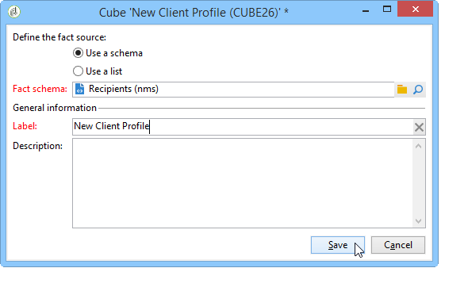

# Creazione di indicatori{#creating-indicators}

Per rendere funzionale un cubo, è necessario identificare le dimensioni e le misure rilevanti e crearle nel cubo.

Per creare un cubo, effettua i seguenti passaggi:

1. Selezionare la tabella di lavoro. Fare riferimento a [Selezione della tabella di lavoro](#selecting-the-work-table).
1. Definite le dimensioni. Fare riferimento a [Definizione delle dimensioni](#defining-dimensions).
1. Definite le misure. Fare riferimento a [Indicatori di generazione](#building-indicators).
1. Creare aggregati (facoltativo). Fare riferimento a [Calcolo e utilizzo degli aggregati](../../reporting/using/concepts-and-methodology.md#calculating-and-using-aggregates).

In questo esempio viene illustrato come creare rapidamente un cubo semplice in un rapporto per esportare le relative misure.

Le fasi di implementazione sono descritte di seguito. Le opzioni e le descrizioni esaustive sono disponibili nelle altre sezioni di questo capitolo.

## Selezione della tabella di lavoro {#selecting-the-work-table}

Per creare un cubo, fate clic sul pulsante **[!UICONTROL New]** sopra l&#39;elenco dei cubi.

Selezionare lo schema dei fatti, ovvero lo schema che contiene gli elementi da esplorare. In questo esempio, selezioneremo la tabella **Recipient**.

Fate clic su **[!UICONTROL Save]** per creare il cubo: verrà visualizzato nell’elenco dei cubi e potrebbe essere configurato utilizzando le schede appropriate.

Fare clic sul collegamento **[!UICONTROL Filter the source data...]** per applicare i calcoli di questo cubo a una selezione di dati nel database.

## Definizione delle dimensioni {#defining-dimensions}

Gli Dimension coincidono con gli assi di analisi definiti per ciascun cubo in base al relativo schema di fatti. Queste sono le dimensioni esaminate nell&#39;analisi, come l&#39;ora (anno, mese, data...), una classificazione di prodotti o contratti (famiglia, riferimento, ecc.), un segmento di popolazione (per città, gruppo di età, stato, ecc.).

Questi assi di analisi sono definiti nella scheda **[!UICONTROL Dimension]** del cubo.

Fare clic sul pulsante **[!UICONTROL Add]** per creare una nuova dimensione, quindi, in **[!UICONTROL Expression field]**, fare clic sull&#39;icona **[!UICONTROL Edit expression]** per selezionare il campo che contiene i dati interessati.

* Per iniziare, selezionare il destinatario **Età**. Per questo campo è possibile definire il binding con le pagine di gruppo e semplificare la lettura delle informazioni. È consigliabile utilizzare il binning quando esiste la probabilità di diversi valori separati.

   A questo scopo, selezionare l&#39;opzione **[!UICONTROL Enable binning]**. Le modalità di associazione sono descritte in [Associazione dei dati](../../reporting/using/concepts-and-methodology.md#data-binning).

   

* Aggiungere una dimensione di tipo **Date**. Qui, vogliamo visualizzare le date di creazione del profilo del destinatario

   A questo scopo, fare clic su **[!UICONTROL Add]** e selezionare il campo **[!UICONTROL Creation date]** nella tabella dei destinatari.

   

   È possibile selezionare la modalità di visualizzazione della data. A questo scopo, selezionate la gerarchia da utilizzare e i livelli da generare:

   

   Nel nostro esempio, vogliamo visualizzare solo anni, mesi e giorni, dal momento che non è possibile lavorare con settimane e semestri/mesi contemporaneamente: questi livelli non sono compatibili.

* Crea un&#39;altra dimensione per analizzare i dati relativi alla città del destinatario

   A questo scopo, aggiungi una nuova dimensione e seleziona la città nel nodo **[!UICONTROL Location]** dello schema del destinatario.

   

   È possibile abilitare il binding per semplificare la lettura delle informazioni e collegare i valori a un&#39;enumerazione.

   

   Seleziona l&#39;enumerazione dall&#39;elenco a discesa

   

   Vengono visualizzati solo i valori nell&#39;enumerazione. Gli altri verranno raggruppati sotto l&#39;etichetta definita nel campo **[!UICONTROL Label of the other values]**.

   Per ulteriori informazioni, vedere [Gestione dinamica dei contenitori](../../reporting/using/concepts-and-methodology.md#dynamically-managing-bins).

## Indicatori di generazione {#building-indicators}

Una volta definite le dimensioni, è necessario specificare una modalità di calcolo per i valori da visualizzare nelle celle. A tal fine, creare gli indicatori corrispondenti nella scheda **[!UICONTROL Measures]**: crea nel rapporto tutte le misure possibili quante colonne verranno visualizzate.

A questo scopo, eseguire i seguenti passaggi:

1. Fai clic sul pulsante **[!UICONTROL Add]**.
1. Selezionare il tipo di misura e la formula da applicare. Qui vogliamo contare il numero di donne tra i beneficiari.

   La nostra misura è basata sullo schema dei fatti e utilizza l&#39;operatore **[!UICONTROL Count]**.

   

   Il collegamento **[!UICONTROL Filter the measure data...]** consente di selezionare solo donne. Per ulteriori informazioni sulla definizione delle misure e delle opzioni disponibili, vedere [Definizione delle misure](../../reporting/using/concepts-and-methodology.md#defining-measures).

   

1. Immettete l’etichetta della misura e salvatela.

   

1. Salva il cubo.

## Creazione di un report basato su un cubo {#creating-a-report-based-on-a-cube}

Una volta configurato, il cubo può essere utilizzato come modello per creare un nuovo rapporto.

Per eseguire questa operazione:

1. Fare clic sul pulsante **[!UICONTROL Create]** dell&#39;universo **[!UICONTROL Reports]** e selezionare il cubo appena creato.

   

1. Fare clic sul pulsante **[!UICONTROL Create]** per confermare: questo ti porterà alla configurazione del report e alla pagina di visualizzazione.

   Per impostazione predefinita, le prime due dimensioni disponibili sono offerte in righe e colonne, ma nella tabella non viene visualizzato alcun valore. Per generare la tabella, fare clic sull’icona principale:

   

1. Potete cambiare gli assi della quota, eliminarli, aggiungere nuove misure, ecc. Le possibili operazioni sono descritte qui di seguito: [Uso dei cubi per esplorare i dati](../../reporting/using/using-cubes-to-explore-data.md).

   A tal fine, utilizzate le icone appropriate.

   

