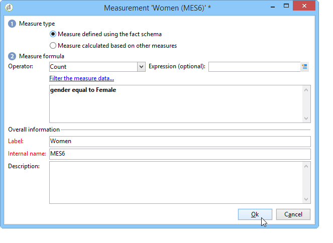

# Creare indicatori{#creating-indicators}

Per rendere funzionale un cubo, è necessario identificare le dimensioni e le misure rilevanti e crearle nel cubo.

Per creare un cubo, esegui i seguenti passaggi:

1. Selezionare la tabella di lavoro. Fai riferimento a [Selezionare la tabella di lavoro](#selecting-the-work-table).
1. Definisci le dimensioni. Fai riferimento a [Definire le dimensioni](#defining-dimensions).
1. Definisci le misure. Fai riferimento a [Indicatori di creazione](#building-indicators).
1. Creare aggregati (facoltativo). Fai riferimento a [Calcolare e utilizzare gli aggregati](../../reporting/using/concepts-and-methodology.md#calculating-and-using-aggregates).

Questo esempio mostra come creare rapidamente un cubo semplice in un report per esportare le relative misure.

I passaggi di implementazione sono descritti di seguito. Le opzioni e le descrizioni esaustive sono disponibili nelle altre sezioni di questo capitolo.

## Selezionare la tabella di lavoro {#selecting-the-work-table}

Per creare un cubo, fai clic sul pulsante **[!UICONTROL New]** sopra l&#39;elenco dei cubi.

Selezionare lo schema dei fatti, ovvero lo schema contenente gli elementi che si desidera esplorare. In questo esempio, selezioneremo il **Destinatario** tabella.

Fai clic su **[!UICONTROL Save]** per creare il cubo: verrà visualizzato nell’elenco dei cubi e potrebbe quindi essere configurato utilizzando le schede appropriate.

Fai clic sul pulsante **[!UICONTROL Filter the source data...]** collegamento per applicare i calcoli di questo cubo a una selezione di dati nel database.

## Definire le dimensioni {#defining-dimensions}

I Dimension coincidono con gli assi di analisi definiti per ciascun cubo in base al relativo schema di fatti. Queste sono le dimensioni esaminate nell’analisi, come l’ora (anno, mese, data...), una classificazione di prodotti o contratti (famiglia, riferimento, ecc.), un segmento di popolazione (per città, gruppo di età, stato, ecc.).

Questi assi di analisi sono definiti nella **[!UICONTROL Dimension]** scheda del cubo.

Fai clic sul pulsante **[!UICONTROL Add]** per creare una nuova dimensione, quindi nella **[!UICONTROL Expression field]**, fai clic su **[!UICONTROL Edit expression]** per selezionare il campo contenente i dati interessati.

* Inizia selezionando il destinatario **Età**. Per questo campo è possibile definire il binding alle pagine di gruppo e semplificare la lettura delle informazioni. È consigliabile utilizzare il binding quando è probabile che siano presenti diversi valori separati.

   Per eseguire questa operazione, controlla il **[!UICONTROL Enable binning]** opzione . Le modalità di associazione sono descritte in [Associazione dei dati](../../reporting/using/concepts-and-methodology.md#data-binning).

   

* Aggiungi un **Data** digita la dimensione. In questo caso, vogliamo visualizzare le date di creazione del profilo del destinatario

   A questo scopo, fai clic su **[!UICONTROL Add]** e seleziona la **[!UICONTROL Creation date]** nella tabella dei destinatari.

   

   È possibile selezionare la modalità di visualizzazione della data. A questo scopo, seleziona la gerarchia da utilizzare e i livelli da generare:

   

   Nel nostro esempio, vogliamo visualizzare solo anni, mesi e giorni, poiché non è possibile lavorare con settimane e semestri/mesi contemporaneamente: questi livelli non sono compatibili.

* Crea un’altra dimensione per analizzare i dati relativi alla città del destinatario

   A questo scopo, aggiungi una nuova dimensione e seleziona la città nella **[!UICONTROL Location]** nodo dello schema destinatario.

   

   È possibile abilitare il binding per semplificare la lettura delle informazioni e collegare i valori a un’enumerazione.

   

   Seleziona l’enumerazione dall’elenco a discesa

   

   Verranno visualizzati solo i valori nell’enumerazione. Gli altri saranno raggruppati sotto l&#39;etichetta definita nella **[!UICONTROL Label of the other values]** campo .

   Per ulteriori informazioni, consulta [Gestione dinamica dei contenitori](../../reporting/using/concepts-and-methodology.md#dynamically-managing-bins).

## Indicatori di creazione {#building-indicators}

Una volta definite le dimensioni, è necessario specificare una modalità di calcolo per i valori da visualizzare nelle celle. A questo scopo, crea gli indicatori corrispondenti nel **[!UICONTROL Measures]** scheda: crea tutte le misure quante le colonne da visualizzare nel rapporto che utilizzerà il cubo.

A questo scopo, esegui i seguenti passaggi:

1. Fai clic sul pulsante **[!UICONTROL Add]**.
1. Selezionare il tipo di misura e la formula da applicare. Qui vogliamo contare il numero di donne tra i destinatari.

   La nostra misura si basa sullo schema dei fatti e utilizza il **[!UICONTROL Count]** operatore.

   

   La **[!UICONTROL Filter the measure data...]** link ti consente di selezionare solo donne. Per ulteriori informazioni sulla definizione delle misure e delle opzioni disponibili, consulta [Definire le misure](../../reporting/using/concepts-and-methodology.md#defining-measures).

   

1. Inserisci l’etichetta della misura e salvala.

   

1. Salva il cubo.

## Creare un report basato su un cubo {#creating-a-report-based-on-a-cube}

Una volta configurato, il cubo può essere utilizzato come modello per creare un nuovo report.

Per eseguire questa operazione:

1. Fai clic sul pulsante **[!UICONTROL Create]** pulsante **[!UICONTROL Reports]** e selezionare il cubo appena creato.

   

1. Fai clic sul pulsante **[!UICONTROL Create]** pulsante per confermare: questo ti porterà alla configurazione del report e alla pagina di visualizzazione.

   Per impostazione predefinita, le prime due dimensioni disponibili sono offerte in righe e colonne, ma non viene visualizzato alcun valore nella tabella. Per generare la tabella, fai clic sull’icona principale:

   

1. Potete cambiare gli assi della dimensione, eliminarli, aggiungere nuove misure, ecc. Le possibili operazioni sono descritte in [questa pagina](../../reporting/using/using-cubes-to-explore-data.md).

   A questo scopo, utilizza le icone appropriate.

   
