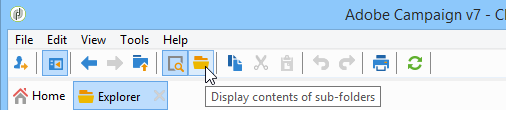

# Rapporti cumulativi {#cumulative-reports}

Puoi visualizzare i rapporti cumulativi sulle consegne. A questo scopo, seleziona le consegne da confrontare per ottenere l’elenco dei rapporti per queste consegne.

Per selezionare consegne non adiacenti dall’elenco, tieni premuto il tasto CTRL durante la selezione.

Per selezionare le consegne salvate in un&#39;altra cartella, fare clic su **[!UICONTROL Display sub-levels]** (accessibile tramite la barra degli strumenti). Vengono quindi visualizzati nello stesso elenco.

