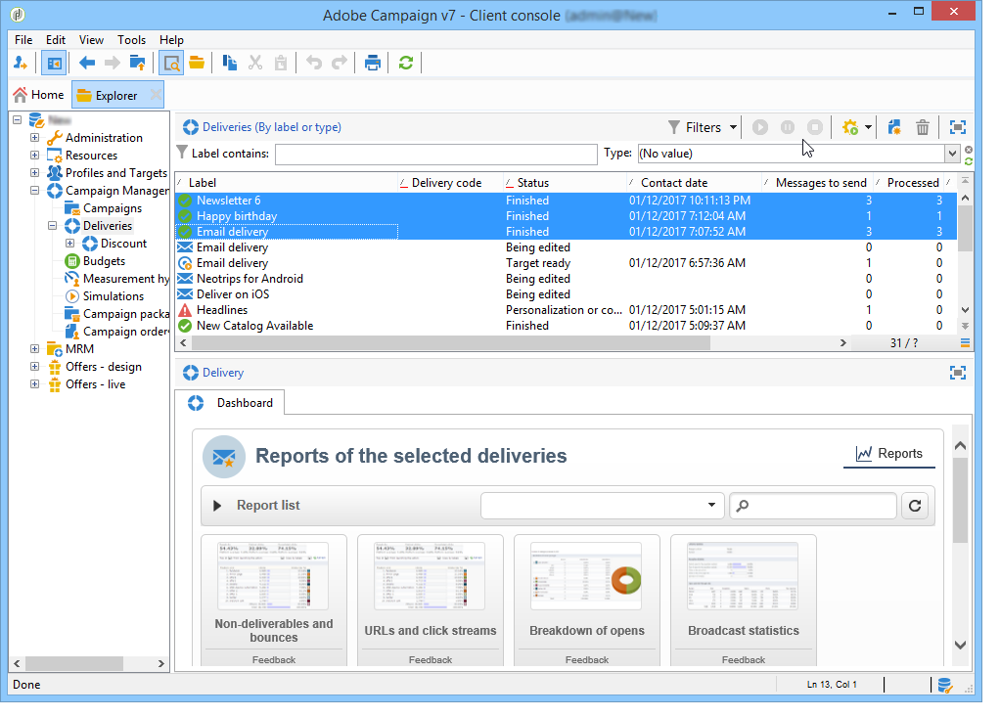

# Rapporti cumulativi {#cumulative-reports}

Puoi visualizzare rapporti cumulati sulle consegne. A questo scopo, seleziona le consegne da confrontare per ottenere l’elenco dei rapporti per queste consegne.

Per selezionare dall’elenco consegne non adiacenti, tenere premuto il tasto CTRL durante la selezione.

Per selezionare le consegne salvate in una cartella diversa, fai clic su **[!UICONTROL Display sub-levels]** (accessibile tramite la barra degli strumenti). Vengono quindi visualizzati nello stesso elenco.

