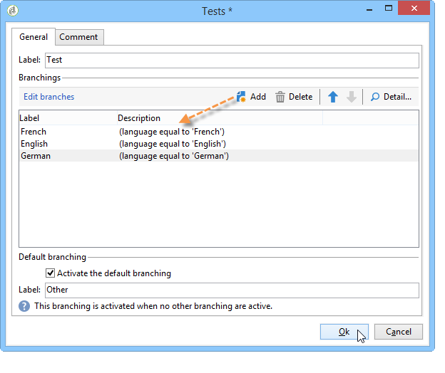

# Definire un contenuto condizionale{#defining-a-conditional-content}

Puoi condizionare la visualizzazione di pagine o elementi del rapporto specifici.

Per rendere condizionali elementi specifici, adattarne le impostazioni di visibilità. Per ulteriori informazioni, consulta [Visualizzazione elemento condizione](#conditioning-item-display).

Per rendere condizionale la visualizzazione di una o più pagine, utilizzare una **[!UICONTROL Test]** attività di tipo. Per ulteriori informazioni, consulta [Visualizzazione pagina condizione](#conditioning-page-display).

## Visualizzazione elemento condizione {#conditioning-item-display}

Per rendere condizionale la visualizzazione di una parte di un rapporto, è necessario definirne le condizioni di visibilità: se queste non vengono soddisfatte, gli elementi non verranno visualizzati.

Le condizioni di visibilità possono dipendere dallo stato dell’operatore, dagli elementi selezionati o immessi nella pagina del rapporto.

Esempi che mostrano la visualizzazione condizionale degli elementi su una pagina sono forniti in [questa sezione](../../web/using/form-rendering.md#defining-fields-conditional-display).

Nell’esempio seguente, la condizione di visualizzazione dipende dalla lingua:

## Visualizzazione pagina condizione {#conditioning-page-display}

Nel grafico di un report, il **[!UICONTROL Test]** attività consente di modificare la sequenza di pagine a seconda di una o più condizioni.

Questa attività si basa sul seguente principio di funzionamento:

1. Inserisci un **[!UICONTROL Test]** in un grafico e modificarlo.
1. Fai clic su **[!UICONTROL Add]** per creare i vari casi possibili.

   

   Per ogni caso, viene aggiunta una transizione di output al **[!UICONTROL Test]** attività.

   

1. Seleziona la **[!UICONTROL Enable default transition]** per aggiungere una transizione, nel caso in cui una delle condizioni configurate non sia soddisfatta.

   Per ulteriori informazioni al riguardo, consulta [questa sezione](../../web/using/defining-web-forms-page-sequencing.md#conditional-page-display).

A **[!UICONTROL Test]** L’attività può essere posizionata all’inizio del grafico per condizionare la visualizzazione in base al contesto o al profilo dell’operatore, ad esempio.
