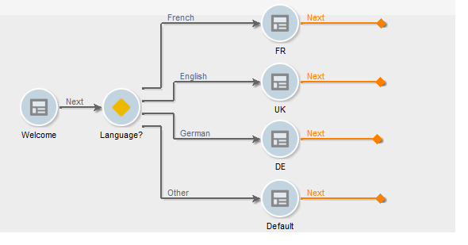

# Definizione di un contenuto condizionale{#defining-a-conditional-content}

È possibile condizionare la visualizzazione di specifici elementi o pagine del rapporto.

Per rendere condizionali elementi specifici, adattane le impostazioni di visibilità. Per ulteriori informazioni, consulta [Visualizzazione elemento di condizionamento](#conditioning-item-display).

Per rendere condizionale la visualizzazione di una o più pagine, utilizza un’attività di tipo **[!UICONTROL Test]**. Per ulteriori informazioni, consulta [Visualizzazione pagina di condizionamento](#conditioning-page-display).

## Visualizzazione dell&#39;elemento di condizionamento {#conditioning-item-display}

Per condizionare la visualizzazione di parte di un rapporto, è necessario definirne le condizioni di visibilità: se questi elementi non sono soddisfatti, gli elementi non verranno visualizzati.

Le condizioni di visibilità possono dipendere dallo stato dell’operatore, dagli elementi selezionati o inseriti nella pagina del rapporto.

Esempi che mostrano la visualizzazione condizionale degli elementi in una pagina sono forniti in [questa sezione](../../web/using/form-rendering.md#defining-fields-conditional-display).

Nell’esempio seguente, la condizione di visualizzazione dipende dalla lingua:

## Visualizzazione della pagina di condizionamento {#conditioning-page-display}

Nel grafico di un rapporto, l’ attività **[!UICONTROL Test]** ti consente di modificare la sequenza di pagine a seconda di una o più condizioni.

Questa attività si basa sul seguente principio operativo:

1. Inserire un elemento **[!UICONTROL Test]** in un grafico e modificarlo.
1. Fai clic sul pulsante **[!UICONTROL Add]** per creare i vari casi possibili.

   

   Per ogni caso, all’attività **[!UICONTROL Test]** viene aggiunta una transizione di output.

   

1. Seleziona il **[!UICONTROL Enable default transition]** per aggiungere una transizione, nel caso in cui una delle condizioni configurate non sia soddisfatta.

   Per ulteriori informazioni al riguardo, consulta [questa sezione](../../web/using/defining-web-forms-page-sequencing.md#conditional-page-display).

Un’attività **[!UICONTROL Test]** può essere posizionata all’inizio del grafico per condizionare la visualizzazione in base al contesto o al profilo dell’operatore, ad esempio.
