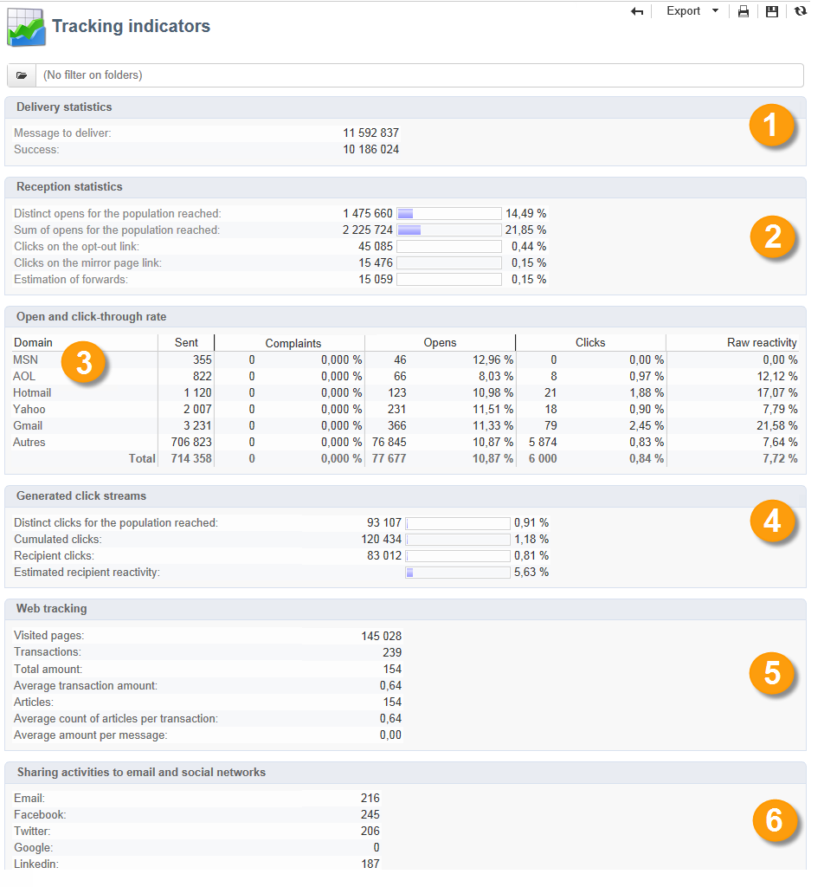

# Rapporti sulle consegne {#delivery-reports}

Puoi tenere traccia dell’esecuzione delle consegne tramite vari rapporti accessibili dalla panoramica della consegna. Per visualizzare i rapporti, attenersi alla procedura descritta di seguito.

1. Vai alla scheda **[!UICONTROL Campaigns]** e fai clic sul collegamento **[!UICONTROL Delivery]** per visualizzare l&#39;elenco delle consegne.
1. Fai clic sul nome della consegna che desideri visualizzare per visualizzarne i dettagli.

   

1. Selezionare la scheda **[!UICONTROL Summary]** e fare clic sul collegamento **[!UICONTROL Reports]** per accedere ai report specifici della consegna.

   

   Per impostazione predefinita, sono disponibili i seguenti rapporti:

   * **[!UICONTROL Delivery throughput]** : fai riferimento a [Velocità effettiva di consegna](../../reporting/using/global-reports.md#delivery-throughput).
   * **[!UICONTROL Sharing to social networks]**: fare riferimento a [Condivisione su social network](../../reporting/using/global-reports.md#sharing-to-social-networks).
   * **[!UICONTROL Statistics on sharing activities]** : fai riferimento a [Statistiche sulle attività di condivisione](../../reporting/using/global-reports.md#statistics-on-sharing-activities).
   * **[!UICONTROL Hot clicks]** : fai riferimento a [Hot click](#hot-clicks).
   * **[!UICONTROL Tracking statistics]** : fai riferimento a [Statistiche di tracciamento](#tracking-statistics)
   * **[!UICONTROL URLs and click streams]** : fai riferimento a [URL e ai flussi di clic](#urls-and-click-streams).
   * **[!UICONTROL Tracking indicators]** : fai riferimento a [Indicatori di tracciamento](#tracking-indicators).
   * **[!UICONTROL Non-deliverables and bounces]** : fai riferimento a [Messaggi non recapitati e non recapitati](../../reporting/using/global-reports.md#non-deliverables-and-bounces).
   * **[!UICONTROL User activities]** : fai riferimento a [Attività utente](../../reporting/using/global-reports.md#user-activities).
   * **[!UICONTROL Delivery summary]** : fai riferimento a [Riepilogo consegna](#delivery-summary).
   * **[!UICONTROL Subscription tracking]** : fai riferimento a [Tracciamento abbonamento](../../reporting/using/global-reports.md#subscription-tracking).
   * **[!UICONTROL Delivery statistics]** : fai riferimento a [Statistiche di consegna](../../reporting/using/global-reports.md#delivery-statistics).
   * **[!UICONTROL Breakdown of opens]** : fai riferimento a [Raggruppamento di aperture](../../reporting/using/global-reports.md#breakdown-of-opens).

## Indicatori di tracciamento {#tracking-indicators}

Questo rapporto combina gli indicatori chiave per monitorare il comportamento dei destinatari al momento della ricezione della consegna. Consente di accedere alle statistiche su consegna e ricezione, ai tassi di apertura e click-through, ai flussi clic generati, al tracciamento web e alle attività di condivisione sui social network.

>[!NOTE]
>
>I valori calcolati in base all’apertura dei messaggi sono sempre stime, a causa del margine di errore collegato alle e-mail in formato testo. Gli indicatori **[!UICONTROL Distinct opens/Sum of opens for the population reached]** tengono conto di questo margine di errore. Per ulteriori informazioni sulle aperture di tracciamento, fare riferimento a [Aperture di tracciamento](../../reporting/using/indicator-calculation.md#tracking-opens-).

**[!UICONTROL 1. Delivery statistics]**

* **[!UICONTROL Messages to deliver]** : numero totale di messaggi da consegnare dopo l’analisi della consegna.
* **[!UICONTROL Success]**: numero di messaggi elaborati correttamente.

**[!UICONTROL 2. Reception statistics]**

>[!NOTE]
>
>Le percentuali correlate vengono calcolate in base al numero di messaggi inoltrati correttamente.

* **[!UICONTROL Distinct opens for the population reached]**: stima del numero di destinatari di destinazione che hanno aperto un messaggio almeno una volta. I clic sugli URL tracciati vengono presi in considerazione, in quanto è necessario aprire le e-mail per fare clic su un collegamento.
* **[!UICONTROL Sum of opens for the population reached]**: stima del numero totale di aperture da parte dei destinatari di destinazione.
* **[!UICONTROL Clicks on opt-out link]** : numero di clic sul collegamento di annullamento dell&#39;abbonamento.
* **[!UICONTROL Clicks on the mirror page link]** : numero di clic sul collegamento alla pagina mirror. Per essere preso in considerazione, il collegamento deve essere definito come tale nell’assistente alla consegna (URL tracciati). Fai riferimento a questa [pagina](../../delivery/using/about-delivery-monitoring.md).
* **[!UICONTROL Estimation of forwards]**: stima del numero di e-mail inoltrate dai destinatari interessati. Questo valore viene calcolato sottraendo il numero di persone distinte e il numero di destinatari distinti che hanno fatto clic nell’e-mail.

  >[!NOTE]
  >
  >Per ulteriori informazioni sulla differenza tra persone distinte e destinatari di destinazione, consulta [Persone o destinatari di destinazione](../../reporting/using/indicator-calculation.md#targeted-persons---recipients).

**[!UICONTROL 3. Open and click-through rate]**

Questa tabella di valori mostra il raggruppamento di consegne, aperture, clic e reattività non elaborata per dominio Internet. Sono utilizzati i seguenti indicatori:

* **[!UICONTROL Sent]**: numero totale di messaggi inviati in questo dominio.
* **[!UICONTROL Complaints]** : numero di messaggi per questo dominio che sono stati segnalati come indesiderati dal destinatario. La frequenza viene calcolata in base al numero totale di messaggi inviati su questo dominio.
* **[!UICONTROL Opens]** : numero di destinatari di destinazione distinti per questo dominio che hanno aperto un messaggio almeno una volta. La frequenza viene calcolata in base al numero totale di messaggi inviati su questo dominio.
* **[!UICONTROL Clicks]**: numero di destinatari di destinazione distinti che hanno fatto clic almeno una volta nella stessa consegna. La frequenza viene calcolata in base al numero totale di messaggi inviati su questo dominio
* **[!UICONTROL Raw reactivity]** : percentuale del numero di destinatari che hanno fatto clic su una consegna almeno una volta rispetto al numero di destinatari che hanno aperto una consegna almeno una volta.

>[!NOTE]
>
>I nomi di dominio visualizzati in questo report sono definiti nell&#39;elenco dettagliato utilizzato a livello di cubo. Per modificare, aggiungere o rimuovere i domini predefiniti, modificare l&#39;elenco dettagliato **[!UICONTROL Domains]** e modificare i valori e gli alias. Per ulteriori informazioni, consulta [questa sezione](../../platform/using/managing-enumerations.md). La categoria **[!UICONTROL Others]** include nomi di dominio che non appartengono ad alcun valore dell&#39;elenco dettagliato.

**[!UICONTROL 4. Generated click streams]**

>[!NOTE]
>
>Le percentuali correlate vengono calcolate in base al numero di messaggi inoltrati correttamente.

* **[!UICONTROL Distinct clicks for the population reached]**: numero di persone distinte che hanno fatto clic almeno una volta in una consegna.
* **[!UICONTROL Cumulated clicks]** : numero totale di clic da parte dei destinatari di destinazione, esclusi i collegamenti di annullamento dell&#39;abbonamento e le pagine mirror.
* **[!UICONTROL Recipient clicks]**: numero di destinatari di destinazione distinti che hanno fatto clic almeno una volta nella stessa consegna.
* **[!UICONTROL Estimated recipient reactivity]**: rapporto tra il numero di destinatari che hanno fatto clic almeno una volta in una consegna e il numero stimato di destinatari che hanno aperto una consegna almeno una volta. I clic sui collegamenti di rinuncia e pagina speculare non vengono presi in considerazione.

**[!UICONTROL 5. Web tracking]**

* **[!UICONTROL Visited pages]**: numero di pagine Web visitate dopo la ricezione del messaggio.
* **[!UICONTROL Transactions]** : numero di acquisti dopo la ricezione del messaggio.
* **[!UICONTROL Total amount]** : importo totale degli acquisti dopo la ricezione del messaggio.
* **[!UICONTROL Average transaction amount]**: acquisto medio effettuato da destinatari di consegna distinti.
* **[!UICONTROL Articles]** : numero di articoli acquistati dai destinatari della consegna.
* **[!UICONTROL Average count of articles per transaction]** : numero medio di elementi per acquisto effettuato da destinatari distinti.
* **[!UICONTROL Average amount per message]**: importo medio degli acquisti generati per messaggio.

  >[!NOTE]
  >
  >Affinché una pagina, una transazione, un importo o un articolo visitato possa essere preso in considerazione, è necessario inserire un tag di web tracking nella pagina web corrispondente. La configurazione del tracciamento web è presentata in [questa sezione](../../configuration/using/about-web-tracking.md).

**[!UICONTROL 6. Sharing activities to email and social networks]**

Questa sezione mostra il numero di messaggi condivisi su ogni social network. Per ulteriori informazioni, consulta [Condivisione su social network](../../reporting/using/global-reports.md#sharing-to-social-networks).

## URL e flussi di clic {#urls-and-click-streams}

Questo rapporto mostra l’elenco delle pagine visitate dopo una consegna.

Puoi configurare il contenuto di questo rapporto selezionando: il grafico a punteggio da visualizzare, il filtro temporale (dal lancio dell’azione, nelle prime 6 ore successive al lancio, ecc.) e la modalità di visualizzazione dei dati (per etichetta, URL, categoria). Fai clic su **[!UICONTROL Refresh]** per confermare la selezione.

Nella sezione superiore del rapporto vengono visualizzate le seguenti percentuali:

* **[!UICONTROL Reactivity]**: rapporto tra il numero di destinatari con targeting che hanno fatto clic in una consegna e il numero stimato di destinatari con targeting che hanno aperto una consegna. I clic sul collegamento di rinuncia e sulla pagina mirror non vengono presi in considerazione.

  >[!NOTE]
  >
  >Per ulteriori informazioni sulle aperture di tracciamento, fare riferimento a [Aperture di tracciamento](../../reporting/using/indicator-calculation.md#tracking-opens-).

* **[!UICONTROL Distinct clicks]** : numero di persone distinte che hanno fatto clic almeno una volta (esclusi il collegamento di annullamento dell’abbonamento e la pagina mirror) in una consegna. La frequenza visualizzata viene calcolata in base al numero di messaggi consegnati correttamente.
* **[!UICONTROL Cumulated clicks]** : numero totale di clic dai destinatari di destinazione (esclusi il collegamento di annullamento dell&#39;abbonamento e la pagina mirror). La frequenza visualizzata viene calcolata in base al numero di messaggi inoltrati correttamente.

**[!UICONTROL Platform average]** : questo tasso medio, visualizzato sotto ogni tasso (reattività, clic distinti e clic cumulativi), è calcolato per le consegne inviate nei sei mesi precedenti. Vengono prese in considerazione solo le consegne con la stessa tipologia e sullo stesso canale. Le bozze sono escluse.

La tabella centrale fornisce le seguenti informazioni:

* **[!UICONTROL Clicks]** : numero di clic cumulativi, per collegamento.
* **[!UICONTROL Clicks (in %)]**: suddivisione del numero di clic per collegamento in relazione al numero totale di clic cumulativi.

**[!UICONTROL Breakdown of clicks in time]**

Questo grafico mostra la suddivisione dei clic cumulativi al giorno.

## Riepilogo della consegna {#delivery-summary}

Questo rapporto fornisce tutte le informazioni principali sulla consegna.

**[!UICONTROL Target population]**

Questa sezione presenta due indicatori:

* **[!UICONTROL Initial population]**: numero totale di destinatari interessati dalla consegna.
* inserire nell&#39;elenco Bloccati **[!UICONTROL Messages rejected by the rule]** : numero di indirizzi ignorati durante l&#39;analisi durante l&#39;applicazione delle regole di tipologia: indirizzo mancante, messo in quarantena, in fase di, ecc. Per ulteriori informazioni sulle regole di tipologia, consulta questa [pagina](../../delivery/using/steps-validating-the-delivery.md#validation-process-with-typologies).

**[!UICONTROL Causes of exclusion]**

Il grafico centrale mostra il raggruppamento per regola dei messaggi rifiutati durante l’analisi.

**[!UICONTROL Delivery statistics]**

Questa sezione include i seguenti indicatori:

* **[!UICONTROL Messages to be delivered]** : numero totale di messaggi da consegnare dopo l’analisi della consegna.
* **[!UICONTROL Success]**: numero di messaggi elaborati correttamente. Il tasso associato è il rapporto con il numero di messaggi da consegnare.
* **[!UICONTROL Errors]** : numero totale di errori cumulativi durante le consegne ed elaborazione automatica del rebound. Il tasso associato è il rapporto con il numero di messaggi da consegnare.
* **[!UICONTROL New quarantines]** : numero di indirizzi messi in quarantena a seguito di una consegna non riuscita (utente sconosciuto, dominio non valido). Il tasso associato è il rapporto con il numero di messaggi da consegnare.

## Hot click {#hot-clicks}

Questo rapporto mostra il contenuto del messaggio (HTML e/o testo) e la percentuale di clic per ogni collegamento. I collegamenti presenti nei blocchi di personalizzazione per l’annullamento dell’iscrizione, per le pagine mirror e per le offerte vengono presi in considerazione nei clic totali cumulati, ma non vengono visualizzati nel rapporto.

>[!NOTE]
>
>Se la consegna contiene offerte (interazione), nella parte superiore del rapporto viene visualizzata una casella che mostra la percentuale di clic sulle offerte.

## Statistiche di tracciamento {#tracking-statistics}

Questo rapporto fornisce statistiche su aperture, clic e transazioni.

Ti consente di monitorare l’impatto di marketing della consegna. Puoi configurare la modalità di visualizzazione dei valori modificando la scala cronologica (visualizzazione a 1 ora, a 3 ore o a 24 ore, ecc.). Fai clic su **[!UICONTROL Refresh]** per confermare la selezione.

Questo rapporto fornisce una tabella di valori e un grafico Pareto che mostra il tempo necessario affinché la consegna raggiunga la massima efficienza. Sono utilizzati i seguenti indicatori:

* **[!UICONTROL Opens]**: stima del tempo necessario per raggiungere una percentuale del numero totale di messaggi aperti. Le e-mail in formato testo non vengono prese in considerazione. Per ulteriori informazioni sulle aperture di tracciamento, fare riferimento a [Aperture di tracciamento](../../reporting/using/indicator-calculation.md#tracking-opens-).
* **[!UICONTROL Clicks]**: stima del tempo necessario per raggiungere una percentuale del numero totale di clic registrati. I clic sul collegamento di rinuncia e sulla pagina speculare non vengono presi in considerazione.
* **[!UICONTROL Transactions]**: tempo necessario per ottenere una percentuale del numero totale di transazioni dopo la ricezione del messaggio. Affinché una transazione possa essere presa in considerazione, è necessario inserire un tag di tracciamento web di tipo transazione nella pagina web corrispondente. La configurazione del tracciamento web è presentata in [questa sezione](../../configuration/using/about-web-tracking.md).
