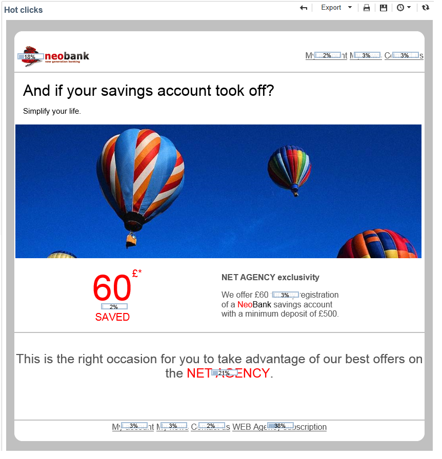

# Report di consegna {#delivery-reports}

Puoi tenere traccia dell’esecuzione delle consegne tramite vari rapporti accessibili dalla panoramica sulla distribuzione. Per visualizzare i rapporti, attenersi alla procedura seguente:

1. Vai all&#39; **[!UICONTROL Campaigns]** universo e fai clic sul **[!UICONTROL Delivery]** collegamento per visualizzare l&#39;elenco delle consegne.
1. Fate clic sul nome della consegna da visualizzare per visualizzarne i dettagli.

   

1. Selezionate la **[!UICONTROL Summary]** scheda e fate clic sul **[!UICONTROL Reports]** collegamento per accedere ai rapporti specifici per la consegna.

   

   Per impostazione predefinita, sono disponibili i seguenti rapporti:

   * **[!UICONTROL Delivery throughput]** : fare riferimento alla [consegna effettiva](../../reporting/using/global-reports.md#delivery-throughput).
   * **[!UICONTROL Sharing to social networks]** : fare riferimento a [Condivisione su social network](../../reporting/using/global-reports.md#sharing-to-social-networks).
   * **[!UICONTROL Statistics on sharing activities]** : fare riferimento a [Statistiche sulle attività](../../reporting/using/global-reports.md#statistics-on-sharing-activities)di condivisione.
   * **[!UICONTROL Hot clicks]** : fare riferimento ai [clic](#hot-clicks)attivi.
   * **[!UICONTROL Tracking statistics]** : fare riferimento alle statistiche di [tracciamento](#tracking-statistics)
   * **[!UICONTROL URLs and click streams]** : fate riferimento agli [URL e fate clic sui flussi](#urls-and-click-streams).
   * **[!UICONTROL Tracking indicators]** : fare riferimento agli indicatori [di](#tracking-indicators)tracciamento.
   * **[!UICONTROL Non-deliverables and bounces]** : fare riferimento a [Non risultati finali e rimbalzi](../../reporting/using/global-reports.md#non-deliverables-and-bounces).
   * **[!UICONTROL User activities]** : fare riferimento alle attività utente.
   * **[!UICONTROL Delivery summary]** : fare riferimento al riepilogo Consegna.
   * **[!UICONTROL Subscription tracking]** : fate riferimento al tracciamento [della](../../reporting/using/global-reports.md#subscription-tracking)sottoscrizione.
   * **[!UICONTROL Delivery statistics]** : fare riferimento alle statistiche sulla [consegna](../../reporting/using/global-reports.md#delivery-statistics).
   * **[!UICONTROL Breakdown of opens]** : fare riferimento a [Suddivisione delle aperture](../../reporting/using/global-reports.md#breakdown-of-opens).

## Indicatori di tracciamento {#tracking-indicators}

Questo rapporto combina gli indicatori chiave per tenere traccia del comportamento dei destinatari alla ricezione della consegna. Consente l&#39;accesso alle statistiche di consegna e ricezione, ai tassi di apertura e click-through, ai flussi di clic generati, al monitoraggio Web e alla condivisione delle attività sui social network.

>[!NOTE]
>
>I valori calcolati in base alle aperture dei messaggi sono sempre stime, a causa del margine di errore collegato alle e-mail in formato testo. Gli **[!UICONTROL Distinct opens/Sum of opens for the population reached]** indicatori tengono conto di questo margine di errore. Per ulteriori informazioni sulle aperture di tracciamento, consultate [Aperture](../../reporting/using/indicator-calculation.md#tracking-opens-)di tracciamento.

**[!UICONTROL 1. Delivery statistics]**

* **[!UICONTROL Messages to deliver]** : Numero totale di messaggi da inviare dopo l&#39;analisi della consegna.
* **[!UICONTROL Success]** : Numero di messaggi elaborati correttamente.

**[!UICONTROL 2. Reception statistics]**

>[!NOTE]
>
>Le percentuali correlate vengono calcolate in base al numero di messaggi inoltrati correttamente.

* **[!UICONTROL Distinct opens for the population reached]** : Stima del numero di destinatari con targeting che hanno aperto un messaggio almeno una volta. Vengono presi in considerazione i clic sui collegamenti di annullamento dell&#39;iscrizione e le pagine mirror.
* **[!UICONTROL Sum of opens for the population reached]** : Stima del numero totale di aperture per destinatari con targeting.
* **[!UICONTROL Clicks on opt-out link]** : Numero di clic sul collegamento di annullamento della sottoscrizione.
* **[!UICONTROL Clicks on the mirror page link]** : Numero di clic sul collegamento alla pagina mirror. Per essere presi in considerazione, il collegamento deve essere definito come tale nella procedura guidata di consegna (URL tracciati). Refer to this [page](../../delivery/using/monitoring-a-delivery.md).
* **[!UICONTROL Estimation of forwards]** : Stima del numero di e-mail inoltrate dai destinatari interessati. Questo valore viene calcolato sottraendo il numero di persone distinte e il numero di destinatari distinti che hanno fatto clic nel messaggio e-mail.

   >[!NOTE]
   >
   >Per ulteriori informazioni sulla differenza tra persone distinte e destinatari mirati, fare riferimento a Persone/destinatari mirati.

**[!UICONTROL 3. Open and click-through rate]**

Questa tabella di valori mostra la suddivisione di consegne, aperture, clic e reattività per dominio Internet. Vengono utilizzati i seguenti indicatori:

* **[!UICONTROL Sent]** : Numero totale di messaggi inviati su questo dominio.
* **[!UICONTROL Complaints]** : Numero di messaggi per questo dominio segnalati come indesiderati dal destinatario. La tariffa viene calcolata in base al numero totale di messaggi inviati in questo dominio.
* **[!UICONTROL Opens]** : Numero di destinatari con targeting distinto per questo dominio che hanno aperto un messaggio almeno una volta. La tariffa viene calcolata in base al numero totale di messaggi inviati in questo dominio.
* **[!UICONTROL Clicks]** : Numero di destinatari con targeting distinto che hanno fatto clic almeno una volta nella stessa consegna. La tariffa viene calcolata in base al numero totale di messaggi inviati in questo dominio
* **[!UICONTROL Raw reactivity]** : Percentuale del numero di destinatari che hanno fatto clic in una consegna almeno una volta rispetto al numero di destinatari che hanno aperto una consegna almeno una volta.

>[!NOTE]
>
>I nomi di dominio visualizzati in questo rapporto sono definiti nell&#39;elenco dettagliato utilizzato a livello di cubo. Per modificare, aggiungere o rimuovere domini predefiniti, modificare l&#39;elenco **[!UICONTROL Domains]** dettagliato e modificare valori e alias. Per ulteriori informazioni al riguardo, consulta [questa sezione](../../platform/using/managing-enumerations.md). La **[!UICONTROL Others]** categoria include nomi di dominio che non appartengono ad alcun valore dell&#39;elenco dettagliato.

**[!UICONTROL 4. Generated click streams]**

>[!NOTE]
>
>Le percentuali correlate vengono calcolate in base al numero di messaggi inoltrati correttamente.

* **[!UICONTROL Distinct clicks for the population reached]** : Numero di persone distinte che hanno fatto clic su una consegna almeno una volta.
* **[!UICONTROL Cumulated clicks]** : Numero totale di clic per destinatari con targeting, esclusi i collegamenti senza iscrizione e le pagine mirror.
* **[!UICONTROL Recipient clicks]** : Numero di destinatari con targeting distinto che hanno fatto clic almeno una volta nella stessa consegna.
* **[!UICONTROL Estimated recipient reactivity]** : Rapporto tra il numero di destinatari che hanno fatto clic almeno una volta in una consegna e il numero stimato di destinatari che hanno aperto una consegna almeno una volta. I clic sui collegamenti di pagina di tipo optedout e mirror non vengono presi in considerazione.

**[!UICONTROL 5. Web tracking]**

* **[!UICONTROL Visited pages]** : Numero di pagine Web visitate dopo la ricezione dei messaggi.
* **[!UICONTROL Transactions]** : Numero di acquisti successivi alla ricezione dei messaggi.
* **[!UICONTROL Total amount]** : Quantità totale di acquisti dopo la ricezione dei messaggi.
* **[!UICONTROL Average transaction amount]** : Acquisto medio effettuato da destinatari di consegna distinti.
* **[!UICONTROL Articles]** : Numero di articoli acquistati dai destinatari della consegna.
* **[!UICONTROL Average count of articles per transaction]** : Numero medio di articoli per acquisto effettuati da destinatari distinti.
* **[!UICONTROL Average amount per message]** : Quantità media di acquisti generati per messaggio.

   >[!NOTE]
   >
   >Per poter prendere in considerazione una pagina, una transazione, un importo o un articolo visitati, è necessario inserire un tag di tracciamento Web nella pagina Web corrispondente. La configurazione del tracciamento Web viene presentata in [questa sezione](../../configuration/using/about-web-tracking.md).

**[!UICONTROL 6. Sharing activities to email and social networks]**

Questa sezione mostra il numero di messaggi condivisi su ogni social network. Per ulteriori informazioni, consulta [Condivisione su social network](../../reporting/using/global-reports.md#sharing-to-social-networks).

## URL e flussi di clic {#urls-and-click-streams}

Questo rapporto mostra l&#39;elenco delle pagine visitate dopo la consegna.

Per configurare il contenuto di questo rapporto, seleziona: il grafico di valutazione da visualizzare, il filtro dell’ora (dall’avvio dell’azione, nelle prime 6 ore successive all’avvio, ecc.) e la modalità di visualizzazione dei dati (per etichetta, URL, per categoria); per ulteriori informazioni, consultate [questa pagina](../../delivery/using/monitoring-a-delivery.md). Fai clic su **[!UICONTROL Refresh]** per confermare la selezione.

Nella sezione superiore del rapporto vengono visualizzate le seguenti percentuali:

* **[!UICONTROL Reactivity]** : Rapporto tra il numero di destinatari con cui è stato fatto clic in una consegna, in relazione al numero stimato di destinatari con cui è stata aperta una consegna. I clic sul collegamento di rifiuto e sulla pagina mirror non vengono presi in considerazione.

   >[!NOTE]
   >
   >Per ulteriori informazioni sulle aperture di tracciamento, consultate [Aperture](../../reporting/using/indicator-calculation.md#tracking-opens-)di tracciamento.

* **[!UICONTROL Distinct clicks]** : Numero di persone distinte che hanno fatto clic almeno una volta (escluso il collegamento e la pagina mirror di annullamento dell&#39;iscrizione) in una consegna. Il tasso visualizzato viene calcolato in base al numero di messaggi consegnati correttamente.
* **[!UICONTROL Cumulated clicks]** : Numero totale di clic per destinatari con targeting (escluso collegamento e pagina mirror senza iscrizione). Il tasso visualizzato viene calcolato in base al numero di messaggi inoltrati correttamente.

**[!UICONTROL Platform average]** : Questo tasso medio, visualizzato sotto ogni tasso (reattività, clic distinti e clic cumulati), è calcolato per le consegne inviate nel corso dei sei mesi precedenti. Vengono prese in considerazione solo le consegne con la stessa tipologia e sullo stesso canale. Sono escluse le prove.

La tabella centrale fornisce le seguenti informazioni:

* **[!UICONTROL Clicks]** : Numero di clic cumulati, per collegamento.
* **[!UICONTROL Clicks (in %)]** : Suddivisione del numero di clic per collegamento, in relazione al numero totale di clic cumulati.

**[!UICONTROL Breakdown of clicks in time]**

Questo grafico mostra la suddivisione dei clic cumulati al giorno.

## Riepilogo consegne {#delivery-summary}

Questo rapporto fornisce tutte le informazioni principali sulla consegna.

**[!UICONTROL Target population]**

Questa sezione ha due indicatori:

* **[!UICONTROL Initial population]** : Numero totale di destinatari interessati dalla consegna.
* **[!UICONTROL Messages rejected by the rule]** : Numero di indirizzi ignorati durante l&#39;analisi durante l&#39;applicazione delle regole di tipologia: indirizzo mancante, in quarantena, al elenco Bloccati, ecc. For more information on typology rules, refer to this [page](../../delivery/using/steps-validating-the-delivery.md#validation-process-with-typologies).

**[!UICONTROL Causes of exclusion]**

Il grafico centrale mostra la suddivisione per regola dei messaggi rifiutati durante l&#39;analisi.

**[!UICONTROL Delivery statistics]**

Questa sezione include i seguenti indicatori:

* **[!UICONTROL Messages to be delivered]** : Numero totale di messaggi da inviare dopo l&#39;analisi della consegna.
* **[!UICONTROL Success]** : Numero di messaggi elaborati correttamente. La frequenza associata è il rapporto con il numero di messaggi da inviare.
* **[!UICONTROL Errors]** : Numero totale di errori cumulati durante le consegne e l&#39;elaborazione automatica del rimbalzo. La frequenza associata è il rapporto con il numero di messaggi da inviare.
* **[!UICONTROL New quarantines]** : Numero di indirizzi in quarantena dopo una consegna non riuscita (dominio utente sconosciuto, non valido). La frequenza associata è il rapporto con il numero di messaggi da inviare.

## Hot click {#hot-clicks}

Questo rapporto mostra il contenuto del messaggio (HTML e/o testo) con, su ogni collegamento, la percentuale di clic sui collegamenti. I blocchi di personalizzazione per l’annullamento di collegamenti di iscrizione, collegamenti di pagina mirror e collegamenti di offerte vengono presi in considerazione nei clic totali cumulati, ma non vengono visualizzati nel rapporto.

>[!NOTE]
>
>Se la consegna contiene offerte (Interazione), nella parte superiore del rapporto viene visualizzata una casella con la percentuale di clic sulle offerte.

## Tracciamento delle statistiche {#tracking-statistics}

Questo rapporto fornisce statistiche su aperture, clic e transazioni.

Consente di monitorare l&#39;impatto di marketing della distribuzione. Potete configurare la modalità di visualizzazione dei valori modificando la scala cronologica (visualizzazione di 1 ora, 3 ore o 24 ore, ecc.). Fai clic su **[!UICONTROL Refresh]** per confermare la selezione.

Questo rapporto fornisce una tabella di valori e un grafico Pareto che mostra il tempo necessario per la consegna per raggiungere la massima efficienza. Vengono utilizzati i seguenti indicatori:

* **[!UICONTROL Opens]** : Stima del tempo necessario per raggiungere una percentuale del numero totale di messaggi aperti. Le e-mail in formato testo non vengono prese in considerazione. Per ulteriori informazioni sulle aperture di tracciamento, consultate [Aperture](../../reporting/using/indicator-calculation.md#tracking-opens-)di tracciamento.
* **[!UICONTROL Clicks]** : Stima del tempo necessario per raggiungere una percentuale del numero totale di clic registrati. I clic sul collegamento di rifiuto e sulla pagina mirror non vengono presi in considerazione.
* **[!UICONTROL Transactions]** : Tempo necessario per ottenere una percentuale del numero totale di transazioni successive alla ricezione dei messaggi. Affinché una transazione possa essere presa in considerazione, è necessario inserire un tag webtracking di tipo transazione nella pagina Web corrispondente. La configurazione del tracciamento Web viene presentata in [questa sezione](../../configuration/using/about-web-tracking.md).
