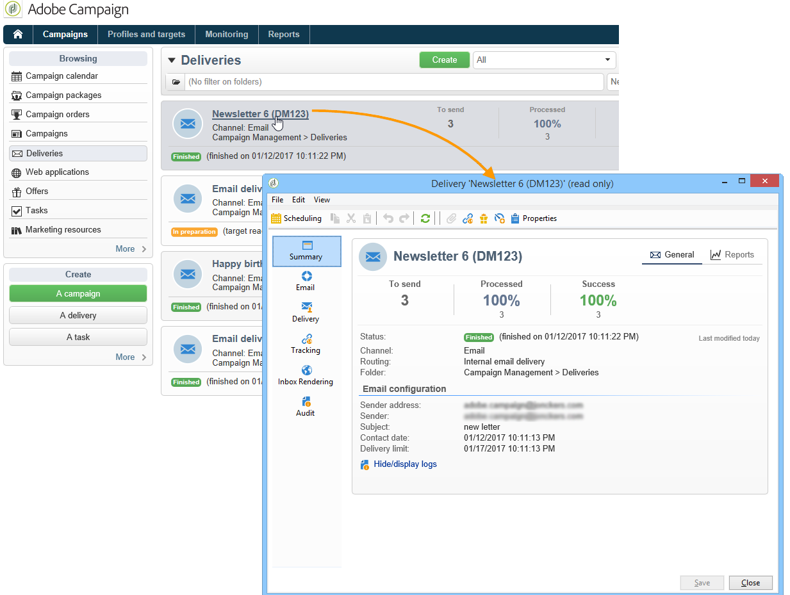

# Rapporti di consegna {#delivery-reports}

Puoi tracciare l’esecuzione delle consegne tramite vari rapporti accessibili dalla panoramica della consegna. Per visualizzare i rapporti, attenersi alla seguente procedura:

1. Vai a **[!UICONTROL Campaigns]** e fai clic su **[!UICONTROL Delivery]** per visualizzare l’elenco delle consegne.
1. Fai clic sul nome della consegna da visualizzare per visualizzarne i dettagli.

   

1. Seleziona la **[!UICONTROL Summary]** e fai clic su **[!UICONTROL Reports]** per accedere ai rapporti specifici della consegna.

   

   Per impostazione predefinita sono disponibili i seguenti rapporti:

   * **[!UICONTROL Delivery throughput]** : fare riferimento a [Velocità effettiva di consegna](../../reporting/using/global-reports.md#delivery-throughput).
   * **[!UICONTROL Sharing to social networks]** : fare riferimento a [Condivisione sui social network](../../reporting/using/global-reports.md#sharing-to-social-networks).
   * **[!UICONTROL Statistics on sharing activities]** : fare riferimento a [Statistiche sulle attività di condivisione](../../reporting/using/global-reports.md#statistics-on-sharing-activities).
   * **[!UICONTROL Hot clicks]** : fare riferimento a [Hot click](#hot-clicks).
   * **[!UICONTROL Tracking statistics]** : fare riferimento a [Tracking delle statistiche](#tracking-statistics)
   * **[!UICONTROL URLs and click streams]** : fare riferimento a [URL e flussi di clic](#urls-and-click-streams).
   * **[!UICONTROL Tracking indicators]** : fare riferimento a [Indicatori di tracciamento](#tracking-indicators).
   * **[!UICONTROL Non-deliverables and bounces]** : fare riferimento a [Non recapitati e mancati recapiti](../../reporting/using/global-reports.md#non-deliverables-and-bounces).
   * **[!UICONTROL User activities]** : fare riferimento a [Attività utente](../../reporting/using/global-reports.md#user-activities).
   * **[!UICONTROL Delivery summary]** : fare riferimento a [Riepilogo consegne](#delivery-summary).
   * **[!UICONTROL Subscription tracking]** : fare riferimento a [Tracciamento sottoscrizione](../../reporting/using/global-reports.md#subscription-tracking).
   * **[!UICONTROL Delivery statistics]** : fare riferimento a [Statistiche di consegna](../../reporting/using/global-reports.md#delivery-statistics).
   * **[!UICONTROL Breakdown of opens]** : fare riferimento a [Suddivisione delle aperture](../../reporting/using/global-reports.md#breakdown-of-opens).

## Indicatori di tracciamento {#tracking-indicators}

Questo rapporto combina gli indicatori chiave per tenere traccia del comportamento dei destinatari alla ricezione della consegna. Consente l&#39;accesso alle statistiche di consegna e ricezione, ai tassi di apertura e click-through, ai flussi di clic generati, al web tracking e alla condivisione delle attività sui social network.

>[!NOTE]
>
>I valori calcolati in base all’apertura dei messaggi sono sempre stime, a causa del margine di errore collegato alle e-mail in formato testo. La **[!UICONTROL Distinct opens/Sum of opens for the population reached]** Gli indicatori tengono conto di questo margine di errore. Per ulteriori informazioni sulle aperture di tracciamento, consulta [Aperture di tracciamento](../../reporting/using/indicator-calculation.md#tracking-opens-).

**[!UICONTROL 1. Delivery statistics]**

* **[!UICONTROL Messages to deliver]** : Numero totale di messaggi da consegnare dopo l’analisi della consegna.
* **[!UICONTROL Success]** : Numero di messaggi elaborati correttamente.

**[!UICONTROL 2. Reception statistics]**

>[!NOTE]
>
>Le percentuali correlate vengono calcolate in base al numero di messaggi inoltrati con successo.

* **[!UICONTROL Distinct opens for the population reached]** : Stima del numero di destinatari con cui è stato aperto un messaggio almeno una volta. Vengono presi in considerazione i clic sui collegamenti di annullamento all’abbonamento e sulle pagine mirror.
* **[!UICONTROL Sum of opens for the population reached]** : Stima del numero totale di aperture per destinatari con targeting.
* **[!UICONTROL Clicks on opt-out link]** : Numero di clic sul collegamento di annullamento dell’abbonamento.
* **[!UICONTROL Clicks on the mirror page link]** : Numero di clic sul collegamento alla pagina speculare. Per essere preso in considerazione, il collegamento deve essere definito come tale nella procedura guidata di consegna (URL tracciati). Fai riferimento a questo [page](../../delivery/using/about-delivery-monitoring.md).
* **[!UICONTROL Estimation of forwards]** : Stima del numero di e-mail inoltrate dai destinatari interessati. Questo valore viene calcolato sottraendo il numero di persone distinte e il numero di destinatari distinti che hanno fatto clic nell’e-mail.

   >[!NOTE]
   >
   >Per ulteriori informazioni sulla differenza tra persone distinte e destinatari target, consulta [Persone/destinatari interessati](../../reporting/using/indicator-calculation.md#targeted-persons---recipients).

**[!UICONTROL 3. Open and click-through rate]**

Questa tabella di valori mostra il raggruppamento di consegne, aperture, clic e reattività non elaborati per dominio Internet. Vengono utilizzati i seguenti indicatori:

* **[!UICONTROL Sent]** : Numero totale di messaggi inviati su questo dominio.
* **[!UICONTROL Complaints]** : Numero di messaggi per questo dominio segnalati come indesiderati dal destinatario. Il tasso viene calcolato in base al numero totale di messaggi inviati su questo dominio.
* **[!UICONTROL Opens]** : Numero di destinatari distinti per questo dominio che hanno aperto un messaggio almeno una volta. Il tasso viene calcolato in base al numero totale di messaggi inviati su questo dominio.
* **[!UICONTROL Clicks]** : Numero di destinatari con targeting distinto che hanno fatto clic sulla stessa consegna almeno una volta. Il tasso viene calcolato in base al numero totale di messaggi inviati su questo dominio
* **[!UICONTROL Raw reactivity]** : Percentuale del numero di destinatari che hanno fatto clic su una consegna almeno una volta rispetto al numero di destinatari che hanno aperto una consegna almeno una volta.

>[!NOTE]
>
>I nomi di dominio visualizzati in questo report sono definiti nell&#39;elenco dettagliato utilizzato a livello di cubo. Per modificare, aggiungere o rimuovere domini predefiniti, modifica il **[!UICONTROL Domains]** elenco dettagliato e modifica valori e alias. Per ulteriori informazioni al riguardo, consulta [questa sezione](../../platform/using/managing-enumerations.md). La **[!UICONTROL Others]** La categoria include i nomi di dominio che non appartengono ad alcun valore dell’elenco dettagliato.

**[!UICONTROL 4. Generated click streams]**

>[!NOTE]
>
>Le percentuali correlate vengono calcolate in base al numero di messaggi inoltrati con successo.

* **[!UICONTROL Distinct clicks for the population reached]** : Numero di persone distinte che hanno fatto clic su in una consegna almeno una volta.
* **[!UICONTROL Cumulated clicks]** : Numero totale di clic per destinatari con targeting, esclusi i collegamenti di annullamento all’abbonamento e le pagine mirror.
* **[!UICONTROL Recipient clicks]** : Numero di destinatari con targeting distinto che hanno fatto clic sulla stessa consegna almeno una volta.
* **[!UICONTROL Estimated recipient reactivity]** : Rapporto tra il numero di destinatari che hanno fatto clic almeno una volta in una consegna e il numero stimato di destinatari che hanno aperto una consegna almeno una volta. I clic sui collegamenti delle pagine di rinuncia e di mirroring non vengono presi in considerazione.

**[!UICONTROL 5. Web tracking]**

* **[!UICONTROL Visited pages]** : Numero di pagine web visitate dopo la ricezione dei messaggi.
* **[!UICONTROL Transactions]** : Numero di acquisti successivi alla ricezione dei messaggi.
* **[!UICONTROL Total amount]** : Importo totale degli acquisti successivi alla ricezione dei messaggi.
* **[!UICONTROL Average transaction amount]** : Acquisto medio effettuato da destinatari di consegna distinti.
* **[!UICONTROL Articles]** : Numero di articoli acquistati dai destinatari della consegna.
* **[!UICONTROL Average count of articles per transaction]** : Numero medio di articoli per acquisto effettuati da destinatari distinti.
* **[!UICONTROL Average amount per message]** : Quantità media di acquisti generati per messaggio.

   >[!NOTE]
   >
   >Affinché una pagina, una transazione, un importo o un articolo visitati siano presi in considerazione, è necessario inserire un tag di web tracking nella pagina web corrispondente. La configurazione del web tracking è presentata in [questa sezione](../../configuration/using/about-web-tracking.md).

**[!UICONTROL 6. Sharing activities to email and social networks]**

Questa sezione mostra il numero di messaggi condivisi su ogni social network. Per ulteriori informazioni, consulta [Condivisione sui social network](../../reporting/using/global-reports.md#sharing-to-social-networks).

## URL e flussi di clic {#urls-and-click-streams}

Questo rapporto mostra l’elenco delle pagine visitate dopo una consegna.

Puoi configurare il contenuto del rapporto selezionando: il grafico a punteggio da visualizzare, il filtro dell’ora (dall’avvio dell’azione, nelle prime 6 ore successive all’avvio, ecc.) e la modalità di visualizzazione dei dati (per etichetta, URL, per categoria). Fai clic su **[!UICONTROL Refresh]** per confermare la selezione.

Nella sezione superiore del rapporto vengono visualizzate le seguenti percentuali:

* **[!UICONTROL Reactivity]** : Rapporto tra il numero di destinatari con targeting che hanno fatto clic su una consegna, in relazione al numero stimato di destinatari con targeting che hanno aperto una consegna. I clic sul collegamento di rinuncia e sulla pagina speculare non vengono presi in considerazione.

   >[!NOTE]
   >
   >Per ulteriori informazioni sulle aperture di tracciamento, consulta [Aperture di tracciamento](../../reporting/using/indicator-calculation.md#tracking-opens-).

* **[!UICONTROL Distinct clicks]** : Numero di persone distinte che hanno fatto clic almeno una volta (esclusi il collegamento di annullamento all’abbonamento e la pagina speculare) in una consegna. Il tasso visualizzato viene calcolato in base al numero di messaggi consegnati correttamente.
* **[!UICONTROL Cumulated clicks]** : Numero totale di clic per destinatari con targeting (esclusi il collegamento di annullamento all’abbonamento e la pagina speculare). Il tasso visualizzato viene calcolato in base al numero di messaggi inoltrati con successo.

**[!UICONTROL Platform average]** : Questo tasso medio, visualizzato sotto ogni tasso (reattività, clic distinti e clic cumulati), viene calcolato per le consegne inviate nei sei mesi precedenti. Vengono prese in considerazione solo le consegne con la stessa tipologia e sullo stesso canale. Le bozze sono escluse.

La tabella centrale fornisce le seguenti informazioni:

* **[!UICONTROL Clicks]** : Numero di clic cumulati, per collegamento.
* **[!UICONTROL Clicks (in %)]** : Scomposizione del numero di clic per collegamento, in relazione al numero totale di clic cumulati.

**[!UICONTROL Breakdown of clicks in time]**

Questo grafico mostra la suddivisione dei clic cumulati al giorno.

## Riepilogo consegne {#delivery-summary}

Questo rapporto fornisce tutte le informazioni principali sulla consegna.

**[!UICONTROL Target population]**

Questa sezione presenta due indicatori:

* **[!UICONTROL Initial population]** : Numero totale di destinatari interessati dalla consegna.
* **[!UICONTROL Messages rejected by the rule]** : Numero di indirizzi ignorati durante l’analisi durante l’applicazione delle regole di tipologia: indirizzo mancante, messo in quarantena, al elenco Bloccati, ecc. Per ulteriori informazioni sulle regole di tipologia, consulta questo [page](../../delivery/using/steps-validating-the-delivery.md#validation-process-with-typologies).

**[!UICONTROL Causes of exclusion]**

Il grafico centrale mostra la suddivisione per regola dei messaggi rifiutati durante l’analisi.

**[!UICONTROL Delivery statistics]**

Questa sezione include i seguenti indicatori:

* **[!UICONTROL Messages to be delivered]** : Numero totale di messaggi da consegnare dopo l’analisi della consegna.
* **[!UICONTROL Success]** : Numero di messaggi elaborati correttamente. Il tasso associato è il rapporto con il numero di messaggi da consegnare.
* **[!UICONTROL Errors]** : Numero totale di errori cumulati durante le consegne e l’elaborazione automatica del rimbalzo. Il tasso associato è il rapporto con il numero di messaggi da consegnare.
* **[!UICONTROL New quarantines]** : Numero di indirizzi messi in quarantena dopo una consegna non riuscita (dominio utente sconosciuto, dominio non valido). Il tasso associato è il rapporto con il numero di messaggi da consegnare.

## Hot click {#hot-clicks}

Questo rapporto mostra il contenuto del messaggio (HTML e/o testo) con, su ogni collegamento, la percentuale di clic sui collegamenti. I blocchi di personalizzazione per l’annullamento dell’abbonamento, i collegamenti alle pagine mirror e i collegamenti alle offerte vengono presi in considerazione nei clic totali cumulati, ma non vengono visualizzati nel rapporto.

>[!NOTE]
>
>Se la consegna contiene offerte (Interazione), nella parte superiore del rapporto viene visualizzata una casella che mostra la percentuale di clic sulle offerte.

## Tracking delle statistiche {#tracking-statistics}

Questo rapporto fornisce statistiche su aperture, clic e transazioni.

Ti consente di tenere traccia dell’impatto di marketing della consegna. Puoi configurare la modalità di visualizzazione dei valori modificando la scala cronologica (1 ora, 3 ore o 24 ore, ecc.). Fai clic su **[!UICONTROL Refresh]** per confermare la selezione.

Questo rapporto fornisce una tabella di valori e un grafico Pareto che mostrano il tempo necessario per la consegna per raggiungere la massima efficienza. Vengono utilizzati i seguenti indicatori:

* **[!UICONTROL Opens]** : Stima del tempo necessario per raggiungere una percentuale del numero totale di messaggi aperti. Le e-mail in formato testo non vengono prese in considerazione. Per ulteriori informazioni sulle aperture di tracciamento, consulta [Aperture di tracciamento](../../reporting/using/indicator-calculation.md#tracking-opens-).
* **[!UICONTROL Clicks]** : Stima del tempo necessario per raggiungere una percentuale del numero totale di clic registrati. I clic sul collegamento di rinuncia e sulla pagina speculare non vengono presi in considerazione.
* **[!UICONTROL Transactions]** : Tempo necessario per raggiungere una percentuale del numero totale di transazioni successive alla ricezione dei messaggi. Affinché una transazione possa essere presa in considerazione, è necessario inserire un tag di web tracking di tipo transazione nella pagina web corrispondente. La configurazione del web tracking è presentata in [questa sezione](../../configuration/using/about-web-tracking.md).
