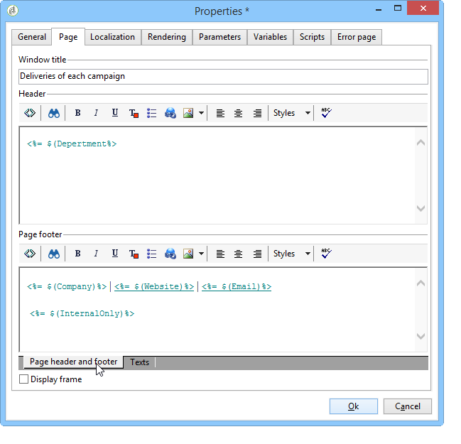

# Layout degli elementi{#element-layout}

Oltre ai vari grafici dettagliati [qui](../../reporting/using/creating-a-chart.md#chart-types-and-variants), è possibile adattare la visualizzazione e aggiungere elementi alle pagine del report.

Puoi utilizzare i contenitori: ti consentono di collegare diversi elementi di una pagina e configurarne il layout in colonne e/o celle. Le modalità di utilizzo sono descritte in [questa sezione](../../web/using/defining-web-forms-layout.md#creating-containers).

Puoi configurare il layout del rapporto nella directory principale della struttura e sovraccaricarlo per ogni contenitore. Le pagine sono ordinate in colonne. I contenitori vengono inoltre ordinati in colonne. Solo gli elementi statici e grafici vengono ordinati in celle.

## Definisci le opzioni per ogni pagina {#defining-the-options-for-each-page}

Puoi utilizzare le opzioni su ogni pagina del rapporto.

La scheda **[!UICONTROL General]** consente di modificare il titolo della pagina, configurare le posizioni della legenda e navigare tra le pagine del report.

Il campo **[!UICONTROL Title]** ti consente di personalizzare l&#39;etichetta nell&#39;intestazione della pagina del report. Il titolo della finestra può essere configurato tramite la finestra **[!UICONTROL Properties]** del report. Per ulteriori informazioni, consulta [Aggiunta di un&#39;intestazione e di un piè di pagina](#adding-a-header-and-a-footer).

Le opzioni **[!UICONTROL Display settings]** consentono di selezionare la posizione della didascalia del controllo all&#39;interno di una pagina del report e di definire il numero di colonne nella pagina. Per ulteriori informazioni sul layout della pagina, consulta la sezione **Layout elemento** di [questa sezione](../../web/using/defining-web-forms-layout.md#positioning-the-fields-on-the-page).

Selezionare le varie opzioni nella sezione **[!UICONTROL Browse]** per autorizzare la navigazione da una pagina di report a un&#39;altra. Se è selezionata l&#39;opzione **[!UICONTROL Disable next page]** o **[!UICONTROL Disable previous page]**, i pulsanti **[!UICONTROL Next]** e **[!UICONTROL Previous]** scompaiono dalla pagina del report.

## Aggiungere un’intestazione e un piè di pagina {#adding-a-header-and-a-footer}

La finestra delle proprietà del rapporto consente inoltre di definire gli elementi di layout, ad esempio il titolo della finestra e il contenuto HTML delle intestazioni e dei piè di pagina.

Per accedere alla finestra delle proprietà, fare clic sul pulsante **[!UICONTROL Properties]** del report.

La scheda **[!UICONTROL Page]** consente di personalizzare la visualizzazione.

Il contenuto configurato in questa scheda sarà visibile su tutte le pagine del rapporto.

La scheda secondaria **[!UICONTROL Texts]** consente di definire il contenuto della variabile: verrà preso in considerazione durante il ciclo di traduzione se il report è progettato per l&#39;utilizzo in più lingue.

Questo consente di creare un elenco di frammenti di testo e collegarli agli identificatori:

Quindi inserisci questi identificatori nel contenuto HTML del rapporto:

Vengono sostituiti automaticamente con il contenuto appropriato quando viene visualizzato il rapporto.

Come per i testi HTML, questa modalità operativa ti consente di centralizzare i testi utilizzati nel rapporto e di gestirne la traduzione. I testi creati in questa scheda vengono raccolti automaticamente dallo strumento di traduzione integrato Adobe Campaign.
