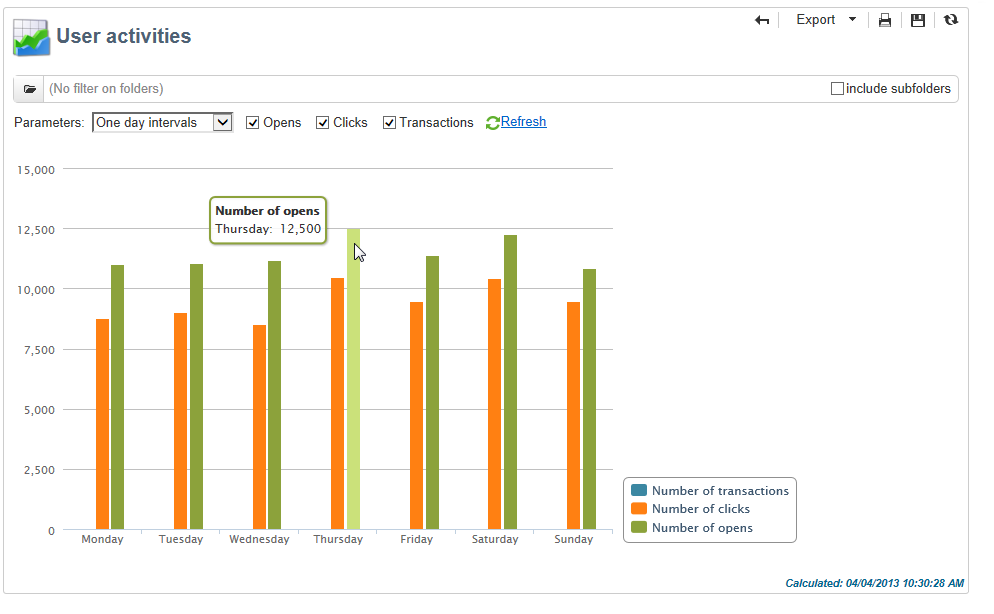

# Report globali {#global-reports}

Tali rapporti riguardano l&#39;attività dei dati nell&#39;intero database. Per visualizzare il dashboard dei rapporti, andate alla **[!UICONTROL Reports]** scheda.

Per visualizzare i rapporti, fate clic sui relativi nomi. Per impostazione predefinita, sono disponibili i seguenti rapporti:

>[!NOTE]
>
>Questa sezione mostra solo i rapporti collegati alle consegne.

* **[!UICONTROL Delivery throughput]** : fare riferimento alla [consegna effettiva](#delivery-throughput).
* **[!UICONTROL Browsers]** : fare riferimento a [Browser](#browsers).
* **[!UICONTROL Sharing to social networks]** : fare riferimento a [Condivisione su social network](#sharing-to-social-networks).
* **[!UICONTROL Statistics on sharing activities]** : fare riferimento a [Statistiche sulle attività](#statistics-on-sharing-activities)di condivisione.
* **[!UICONTROL Operating systems]** : fare riferimento ai sistemi operativi.
* **[!UICONTROL URLs and click streams]** : fate riferimento agli [URL e fate clic sui flussi](../../reporting/using/delivery-reports.md#urls-and-click-streams).
* **[!UICONTROL Tracking indicators]** : fare riferimento agli indicatori [di](../../reporting/using/delivery-reports.md#tracking-indicators)tracciamento.
* **[!UICONTROL Non-deliverables and bounces]** : fare riferimento a [Non risultati finali e rimbalzi](#non-deliverables-and-bounces).
* **[!UICONTROL User activities]** : fare riferimento alle attività utente.
* **[!UICONTROL Subscription tracking]** : fate riferimento al tracciamento [della](#subscription-tracking)sottoscrizione.
* **[!UICONTROL Delivery summary]** : fare riferimento al riepilogo Consegna.
* **[!UICONTROL Delivery statistics]** : fare riferimento alle statistiche sulla [consegna](#delivery-statistics).
* **[!UICONTROL Breakdown of opens]** : fare riferimento a [Suddivisione delle aperture](#breakdown-of-opens).

## Velocità effettiva di consegna {#delivery-throughput}

Questo rapporto contiene informazioni sulla velocità di consegna dell&#39;intera piattaforma per un determinato periodo. Per misurare la velocità di invio dei messaggi, i criteri sono il numero di messaggi inviati all&#39;ora e la dimensione dei messaggi (in bit al secondo). Nell&#39;esempio seguente, il primo grafico mostra le consegne riuscite in blu e il numero di consegne errate in arancione.

Potete configurare i valori visualizzati modificando la scala cronologica: Vista di 1 ora, visualizzazione di 3 ore, visualizzazione di 24 ore, ecc. Fai clic su **[!UICONTROL Refresh]** per confermare la selezione.

## Attività utente {#user-activities}

Questo rapporto mostra la suddivisione di aperture, clic e transazioni per mezz&#39;ora, ora o giorno, sotto forma di grafico.

Sono disponibili le seguenti opzioni:

* **[!UICONTROL Opens]** : Numero totale di messaggi aperti. Le e-mail in formato testo non vengono prese in considerazione. Per ulteriori informazioni sulle aperture di tracciamento, consultate [Aperture](../../reporting/using/indicator-calculation.md#tracking-opens-)di tracciamento.
* **[!UICONTROL Clicks]** : Numero totale di clic sui collegamenti nelle consegne. I clic sui collegamenti di annullamento iscrizione e sulle pagine mirror non vengono presi in considerazione.
* **[!UICONTROL Transactions]** : Numero totale di transazioni dopo la ricezione di un messaggio. Affinché una transazione possa essere presa in considerazione, è necessario inserire un tag webtracking di tipo transazione nella pagina Web corrispondente. La configurazione del tracciamento Web viene presentata in [questa sezione](../../configuration/using/about-web-tracking.md).

## Messaggi non recapitati e non trasferibili {#non-deliverables-and-bounces}

Questo rapporto mostra la suddivisione dei risultati non consegnabili e la suddivisione dei risultati per dominio Internet.

Rappresenta **[!UICONTROL Number of messages processed]** il numero totale di messaggi elaborati dal server di consegna. Questo valore è inferiore al numero di messaggi da inviare quando alcune consegne sono state interrotte o messe in pausa (prima di essere elaborate dal server).

**[!UICONTROL Breakdown of errors by type]**

>[!NOTE]
>
>Gli errori mostrati in questo rapporto attivano il processo di quarantena. Per ulteriori informazioni sulla gestione della quarantena, fare riferimento alla gestione della [quarantena](../../delivery/using/understanding-quarantine-management.md).

La prima sezione di questo rapporto mostra la suddivisione dei risultati non finali sotto forma di tabella di valori e grafico.

Per ciascun tipo di errore, sono disponibili:

* il numero di messaggi di errore di questo tipo,
* la percentuale di messaggi con errori di questo tipo rispetto al numero totale di messaggi con errori,
* la percentuale di messaggi di errore di questo tipo rispetto al numero totale di messaggi elaborati.

Vengono utilizzati i seguenti indicatori:

* **[!UICONTROL User unknown]** : Tipo di errore generato durante la consegna per indicare che l&#39;indirizzo e-mail non è valido.
* **[!UICONTROL Invalid domain]** : Tipo di errore generato durante l&#39;invio di una consegna per indicare che il dominio dell&#39;indirizzo e-mail è errato o non esiste.
* **[!UICONTROL Inbox full]** : Tipo di errore generato dopo cinque tentativi di consegna per indicare che la inbox dei destinatari contiene troppi messaggi.
* **[!UICONTROL Account disabled]** : Tipo di errore generato durante l&#39;invio di una consegna per indicare che l&#39;indirizzo non esiste più.
* **[!UICONTROL Rejected]** : Tipo di errore generato quando un indirizzo viene rifiutato dall&#39;IAP (Internet Access Provider), ad esempio in seguito all&#39;applicazione di una regola di sicurezza (software anti-spam).
* **[!UICONTROL Unreachable]** : Tipo di errore che si verifica nella stringa di distribuzione del messaggio: incidente sul relè SMTP, dominio temporaneamente irraggiungibile, ecc
* **[!UICONTROL Not connected]** : Tipo di errore per indicare che il telefono cellulare del destinatario è spento o disconnesso dalla rete al momento dell&#39;invio.

   >[!NOTE]
   >
   >Questo indicatore riguarda solo le consegne sui canali mobili. Per ulteriori informazioni al riguardo, consulta [questa sezione](../../delivery/using/sms-channel.md).

   Per aprire ciascuna riga della tabella dei valori, fare clic sul `[+]` simbolo. Per ciascun tipo di errore, è possibile visualizzare la suddivisione dei messaggi di errore per dominio.

   

**[!UICONTROL Breakdown of errors per domain]**

La seconda sezione di questo rapporto mostra la suddivisione degli errori per dominio Internet sotto forma di tabella di valori e grafico.

Per ciascun nome di dominio sono disponibili:

* il numero di messaggi con errori per questo dominio,
* la percentuale di messaggi con errori per questo dominio rispetto al numero totale di messaggi elaborati per questo dominio,
* la percentuale di messaggi di errore per questo dominio rispetto al numero totale di messaggi di errore.

Per aprire ciascuna riga della tabella dei valori, fare clic sul simbolo [+] . Per ciascun tipo di dominio, è possibile visualizzare la suddivisione dei messaggi di errore in base al tipo di errore.

>[!NOTE]
>
>I nomi di dominio visualizzati in questo rapporto sono definiti a livello di cubo. Per modificare questi valori, modificare il **[!UICONTROL Delivery logs (broadlogrcp)]** cubo. Per ulteriori informazioni al riguardo, consulta [questa sezione](../../reporting/using/about-cubes.md). La **[!UICONTROL Others]** categoria include nomi di dominio che non appartengono a una classe specifica.

## Browser {#browsers}

Questo rapporto mostra la suddivisione dei browser Internet utilizzati dai destinatari della distribuzione per il periodo in questione.

>[!NOTE]
>
>I valori indicati in questo rapporto sono stime: verranno presi in considerazione solo i destinatari che hanno fatto clic su una consegna.

**Statistiche globali**

Le statistiche globali sull’uso del browser sono presentate sotto forma di tabella di valori e grafico.

Vengono utilizzati i seguenti indicatori:

* **[!UICONTROL Visitors]** : Numero totale di destinatari interessati (per browser Internet) e che hanno fatto clic su una consegna almeno una volta.
* **[!UICONTROL Pages viewed]** : Numero totale di clic sui collegamenti in una consegna (per browser Internet) per tutte le consegne.
* **[!UICONTROL Usage rate]** : Questo tasso rappresenta la suddivisione dei visitatori (per browser Internet) in relazione al numero totale di visitatori.

**Statistiche per browser**

Nella tabella dei valori statistici globali, potete fare clic sul nome di ciascun browser per visualizzarne le statistiche di utilizzo.

Le statistiche sono presentate sotto forma di curva, grafico e tabella di valori.

La **[!UICONTROL History]** curva rappresenta il tasso di partecipazione di questo browser al giorno. Il tasso è il rapporto tra il numero di visitatori al giorno (in questo browser) e il numero di visitatori misurato nel giorno con il tasso di partecipazione più alto.

Il **[!UICONTROL Breakdown per version]** grafico rappresenta la suddivisione dei visitatori per versione rispetto al numero totale di visitatori (in questo browser).

La tabella di valori utilizza i seguenti indicatori:

* **[!UICONTROL Global rate]** : Questo tasso rappresenta la suddivisione dei visitatori per versione rispetto al numero totale di visitatori (su tutti i browser).
* **[!UICONTROL Relative rate]** : Questo tasso rappresenta la suddivisione dei visitatori per versione rispetto al numero totale di visitatori (in questo browser).

### Condivisione sui social network {#sharing-to-social-networks}

Il marketing virale consente ai destinatari della distribuzione di condividere informazioni con la propria rete di contatti: possono aggiungere un collegamento al loro profilo (Facebook, Twitter, ecc.) o inviare un messaggio a un amico. Ogni condivisione e ogni accesso alle informazioni condivise viene tracciato all&#39;interno della consegna. For more information on viral marketing, refer to [this section](../../delivery/using/viral-and-social-marketing.md).

Questo rapporto mostra la suddivisione dei messaggi condivisi e aperti per social network (Facebook, Twitter, ecc.) e/o per e-mail.

**[!UICONTROL Email delivery statistics]**

Nelle statistiche di consegna delle e-mail vengono visualizzati due valori:

* **[!UICONTROL Number of messages to be delivered]** : Numero totale di messaggi elaborati durante l&#39;analisi del recapito.
* **[!UICONTROL Number of successful deliveries]** : Numero di messaggi elaborati correttamente.

**[!UICONTROL Sharing activities and mail open statistics]**

La tabella centrale mostra le statistiche sulle condivisioni e-mail e si apre.

Nella **[!UICONTROL Shares]** colonna sono disponibili i seguenti indicatori:

* **[!UICONTROL No. of sharing activities]** : Numero totale di messaggi condivisi su ogni social network. Questo valore corrisponde al numero totale di clic sull&#39;icona del blocco di **[!UICONTROL Links for sharing to social networks]** personalizzazione corrispondente.
* **[!UICONTROL Breakdown]** : Questo tasso rappresenta la disaggregazione delle azioni per rete sociale, in relazione al numero totale di azioni.
* **[!UICONTROL Sharing rate]** : Questo tasso rappresenta la disaggregazione delle azioni per social network, in relazione al numero di messaggi da inviare.

Nella **[!UICONTROL Opens]** colonna sono disponibili i seguenti indicatori:

* **[!UICONTROL No. of opens]** : Numero totale di messaggi aperti dalle persone a cui è stato inoltrato il messaggio (tramite il blocco di **[!UICONTROL Links for sharing to social networks]** personalizzazione). Questo valore corrisponde al numero di volte in cui è stata visualizzata la pagina mirror. Le aperture in base ai destinatari della consegna non vengono prese in considerazione.
* **[!UICONTROL Breakdown]** : Questo tasso rappresenta la disaggregazione delle aperture per social network, in relazione al numero totale di aperture.
* **[!UICONTROL Rate of opens]** : Questo tasso rappresenta la disaggregazione delle aperture per social network, in relazione al numero totale di azioni.

**[!UICONTROL Breakdown of sharing activities and opens]**

Questa sezione include due grafici che rappresentano la suddivisione delle attività di condivisione e si apre per social network.

## Statistiche sulle attività di condivisione {#statistics-on-sharing-activities}

Questo rapporto mostra l&#39;evoluzione delle condivisioni sui social network (Facebook, Twitter, email, ecc.) in tempo.

For more information on viral marketing, refer to [this section](../../delivery/using/viral-and-social-marketing.md).

Le statistiche sono presentate sotto forma di tabella di valori e di grafico.

Vengono utilizzati i seguenti indicatori:

* **[!UICONTROL New contacts]** : Numero di nuove iscrizioni dopo la ricezione di un messaggio condiviso tramite e-mail. Questo valore corrisponde al numero di persone che hanno ricevuto un messaggio condiviso via e-mail, hanno fatto clic sul modulo **[!UICONTROL Subscription link]** e l&#39;hanno compilato.
* **[!UICONTROL Opens]** : Numero totale di messaggi aperti dalle persone a cui è stato trasferito il messaggio (tramite il blocco di **[!UICONTROL Link for sharing to social networks]** personalizzazione). Questo valore corrisponde al numero di volte in cui è stata visualizzata la pagina mirror. Le aperture in base ai destinatari della consegna non vengono prese in considerazione.
* **[!UICONTROL Sharing activities]** : Numero totale di messaggi condivisi tramite social network. Questo valore corrisponde al numero totale di clic sull&#39;icona del blocco di **[!UICONTROL Links for sharing to social networks]** personalizzazione.

## Sistemi operativi {#operating-systems}

Questo rapporto mostra la ripartizione dei sistemi operativi utilizzati dai destinatari della consegna per il periodo in questione.

>[!NOTE]
>
>I valori indicati in questo rapporto sono stime: verranno presi in considerazione solo i destinatari che hanno fatto clic su una consegna.

**Statistiche globali**

Le statistiche di utilizzo globali dei sistemi operativi sono presentate sotto forma di tabella di valori e grafico.

Vengono utilizzati i seguenti indicatori:

* **[!UICONTROL Visitors]** : Media giornaliera del numero totale di destinatari (per sistema operativo) che hanno fatto clic su una consegna almeno una volta.
* **[!UICONTROL Pages viewed]** : Media giornaliera del numero totale di clic sui collegamenti di consegna (per sistema operativo) per tutte le consegne.
* **[!UICONTROL Rate of use]** : Questo tasso rappresenta la suddivisione dei visitatori (per sistema operativo) in relazione al numero totale di visitatori.

**Statistiche per sistema operativo**

Nella tabella dei valori delle statistiche globali, fare clic sul nome di ciascun sistema operativo per visualizzare le statistiche per sistema operativo.

Le statistiche sono presentate sotto forma di curva, grafico e tabella di valori.

La **[!UICONTROL History]** curva rappresenta il tasso di utilizzo giornaliero di questo sistema operativo. Questo tasso è il rapporto tra il numero di visitatori al giorno (su questo sistema operativo) e il numero di visitatori misurato nel giorno con la maggiore frequenza.

Il **[!UICONTROL Breakdown by version]** grafico rappresenta la suddivisione dei visitatori per versione in relazione al numero totale di visitatori in questo sistema operativo.

La tabella di valori utilizza i seguenti indicatori:

* **[!UICONTROL Global rate]** : Questo tasso rappresenta la suddivisione dei visitatori (per versione) in relazione al numero totale di visitatori in tutti i sistemi operativi.
* **[!UICONTROL Relative rate]** : Questo tasso rappresenta la suddivisione dei visitatori (per versione) in relazione al numero totale di visitatori per questo sistema operativo.

## Tracciamento iscrizione {#subscription-tracking}

Questo rapporto consente di monitorare le iscrizioni ai servizi di informazione. Vengono visualizzate le sottoscrizioni e le sottoscrizioni.

Può essere visualizzato per una sottoscrizione facendo clic sul **[!UICONTROL Profiles and targets > Services and subscriptions]** nodo della pagina principale o dell&#39;elenco delle cartelle. Selezionate l’iscrizione desiderata, quindi fate clic sulla **[!UICONTROL Reports]** scheda. Il **[!UICONTROL Subscriptions tracking]** rapporto è disponibile per impostazione predefinita. Consente di visualizzare le tendenze relative all’iscrizione e all’annullamento dell’iscrizione e il tasso di fedeltà in un determinato periodo di tempo. È possibile configurare la rappresentazione di questi dati tramite l&#39;elenco a discesa. Fare clic **[!UICONTROL Refresh]** per convalidare la configurazione selezionata.

For further information, refer to [this page](../../delivery/using/managing-subscriptions.md).

Rappresenta **[!UICONTROL Number subscribed to date]** il numero totale di persone attualmente sottoscritte.

**[!UICONTROL Overall evolution of subscriptions]**

La tabella di valori utilizza i seguenti indicatori:

* **[!UICONTROL Subscribers]** : Numero totale di abbonati per il periodo in questione.
* **[!UICONTROL Subscriptions]** : Numero di sottoscrizioni per il periodo in questione.
* **[!UICONTROL Unsubscriptions]** : Numero di sottoscrizioni per il periodo in questione.
* **[!UICONTROL Evolution]** : Numero di sottoscrizioni meno il numero di sottoscrizioni. Il tasso viene calcolato in base al numero totale di abbonati.
* **[!UICONTROL Loyalty]** : Tasso di fedeltà degli abbonati per il periodo in questione.

**[!UICONTROL Subscription evolution curves]**

Questo grafico mostra l&#39;evoluzione delle sottoscrizioni e delle sottoscrizioni per il periodo in questione.

## Statistiche di consegna {#delivery-statistics}

Questo rapporto mostra la suddivisione per dominio Internet, di tutti i messaggi elaborati e inviati, di rimbalzi rigidi e morbidi, aperture, clic e cancellazioni delle iscrizioni.

Vengono utilizzati i seguenti indicatori:

* **[!UICONTROL Emails processed]** : Numero totale di messaggi elaborati dal server di consegna.
* **[!UICONTROL Delivered]** : percentuale del numero di messaggi elaborati correttamente rispetto al numero totale di messaggi elaborati.
* **[!UICONTROL Hard bounces]** : percentuale del numero di rimbalzi &quot;hard&quot; rispetto al numero totale di messaggi elaborati.
* **[!UICONTROL Soft bounces]** : percentuale del numero di rimbalzi &quot;soft&quot; rispetto al numero totale di messaggi elaborati.

   >[!NOTE]
   >
   >Per ulteriori informazioni sui rimbalzi rigidi e morbidi, fare riferimento a Gestione [della](../../delivery/using/understanding-quarantine-management.md)quarantena.

* **[!UICONTROL Opens]** : percentuale del numero di destinatari con targeting che hanno aperto un messaggio almeno una volta rispetto al numero di messaggi elaborati correttamente.
* **[!UICONTROL Clicks]** : percentuale del numero di persone che hanno fatto clic in una consegna almeno una volta rispetto al numero di messaggi elaborati correttamente.
* **[!UICONTROL Unsubscription]** : percentuale del numero di clic su un collegamento di annullamento della sottoscrizione rispetto al numero di messaggi elaborati correttamente.

## Suddivisione delle aperture {#breakdown-of-opens}

Questo rapporto mostra la suddivisione delle aperture per sistema operativo, dispositivo e browser per il periodo in questione. Per ciascuna categoria vengono utilizzati due grafici. Il primo visualizza le statistiche relative alle aperture su un computer e dispositivi mobili. Il secondo visualizza le statistiche relative solo alle aperture sui dispositivi mobili.

Il numero di aperture corrisponde al numero totale di messaggi aperti. Le e-mail in formato testo non vengono conteggiate. Per ulteriori informazioni sulle aperture Tracciamento, fare riferimento alla sezione [Tracciamento delle aperture](../../reporting/using/indicator-calculation.md#tracking-opens-) .

>[!NOTE]
>
>I nomi dei browser e dei sistemi operativi costituiscono parte delle informazioni inviate dall&#39;agente utente del browser a cui è stato aperto il messaggio.  Adobe Campaign detrae il tipo di dispositivo utilizzando le relative informazioni sul dispositivo.