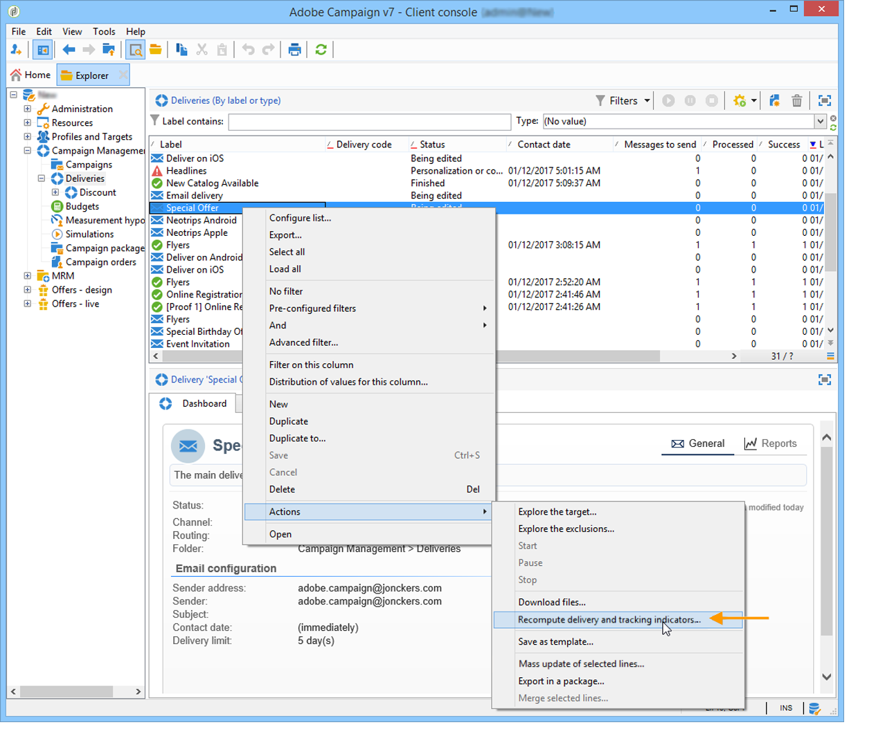

# Calcolo indicatore {#indicator-calculation}

## Attività utente {#user-activities-1}

<table> 
 <thead> 
  <tr> 
   <th> <strong>Etichetta</strong>   </th> 
   <th> <strong>Nome campo</strong>   </th> 
   <th> <strong>Descrizione indicatore</strong>   </th> 
   <th> <strong>Formula di calcolo indicatore</strong>   </th> 
  </tr> 
 </thead> 
 <tbody> 
  <tr> 
   <td> Messaggi aperti  </td> 
   <td> @opens  </td> 
   <td> Somma di tutti @totalClicks con una chiave primaria URL uguale a 1.  </td> 
   <td> sum(Iif([@url-id]=1, @totalClicks, 0))  </td> 
  </tr> 
  <tr> 
   <td> Clic  </td> 
   <td> @clic  </td> 
   <td> Somma di tutti i @totalClicks con un tipo di URL uguale a "Email click".  </td> 
   <td> sum(Iif([url/@type]=1, @totalClicks, 0)  </td> 
  </tr> 
  <tr> 
   <td> Transazioni  </td> 
   <td> @transaction  </td> 
   <td> Somma di tutti @totalClicks con un tipo URL uguale a "Transaction".  </td> 
   <td> sum(Iif([url/@type]=5, @totalClicks, 0)  </td> 
  </tr> 
 </tbody> 
</table>

Questo rapporto è basato sulla **[!UICONTROL Consolidated tracking]** tabella (nms:trackingStats). Questa tabella aggregata viene utilizzata per motivi di prestazioni durante la visualizzazione dei rapporti, al posto della **[!UICONTROL Recipient tracking logs]** tabella (nms:trackingLogRcp) e non viene calcolata in tempo reale. La tabella viene generata alcuni minuti dopo il recupero dei registri di tracciamento. Se gli indicatori sono aggiornati, i risultati saranno gli stessi degli indicatori del rapporto **degli indicatori** di tracciamento. L&#39;indicatore @totalclick esprime il numero totale di clic su un periodo di 5 minuti.

## Messaggi non recapitati e non trasferibili {#non-deliverables-and-bounces-1}

**Suddivisione per tipo di errore**

Questo rapporto è basato sulla **[!UICONTROL Delivery and tracking statistics]** tabella (nms:deliveryLogStats).

<table> 
 <thead> 
  <tr> 
   <th> <strong>Etichetta</strong>   </th> 
   <th> <strong>Nome campo</strong>   </th> 
   <th> <strong>Descrizione indicatore</strong>   </th> 
   <th> <strong>Formula di calcolo indicatore</strong>   </th> 
  </tr> 
 </thead> 
 <tbody> 
  <tr> 
   <td> Numero totale di messaggi elaborati  </td> 
   <td> @totalProcessed  </td> 
   <td> Somma di messaggi con stato uguale a "Pronto", "Inviato" o "Non riuscito".  </td> 
   <td> @ready + @error + @success  </td> 
  </tr> 
  <tr> 
   <td> Utente sconosciuto  </td> 
   <td> @unknownUser  </td> 
   <td> Conteggio di tutti i messaggi con stato uguale a "Non riuscito" e motivo uguale a "Utente sconosciuto".   </td> 
   <td> Count(@status=2 e msg/@failureReason=1)  </td> 
  </tr> 
  <tr> 
   <td> Non Raggiungibile   </td> 
   <td> @non raggiungibile  </td> 
   <td> Conteggio di tutti i messaggi con stato uguale a "Non riuscito" e motivo uguale a "Non raggiungibile".   </td> 
   <td> Count(@status=2 e msg/@failureReason=3)  </td> 
  </tr> 
  <tr> 
   <td> Rifiutato  </td> 
   <td> @rifiutato  </td> 
   <td> Conteggio di tutti i messaggi con stato uguale a "Non riuscito" e motivo uguale a "Rifiutato".   </td> 
   <td> Count(@status=2 e msg/@failureReason=20)  </td> 
  </tr> 
  <tr> 
   <td> Dominio non valido  </td> 
   <td> @InvalidDomain  </td> 
   <td> Conteggio di tutti i messaggi con uno stato uguale a "Non riuscito" e un motivo uguale a "Dominio non valido".   </td> 
   <td> Count(@status=2 e msg/@failureReason=2)  </td> 
  </tr> 
  <tr> 
   <td> Account disattivato  </td> 
   <td> @disabled  </td> 
   <td> Conteggio di tutti i messaggi con stato uguale a "Non riuscito" e motivo uguale a "Account disabilitato".  </td> 
   <td> Count(@status=2 e msg/@failureReason=4)  </td> 
  </tr> 
  <tr> 
   <td> Casella in entrata piena  </td> 
   <td> @mailBoxFull  </td> 
   <td> Conteggio di tutti i messaggi con stato uguale a "Non riuscito" e motivo uguale a "Posta in arrivo piena".   </td> 
   <td> Count(@status=2 e msg/@failureReason=5)  </td> 
  </tr> 
  <tr> 
   <td> Errori  </td> 
   <td> @value  </td> 
   <td> Numero di messaggi non riusciti per questo tipo di errore.  </td> 
   <td> Count(@status=2 e msg/@failureReason="Valore del tipo di errore")  </td> 
  </tr> 
  <tr> 
   <td> Contributo  </td> 
   <td> -  </td> 
   <td> Percentuale di errori di questo tipo rispetto al numero totale di messaggi di errore.  </td> 
   <td> percentuale(@value,@totalErrors)  </td> 
  </tr> 
  <tr> 
   <td> Suddivisione  </td> 
   <td> -  </td> 
   <td> Percentuale di errori di questo tipo rispetto al numero totale di messaggi elaborati.  </td> 
   <td> percentuale(@value,@totalProcessed)  </td> 
  </tr> 
 </tbody> 
</table>

**Suddivisione per dominio**

La seconda parte del rapporto descrive in dettaglio la suddivisione dei messaggi non riusciti per dominio Internet anziché per tipo di errore. La formula collegata all&#39;indicatore di **errore** (@value) in questo caso è: Count(@status=2 e @domain=&quot;Valore del nome di dominio&quot;), ovvero un conteggio di tutti i messaggi con uno stato non riuscito per questo dominio.

## Browser {#browsers-1}

Questo rapporto è basato sulla **[!UICONTROL Internet Browser Statistics]** tabella (nms:userAgentStats).

**Statistiche globali**

<table> 
 <thead> 
  <tr> 
   <th> <strong>Etichetta</strong>   </th> 
   <th> <strong>Nome campo</strong>   </th> 
   <th> <strong>Descrizione indicatore</strong>   </th> 
   <th> <strong>Formula di calcolo indicatore</strong>   </th> 
  </tr> 
 </thead> 
 <tbody> 
  <tr> 
   <td> Visitatori  </td> 
   <td> @totalVisitors  </td> 
   <td> Numero totale di destinatari con targeting per questo browser che hanno fatto clic almeno una volta in una consegna.  </td> 
   <td> Sum(@visitatori)  </td> 
  </tr> 
  <tr> 
   <td> Visualizzazioni pagina  </td> 
   <td> @totalPages  </td> 
   <td> Numero totale di clic sui collegamenti di consegna che utilizzano questo browser, per tutte le consegne.  </td> 
   <td> Sum(@pages)   </td> 
  </tr> 
  <tr> 
   <td> Tasso di utilizzo  </td> 
   <td> -  </td> 
   <td> Percentuale di visitatori per questo browser rispetto al numero totale di visitatori.  </td> 
   <td> percentuale(@totalVisitors, sum(@totalVisitors))   </td> 
  </tr> 
 </tbody> 
</table>

**Statistiche per browser**

<table> 
 <thead> 
  <tr> 
   <th> <strong>Etichetta</strong>   </th> 
   <th> <strong>Nome campo</strong>   </th> 
   <th> <strong>Descrizione indicatore</strong>   </th> 
   <th> <strong>Formula di calcolo indicatore</strong>   </th> 
  </tr> 
 </thead> 
 <tbody> 
  <tr> 
   <td> Tasso di utilizzo  </td> 
   <td> @visitatori  </td> 
   <td> Percentuale del numero di visitatori al giorno che utilizzano questo browser rispetto al numero di visitatori misurato nel giorno con il maggior numero di visite.  </td> 
   <td> percentuale(sum(@visitatori),max(@visitatoriOfTheDay))  </td> 
  </tr> 
  <tr> 
   <td> Tasso globale  </td> 
   <td> -  </td> 
   <td> Percentuale di visitatori per questa versione rispetto al numero totale di visitatori che utilizzano tutti i browser.  </td> 
   <td> percentuale(@totalVisitors, @globalVisitors)  </td> 
  </tr> 
  <tr> 
   <td> Peso relativo  </td> 
   <td> -  </td> 
   <td> Percentuale di visitatori per questa versione rispetto al numero totale di visitatori che utilizzano questo browser.  </td> 
   <td> percentuale(@totalVisitors, sum(@totalVisitors))   </td> 
  </tr> 
 </tbody> 
</table>

## Condivisione sui social network {#sharing-to-social-networks-1}

Questo rapporto è basato sulle tabelle **[!UICONTROL Delivery]** (nms:delivery), **[!UICONTROL Consolidated tracking]** (nms:trackingStats) e **[!UICONTROL Web tracking]** (nms:webTrackingLog).

<table> 
 <thead> 
  <tr> 
   <th> <strong>Etichetta</strong>   </th> 
   <th> <strong>Nome campo</strong>   </th> 
   <th> <strong>Descrizione indicatore</strong>   </th> 
   <th> <strong>Formula di calcolo indicatore</strong>   </th> 
  </tr> 
 </thead> 
 <tbody> 
  <tr> 
   <td> Number of messages to deliver  </td> 
   <td> @totalTarget  </td> 
   <td> Numero totale di messaggi elaborati durante l'analisi di consegna.  </td> 
   <td> sum([properties/@totalTarget])  </td> 
  </tr> 
  <tr> 
   <td> Numero di consegne riuscite  </td> 
   <td> @success  </td> 
   <td> Numero di messaggi elaborati correttamente   </td> 
   <td> sum([indicatori/@success])  </td> 
  </tr> 
  <tr> 
   <td> E-mail  </td> 
   <td> @email  </td> 
   <td> Somma di tutti @totalClicks per i quali la categoria URL è uguale a "email".  </td> 
   <td> Sum(iIf([url/@category]='email',@totalClicks,0)  </td> 
  </tr> 
  <tr> 
   <td> Facebook  </td> 
   <td> @facebook  </td> 
   <td> Somma di tutti @totalClicks per i quali la categoria URL è uguale a "facebook".  </td> 
   <td> Sum(iIf([url/@category]='facebook',@totalClicks,0)  </td> 
  </tr> 
  <tr> 
   <td> Twitter  </td> 
   <td> @twitter  </td> 
   <td> Somma di tutti @totalClicks per i quali la categoria URL è uguale a "twitter".  </td> 
   <td> Sum(iIf([url/@category]='twitter',@totalClicks,0)  </td> 
  </tr> 
  <tr> 
   <td> Delizioso  </td> 
   <td> @delizioso  </td> 
   <td> Somma di tutti @totalClicks per i quali la categoria URL è "deliziosa".  </td> 
   <td> Sum(iIf([url/@category]='delizioso',@totalClicks,0))  </td> 
  </tr> 
  <tr> 
   <td> Digg  </td> 
   <td> @digg  </td> 
   <td> Somma di tutti @totalClicks per i quali la categoria URL è uguale a "digg".  </td> 
   <td> Sum(iIf([url/@category]='digg',@totalClicks,0))  </td> 
  </tr> 
  <tr> 
   <td> Google  </td> 
   <td> @google  </td> 
   <td> Somma di tutti @totalClicks per i quali la categoria URL è uguale a "google".  </td> 
   <td> Sum(iIf([url/@category]='google',@totalClicks,0)  </td> 
  </tr> 
  <tr> 
   <td> Linkedin  </td> 
   <td> @linkedin  </td> 
   <td> Somma di tutti @totalClicks per i quali la categoria URL è "linkedin".  </td> 
   <td> Sum(iIf([url/@category]='linkedin',@totalClicks,0))  </td> 
  </tr> 
 </tbody> 
</table>

**Azioni**

<table> 
 <thead> 
  <tr> 
   <th> <strong>Etichetta</strong>   </th> 
   <th> <strong>Nome campo</strong>   </th> 
   <th> <strong>Descrizione indicatore</strong>   </th> 
   <th> <strong>Formula di calcolo indicatore</strong>   </th> 
  </tr> 
 </thead> 
 <tbody> 
  <tr> 
   <td> Numero di azioni  </td> 
   <td> @forward  </td> 
   <td> Numero totale di messaggi condivisi in questo social network.  </td> 
   <td> Sum(iIf([url/@category]="Valore del tipo di rete social",@totalClicks,0))  </td> 
  </tr> 
  <tr> 
   <td> Suddivisione  </td> 
   <td> @percent  </td> 
   <td> Percentuale del numero di azioni su questo social network rispetto al numero totale di azioni.  </td> 
   <td> percentuale(@forward, sum(@forward))  </td> 
  </tr> 
  <tr> 
   <td> Velocità di condivisione  </td> 
   <td> @rate  </td> 
   <td> Numero di condivisioni in questa rete rispetto al numero di messaggi da inviare.  </td> 
   <td> @forward / @totalTarget  </td> 
  </tr> 
 </tbody> 
</table>

**Messaggi aperti**

<table> 
 <thead> 
  <tr> 
   <th> <strong>Etichetta</strong>   </th> 
   <th> <strong>Nome campo</strong>   </th> 
   <th> <strong>Descrizione indicatore</strong>   </th> 
   <th> <strong>Formula di calcolo indicatore</strong>   </th> 
  </tr> 
 </thead> 
 <tbody> 
  <tr> 
   <td> Numero di aperture   </td> 
   <td> @open  </td> 
   <td> Numero totale di righe di tracciamento nella tabella di tracciamento Web.  </td> 
   <td> Count  </td> 
  </tr> 
  <tr> 
   <td> Suddivisione  </td> 
   <td> @percentOpen  </td> 
   <td> Percentuale del numero di aperture in questo social network rispetto al numero totale di aperture.  </td> 
   <td> percentuale(@open, sum(@open))  </td> 
  </tr> 
  <tr> 
   <td> Frequenza delle aperture  </td> 
   <td> @rateOpen  </td> 
   <td> Numero di aperture su questo social network rispetto al numero totale di messaggi da inviare.  </td> 
   <td> @open / @totalTarget  </td> 
  </tr> 
 </tbody> 
</table>

## Statistiche sulle attività di condivisione {#statistics-on-sharing-activities-1}

Questo rapporto è basato sulle tabelle **[!UICONTROL Delivery]** (nms:delivery), **[!UICONTROL Consolidated tracking]** (nms:trackingStats) e **[!UICONTROL Web tracking]** (nms:webTrackingLog).

<table> 
 <thead> 
  <tr> 
   <th> <strong>Etichetta</strong>   </th> 
   <th> <strong>Nome campo</strong>   </th> 
   <th> <strong>Descrizione indicatore</strong>   </th> 
   <th> <strong>Formula di calcolo indicatore</strong>   </th> 
  </tr> 
 </thead> 
 <tbody> 
  <tr> 
   <td> Nuovi contatti  </td> 
   <td> @newContatti  </td> 
   <td> Conteggio del numero di visitatori collegati a un destinatario.  </td> 
   <td> Formula: count(@id)  Filtro: @receive-id != 0  </td> 
  </tr> 
  <tr> 
   <td> Messaggi aperti  </td> 
   <td> @open  </td> 
   <td> Conteggio di tutti gli @ids con un tipo URL uguale a "Open".  </td> 
   <td> count (Iif([url/@type] = 2, @id, 0)  </td> 
  </tr> 
  <tr> 
   <td> Azioni  </td> 
   <td> @shared  </td> 
   <td> categoria URL inclusa in 'email' , 'facebook' , 'twitter' , 'delizioso' , 'digg' , 'google' , 'linkedin'  Conteggio di tutti @totalClicks con una categoria URL uguale a "email", "facebook", "twitter", "delizioso", "digg", "google" o "linkedin".  </td> 
   <td> count (Iif([url/@category] IN (email) , 'facebook' , 'twitter' , 'delizioso' , 'digg' , 'google' , 'linkedin'), @totalClicks, 0)  </td> 
  </tr> 
 </tbody> 
</table>

## Sistemi operativi {#operating-systems-1}

Questo rapporto è basato sulla **[!UICONTROL Internet Browser Statistics]** tabella (nms:userAgentStats).

**Statistiche globali**

<table> 
 <thead> 
  <tr> 
   <th> <strong>Etichetta</strong>   </th> 
   <th> <strong>Nome campo</strong>   </th> 
   <th> <strong>Descrizione indicatore</strong>   </th> 
   <th> <strong>Formula di calcolo indicatore</strong>   </th> 
  </tr> 
 </thead> 
 <tbody> 
  <tr> 
   <td> Visitatori  </td> 
   <td> @totalVisitors / @Days  </td> 
   <td> Media giornaliera del numero totale di destinatari a cui il sistema operativo ha fatto clic in una consegna almeno una volta.  </td> 
   <td> Sum(@visitatori)  </td> 
  </tr> 
  <tr> 
   <td> Pagine visualizzate  </td> 
   <td> @totalPages / @Days  </td> 
   <td> Media giornaliera del numero totale di clic sui collegamenti di consegna per ogni sistema operativo per tutte le consegne.  </td> 
   <td> Sum(@pages)  </td> 
  </tr> 
  <tr> 
   <td> Tasso di utilizzo  </td> 
   <td> -  </td> 
   <td> Suddivisione dei visitatori per sistema operativo rispetto al numero totale di visitatori.  </td> 
   <td> percentuale(@totalVisitors, sum(@totalVisitors))  </td> 
  </tr> 
 </tbody> 
</table>

**Statistiche per sistema operativo**

<table> 
 <thead> 
  <tr> 
   <th> <strong>Etichetta</strong>   </th> 
   <th> <strong>Nome campo</strong>   </th> 
   <th> <strong>Descrizione indicatore</strong>   </th> 
   <th> <strong>Formula di calcolo indicatore</strong>   </th> 
  </tr> 
 </thead> 
 <tbody> 
  <tr> 
   <td> Tasso di utilizzo  </td> 
   <td> @visitatori  </td> 
   <td> Percentuale del numero di visitatori al giorno in questo sistema operativo rispetto al numero di visitatori misurati nel giorno con il maggior numero di visite.  </td> 
   <td> percentuale(sum(@visitatori), max(@visitatoriOfTheDay))  </td> 
  </tr> 
  <tr> 
   <td> Tasso globale  </td> 
   <td> -  </td> 
   <td> Percentuale di visitatori per versione rispetto al numero totale di visitatori per tutti i sistemi operativi.  </td> 
   <td> percentuale(@totalVisitors, @globalVisitors)  </td> 
  </tr> 
  <tr> 
   <td> Tasso relativo  </td> 
   <td> -  </td> 
   <td> Percentuale di visitatori per versione rispetto al numero totale di visitatori che utilizzano questo sistema operativo.  </td> 
   <td> percentuale(@totalVisitors, sum(@totalVisitors))  </td> 
  </tr> 
 </tbody> 
</table>

## Tracciamento iscrizione {#subscription-tracking-1}

Questo rapporto è basato sulla **[!UICONTROL Services]** tabella (nms:service).

<table> 
 <thead> 
  <tr> 
   <th> <strong>Etichetta</strong>   </th> 
   <th> <strong>Nome campo</strong>   </th> 
   <th> <strong>Descrizione indicatore</strong>   </th> 
   <th> <strong>Formula di calcolo indicatore</strong>   </th> 
  </tr> 
 </thead> 
 <tbody> 
  <tr> 
   <td> Registrato  </td> 
   <td> @_subscriber  </td> 
   <td> Conteggio delle persone registrate il giorno precedente.  </td> 
   <td> sum(Iif(@created &lt; addDays(getDate(), (-1)), 1, 0)  </td> 
  </tr> 
  <tr> 
   <td> Iscrizioni  </td> 
   <td> @_subscription  </td> 
   <td> conteggio delle sottoscrizioni (@action = 1) nel giorno precedente.  </td> 
   <td> sum(Iif(@action = 1 e @date &gt; addDays(getDate(), (-1)), 1, 0)  </td> 
  </tr> 
  <tr> 
   <td> Abbonamenti non riusciti  </td> 
   <td> @_unsubscription  </td> 
   <td> conteggio di sottoscrizioni (azione = 0) nel giorno precedente.  </td> 
   <td> sum(Iif(@action = 0 e @date &gt; addDays(getDate(), (-1)), 1, 0)  </td> 
  </tr> 
  <tr> 
   <td> Evoluzione  </td> 
   <td> -  </td> 
   <td> Numero di sottoscrizioni meno il numero di sottoscrizioni. Il tasso è calcolato in relazione al numero totale di abbonati.  </td> 
   <td> Iif(number(@_subscription) &gt; number(@_unsubscription), '+', '')+format(@_subscription - @_unsubscription, 'number', '# ##0')+ Iif(@_subscriber&gt;0,' (' + format(100*percentuale(@_subscription - @_unsubscription, @_subscriber), 'number', '#,##0.0 0')+ '%)',')  </td> 
  </tr> 
  <tr> 
   <td> Fedeltà  </td> 
   <td> -  </td> 
   <td> Tasso di fedeltà dell’utente iscritto per il periodo correlato.  </td> 
   <td> 1%(@_unsubscription,@_subscriber+@_subscription-@_unsubscription)  </td> 
  </tr> 
 </tbody> 
</table>

## Indicatori di tracciamento {#tracking-indicators-1}

Questo rapporto è basato sulle tabelle **[!UICONTROL Delivery and tracking statistics]** (nms:deliveryLogStats) e **[!UICONTROL Consolidated tracking]** (nms:trackingStats).

<table> 
 <thead> 
  <tr> 
   <th> <strong>Etichetta</strong>   </th> 
   <th> <strong>Nome campo</strong>   </th> 
   <th> <strong>Descrizione indicatore</strong>   </th> 
   <th> <strong>Formula di calcolo indicatore</strong>   </th> 
  </tr> 
 </thead> 
 <tbody> 
  <tr> 
   <td> Messaggi da inviare  </td> 
   <td> @toDeliver  </td> 
   <td> Conteggio del numero di wideLogs dopo l’analisi di destinazione.  </td> 
   <td> sum([properties/@toDeliver])  </td> 
  </tr> 
  <tr> 
   <td> Successo  </td> 
   <td> @successWithoutSeeds  </td> 
   <td> Conteggio dei messaggi per i quali il campo "indirizzo" è uguale a "No" e con uno stato uguale a "Preso in considerazione dal provider di servizi" o "Inviato" o "Ricevuto sul cellulare".  </td> 
   <td> sum([indicatori/@success])  </td> 
  </tr> 
  <tr> 
   <td> Apertura distinta sulla popolazione raggiunta  </td> 
   <td> @EstimalRecipientOpen  </td> 
   <td> Estrapolazione del numero di aperture distinte per tutte le e-mail in base al numero di aperture distinte per le e-mail in formato html.  </td> 
   <td> Iif([@toDeliver] - [@text]) = 0, 0, round(toDouble(@RecipiOpen) * [@toDeliver] / ([@toDeliver] - [@text])  </td> 
  </tr> 
  <tr> 
   <td> Somma di aperture sulla popolazione raggiunta  </td> 
   <td> @EstimTotalRecipientOpen  </td> 
   <td> Estrapolazione del numero totale di aperture per tutte le e-mail in base al numero totale di aperture di e-mail in formato html.  </td> 
   <td> Iif([@toDeliver] - [@text]) = 0, 0, round(toDouble(@totalRecipientOpen) * [@toDeliver] / ([@toDeliver] - [@text])  </td> 
  </tr> 
  <tr> 
   <td> Fate clic sul collegamento per annullare l’iscrizione  </td> 
   <td> @optOut  </td> 
   <td> Conteggio di tutti gli @ids con una categoria URL uguale a "Rifiuto".  </td> 
   <td> count(Iif([url/@type]=3, @id, 0)  </td> 
  </tr> 
  <tr> 
   <td> Clic sul collegamento alla pagina mirror  </td> 
   <td> @mirrorPage  </td> 
   <td> Conteggio di tutti gli @ids con una categoria URL uguale a "Mirror page".  </td> 
   <td> count(Iif([url/@type]=6, @id, 0)  </td> 
  </tr> 
  <tr> 
   <td> Stima dei progressi  </td> 
   <td> @forward  </td> 
   <td> Differenza tra il numero di persone distinte e il numero di destinatari distinti che hanno fatto clic sul messaggio almeno una volta.  </td> 
   <td> @PersonaClick - @destinatarioClick  </td> 
  </tr> 
  <tr> 
   <td> Invio  </td> 
   <td> @successWithoutSeeds  </td> 
   <td> Conteggio dei messaggi per i quali il campo "indirizzo e-mail" è uguale a "No" e con uno stato uguale a "preso in considerazione dal destinatario" o "Inviato" o "Ricevuto su dispositivo mobile".  </td> 
   <td> sum([indicatori/@success])  </td> 
  </tr> 
  <tr> 
   <td> Reclami  </td> 
   <td> @complaints  </td> 
   <td> Conteggio di messaggi con stato uguale a "Non riuscito" e motivo uguale a "indirizzo sul elenco Bloccati".  </td> 
   <td> Count(@status=2 e msg/@failureReason=8)  </td> 
  </tr> 
  <tr> 
   <td> Messaggi aperti  </td> 
   <td> @receiveOpen  </td> 
   <td> Conteggio di tutti gli @broadLog-ids in tutti i registri di tracciamento.  </td> 
   <td> Countdistinto ([@broadLog-id])  </td> 
  </tr> 
  <tr> 
   <td> Clic  </td> 
   <td> @destinatarioClick  </td> 
   <td> Conteggio distinto di @broadLog-ids con un tipo URL uguale a "Clic e-mail".   </td> 
   <td> Countdistinta(Iif([url/@type]=1, @wideLog-id, 0)  </td> 
  </tr> 
  <tr> 
   <td> Reattività grezza  </td> 
   <td> -  </td> 
   <td> Percentuale del numero di destinatari che hanno fatto clic in una consegna almeno una volta rispetto al numero di destinatari che hanno aperto una consegna almeno una volta.  </td> 
   <td> percentuale(@destinatarioClick,@destinatarioOpen)  </td> 
  </tr> 
  <tr> 
   <td> Clic distinto sulla popolazione raggiunta  </td> 
   <td> @PersonClick  </td> 
   <td> Conteggio di tutti gli @source-ids con una categoria URL uguale a "E-mail click".  </td> 
   <td> Countdistinta(Iif([url/@type]=1, @source-id, 0)  </td> 
  </tr> 
  <tr> 
   <td> Clic cumulati  </td> 
   <td> @totalRecipientClick  </td> 
   <td> Conteggio di tutti gli @ids con una categoria di URL che corrisponde a "Clic e-mail".  </td> 
   <td> count(Iif([url/@type]=1, @id, 0)  </td> 
  </tr> 
  <tr> 
   <td> Clic del destinatario  </td> 
   <td> @destinatarioClick  </td> 
   <td> Conteggio distinto degli @broadLog-ids con un tipo di URL che corrisponde a "Clic e-mail".  </td> 
   <td> Countdistinta(Iif([url/@type]=1, @wideLog-id, 0)  </td> 
  </tr> 
  <tr> 
   <td> Reattività stimata  </td> 
   <td> -  </td> 
   <td> Rapporto tra il numero di destinatari che hanno fatto clic in una consegna almeno una volta rispetto alla stima dei destinatari che hanno aperto la consegna almeno una volta.  </td> 
   <td> percentuale(@RecipientClick, @EstimRecipientOpen  </td> 
  </tr> 
  <tr> 
   <td> Pagine visitate  </td> 
   <td> @totalWebPage  </td> 
   <td> Conteggio di tutti gli @ids con un tipo URL uguale a "Web" o "Transaction".  </td> 
   <td> count(Iif([url/@type]=4 o [url/@type]=5, @id, 0)  </td> 
  </tr> 
  <tr> 
   <td> Transazioni  </td> 
   <td> @transaction  </td> 
   <td> Conteggio di tutti gli @ids con un tipo URL uguale a "Transaction".  </td> 
   <td> count(Iif([url/@type]=5, @id, 0)  </td> 
  </tr> 
  <tr> 
   <td> Importo totale  </td> 
   <td> @amount  </td> 
   <td> Somma di webTrackingLog/@amount con un tipo URL uguale a "Transaction".   </td> 
   <td> Sum(Iif([url/@type]=5, webTrackingLog/@amount, 0)  </td> 
  </tr> 
  <tr> 
   <td> Importo medio transazione  </td> 
   <td> -  </td> 
   <td> Rapporto tra l'importo totale e il numero di transazioni.  </td> 
   <td> div(@amount, @transaction)  </td> 
  </tr> 
  <tr> 
   <td> Elementi  </td> 
   <td> @article  </td> 
   <td> Somma di articoli webTrackingLog/@con un tipo URL uguale a "Transaction".  </td> 
   <td> Sum(Iif([url/@type]=5, webTrackingLog/@article, 0)  </td> 
  </tr> 
  <tr> 
   <td> Numero medio di elementi per transazione  </td> 
   <td> -  </td> 
   <td> Rapporto tra il numero di voci e il numero di transazioni.  </td> 
   <td> div(@article, @transaction)  </td> 
  </tr> 
  <tr> 
   <td> Importo medio per messaggio  </td> 
   <td> -  </td> 
   <td> Rapporto tra l'importo totale e il numero di messaggi da inviare.  </td> 
   <td> div(@amount, @toDeliver)  </td> 
  </tr> 
  <tr> 
   <td> E-mail  </td> 
   <td> @email  </td> 
   <td> Somma di tutti i @totalClicks con una categoria URL uguale a "email".  </td> 
   <td> Sum(iIf([url/@category]='email',@totalClicks,0)  </td> 
  </tr> 
  <tr> 
   <td> Facebook  </td> 
   <td> @facebook  </td> 
   <td> Somma di tutti i @totalClicks con una categoria URL uguale a "facebook".  </td> 
   <td> Sum(iIf([url/@category]='facebook',@totalClicks,0)  </td> 
  </tr> 
  <tr> 
   <td> Twitter  </td> 
   <td> @twitter  </td> 
   <td> Somma di tutti i @totalClicks con una categoria URL uguale a "twitter".  </td> 
   <td> Sum(iIf([url/@category]='twitter',@totalClicks,0)  </td> 
  </tr> 
  <tr> 
   <td> Delizioso  </td> 
   <td> @delizioso  </td> 
   <td> Somma di tutti i @totalClicks con una categoria URL uguale a "delizioso".  </td> 
   <td> Sum(iIf([url/@category]='delizioso',@totalClicks,0))  </td> 
  </tr> 
  <tr> 
   <td> Digg  </td> 
   <td> @digg  </td> 
   <td> Somma di tutti @totalClicks con una categoria URL uguale a "digg".  </td> 
   <td> Sum(iIf([url/@category]='digg',@totalClicks,0))  </td> 
  </tr> 
  <tr> 
   <td> Google  </td> 
   <td> @google  </td> 
   <td> Somma di tutti i @totalClicks con una categoria di URL uguale a "google".  </td> 
   <td> Sum(iIf([url/@category]='google',@totalClicks,0)  </td> 
  </tr> 
  <tr> 
   <td> Linkedin  </td> 
   <td> @linkedin  </td> 
   <td> Somma di tutti @totalClicks con una categoria URL uguale a "linkedin".  </td> 
   <td> Sum(iIf([url/@category]='linkedin',@totalClicks,0))  </td> 
  </tr> 
 </tbody> 
</table>

## URL e flussi di clic {#urls-and-click-streams-1}

Questo rapporto è basato sulla **[!UICONTROL Delivery]** tabella (nms:delivery).

<table> 
 <thead> 
  <tr> 
   <th> <strong>Etichetta</strong>   </th> 
   <th> <strong>Nome campo</strong>   </th> 
   <th> <strong>Descrizione indicatore</strong>   </th> 
   <th> <strong>Formula di calcolo indicatore</strong>   </th> 
  </tr> 
 </thead> 
 <tbody> 
  <tr> 
   <td> Reattività  </td> 
   <td> @reactivity  </td> 
   <td> Rapporto tra il numero di destinatari con targeting che hanno fatto clic in una consegna almeno una volta rispetto al numero stimato di destinatari con targeting che hanno aperto una consegna almeno una volta.  </td> 
   <td> percentuale([indicatori/@destinatarioClick], [indicatori/@EstimRecipientOpen])  </td> 
  </tr> 
  <tr> 
   <td> Clic distinti  </td> 
   <td> @distintaClicks  </td> 
   <td> Rapporto tra il numero di persone distinte che hanno fatto clic in una consegna almeno una volta rispetto al numero di messaggi inviati con esito positivo.  </td> 
   <td> percentuale([indicatori/@personaClic], [indicatori/@successo])  </td> 
  </tr> 
  <tr> 
   <td> Clic cumulati  </td> 
   <td> @totalClicks  </td> 
   <td> Rapporto tra il numero totale di clic dei destinatari con targeting e il numero di messaggi inviati con esito positivo.  </td> 
   <td> percentuale([indicatori/@totalRecipientClick], [indicatori/@success])  </td> 
  </tr> 
  <tr> 
   <td> Clic  </td> 
   <td> @_click  </td> 
   <td> Totale di tutti @totalClicks con una chiave primaria URL diversa da 1  </td> 
   <td> count(Iif([@url-id] != 1, @totalClicks, 0)  </td> 
  </tr> 
  <tr> 
   <td> Clic (%)  </td> 
   <td> -  </td> 
   <td> Percentuale del numero di clic rispetto al numero totale di clic cumulati.  </td> 
   <td> percentuale(@_click, @_total)  </td> 
  </tr> 
 </tbody> 
</table>

## Riepilogo consegne {#delivery-summary-1}

Questo rapporto è basato sulla **[!UICONTROL Delivery]** tabella (nms:delivery).

<table> 
 <thead> 
  <tr> 
   <th> <strong>Etichetta</strong>   </th> 
   <th> <strong>Nome campo</strong>   </th> 
   <th> <strong>Descrizione indicatore</strong>   </th> 
   <th> <strong>Formula di calcolo indicatore</strong>   </th> 
  </tr> 
 </thead> 
 <tbody> 
  <tr> 
   <td> Popolazione iniziale  </td> 
   <td> @totalTarget  </td> 
   <td> Numero totale di destinatari interessati dalla consegna.  </td> 
   <td> sum([properties/@totalTarget])  </td> 
  </tr> 
  <tr> 
   <td> Messaggi rifiutati dalla regola  </td> 
   <td> @rifiutare  </td> 
   <td> Numero di indirizzi ignorati durante l'analisi in conformità con le regole di tipologia: indirizzo non specificato, messo in quarantena, al elenco Bloccati, ecc.  </td> 
   <td> sum([proprietà/@rifiuto])  </td> 
  </tr> 
  <tr> 
   <td> Messaggi da inviare  </td> 
   <td> @toDeliver  </td> 
   <td> Numero totale di messaggi da inviare dopo l'analisi della consegna.  </td> 
   <td> sum([properties/@toDeliver])  </td> 
  </tr> 
  <tr> 
   <td> Successo  </td> 
   <td> @success  </td> 
   <td> Numero di messaggi elaborati con esito positivo.  </td> 
   <td> sum([indicatori/@success])  </td> 
  </tr> 
  <tr> 
   <td> Errori  </td> 
   <td> @error  </td> 
   <td> Numero totale di errori cumulati durante le consegne e l'elaborazione automatica dei rimbalzi.  </td> 
   <td> sum([indicatori/@errore])  </td> 
  </tr> 
  <tr> 
   <td> Nuove quarantena  </td> 
   <td> @newQuarantine  </td> 
   <td> Numero di indirizzi in quarantena dopo un errore di consegna (dominio utente sconosciuto, non valido).  </td> 
   <td> sum([indicatori/@newQuarantine])  </td> 
  </tr> 
 </tbody> 
</table>

## Hot click {#hot-clicks-1}

Questo rapporto è basato sulle tabelle Delivery(nms:delivery) e **[!UICONTROL Consolidated tracking]** (nms:trackingStats).

Questo rapporto mostra il contenuto del messaggio (HTML e/o testo) con, su ogni collegamento, la percentuale di clic sui collegamenti. I blocchi di personalizzazione per i collegamenti di annullamento iscrizione e i collegamenti di pagina mirror vengono presi in considerazione nei clic totali cumulati, ma non vengono visualizzati nel rapporto.

## Tracciamento delle statistiche {#tracking-statistics-1}

Questo rapporto è basato sulla **[!UICONTROL Delivery]** tabella (nms:delivery).

<table> 
 <thead> 
  <tr> 
   <th> <strong>Etichetta</strong>   </th> 
   <th> <strong>Nome campo</strong>   </th> 
   <th> <strong>Descrizione indicatore</strong>   </th> 
   <th> <strong>Formula di calcolo indicatore</strong>   </th> 
  </tr> 
 </thead> 
 <tbody> 
  <tr> 
   <td> Transazioni  </td> 
   <td> @transaction  </td> 
   <td> Somma di tutti @totalClicks con un tipo URL uguale a "Transaction".  </td> 
   <td> sum(Iif([url/@type] = 5, @totalClicks, 0)  </td> 
  </tr> 
  <tr> 
   <td> Clic  </td> 
   <td> @clic  </td> 
   <td> Somma di tutti @totalClicks con un tipo di URL che corrisponde a "Email click".  </td> 
   <td> sum(Iif([url/@type] = 1, @totalClicks, 0)  </td> 
  </tr> 
  <tr> 
   <td> Apri  </td> 
   <td> @opens  </td> 
   <td> Somma di tutti @totalClicks con una chiave primaria URL uguale a 1.  </td> 
   <td> sum(Iif([@url-id] = 1, @totalClicks, 0)  </td> 
  </tr> 
 </tbody> 
</table>

## Statistiche di consegna {#delivery-statistics-1}

Questo rapporto è basato sulla **[!UICONTROL Delivery and tracking statistics]** tabella (nms:deliveryLogStats).

<table> 
 <thead> 
  <tr> 
   <th> <strong>Etichetta</strong>   </th> 
   <th> <strong>Nome campo</strong>   </th> 
   <th> <strong>Descrizione indicatore</strong>   </th> 
   <th> <strong>Formula di calcolo indicatore</strong>   </th> 
  </tr> 
 </thead> 
 <tbody> 
  <tr> 
   <td> E-mail elaborate  </td> 
   <td> @processed  </td> 
   <td> Numero totale di messaggi con stato uguale a "Pronto", "Inviato" o "Non riuscito".  </td> 
   <td> @ready + @error + @success  </td> 
  </tr> 
  <tr> 
   <td> Consegnato  </td> 
   <td> @success  </td> 
   <td> Numero di messaggi elaborati correttamente.  </td> 
   <td> indicatori/@success  </td> 
  </tr> 
  <tr> 
   <td> Rimbalzi netti  </td> 
   <td> @hardBounce  </td> 
   <td> Numero totale di messaggi con uno stato uguale a "Non riuscito" e un motivo uguale a "Utente sconosciuto".  </td> 
   <td> @unknownUser  </td> 
  </tr> 
  <tr> 
   <td> Rimbalzi morbidi  </td> 
   <td> @softBounce  </td> 
   <td> Totale di tutti i messaggi con uno stato uguale a "Non riuscito" e un motivo uguale a "non raggiungibile", "inbox completo", "dominio non valido", "account disabilitato", "non connesso" o "rifiutato"  </td> 
   <td> @non raggiungibile + @mailBoxFull + @InvalidDomain + @disabled + @notConnected + @rifiutato  </td> 
  </tr> 
  <tr> 
   <td> Messaggi aperti  </td> 
   <td> @receiveOpen  </td> 
   <td> Numero totale di @broadLog-ids nei registri di tracciamento.  </td> 
   <td> Countdistinto ([@broadLog-id])  </td> 
  </tr> 
  <tr> 
   <td> Clic  </td> 
   <td> @PersonClick  </td> 
   <td> Numero totale di @source-ids per i quali la categoria URL è uguale a "Clic e-mail".   </td> 
   <td> Countdistinta(Iif([url/@type]=1, @source-id, 0)   </td> 
  </tr> 
  <tr> 
   <td> Abbonamenti non riusciti  </td> 
   <td> @optOut  </td> 
   <td> Numero totale di @ids per i quali la categoria URL è uguale a "Rifiuto".  </td> 
   <td> count(Iif([url/@type]=3, @id, 0)  </td> 
  </tr> 
 </tbody> 
</table>

## Suddivisione delle aperture {#breakdown-of-opens-1}

Questo rapporto si basa sulle tabelle **Consegne** (nms:delivery) e **Registri** di tracciamento (nms:trackingLogRcp).

<table> 
 <thead> 
  <tr> 
   <th> <strong>Etichetta</strong>   </th> 
   <th> <strong>Nome campo</strong>   </th> 
   <th> <strong>Descrizione indicatore</strong>   </th> 
   <th> <strong>Formula di calcolo indicatore</strong>   </th> 
  </tr> 
 </thead> 
 <tbody> 
  <tr> 
   <td> Messaggi aperti  </td> 
   <td> @totalRecipientOpen  </td> 
   <td> Somma di tutti gli @id con una chiave primaria URL uguale a 1 (aperta).   </td> 
   <td> count(Iif([@url-id] = 1, @id, 0)  </td> 
  </tr> 
 </tbody> 
</table>

## Altri indicatori {#other-indicators}

L&#39;indicatore **Inviato** (@sent), a cui si accede tramite il nodo **Consegne (nms:delivery) > Indicatori** corrisponde al numero totale di SMS inviati al provider di servizi. Questo indicatore è utilizzato solo per le consegne via SMS e non deve essere utilizzato per altri tipi di consegne (da non confondere con gli indicatori **@success** e **@processed** ).

## Sincronizzazione indicatori {#indicator-synchronization}

In caso di desincronizzazione o incoerenza per alcuni indicatori, selezionate la distribuzione interessata in  Adobe Campaign Explorer, fate clic con il pulsante destro del mouse e scegliete **[!UICONTROL Action>Recompute delivery and tracking indicators]**. Fate clic **[!UICONTROL Next]**, quindi fate clic **[!UICONTROL Finish]**.

## Aperture di tracciamento {#tracking-opens-}

Affinché  Adobe Campaign possa rilevare le aperture dei messaggi, il destinatario deve scaricare le immagini contenute nell&#39;e-mail. HTML e e e-mail multiparte/alternative includono un&#39;immagine di 0 pixel che consente di rilevare i messaggi aperti. Poiché i messaggi in formato testo non includono immagini, è impossibile rilevare se sono stati aperti o meno. I valori calcolati in base alle aperture dei messaggi sono sempre stime, a causa del margine di errore collegato alla visualizzazione delle immagini.

## Persone / destinatari interessati {#targeted-persons---recipients}

In alcuni rapporti,  Adobe Campaign distingue le persone mirate e i destinatari mirati.

I destinatari di destinazione sono tutti i destinatari a cui è stato inviato il recapito.

Il numero di persone include destinatari mirati più tutte le persone a cui è stato inviato il messaggio e-mail. Ogni volta che si apre o si fa clic in un nuovo browser (il messaggio non è ancora stato aperto), alle statistiche viene aggiunta un&#39;altra persona.

Ad esempio, se ricevi un&#39;e-mail (inviata da  Adobe Campaign) al lavoro e ti apri o fai clic su di essa, verrai conteggiato come destinatario (ad es. destinatario=1, persona=1). Se inviate questa e-mail a due amici, il numero di destinatari con targeting sarà ancora uguale a uno, mentre il numero di persone sarà uguale a tre. Il valore 3 coincide con ogni apertura o clic in un nuovo browser.
