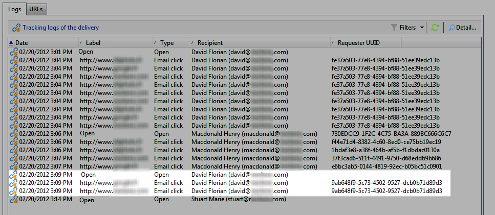
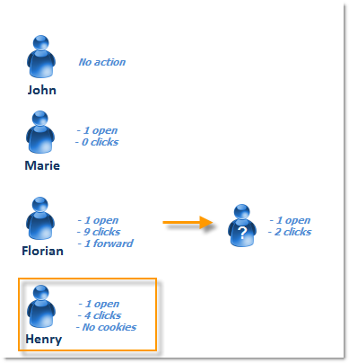

# Persona/persone e destinatari {#person-people-and-recipients}

Questo esempio aiuterà a comprendere la differenza tra una persona/una persona e un destinatario in  Adobe Campaign. Invieremo una consegna a più persone per evidenziare la differenza tra le persone e i destinatari, specificando nel contempo il metodo di calcolo per i seguenti indicatori:

* **[!UICONTROL Clicks]**
* **[!UICONTROL Distinct clicks for the population reached]**
* **[!UICONTROL Distinct opens for the population reached]**
* **[!UICONTROL Estimation of forwards]**
* **[!UICONTROL Raw reactivity]**

>[!NOTE]
>
>Questi indicatori sono utilizzati nella **[!UICONTROL Tracking indicators]** relazione. For more on this, refer to [Tracking indicators](../../reporting/using/delivery-reports.md#tracking-indicators).

A una consegna vengono aggiunti tre collegamenti. Viene inviato a 4 destinatari:

* **[!UICONTROL John Davis]** : il destinatario non apre l’e-mail (e quindi non fa clic su alcun collegamento).
* **[!UICONTROL Marie Stuart]** : apre l’e-mail ma non fa clic sui collegamenti.
* **[!UICONTROL Florian David]** : apre l’e-mail e fa clic sui collegamenti 9 volte. Invia inoltre l&#39;e-mail a qualcuno che l&#39;ha aperta e fa clic due volte.
* **[!UICONTROL Henry Macdonald]** : il destinatario ha configurato il proprio browser Internet per rifiutare i cookie. Apre l&#39;e-mail e fa clic sui collegamenti 4 volte.

Vengono restituiti i seguenti registri di tracciamento:

Per avere un&#39;idea più chiara del modo in cui persone e destinatari vengono contati, analizzeremo i registri di ciascun profilo.

## Passaggio 1: John {#step-1--john}

**[!UICONTROL John Davis]** non apre l’e-mail (e pertanto non fa clic su alcun collegamento).

Dal momento che John non ha aperto né fatto clic nell&#39;e-mail, non viene visualizzato nei registri.

**Calcolo intermedio:**

|  | Destinatari che hanno fatto clic | Persone che hanno fatto clic su | Destinatari che hanno aperto |
|---|---|---|---|
| John | - | - | - |
| Totale intermedio | 0 | 0 | 0 |

## Passaggio 2: Marie {#step-2--marie}

**[!UICONTROL Marie Stuart]** apre l’e-mail ma non fa clic sui collegamenti.

L&#39;apertura di Marie viene visualizzata nel seguente registro:

L&#39;apertura è assegnata a un destinatario: Marie.  Adobe Campaign aggiunge quindi un nuovo destinatario al conteggio.

**Calcolo intermedio:**

|  | Destinatari che hanno fatto clic | Persone che hanno fatto clic su | Destinatari che hanno aperto |
|---|---|---|---|
| John | - | - | - |
| Marie | - | - | +1 |
| Totale intermedio | 0 | 0 | 1 |

## Passaggio 3: Florian {#step-3--florian}

**[!UICONTROL Florian David]** apre l’e-mail e fa clic sui collegamenti 9 volte. Invia inoltre l&#39;e-mail a qualcuno che l&#39;ha aperta e fa clic due volte.

Le azioni di Florian (uno aperto e 9 clic) vengono visualizzate nei seguenti registri:

**Destinatari**: gli open e i clic vengono assegnati allo stesso destinatario (Florian). Poiché questo destinatario è diverso da quello precedente (Marie),  Adobe Campaign aggiunge un nuovo destinatario al conteggio.

Persone: Poiché il browser del destinatario accetta i cookie, è possibile vedere che lo stesso identificatore (UUID) è assegnato a tutti i registri di clic: **`fe37a503 [...]`**.  Adobe Campaign identifica correttamente questi clic come appartenenti alla stessa persona. Al conteggio viene aggiunta una nuova persona.

**Calcolo intermedio:**

|  | Destinatari che hanno fatto clic | Persone che hanno fatto clic su | Destinatari che hanno aperto |
|---|---|---|---|
| John | - | - | - |
| Marie | - | - | +1 |
| Florian | +1 | +1 | +1 |
| Totale intermedio | 1 | 1 | 2 |

I registri seguenti coincidono con gli open e due clic effettuati dalla persona a cui Florian ha inviato l&#39;e-mail a:

**Destinatari**: i relativi clic e aperti vengono assegnati al destinatario che ha inoltrato l&#39;e-mail (Florian). Poiché questo destinatario è già stato conteggiato, il conteggio dei destinatari rimane lo stesso.

**Persone**: per quanto riguarda i clic, lo stesso identificatore (UUID) è assegnato a tutti i registri: **`9ab648f9 [...]`**. Questo identificatore non è ancora stato conteggiato. Una nuova persona viene quindi aggiunta al conteggio.

**Calcolo intermedio:**

|  | Destinatari che hanno fatto clic | Persone che hanno fatto clic su | Destinatari che hanno aperto |
|---|---|---|---|
| John | - | - | - |
| Marie | - | - | +1 |
| Florian | +1 | +1 | +1 |
| Persona sconosciuta | - | +1 | - |
| Totale intermedio | 1 | 2 | 2 |

## Passaggio 4: Henry {#step-4--henry}

**[!UICONTROL Henry Macdonald]** ha configurato il suo browser Internet per rifiutare i cookie. Apre l&#39;e-mail e fa clic sui collegamenti 4 volte.

L&#39;apertura e 4 clic effettuati da Henry appaiono nei seguenti registri:

**Destinatari**: gli open e i clic vengono assegnati allo stesso destinatario (Henry). Poiché questo destinatario non è ancora stato conteggiato,  Adobe Campaign aggiunge un destinatario al conteggio.

**Persone**: Poiché il browser di Henry non accetta i cookie, per ogni clic viene generato un nuovo identificatore (UUID). Ciascuno dei 4 clic viene interpretato come proveniente da una persona diversa. Poiché questi identificatori non sono ancora stati conteggiati, vengono aggiunti al conteggio.

**Calcolo intermedio:**

|  | Destinatari che hanno fatto clic | Persone che hanno fatto clic su | Destinatari che hanno aperto |
|---|---|---|---|
| John | - | - | - |
| Marie | - | - | +1 |
| Florian | +1 | +1 | +1 |
| Persona sconosciuta | - | +1 | - |
| Henry | +1 | +4 | +1 |
| Totale intermedio | 2 | 6 | 3 |

## Riepilogo {#summary}

A livello di consegna, abbiamo i seguenti risultati:

* **[!UICONTROL Clicks]** (destinatari che hanno fatto clic su di essi): 2
* **[!UICONTROL Distinct clicks for the population reached]** (utenti che hanno fatto clic su): 6
* **[!UICONTROL Distinct opens for the population reached]** (destinatari che hanno aperto): 3

La reattività grezza e la stima dei forward sono calcolate come segue:

* **[!UICONTROL Estimation of forwards]** = **B - A** (quindi 6 - 2 = 4)
* **[!UICONTROL Raw reactivity]** = **A / C** (quindi 2 / 3 = 66,67%)

>[!NOTE]
>
>Nelle formule seguenti:
>
>* Un rappresenta l’ **[!UICONTROL Clicks]** indicatore (destinatari che hanno fatto clic su di esso).
>* B rappresenta l’ **[!UICONTROL Distinct clicks for the population reached]** indicatore (persone che hanno fatto clic su di esso).
>* C rappresenta l’ **[!UICONTROL Distinct opens for the population reached]** indicatore (destinatari che hanno aperto).