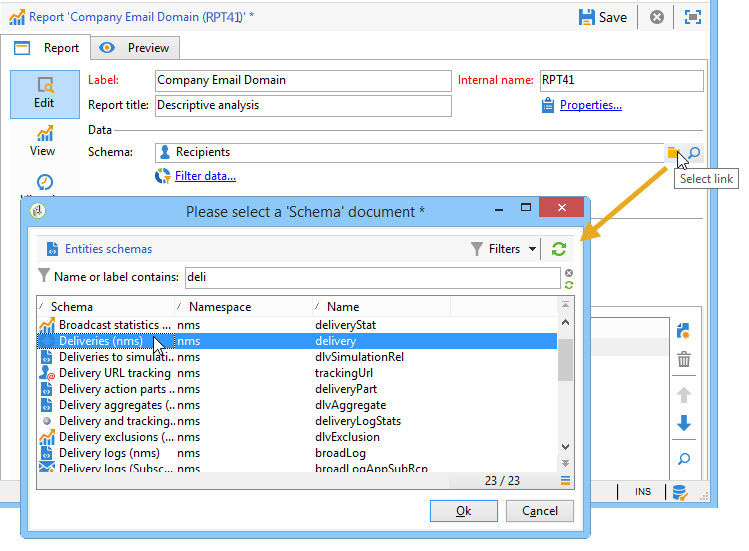

# Utilizzare un rapporto di analisi{#processing-a-report}

## Salvataggio di un rapporto di analisi {#saving-an-analysis-report}

Se si dispone dei diritti appropriati, è possibile salvare un rapporto di analisi creato da un modello o esportarlo in formato Excel, PDF o OpenOffice.

Per salvare il rapporto, fai clic su **[!UICONTROL Save]** e assegna un&#39;etichetta al tuo rapporto.

Seleziona **[!UICONTROL Also save data]** se desideri creare una cronologia del rapporto e visualizzare i valori del rapporto al momento del salvataggio. Per ulteriori informazioni, consulta [Archiviare i rapporti di analisi](#archiving-analysis-reports).

La **[!UICONTROL Share this report]** consente ad altri operatori di accedere al rapporto.

Una volta salvato, questo rapporto può essere riutilizzato per generare altri rapporti di analisi:

Per apportare modifiche a questo rapporto, modifica il **[!UICONTROL Administration > Configuration > Adobe Campaign tree reports]** nodo della struttura Adobe Campaign (o la prima cartella di tipo &quot;Report&quot; per la quale l’operatore dispone di diritti di modifica). Per ulteriori informazioni, consulta [Configurare il layout di un rapporto di analisi descrittivo](#configuring-the-layout-of-a-descriptive-analysis-report).

## Impostazioni aggiuntive del rapporto di analisi {#analysis-report-additional-settings}

Una volta salvato il rapporto di analisi descrittivo, puoi modificarne le proprietà e accedere a ulteriori opzioni.

Queste opzioni sono le stesse dei rapporti standard e sono descritte in [questa pagina](../../reporting/using/properties-of-the-report.md).

## Configurare il layout di un rapporto di analisi descrittivo {#configuring-the-layout-of-a-descriptive-analysis-report}

Puoi personalizzare la visualizzazione e il layout dei dati nei grafici e nelle tabelle dell’analisi descrittiva. Tutte le opzioni sono accessibili tramite la struttura di Adobe Campaign, nella **[!UICONTROL Edit]** di ogni rapporto.

### Modalità di visualizzazione del rapporto di analisi {#analysis-report-display-mode}

Quando crei un rapporto utilizzando **[!UICONTROL qualitative distribution]** le modalità di visualizzazione dei modelli, delle tabelle e dei grafici sono selezionate per impostazione predefinita. Se desideri una sola modalità di visualizzazione, deseleziona la casella appropriata. Ciò significa che sarà disponibile solo la scheda della modalità di visualizzazione selezionata.

Per modificare lo schema del rapporto, fai clic sul pulsante **[!UICONTROL Select the link]** e selezionare un&#39;altra tabella dal database.

### Impostazioni di visualizzazione dei rapporti di analisi {#analysis-report-display-settings}

È possibile nascondere o mostrare le statistiche e i totali parziali, nonché scegliere l’orientamento delle statistiche.

Quando crei delle statistiche puoi personalizzarne l’etichetta.

Il loro nome verrà visualizzato nel rapporto.

Tuttavia, se deselezioni l’opzione di visualizzazione dell’etichetta e del totale secondario, questi non saranno visibili nel rapporto. Il nome viene visualizzato in una descrizione comandi quando si passa il mouse su una cella della tabella.

Per impostazione predefinita, le statistiche vengono visualizzate online. Per modificare l’orientamento, seleziona l’opzione appropriata dall’elenco a discesa.

Nell&#39;esempio seguente, le statistiche vengono visualizzate in colonne.

### Layout dei dati del rapporto di analisi {#analysis-report-data-layout}

Puoi personalizzare il layout dei dati direttamente nelle tabelle di analisi descrittive. A questo scopo, fai clic con il pulsante destro del mouse sulla variabile con cui desideri lavorare. Seleziona le opzioni disponibili dal menu a discesa:

* **[!UICONTROL Pivot]** per modificare l&#39;asse della variabile.
* **[!UICONTROL Up]** / **[!UICONTROL Down]** per scambiare le variabili in righe.
* **[!UICONTROL Move to the right]** / **[!UICONTROL Move to the left]** per scambiare le variabili in colonne.
* **[!UICONTROL Turn]** per invertire gli assi delle variabili.
* **[!UICONTROL Sort from A to Z]** per ordinare i valori delle variabili da basso a alto.
* **[!UICONTROL Sort from Z to A]** per ordinare i valori delle variabili da alto a basso.

   

Per tornare alla visualizzazione iniziale, aggiornare la visualizzazione.

### Opzioni del grafico dei report di analisi {#analysis-report-chart-options}

È possibile personalizzare la visualizzazione dei dati nel grafico. A questo scopo, fai clic sul pulsante **[!UICONTROL Variables...]** collegamento disponibile durante la fase di selezione del tipo di grafico.

Sono disponibili le seguenti opzioni:

* La sezione superiore della finestra consente di modificare l’area di visualizzazione del grafico.
* Per impostazione predefinita, le etichette vengono visualizzate nel grafico. Puoi nasconderli deselezionando la **[!UICONTROL Show values]** opzione .
* La **[!UICONTROL Accumulate values]** consente di aggiungere valori da una serie all’altra.
* È possibile decidere se visualizzare o meno la legenda del grafico: per nasconderlo, deseleziona l’opzione appropriata. Per impostazione predefinita, la legenda viene visualizzata all’esterno del grafico nell’angolo in alto a destra.

   La legenda può anche essere visualizzata sopra il grafico per risparmiare spazio sullo schermo. A questo scopo, seleziona l’opzione **[!UICONTROL Include in the chart]**

   Selezionare l&#39;allineamento verticale e orizzontale nella **[!UICONTROL Caption position]** elenco a discesa.

   

## Esportare un rapporto di analisi {#exporting-an-analysis-report}

Per esportare i dati da un rapporto di analisi, fai clic sull’elenco a discesa e seleziona il formato di output desiderato.

Per ulteriori informazioni, consulta [questa pagina](../../reporting/using/actions-on-reports.md).

## Riutilizzare i rapporti e le analisi esistenti {#re-using-existing-reports-and-analyses}

Puoi creare rapporti di analisi descrittivi sui dati utilizzando i rapporti esistenti già memorizzati in Adobe Campaign. Questa modalità è possibile quando le analisi sono state salvate o quando sono stati creati e configurati rapporti per l’accesso tramite la procedura guidata di analisi descrittiva.

Per scoprire come salvare le analisi descrittive, fai riferimento a [Salvataggio di un rapporto di analisi](#saving-an-analysis-report).

Per creare rapporti di analisi descrittivi, la procedura guidata di analisi descrittiva deve essere eseguita tramite una transizione di flusso di lavoro o tramite la **[!UICONTROL Tools > Descriptive analysis]** menu.

1. Seleziona **[!UICONTROL Existing analyses and reports]** e fai clic su **[!UICONTROL Next]**.
1. Questo consente di accedere all’elenco dei rapporti disponibili. Seleziona il rapporto da generare.

   

## Archiviare i rapporti di analisi {#archiving-analysis-reports}

Quando crei un’analisi descrittiva basata su un’analisi esistente, puoi creare archivi per memorizzare i dati e confrontare i risultati del rapporto.

Per creare una cronologia, esegui i seguenti passaggi:

1. Apri un’analisi esistente o crea una nuova procedura guidata di analisi descrittiva.
1. Nella pagina di visualizzazione del rapporto, fai clic sul pulsante per creare una cronologia nella barra degli strumenti, quindi conferma come mostrato di seguito:

   

1. Utilizza il pulsante di accesso all’archivio per visualizzare le analisi precedenti.

   
