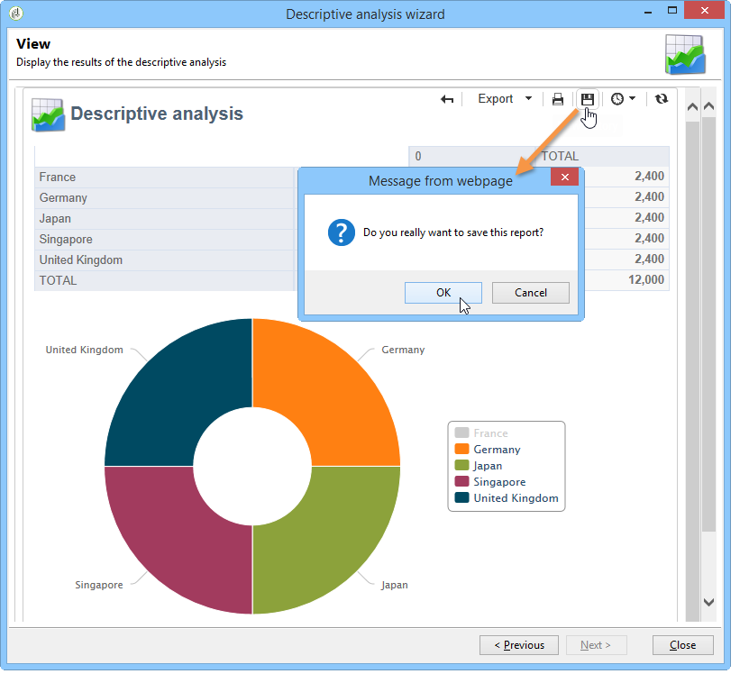

# Gestire e configurare il rapporto di analisi {#processing-a-report}

## Salvataggio di un rapporto di analisi {#saving-an-analysis-report}

Se si dispone dei diritti appropriati, è possibile salvare un report di analisi creato da un modello o esportarlo in formato Excel, PDF o OpenOffice.

Per salvare il report, fare clic su **[!UICONTROL Save]** e assegnare un&#39;etichetta al report.

Selezionare **[!UICONTROL Also save data]** per creare una cronologia del report e visualizzare i valori del report al momento del salvataggio. Per ulteriori informazioni, consulta [Archiviare i report di analisi](#archiving-analysis-reports).

L&#39;opzione **[!UICONTROL Share this report]** consente ad altri operatori di accedere al report.

Una volta salvato, il rapporto può essere riutilizzato per generare altri rapporti di analisi:

Per apportare modifiche a questo report, modificare il nodo **[!UICONTROL Administration > Configuration > Adobe Campaign tree reports]** della struttura Adobe Campaign (o la prima cartella di tipo &quot;Report&quot; per la quale l&#39;operatore dispone dei diritti di modifica). Per ulteriori informazioni, consulta [Configurare il layout di un rapporto di analisi descrittivo](#configuring-the-layout-of-a-descriptive-analysis-report).

## Impostazioni aggiuntive del rapporto di analisi {#analysis-report-additional-settings}

Una volta salvato il rapporto di analisi descrittivo, puoi modificarne le proprietà e accedere ad altre opzioni.

Queste opzioni sono le stesse dei report standard e sono descritte in dettaglio in [questa pagina](../../reporting/using/properties-of-the-report.md).

## Configurare il layout di un rapporto di analisi descrittivo {#configuring-the-layout-of-a-descriptive-analysis-report}

Puoi personalizzare la visualizzazione e il layout dei dati nei grafici e nelle tabelle dell’analisi descrittiva. Tutte le opzioni sono accessibili tramite la struttura Adobe Campaign, nella scheda **[!UICONTROL Edit]** di ogni rapporto.

### Modalità di visualizzazione dei rapporti di analisi {#analysis-report-display-mode}

Quando si crea un report utilizzando il modello **[!UICONTROL qualitative distribution]**, le modalità di visualizzazione delle tabelle e dei grafici sono selezionate per impostazione predefinita. Se desideri una sola modalità di visualizzazione, deseleziona la casella appropriata. Ciò significa che sarà disponibile solo la scheda della modalità di visualizzazione selezionata.

Per modificare lo schema del report, fare clic su **[!UICONTROL Select the link]** e selezionare un&#39;altra tabella dal database.

### Impostazioni di visualizzazione del rapporto di analisi {#analysis-report-display-settings}

È possibile nascondere o visualizzare le statistiche e i totali parziali, nonché scegliere l&#39;orientamento delle statistiche.

Quando crei delle statistiche puoi personalizzarne l’etichetta.

Il loro nome verrà visualizzato nel rapporto.

Tuttavia, se deselezioni l’opzione di visualizzazione etichetta e subtotale, questi non saranno visibili nel rapporto. Il nome verrà visualizzato in una descrizione quando si passa il puntatore del mouse su una cella della tabella.

Per impostazione predefinita, le statistiche vengono visualizzate online. Per modificare l’orientamento, seleziona l’opzione appropriata dall’elenco a discesa.

Nell&#39;esempio seguente le statistiche vengono visualizzate in colonne.

### Layout dei dati dei rapporti di analisi {#analysis-report-data-layout}

Puoi personalizzare il layout dei dati direttamente nelle tabelle di analisi descrittive. A questo scopo, fai clic con il pulsante destro del mouse sulla variabile con cui desideri lavorare. Seleziona le opzioni disponibili dal menu a discesa:

* **[!UICONTROL Pivot]** per modificare l&#39;asse della variabile.
* **[!UICONTROL Up]** / **[!UICONTROL Down]** per scambiare le variabili in righe.
* **[!UICONTROL Move to the right]** / **[!UICONTROL Move to the left]** per scambiare le variabili nelle colonne.
* **[!UICONTROL Turn]** per invertire gli assi delle variabili.
* **[!UICONTROL Sort from A to Z]** per ordinare i valori della variabile da basso a alto.
* **[!UICONTROL Sort from Z to A]** per ordinare i valori della variabile da alto a basso.

  

Per tornare alla visualizzazione iniziale, aggiornare la visualizzazione.

### Opzioni del grafico del rapporto di analisi {#analysis-report-chart-options}

È possibile personalizzare la visualizzazione dei dati nel grafico. A tale scopo, fare clic sul collegamento **[!UICONTROL Variables...]** disponibile durante la fase di selezione del tipo di grafico.

Sono disponibili le seguenti opzioni:

* La sezione superiore della finestra consente di modificare l&#39;area di visualizzazione del grafico.
* Per impostazione predefinita, le etichette vengono visualizzate nel grafico. È possibile nasconderli deselezionando l&#39;opzione **[!UICONTROL Show values]**.
* L&#39;opzione **[!UICONTROL Accumulate values]** consente di aggiungere valori da una serie all&#39;altra.
* È possibile decidere se visualizzare o meno la legenda del grafico: per nasconderla, deselezionare l&#39;opzione appropriata. Per impostazione predefinita, la legenda viene visualizzata all&#39;esterno del grafico nell&#39;angolo in alto a destra.

  La legenda può essere visualizzata anche sopra il grafico per risparmiare spazio. A tale scopo, selezionare l&#39;opzione **[!UICONTROL Include in the chart]**

  Selezionare l&#39;allineamento verticale e orizzontale nell&#39;elenco a discesa **[!UICONTROL Caption position]**.

  

## Esportare un rapporto di analisi {#exporting-an-analysis-report}

Per esportare dati da un rapporto di analisi, fai clic sull’elenco a discesa e seleziona il formato di output desiderato.

Per ulteriori informazioni, consulta [questa pagina](../../reporting/using/actions-on-reports.md).

## Riutilizzare i report e le analisi esistenti {#re-using-existing-reports-and-analyses}

Puoi creare rapporti di analisi descrittivi sui dati utilizzando rapporti esistenti già memorizzati in Adobe Campaign. Questa modalità è possibile quando le analisi sono state salvate o quando i rapporti sono stati creati e configurati per essere accessibili tramite l’assistente di analisi descrittivo.

Per informazioni su come salvare le analisi descrittive, vedere [Salvataggio di un report di analisi](#saving-an-analysis-report).

Per creare rapporti di analisi descrittivi, l&#39;Assistente all&#39;analisi descrittiva deve essere eseguito tramite una transizione del flusso di lavoro o tramite il menu **[!UICONTROL Tools > Descriptive analysis]**.

1. Seleziona **[!UICONTROL Existing analyses and reports]** e fai clic su **[!UICONTROL Next]**.
1. Questo ti consente di accedere all’elenco dei rapporti disponibili. Seleziona il rapporto da generare.

   

## Archiviare i rapporti di analisi {#archiving-analysis-reports}

Quando crei un’analisi descrittiva basata su un’analisi esistente, puoi creare archivi per memorizzare dati e confrontare i risultati dei rapporti.

Per creare una cronologia, attieniti alla seguente procedura:

1. Apri un’analisi esistente o crea un nuovo assistente di analisi descrittivo.
1. Nella pagina di visualizzazione del rapporto, fai clic sul pulsante per creare una cronologia nella barra degli strumenti, quindi conferma come mostrato di seguito:

   

1. Utilizza il pulsante di accesso archivio per visualizzare le analisi precedenti.

   
