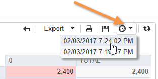

# Utilizzo di un rapporto di analisi{#processing-a-report}

## Salvataggio di un rapporto di analisi {#saving-an-analysis-report}

Se disponete dei diritti appropriati, potete salvare un rapporto di analisi creato da un modello o esportarlo in formato Excel, PDF o OpenOffice.

Per salvare il rapporto, fai clic su **[!UICONTROL Save]** e assegna un&#39;etichetta al rapporto.

Selezionate **[!UICONTROL Also save data]** se desiderate creare una cronologia del rapporto e visualizzare i valori del rapporto al momento del salvataggio. Per ulteriori informazioni, consultare [Archiviazione dei report](#archiving-analysis-reports)di analisi.

L&#39; **[!UICONTROL Share this report]** opzione consente agli altri operatori di accedere al rapporto.

Una volta salvato, il rapporto può essere riutilizzato per generare altri rapporti di analisi:

Per apportare modifiche a questo rapporto, modificare il **[!UICONTROL Administration > Configuration > Adobe Campaign tree reports]** nodo della struttura di Adobe Campaign  (o la prima cartella di tipo &quot;Report&quot; per la quale l&#39;operatore dispone dei diritti di modifica). Per ulteriori informazioni, consulta [Configurazione del layout di un rapporto](#configuring-the-layout-of-a-descriptive-analysis-report)di analisi descrittivo.

## Impostazioni aggiuntive del rapporto di analisi {#analysis-report-additional-settings}

Dopo aver salvato un rapporto di analisi descrittivo, puoi modificarne le proprietà e accedere ad altre opzioni.

Queste opzioni sono le stesse dei rapporti standard e sono dettagliate in [questa pagina](../../reporting/using/properties-of-the-report.md).

## Configurazione del layout di un rapporto di analisi descrittivo {#configuring-the-layout-of-a-descriptive-analysis-report}

È possibile personalizzare la visualizzazione e il layout dei dati nei grafici e nelle tabelle dell&#39;analisi descrittiva. Tutte le opzioni sono accessibili tramite la struttura  Adobe Campaign, nella **[!UICONTROL Edit]** scheda di ciascun rapporto.

### Modalità di visualizzazione dei rapporti di analisi {#analysis-report-display-mode}

Quando si crea un rapporto utilizzando il modello, per impostazione predefinita vengono selezionate le modalità di visualizzazione delle tabelle e dei grafici. **[!UICONTROL qualitative distribution]** Se desiderate una sola modalità di visualizzazione, deselezionate la casella appropriata. Ciò significa che sarà disponibile solo la scheda della modalità di visualizzazione selezionata.

Per modificare lo schema del rapporto, fare clic su di esso **[!UICONTROL Select the link]** e selezionare un&#39;altra tabella dal database.

### Impostazioni di visualizzazione dei rapporti di analisi {#analysis-report-display-settings}

È possibile nascondere o visualizzare le statistiche e i totali parziali nonché scegliere l&#39;orientamento delle statistiche.

Quando create delle statistiche potete personalizzare la relativa etichetta.

Il nome verrà visualizzato nel rapporto.

Tuttavia, se deselezionate l&#39;opzione di visualizzazione dell&#39;etichetta e del sotto-totale, questi non saranno visibili nel rapporto. Il nome verrà visualizzato in una descrizione comandi quando si passa il puntatore del mouse su una cella della tabella.

Per impostazione predefinita, le statistiche sono visualizzate online. Per modificare l&#39;orientamento, selezionate l&#39;opzione appropriata dall&#39;elenco a discesa.

Nell&#39;esempio seguente, le statistiche sono visualizzate in colonne.

### Layout dei dati del rapporto di analisi {#analysis-report-data-layout}

Puoi personalizzare il layout dei dati direttamente nelle tabelle di analisi descrittive. A questo scopo, fare clic con il pulsante destro del mouse sulla variabile con cui si desidera lavorare. Selezionate le opzioni disponibili dal menu a discesa:

* **[!UICONTROL Pivot]** per modificare l&#39;asse della variabile.
* **[!UICONTROL Up]** / **[!UICONTROL Down]** per sostituire le variabili in righe.
* **[!UICONTROL Move to the right]** / **[!UICONTROL Move to the left]** per sostituire le variabili in colonne.
* **[!UICONTROL Turn]** per invertire gli assi delle variabili.
* **[!UICONTROL Sort from A to Z]** per ordinare i valori delle variabili da basso a alto.
* **[!UICONTROL Sort from Z to A]** per ordinare i valori delle variabili da alto a basso.

   

Per tornare alla visualizzazione iniziale, aggiornare la visualizzazione.

### Opzioni del grafico dei report di analisi {#analysis-report-chart-options}

È possibile personalizzare la visualizzazione dei dati nel grafico. A tal fine, fare clic sul **[!UICONTROL Variables...]** collegamento disponibile durante l&#39;area di selezione del tipo di grafico.

Sono disponibili le seguenti opzioni:

* La sezione superiore della finestra consente di modificare l&#39;area di visualizzazione del grafico.
* Per impostazione predefinita, le etichette sono visualizzate nel grafico. Potete nasconderli deselezionando l’ **[!UICONTROL Show values]** opzione.
* L&#39; **[!UICONTROL Accumulate values]** opzione consente di aggiungere valori da una serie all&#39;altra.
* È possibile decidere se visualizzare o meno la legenda del grafico: per nasconderlo, deselezionate l’opzione appropriata. Per impostazione predefinita, la legenda viene visualizzata all’esterno del grafico nell’angolo in alto a destra.

   La legenda può anche essere visualizzata sopra al grafico per risparmiare spazio di visualizzazione. To do this, select the option **[!UICONTROL Include in the chart]**

   Selezionare l&#39;allineamento verticale e orizzontale nell&#39;elenco a **[!UICONTROL Caption position]** discesa.

   

## Esportazione di un rapporto di analisi {#exporting-an-analysis-report}

Per esportare i dati da un rapporto di analisi, fai clic sull’elenco a discesa e seleziona il formato di output desiderato.

Per ulteriori informazioni, consulta [questa pagina](../../reporting/using/actions-on-reports.md).

## Riutilizzo di report e analisi esistenti {#re-using-existing-reports-and-analyses}

Potete creare rapporti di analisi descrittivi sui dati utilizzando i rapporti esistenti già memorizzati in  Adobe Campaign. Questa modalità è possibile quando le analisi sono state salvate o quando sono stati creati e configurati per l&#39;accesso tramite la procedura guidata di analisi descrittiva.

Per informazioni su come salvare le analisi descrittive, vedere [Salvataggio di un report](#saving-an-analysis-report)di analisi.

Per creare rapporti di analisi descrittivi, l&#39;analisi guidata deve essere eseguita tramite una transizione di workflow o tramite il **[!UICONTROL Tools > Descriptive analysis]** menu.

1. Seleziona **[!UICONTROL Existing analyses and reports]** e fai clic su **[!UICONTROL Next]**.
1. Questo consente di accedere all&#39;elenco dei rapporti disponibili. Selezionate il rapporto da generare.

   

## Archiviazione dei report di analisi {#archiving-analysis-reports}

Quando crei un&#39;analisi descrittiva basata su un&#39;analisi esistente, puoi creare archivi per memorizzare i dati e confrontare i risultati dei report.

Per creare una cronologia, attenetevi alla seguente procedura:

1. Aprite un&#39;analisi esistente o create una nuova procedura guidata di analisi descrittiva.
1. Nella pagina di visualizzazione del rapporto, fate clic sul pulsante per creare una cronologia nella barra degli strumenti, quindi confermate come illustrato di seguito:

   

1. Utilizzate il pulsante di accesso all&#39;archivio per visualizzare le analisi precedenti.

   

