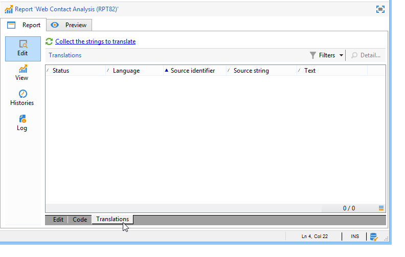
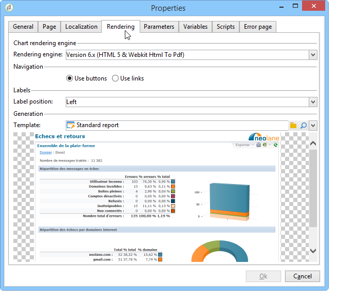

# Proprietà del rapporto{#properties-of-the-report}

Puoi personalizzare e configurare completamente il rapporto in base alle tue esigenze. A questo scopo, modificane le proprietà. Le proprietà dei report sono accessibili tramite il pulsante **[!UICONTROL Properties]** sopra il grafico della sequenza di attività.

Le proprietà generali sono descritte di seguito. Le funzionalità avanzate configurate nelle schede **[!UICONTROL Parameters]**, **[!UICONTROL Variables]** e **[!UICONTROL Scripts]** sono descritte [in questa sezione](../../reporting/using/advanced-functionalities.md).

## Proprietà generali {#overall-properties}

Nella scheda **[!UICONTROL General]** delle proprietà del report, è possibile modificare le impostazioni elencate di seguito:

* L’etichetta e il nome interno del rapporto. **[!UICONTROL Internal name]** viene utilizzato nell&#39;URL finale del report. Non deve essere modificato dopo la creazione del rapporto.

* Il report **Cartella** è selezionato durante la creazione. Si consiglia di creare una cartella dedicata per i report personalizzati in modo che non vengano combinati con [report incorporati](../../reporting/using/about-campaign-built-in-reports.md).

* **Archiviazione** selezionata durante la creazione del report. Per modificare la tabella dati del report, fare clic sull&#39;icona **[!UICONTROL Select link]** a destra del campo **[!UICONTROL Document type]**.

  

* Parametri del controllo di accesso **&#x200B;**. Queste impostazioni sono descritte di seguito.

## Controllare l’accesso al rapporto {#report-accessibility}

È possibile accedere a un rapporto nella console Adobe Campaign o con un browser web. In questo caso, può essere necessario configurare il controllo di accesso ai rapporti come mostrato di seguito.

Le opzioni possibili sono:

* **[!UICONTROL Anonymous access]**: questa opzione consente l&#39;accesso illimitato al report. Tuttavia, non è possibile alcuna manipolazione.

  Le autorizzazioni dell’operatore tecnico &quot;webapp&quot; vengono utilizzate per visualizzare gli elementi del rapporto. Per ulteriori informazioni, consulta [questa sezione](../../platform/using/access-management-operators.md).

* **[!UICONTROL Access control]**: questa opzione consente agli operatori Adobe Campaign di accedervi dopo l&#39;accesso.
* **[!UICONTROL Specific account]**: questa opzione consente di eseguire il report con i diritti dell&#39;operatore selezionato nel campo **[!UICONTROL Operator]**.

## Tradurre il rapporto {#report-localization}

Puoi configurare le lingue in cui desideri tradurre il rapporto. A tale scopo, fare clic sulla scheda **[!UICONTROL Localization]**.

La lingua di modifica è la lingua in cui si scrive. Quando aggiungi una lingua, la scheda secondaria viene visualizzata nella pagina di modifica del rapporto.

>[!NOTE]
>
>Per ulteriori informazioni sulla localizzazione delle pagine Web in Campaign, consulta [questa sezione](../../web/using/translating-a-web-form.md).

## Personalizzare il rendering di HTML {#personalizing-html-rendering}

Nella scheda **[!UICONTROL Rendering]** è possibile personalizzare la modalità di visualizzazione dei dati per la pagina. Puoi selezionare:

* Il tipo di navigazione nel rapporto: tramite pulsanti o collegamenti.
* Posizione predefinita delle etichette per gli elementi del report. Questa posizione può essere sovraccaricata per ogni elemento.
* Modello o tema utilizzato per generare le pagine del rapporto.

## Personalizzazione della pagina di errore {#personalizing-the-error-page}

La scheda **[!UICONTROL Error page]** consente di configurare il messaggio che verrà visualizzato in caso di errore nella visualizzazione del report.

Puoi definire i testi e collegarli a identificatori specifici per gestire la localizzazione dei rapporti. Per ulteriori informazioni, consulta [Aggiunta di un&#39;intestazione e di un piè di pagina](../../reporting/using/element-layout.md#adding-a-header-and-a-footer).

