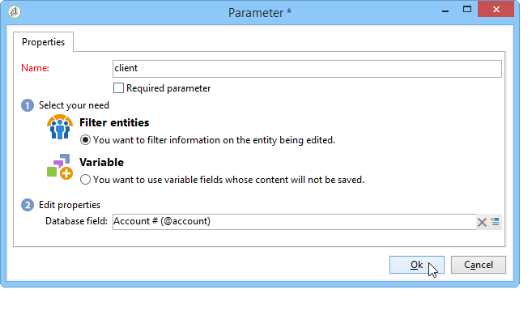

# Proprietà del report{#properties-of-the-report}

## Panoramica {#overview}

Puoi personalizzare e configurare il rapporto in base alle tue esigenze. A questo scopo, modificarne le proprietà. Le proprietà del report sono accessibili tramite il pulsante Proprietà presente sopra il grafico della sequenza di attività.

## Proprietà generali {#overall-properties}

La **[!UICONTROL General]** scheda consente di visualizzare o modificare l&#39;etichetta e lo schema di cui si occupa il rapporto. Questi elementi vengono inseriti durante la creazione del rapporto.

Non si consiglia di cambiare **[!UICONTROL Internal name]** : viene utilizzato nell&#39;URL di accesso del report.

Il modello di rapporto viene selezionato durante la creazione del rapporto e non può essere modificato in seguito.

Per modificare la tabella interessata dal rapporto, fai clic sull’ **[!UICONTROL Select link]** icona a destra del **[!UICONTROL Document type]** campo. Per visualizzare i campi disponibili nella tabella selezionata, fare clic sull’ **[!UICONTROL Magnifier]** icona .

## Accessibilità dei report {#report-accessibility}

È possibile accedere a un report oltre la console di Adobe Campaign , ad esempio tramite un browser Web. In questo caso, può essere necessario configurare il controllo di accesso al report come mostrato di seguito.

Il principio generale è il seguente:

* L&#39; **[!UICONTROL Anonymous access]** opzione consente l&#39;accesso illimitato al report. Tuttavia, non è possibile alcuna manipolazione.

   I diritti dell&#39;operatore di report predefinito (&#39;webapp&#39;) vengono utilizzati per visualizzare gli elementi del report.

* L&#39; **[!UICONTROL Access control]** opzione consente  operatori Adobe Campaign di accedervi dopo l&#39;accesso.
* L&#39; **[!UICONTROL Specific account]** opzione consente di eseguire il rapporto con i diritti dell&#39;operatore selezionato nel **[!UICONTROL Operator]** campo.

Le proprietà del modulo Web sono dettagliate in [questa pagina](../../web/using/about-web-forms.md).

## Gestione della localizzazione dei report {#managing-report-localization}

Potete configurare le lingue in cui desiderate tradurre il rapporto. A tale scopo, fare clic sulla **[!UICONTROL Localization]** scheda.

La lingua di modifica è la lingua in cui si scrive. Quando aggiungete una lingua, nella pagina di modifica del rapporto viene visualizzata la sottoscheda.

>[!NOTE]
>
>Per ulteriori informazioni, consulta la sezione appropriata di [questa sezione](../../web/using/translating-a-web-form.md).

## Personalizzazione del rendering HTML {#personalizing-html-rendering}

Nella **[!UICONTROL Rendering]** scheda, è possibile personalizzare la modalità di visualizzazione dei dati per la pagina. Potete selezionare:

* Il motore di rendering del grafico:  Adobe Campaign offre due diverse modalità per generare il rendering del grafico. Per impostazione predefinita, il motore di rendering è HTML 5. Se necessario, potete selezionare il rendering del Flash.
* Tipo di navigazione nel rapporto: tramite pulsanti o collegamenti.
* Posizione predefinita delle etichette per gli elementi del report. Questa posizione può essere sovraccaricata per ogni elemento.
* Modello o tema utilizzato per generare le pagine dei rapporti.

Le proprietà del modulo Web sono dettagliate in [questa pagina](../../web/using/about-web-forms.md).

## Definizione di impostazioni aggiuntive {#defining-additional-settings}

La **[!UICONTROL Parameters]** scheda consente di creare impostazioni aggiuntive per il rapporto: queste impostazioni verranno trasmesse all’URL durante la chiamata.

Le proprietà del modulo Web sono dettagliate in [questa pagina](../../web/using/about-web-forms.md).

>[!CAUTION]
>
>Per motivi di sicurezza, questi parametri devono essere utilizzati con grande cautela.

Per creare una nuova impostazione:

1. Fate clic sul **[!UICONTROL Add]** pulsante e immettete il nome dell’impostazione.

   

1. Se necessario, specificate se l&#39;impostazione sarà obbligatoria o meno.
1. Select the type of setting you want to create: **[!UICONTROL Filter]** or **[!UICONTROL Variable]**.

   L&#39; **[!UICONTROL Filter entities]** opzione consente di utilizzare un campo del database come parametro.

   

   I dati vengono recuperati direttamente a livello di entità: **ctx/receive/@account**.

   L&#39; **[!UICONTROL Variable]** opzione consente di creare o selezionare una variabile che verrà passata come parametro dell&#39;URL e che può essere utilizzata nei filtri.

Questo **[!UICONTROL Response HTTP headers]** consente di evitare il clic quando si inserisce la pagina del rapporto in una pagina HTML utilizzando iframe. Per evitare il clickjacking, potete scegliere il **[!UICONTROL X-Frame-options header]** comportamento:

* **[!UICONTROL None]**: Il rapporto non avrà alcun risultato **[!UICONTROL X-Frame-options header]**.
* **[!UICONTROL Same as origin]**: Impostato per impostazione predefinita per i nuovi rapporti e i rapporti ripubblicati. Il nome host sarà uguale all&#39;URL del report.
* **[!UICONTROL Deny]**: Il rapporto non può essere incluso in una pagina HTML utilizzando iframe.

## Aggiunta di variabili {#adding-variables}

La **[!UICONTROL Variables]** scheda contiene l&#39;elenco delle variabili configurate nel rapporto. Queste variabili sono esposte nel contesto del rapporto e possono essere utilizzate nei calcoli.

Fate clic sul **[!UICONTROL Add]** pulsante per creare una nuova variabile.

Per visualizzare la definizione di una variabile, selezionatela e fate clic sul **[!UICONTROL Detail...]** pulsante.

## Riferimento a script {#referencing-scripts}

La **[!UICONTROL Scripts]** scheda consente di fare riferimento ai codici JavaScript che verranno eseguiti sul lato client e/o server quando viene richiamata la pagina del rapporto.

Per una normale esecuzione sul lato client, gli script di riferimento devono essere scritti in JavaScript e devono essere compatibili con la maggior parte dei browser. Per ulteriori informazioni al riguardo, consulta [questa sezione](../../web/using/web-forms-answers.md).

## Personalizzazione della pagina di errore {#personalizing-the-error-page}

La **[!UICONTROL Error page]** scheda consente di configurare il messaggio che verrà visualizzato in caso di errore nella visualizzazione del rapporto.

Puoi definire testi e collegarli a identificatori specifici per gestire la localizzazione dei report. Per ulteriori informazioni, vedere [Aggiunta di un&#39;intestazione e di un piè di pagina](../../reporting/using/element-layout.md#adding-a-header-and-a-footer).

