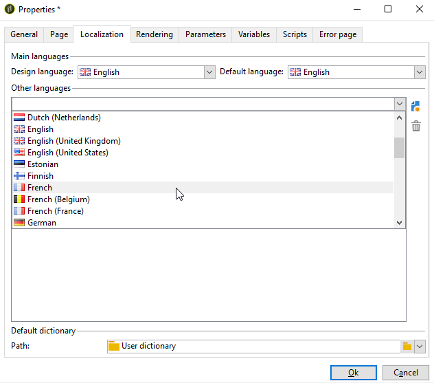

# Proprietà del rapporto{#properties-of-the-report}

Puoi personalizzare e configurare completamente il rapporto in base alle tue esigenze. A questo scopo, modificane le proprietà. Le proprietà dei rapporti sono accessibili tramite il pulsante **[!UICONTROL Properties]** sopra il grafico a sequenza di attività.

Le proprietà generali sono descritte di seguito. Le funzionalità avanzate configurate nelle schede **[!UICONTROL Parameters]**, **[!UICONTROL Variables]** e **[!UICONTROL Scripts]** sono descritte [in questa sezione](../../reporting/using/advanced-functionalities.md).

## Proprietà generali {#overall-properties}

Nella scheda **[!UICONTROL General]** delle proprietà del rapporto puoi modificare le impostazioni elencate di seguito:

* Etichetta e nome interno del rapporto. L’ **[!UICONTROL Internal name]** viene utilizzato nell’URL finale del rapporto. Non deve essere modificato dopo la creazione del rapporto.

* Il report **Folder** viene selezionato durante la creazione del report. È consigliabile creare una cartella dedicata per i rapporti personalizzati in modo che non vengano mescolati con i [rapporti incorporati](../../reporting/using/about-campaign-built-in-reports.md).

* Durante la creazione del rapporto viene selezionato **Archiviazione** . Per modificare la tabella dati del rapporto, fai clic sull&#39;icona **[!UICONTROL Select link]** a destra del campo **[!UICONTROL Document type]** .

   

* I parametri **Controllo di accesso**. Queste impostazioni sono descritte di seguito.

## Controllo dell&#39;accesso al report {#report-accessibility}

Un rapporto è accessibile dalla console Adobe Campaign o da un browser web. In questo caso, può essere necessario configurare il controllo di accesso al report come mostrato di seguito.

Le opzioni possibili sono:

* **[!UICONTROL Anonymous access]**: questa opzione consente l’accesso illimitato al report. Tuttavia, non è possibile alcuna manipolazione.

   Le autorizzazioni dell’operatore tecnico &quot;webapp&quot; vengono utilizzate per visualizzare gli elementi del rapporto. Ulteriori informazioni [in questa sezione](../../platform/using/access-management-operators.md).

* **[!UICONTROL Access control]**: questa opzione consente agli operatori Adobe Campaign di accedervi una volta connessi.
* **[!UICONTROL Specific account]**: questa opzione ti consente di eseguire il rapporto con i diritti dell’operatore selezionato nel  **[!UICONTROL Operator]** campo .

## Gestione della localizzazione dei report {#managing-report-localization}

Puoi configurare le lingue in cui desideri tradurre il rapporto. A questo scopo, fai clic sulla scheda **[!UICONTROL Localization]** .

Il linguaggio di modifica è la lingua in cui si scrive. Quando aggiungi una lingua, nella pagina di modifica del rapporto viene visualizzata la sottoscheda .

>[!NOTE]
>
>Per ulteriori informazioni sulla localizzazione delle pagine web in Campaign, consulta [questa sezione](../../web/using/translating-a-web-form.md).

## Personalizzazione del rendering HTML {#personalizing-html-rendering}

Nella scheda **[!UICONTROL Rendering]** puoi personalizzare la modalità di visualizzazione dei dati per la pagina. Puoi selezionare:

* Il motore di rendering del grafico: per impostazione predefinita, il motore di rendering è HTML 5.
* Tipo di navigazione nel rapporto: tramite pulsanti o collegamenti.
* Posizione predefinita delle etichette per gli elementi del report. Questa posizione può essere sovraccaricata per ogni elemento.
* Il modello o il tema utilizzato per generare le pagine dei rapporti.

## Personalizzazione della pagina di errore {#personalizing-the-error-page}

La scheda **[!UICONTROL Error page]** ti consente di configurare il messaggio che verrà visualizzato in caso di errore nella visualizzazione del rapporto.

Puoi definire i testi e collegarli a identificatori specifici per gestire la localizzazione dei report. Per ulteriori informazioni, consulta [Aggiunta di un’intestazione e di un piè di pagina](../../reporting/using/element-layout.md#adding-a-header-and-a-footer).

