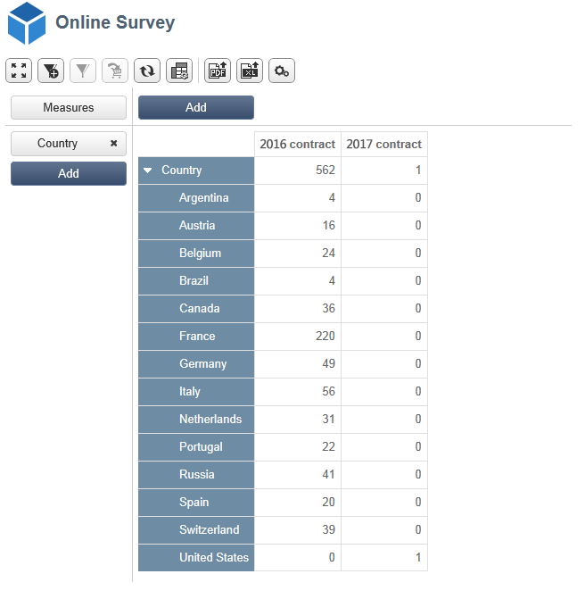

# Caso di utilizzo: visualizzazione di un report sulle risposte a un sondaggio online{#use-case-displaying-report-on-answers-to-an-online-survey}

Le risposte  sondaggi Adobe Campaign possono essere raccolte e analizzate utilizzando report dedicati.

Nell&#39;esempio seguente, vogliamo raccogliere le risposte a un sondaggio online e visualizzarle in una tabella pivot

Effettuate le seguenti operazioni:

1. Creazione di un flusso di lavoro per recuperare le risposte al sondaggio e memorizzarle in un elenco.
1. Creazione di un cubo utilizzando i dati presenti nell&#39;elenco.
1. Creazione di un rapporto con la tabella pivot e visualizzazione della suddivisione delle risposte.

Prima di iniziare questo caso di utilizzo, è necessario avere accesso a un sondaggio e a una serie di risposte che è possibile analizzare.

>[!NOTE]
>
>Questo caso d’uso può essere implementato solo se avete acquisito l’opzione **Survey Manager** . Controlla il contratto di licenza.

## Passaggio 1 - Creazione del flusso di lavoro per la raccolta e l&#39;archiviazione dei dati {#step-1---creating-the-data-collection-and-storage-workflow}

Per raccogliere le risposte al sondaggio, effettuate le seguenti operazioni:

1. Create un flusso di lavoro e inserite un&#39; **[!UICONTROL Answers to a survey]** attività. For more on using this activity, refer to [this section](../../web/using/publish--track-and-use-collected-data.md#using-the-collected-data).
1. Modificate l&#39;attività e selezionate il sondaggio di cui desiderate analizzare le risposte.
1. Abilitate l&#39; **[!UICONTROL Select all the answer data]** opzione per raccogliere tutte le informazioni.

   

1. Selezionare le colonne da estrarre (in questo caso: select: tutti i campi archiviati. Questi sono i campi che contengono le risposte.

   

1. Una volta configurata la casella di raccolta delle risposte, posizionare un&#39;attività di **[!UICONTROL List update]** tipo per salvare i dati.

   

   In questa attività, specificate l&#39;elenco da aggiornare e deselezionate l&#39; **[!UICONTROL Purge and re-use the list if it exists (otherwise add to the list)]** opzione: le risposte vengono aggiunte alla tabella esistente. Questa opzione consente di fare riferimento all&#39;elenco in un cubo. Lo schema collegato all&#39;elenco non verrà generato di nuovo per ogni aggiornamento, che garantisce l&#39;integrità del cubo che utilizza questo elenco.

   

1. Avviate il flusso di lavoro per confermare la configurazione.

   

   L’elenco specificato viene creato e include lo schema delle risposte al sondaggio.

1. Aggiungete un pianificatore per automatizzare la raccolta giornaliera di risposte e l&#39;aggiornamento dell&#39;elenco.

   Le attività **[!UICONTROL List update]** e **[!UICONTROL Scheduler]** sono descritte in dettaglio in .

## Passaggio 2 - Creazione del cubo, delle sue misure e dei suoi indicatori {#step-2---creating-the-cube--its-measures-and-its-indicators}

È quindi possibile creare il cubo e configurarne le misure: verranno utilizzati per creare gli indicatori che saranno mostrati nel rapporto. Per ulteriori informazioni sulla creazione e la configurazione dei cubi, vedere [Informazioni sui cubi](../../reporting/using/about-cubes.md).

In questo esempio, il cubo è basato sui dati presenti nell&#39;elenco, inviati dal flusso di lavoro creato in precedenza.

Definite le dimensioni e le misure da visualizzare nel rapporto. Qui, vogliamo visualizzare la data del contratto e il paese del convenuto.

La **[!UICONTROL Preview]** scheda consente di controllare il rendering del rapporto.

## Passaggio 3 - Creazione del rapporto e configurazione del layout dei dati all&#39;interno della tabella {#step-3---creating-the-report-and-configuring-the-data-layout-within-the-table}

È quindi possibile creare un rapporto basato su questo cubo ed elaborare i dati e le informazioni.

Adatta le informazioni da visualizzare in base alle tue esigenze.

