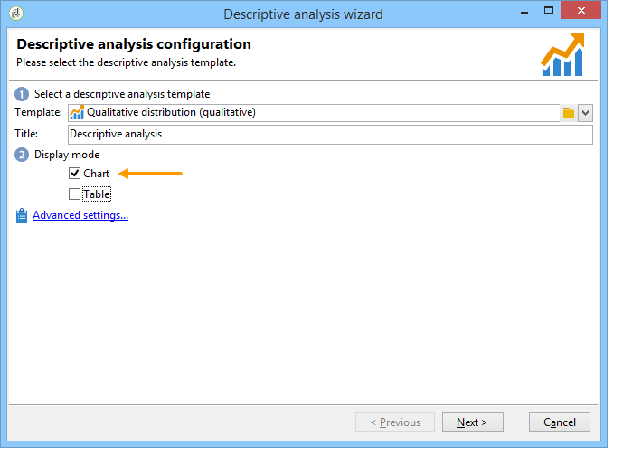

# Casi d’uso{#use-cases}


## Analisi di una popolazione {#analyzing-a-population}

L’esempio seguente consente di esplorare la popolazione di destinazione di un set di newsletter utilizzando la procedura guidata di analisi descrittiva.

Le fasi di implementazione sono descritte in dettaglio di seguito, mentre un elenco completo delle opzioni e delle descrizioni è disponibile nelle altre sezioni di questo capitolo.

### Identificazione della popolazione da analizzare {#identifying-the-population-to-analyze}

In questo esempio, vogliamo esplorare la popolazione target delle consegne incluse nella cartella **Newsletter** .

A questo scopo, seleziona le consegne interessate, quindi fai clic con il pulsante destro del mouse e seleziona **[!UICONTROL Action > Explore the target...]**.


### Selezione di un tipo di analisi {#selecting-a-type-of-analysis}

Nel primo passaggio dell’assistente, puoi selezionare il modello di analisi descrittiva da utilizzare. Per impostazione predefinita, Adobe Campaign offre due modelli: **[!UICONTROL Qualitative distribution]** e **[!UICONTROL Quantitative distribution]**. Per ulteriori informazioni, consulta la sezione [Configurazione del modello di distribuzione qualitativa](../../reporting/using/using-the-descriptive-analysis-wizard.md#configuring-the-qualitative-distribution-template) . I vari rendering sono descritti nella sezione [Informazioni sull&#39;analisi descrittiva](../../reporting/using/about-descriptive-analysis.md) .

Per questo esempio, selezionare il modello **[!UICONTROL Qualitative distribution]** e scegliere una visualizzazione con un grafico e una tabella (matrice). Assegna un nome al rapporto (&quot;Analisi descrittiva&quot;) e fai clic su **[!UICONTROL Next]**.


### Selezione delle variabili da visualizzare {#selecting-the-variables-to-display}

Il passaggio successivo ti consente di selezionare i dati da visualizzare nella tabella.

Fai clic sul collegamento **[!UICONTROL Add...]** per selezionare la variabile contenente i dati da visualizzare. Qui vogliamo visualizzare le città dei destinatari della consegna su una riga:


Nelle colonne viene visualizzato il numero di acquisti per azienda. In questo esempio, gli importi sono aggregati nel campo **Acquisti web** .

In questo caso, vogliamo definire il binding dei risultati per chiarirne la visualizzazione. A questo scopo, seleziona l’opzione di binding **[!UICONTROL Manual]** e imposta le classi di calcolo per i segmenti da visualizzare:


Quindi, fai clic su **[!UICONTROL Ok]** per approvare la configurazione.

Una volta definite le linee e le colonne, è possibile modificarle, spostarle o eliminarle utilizzando la barra degli strumenti.


### Definizione del formato di visualizzazione {#defining-the-display-format}

Il passaggio successivo della procedura guidata consente di selezionare il tipo di grafico che si desidera generare.

In questo caso, scegli l’istogramma.


Le possibili configurazioni delle diverse immagini sono descritte in dettaglio nella sezione [Opzioni grafico a rapporti di analisi](../../reporting/using/processing-a-report.md#analysis-report-chart-options) .

### Configurazione della statistica da calcolare {#configuring-the-statistic-to-calculate}

Quindi specificare i calcoli da applicare ai dati raccolti. Per impostazione predefinita, la procedura guidata di analisi descrittiva esegue un conteggio semplice dei valori.

Questa finestra consente di definire l’elenco delle statistiche da calcolare.


Per creare una nuova statistica, fai clic sul pulsante **[!UICONTROL Add]** . Per ulteriori informazioni, consulta [Calcolo delle statistiche](../../reporting/using/using-the-descriptive-analysis-wizard.md#statistics-calculation).

### Visualizzazione e utilizzo del rapporto {#viewing-and-using-the-report}

Nell’ultimo passaggio della procedura guidata vengono visualizzati la tabella e il grafico.

È possibile memorizzare, esportare o stampare i dati utilizzando la barra degli strumenti sopra la tabella. Per ulteriori informazioni, consulta [Elaborazione di un report](../../reporting/using/processing-a-report.md).


## Analisi qualitativa dei dati {#qualitative-data-analysis}

### Esempio di visualizzazione di un grafico {#example-of-a-chart-display}

**Target**: genera un rapporto di analisi sulla posizione dei potenziali clienti o dei clienti.

1. Apri la procedura guidata di analisi descrittiva e seleziona solo **[!UICONTROL Chart]**.

   

   Fai clic su **[!UICONTROL Next]** per approvare questo passaggio.

1. Quindi seleziona l’opzione **[!UICONTROL 2 variables]** e specifica che il **[!UICONTROL First variable (abscissa)]** farà riferimento allo stato del destinatario (potenziale/cliente) e che la seconda variabile farà riferimento al paese.
1. Seleziona **[!UICONTROL Cylinders]** come tipo.

   

1. Fai clic su **[!UICONTROL Next]** e lascia la statistica predefinita **[!UICONTROL Simple count]**.
1. Fai clic su **[!UICONTROL Next]** per visualizzare il rapporto.

   

   Passa il cursore sopra un bar per vedere il numero esatto di clienti o potenziali clienti per questo paese.

1. Attiva o disattiva la visualizzazione di uno dei paesi in base alla legenda.

   

### Esempio di visualizzazione di una tabella {#example-of-a-table-display}

**Target**: analizzare i domini e-mail aziendali.

1. Apri la procedura guidata di analisi descrittiva e seleziona solo la modalità di visualizzazione **[!UICONTROL Array]** .

   

   Fai clic sul pulsante **[!UICONTROL Next]** per approvare questo passaggio.

1. Seleziona la variabile **[!UICONTROL Company]** come colonna e la variabile **[!UICONTROL Email domain]** come riga.
1. Mantieni l’opzione **[!UICONTROL By rows]** per l’orientamento delle statistiche: il calcolo statistico viene visualizzato a destra della variabile **[!UICONTROL Email domain]** .

   

   Fai clic su **[!UICONTROL Next]** per approvare questo passaggio.

1. Quindi inserisci le statistiche da calcolare: mantieni il conteggio predefinito e crea una nuova statistica. A questo scopo, fai clic su **[!UICONTROL Add]** e seleziona **[!UICONTROL Total percentage distribution]** come operatore.

   

1. Immetti un’etichetta per la statistica in modo che non ci sia un campo vuoto quando viene visualizzato il rapporto.

   

1. Fai clic su **[!UICONTROL Next]** per visualizzare il rapporto.

   

1. Una volta generato il rapporto di analisi, puoi adattare lo schermo in base alle tue esigenze senza modificare la configurazione. Ad esempio, puoi cambiare gli assi: fare clic con il pulsante destro del mouse sui nomi di dominio e selezionare **[!UICONTROL Turn]** dal menu di scelta rapida.

   

   Nella tabella vengono visualizzate le informazioni come segue:

   

## Analisi quantitativa dei dati {#quantitative-data-analysis}

**Target**: generare un rapporto di analisi quantitativa sull’età del destinatario

1. Apri la procedura guidata di analisi descrittiva e seleziona **[!UICONTROL Quantitative distribution]** dall’elenco a discesa.

   

   Fai clic sul pulsante **[!UICONTROL Next]** per approvare questo passaggio.

1. Seleziona la variabile **[!UICONTROL Age]** e immetti la relativa etichetta. Specifica se si tratta di un numero intero, quindi fai clic su **[!UICONTROL Next]**.

   

1. Eliminare le statistiche **[!UICONTROL Deciles]**, **[!UICONTROL Distribution]** e **[!UICONTROL Sum]**: non sono necessarie qui.

   

1. Fai clic su **[!UICONTROL Next]** per visualizzare il rapporto.

   

## Analisi di una destinazione di transizione in un flusso di lavoro {#analyzing-a-transition-target-in-a-workflow}

**Target**: per generare rapporti sulla popolazione di un flusso di lavoro di targeting

1. Apri il flusso di lavoro di targeting desiderato.
1. Fai clic con il pulsante destro del mouse su una transizione che punta alla tabella dei destinatari.
1. Seleziona **[!UICONTROL Analyze target]** nel menu a discesa per aprire la finestra di analisi descrittiva.

   

1. A questo punto puoi selezionare l’opzione **[!UICONTROL Existing analyses and reports]** e utilizzare i rapporti creati in precedenza (consulta [Riutilizzo di rapporti e analisi esistenti](../../reporting/using/processing-a-report.md#re-using-existing-reports-and-analyses)) oppure creare una nuova analisi descrittiva. A questo scopo, lascia selezionata l’opzione **[!UICONTROL New descriptive analysis from a template]** per impostazione predefinita.

   Il resto della configurazione è lo stesso di tutte le analisi descrittive.

### Raccomandazioni per l’analisi di Target {#target-analyze-recommendations}

L’analisi di una popolazione in un flusso di lavoro richiede che la popolazione sia ancora presente nella transizione. Se il flusso di lavoro viene avviato, il risultato relativo alla popolazione potrebbe essere eliminato dalla transizione. Per eseguire un’analisi, puoi effettuare le seguenti operazioni:

* Stacca la transizione dalla relativa attività di destinazione e avvia il flusso di lavoro per renderla attiva. Una volta che la transizione inizia a lampeggiare, avvia la procedura guidata nel modo consueto.

   

* Modifica le proprietà del flusso di lavoro selezionando l’opzione **[!UICONTROL Keep the result of interim populations between two executions]** . Questo consente di avviare un’analisi della transizione scelta, anche se il flusso di lavoro è terminato.

   

   Se la popolazione è stata eliminata dalla transizione, un messaggio di errore ti chiede di selezionare l’opzione interessata prima di avviare la procedura guidata di analisi descrittiva.

   

>[!CAUTION]
>
>L’opzione **[!UICONTROL Keep the result of interim populations between two executions]** deve essere utilizzata solo nelle fasi di sviluppo, ma non per un ambiente in produzione.\
>Le popolazioni intermedie vengono automaticamente eliminate una volta raggiunto il termine di conservazione. Questa scadenza è specificata nella scheda delle proprietà del flusso di lavoro **[!UICONTROL Execution]** .

## Analisi dei registri di tracciamento dei destinatari {#analyzing-recipient-tracking-logs}

La procedura guidata di analisi descrittiva può generare rapporti su altre tabelle di lavoro. Questo significa che puoi analizzare i registri di consegna creando un rapporto dedicato.

In questo esempio, vogliamo analizzare il tasso di reattività dei destinatari di una newsletter.

A questo scopo, esegui i seguenti passaggi:

1. Apri la procedura guidata di analisi descrittiva dal menu **[!UICONTROL Tools > Descriptive analysis]** e modifica la tabella di lavoro predefinita. Seleziona **[!UICONTROL Recipient tracking log]** e aggiungi un filtro per escludere le bozze e includere le newsletter.

   

   Seleziona una visualizzazione della tabella e fai clic su **[!UICONTROL Next]**.

1. Nella finestra successiva, specifica che l’analisi riguarda le consegne.

   

   In questo caso, le etichette di consegna verranno visualizzate nella prima colonna.

1. Elimina il conteggio predefinito e crea tre statistiche per configurare le statistiche da visualizzare nella tabella.

   Qui, per ogni newsletter, la tabella mostra: il numero di aperture, il numero di clic e il tasso di reattività (in percentuale).

1. Aggiungi una statistica per il conteggio del numero di clic: definisci il filtro appropriato nella scheda **[!UICONTROL Filter]** .

   

1. Quindi fai clic sulla scheda **[!UICONTROL General]** per rinominare l’etichetta e l’alias delle statistiche:

   

1. Aggiungi una seconda statistica per il conteggio del numero di aperture:

   

1. Quindi fai clic sulla scheda **[!UICONTROL General]** per rinominare l’etichetta delle statistiche e il relativo alias:

   

1. Aggiungi la terza statistica e seleziona l’operatore **[!UICONTROL Calculated field]** per misurare il tasso di reattività.

   

   Vai al campo **[!UICONTROL User function]** e immetti la seguente formula:

   ```
   @clic / @open * 100
   ```

   Adatta l’etichetta delle statistiche come mostrato di seguito:

   

   Infine, specifica se i valori sono visualizzati come percentuale: a questo scopo, deseleziona l’opzione **[!UICONTROL Default formatting]** nella scheda **[!UICONTROL Advanced]** e seleziona **[!UICONTROL Percentage]** senza un separatore decimale.

   

1. Fai clic su **[!UICONTROL Next]** per visualizzare il rapporto.

   

## Analisi dei registri di esclusione della consegna {#analyzing-delivery-exclusion-logs}

Se l’analisi riguarda una consegna, puoi analizzare la popolazione esclusa. A questo scopo, seleziona le consegne da analizzare e fai clic con il pulsante destro del mouse per accedere al menu **[!UICONTROL Action > Explore exclusions]** .


Viene visualizzata la procedura guidata di analisi descrittiva e l’analisi riguarda i registri di esclusione dei destinatari.

Ad esempio, puoi visualizzare i domini di tutti gli indirizzi esclusi e ordinarli per data di esclusione.


Questo genererebbe il seguente tipo di rapporto:


