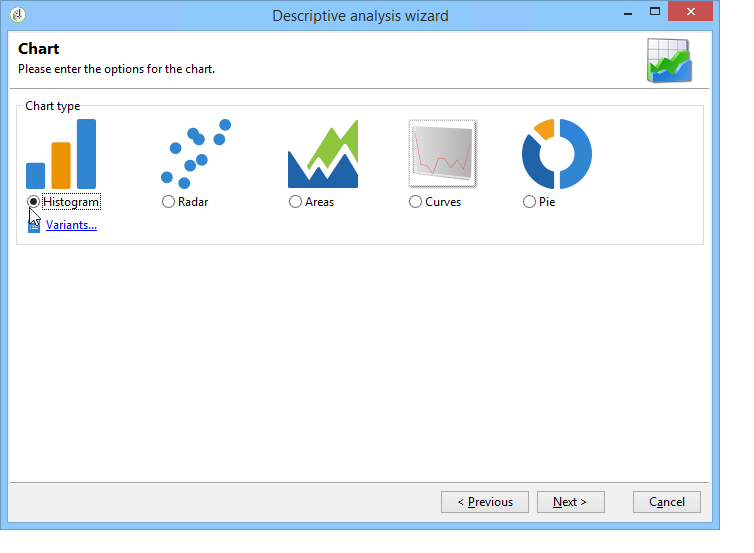
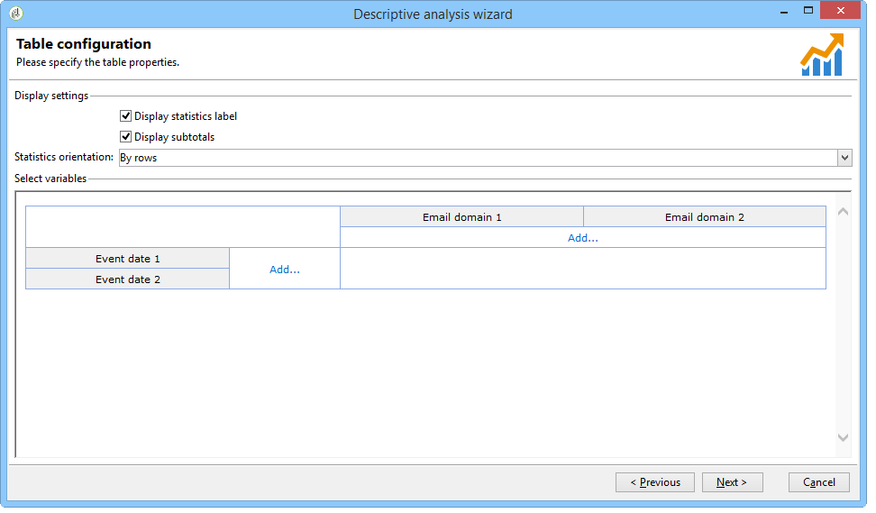

# Casi d’uso{#use-cases}

## Analisi di una popolazione {#analyzing-a-population}

Nell&#39;esempio seguente è possibile esaminare la popolazione di destinazione di un set di newsletter utilizzando la procedura guidata di analisi descrittiva.

Le fasi di implementazione sono descritte di seguito, mentre un elenco esaustivo di opzioni e descrizioni è disponibile nelle altre sezioni di questo capitolo.

### Identificazione della popolazione da analizzare {#identifying-the-population-to-analyze}

In questo esempio, vogliamo esplorare la popolazione di destinazione delle consegne incluse nella cartella **Newsletters** .

A tal fine, selezionare le consegne interessate, quindi fare clic con il pulsante destro del mouse e selezionare **[!UICONTROL Action > Explore the target...]**.


### Selezione di un tipo di analisi {#selecting-a-type-of-analysis}

Nel primo passaggio dell&#39;assistente, potete selezionare il modello di analisi descrittiva da utilizzare. Per impostazione predefinita,  Adobe Campaign offre due modelli: **[!UICONTROL Qualitative distribution]** e **[!UICONTROL Quantitative distribution]**. For more on this refer to the [Configuring the qualitative distribution template](../../reporting/using/using-the-descriptive-analysis-wizard.md#configuring-the-qualitative-distribution-template) section. I vari rendering sono presentati nella sezione [Informazioni sull&#39;analisi](../../reporting/using/about-descriptive-analysis.md) descrittiva.

Per questo esempio, selezionate il **[!UICONTROL Qualitative distribution]** modello e scegliete una visualizzazione con un grafico e una tabella (array). Assegna al rapporto un nome (&quot;Analisi descrittiva&quot;) e fai clic su **[!UICONTROL Next]**.


### Selezione delle variabili da visualizzare {#selecting-the-variables-to-display}

Il passaggio successivo consente di selezionare i dati da visualizzare nella tabella.

Fare clic sul **[!UICONTROL Add...]** collegamento per selezionare la variabile che contiene i dati da visualizzare. Qui vogliamo visualizzare le città dei nostri destinatari della consegna su una sola riga:


Le colonne visualizzeranno il numero di acquisti per società. In questo esempio, gli importi sono aggregati nel campo **Acquisti** Web.

Qui, vogliamo definire il binning dei risultati per chiarirne la visualizzazione. A tal fine, selezionare l&#39;opzione di **[!UICONTROL Manual]** binding e impostare le classi di calcolo per i segmenti da visualizzare:


Quindi, fate clic **[!UICONTROL Ok]** per approvare la configurazione.

Una volta definite le righe e le colonne, è possibile modificarle, spostarle o eliminarle utilizzando la barra degli strumenti.


### Definizione del formato di visualizzazione {#defining-the-display-format}

Il passaggio successivo della procedura guidata consente di selezionare il tipo di grafico da generare.

In questo caso, scegliete l’istogramma.



Le possibili configurazioni dei diversi elementi grafici sono descritte dettagliatamente nella sezione Opzioni [del grafico del rapporto di](../../reporting/using/processing-a-report.md#analysis-report-chart-options) analisi.

### Configurazione della statistica da calcolare {#configuring-the-statistic-to-calculate}

Specificare quindi i calcoli da applicare ai dati raccolti. Per impostazione predefinita, la procedura guidata di analisi descrittiva effettua un semplice conteggio dei valori.

Questa finestra consente di definire l&#39;elenco delle statistiche da calcolare.


Per creare una nuova statistica, fate clic sul **[!UICONTROL Add]** pulsante. For more on this, refer to [Statistics calculation](../../reporting/using/using-the-descriptive-analysis-wizard.md#statistics-calculation).

### Visualizzazione e utilizzo del rapporto {#viewing-and-using-the-report}

Nell&#39;ultimo passaggio della procedura guidata vengono visualizzati la tabella e il grafico.

È possibile memorizzare, esportare o stampare i dati utilizzando la barra degli strumenti sopra la tabella. Per ulteriori informazioni, vedere [Elaborazione di un rapporto](../../reporting/using/processing-a-report.md).


## Analisi qualitativa dei dati {#qualitative-data-analysis}

### Esempio di visualizzazione di un grafico {#example-of-a-chart-display}

**Target**: genera un rapporto di analisi sulla posizione dei potenziali clienti o dei clienti.

1. Aprite la procedura guidata di analisi descrittiva e selezionate **[!UICONTROL Chart]** solo.

   

   Fate clic **[!UICONTROL Next]** per approvare questo passaggio.

1. Selezionate quindi l’ **[!UICONTROL 2 variables]** opzione e specificate che **[!UICONTROL First variable (abscissa)]** farà riferimento allo stato del destinatario (clienti potenziali) e che la seconda variabile faccia riferimento al paese.
1. Selezionare **[!UICONTROL Cylinders]** come tipo.

   

1. Fate clic **[!UICONTROL Next]** e lasciate la **[!UICONTROL Simple count]** statistica predefinita.
1. Fate clic **[!UICONTROL Next]** per visualizzare il rapporto.

   

   Passa il cursore del mouse su una barra per vedere il numero esatto di clienti o potenziali clienti per questo paese.

1. Abilitare o disabilitare la visualizzazione di uno dei paesi in base alla legenda.

   

### Esempio di visualizzazione di una tabella {#example-of-a-table-display}

**Target**: analizza i domini e-mail della società.

1. Aprite la procedura guidata di analisi descrittiva e selezionate solo la modalità di **[!UICONTROL Array]** visualizzazione.

   

   Fate clic sul **[!UICONTROL Next]** pulsante per approvare questo passaggio.

1. Selezionare la **[!UICONTROL Company]** variabile come colonna e la **[!UICONTROL Email domain]** variabile come riga.
1. Mantenere l&#39; **[!UICONTROL By rows]** opzione per l&#39;orientamento delle statistiche: il calcolo statistico viene visualizzato a destra della **[!UICONTROL Email domain]** variabile.

   

   Fate clic **[!UICONTROL Next]** per approvare questo passaggio.

1. Inserire quindi le statistiche da calcolare: mantenete il conteggio predefinito e create una nuova statistica. A questo scopo, fare clic **[!UICONTROL Add]** e selezionare **[!UICONTROL Total percentage distribution]** come operatore.

   

1. Immettete un&#39;etichetta per la statistica in modo che non vi sia un campo vuoto quando viene visualizzato il rapporto.

   

1. Fate clic **[!UICONTROL Next]** per visualizzare il rapporto.

   

1. Una volta generato il rapporto di analisi, potete adattare lo schermo in base alle vostre esigenze senza modificare la configurazione. Ad esempio, è possibile cambiare gli assi: fare clic con il pulsante destro del mouse sui nomi di dominio e selezionare **[!UICONTROL Turn]** il menu di scelta rapida.

   

   Nella tabella sono visualizzate le informazioni come segue:

   

## Analisi quantitativa dei dati {#quantitative-data-analysis}

**Target**: per generare un rapporto di analisi quantitativa sull&#39;età del destinatario

1. Aprite la procedura guidata di analisi descrittiva e selezionate **[!UICONTROL Quantitative distribution]** dall’elenco a discesa.

   

   Fate clic sul **[!UICONTROL Next]** pulsante per approvare questo passaggio.

1. Selezionate la **[!UICONTROL Age]** variabile e immettete la relativa etichetta. Specificate se si tratta di un numero intero o meno, quindi fate clic **[!UICONTROL Next]**.

   

1. Eliminate le **[!UICONTROL Deciles]**, **[!UICONTROL Distribution]** e **[!UICONTROL Sum]** le statistiche: non sono necessari qui.

   

1. Fate clic **[!UICONTROL Next]** per visualizzare il rapporto.

   

## Analisi di una destinazione di transizione in un flusso di lavoro {#analyzing-a-transition-target-in-a-workflow}

**Target**: per generare rapporti sulla popolazione di un flusso di lavoro di targeting

1. Aprite il flusso di lavoro di targeting desiderato.
1. Fare clic con il pulsante destro del mouse su una transizione che punta alla tabella dei destinatari.
1. Selezionate **[!UICONTROL Analyze target]** nel menu a discesa per aprire la finestra di analisi descrittiva.

   

1. A questo punto potete selezionare l&#39; **[!UICONTROL Existing analyses and reports]** opzione e utilizzare i rapporti creati in precedenza (consultate [Riutilizzare i rapporti e le analisi](../../reporting/using/processing-a-report.md#re-using-existing-reports-and-analyses)esistenti) oppure creare una nuova analisi descrittiva. Per eseguire questa operazione, lasciare l&#39; **[!UICONTROL New descriptive analysis from a template]** opzione selezionata per impostazione predefinita.

   Il resto della configurazione è lo stesso di tutte le analisi descrittive.

### Eseguire l&#39;analisi delle raccomandazioni {#target-analyze-recommendations}

L&#39;analisi di una popolazione in un flusso di lavoro richiede che la popolazione rimanga presente nella transizione. Se il flusso di lavoro viene avviato, il risultato relativo alla popolazione potrebbe essere eliminato dalla transizione. Per eseguire un&#39;analisi, potete:

* Scollegare la transizione dall&#39;attività di destinazione e avviare il flusso di lavoro per renderla attiva. Una volta avviata la transizione, avviate la procedura guidata nel modo usuale.

   

* Modificate le proprietà del flusso di lavoro selezionando l&#39; **[!UICONTROL Keep the result of interim populations between two executions]** opzione. Questo consente di avviare un’analisi della transizione scelta, anche se il flusso di lavoro è terminato.

   

   Se la popolazione è stata eliminata dalla transizione, un messaggio di errore richiede di selezionare l&#39;opzione interessata prima di avviare la procedura guidata di analisi descrittiva.

   

>[!CAUTION]
>
>L&#39; **[!UICONTROL Keep the result of interim populations between two executions]** opzione deve essere utilizzata solo nelle fasi di sviluppo, ma mai per un ambiente di produzione.\
>Le popolazioni intermedie vengono automaticamente eliminate una volta raggiunto il termine di conservazione. Tale scadenza è specificata nella **[!UICONTROL Execution]** scheda delle proprietà del flusso di lavoro.

## Analisi dei registri di tracciamento dei destinatari {#analyzing-recipient-tracking-logs}

La procedura guidata di analisi descrittiva può generare rapporti su altre tabelle di lavoro. Questo significa che puoi analizzare i registri di consegna creando un rapporto dedicato.

In questo esempio, vogliamo analizzare il tasso di reattività dei destinatari della newsletter.

A questo scopo, eseguire i seguenti passaggi:

1. Aprire la procedura guidata di analisi descrittiva dal **[!UICONTROL Tools > Descriptive analysis]** menu e modificare la tabella di lavoro predefinita. Selezionate **[!UICONTROL Recipient tracking log]** e aggiungete un filtro per escludere le prove di stampa e includere le newsletter.

   

   Selezionare una visualizzazione di tabella e fare clic su **[!UICONTROL Next]**.

1. Nella finestra successiva, specificare che l&#39;analisi riguarda le consegne.

   

   Qui, le etichette di consegna verranno visualizzate nella prima colonna.

1. Eliminate il conteggio predefinito e create tre statistiche per configurare le statistiche da visualizzare nella tabella.

   Qui, per ogni newsletter, la tabella mostrerà: il numero di aperture, il numero di clic, il tasso di reattività (in percentuale).

1. Aggiungete una statistica per il conteggio del numero di clic: definire il filtro appropriato nella **[!UICONTROL Filter]** scheda.

   

1. Fate clic sulla **[!UICONTROL General]** scheda per rinominare l&#39;etichetta e l&#39;alias delle statistiche:

   

1. Aggiungete una seconda statistica per conteggiare il numero di aperture:

   

1. Fate clic sulla **[!UICONTROL General]** scheda per rinominare l&#39;etichetta delle statistiche e il relativo alias:

   

1. Aggiungete la terza statistica e selezionate l&#39; **[!UICONTROL Calculated field]** operatore per misurare il tasso di reattività.

   

   Passare al **[!UICONTROL User function]** campo e immettere la formula seguente:

   ```
   @clic / @open * 100
   ```

   Adattare l&#39;etichetta delle statistiche come illustrato di seguito:

   

   Infine, specificate se i valori sono visualizzati come percentuale: per eseguire questa operazione, deselezionare l&#39; **[!UICONTROL Default formatting]** opzione nella **[!UICONTROL Advanced]** scheda e selezionare **[!UICONTROL Percentage]** senza un separatore decimale.

   

1. Fate clic **[!UICONTROL Next]** per visualizzare il rapporto.

   

## Analisi dei registri di esclusione della distribuzione {#analyzing-delivery-exclusion-logs}

Se l&#39;analisi riguarda una consegna, potete analizzare la popolazione esclusa. A tal fine, selezionate le consegne da analizzare e fate clic con il pulsante destro del mouse per accedere al **[!UICONTROL Action > Explore exclusions]** menu.


Questo ti porterà alla procedura guidata di analisi descrittiva e l&#39;analisi riguarderà i log di esclusione dei destinatari.

Ad esempio, puoi visualizzare i domini di tutti gli indirizzi esclusi e ordinarli per data di esclusione.



Questo genererebbe il seguente tipo di rapporto:


