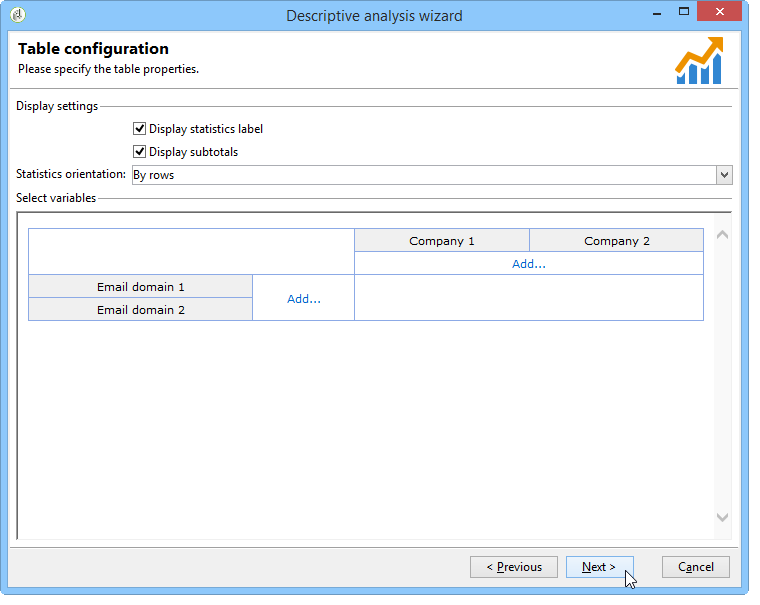

# Casi d’uso{#use-cases}


## Analisi di una popolazione {#analyzing-a-population}

L’esempio seguente consente di esplorare la popolazione target di un set di newsletter utilizzando la procedura guidata di analisi descrittiva.

I passaggi di implementazione sono descritti di seguito, mentre un elenco completo delle opzioni e delle descrizioni è disponibile nelle altre sezioni di questo capitolo.

### Identificazione della popolazione da analizzare {#identifying-the-population-to-analyze}

In questo esempio, vogliamo esplorare la popolazione target delle consegne incluse nel **Newsletter** cartella.

A questo scopo, seleziona le consegne interessate, quindi fai clic con il pulsante destro del mouse e seleziona **[!UICONTROL Action > Explore the target...]**.


### Selezione di un tipo di analisi {#selecting-a-type-of-analysis}

Nel primo passaggio dell’assistente, puoi selezionare il modello di analisi descrittivo da utilizzare. Per impostazione predefinita, Adobe Campaign offre due modelli: **[!UICONTROL Qualitative distribution]** e **[!UICONTROL Quantitative distribution]**. Per ulteriori informazioni, consulta [Configurazione del modello di distribuzione qualitativa](../../reporting/using/using-the-descriptive-analysis-wizard.md#configuring-the-qualitative-distribution-template) sezione. I vari rendering vengono presentati nel [Informazioni sull’analisi descrittiva](../../reporting/using/about-descriptive-analysis.md) sezione.

Per questo esempio, seleziona la **[!UICONTROL Qualitative distribution]** e scegliere una visualizzazione con un grafico e una tabella (matrice). Assegna un nome al rapporto (&quot;Analisi descrittiva&quot;) e fai clic su **[!UICONTROL Next]**.


### Selezione delle variabili da visualizzare {#selecting-the-variables-to-display}

Il passaggio successivo consente di selezionare i dati da visualizzare nella tabella.

Fai clic su **[!UICONTROL Add...]** per selezionare la variabile contenente i dati da visualizzare. Qui vogliamo visualizzare le città dei destinatari della consegna su una riga:


Nelle colonne viene visualizzato il numero di acquisti per azienda. In questo esempio, gli importi vengono aggregati nel **Acquisti web** campo.

In questo caso, vogliamo definire il binning dei risultati per chiarirne la visualizzazione. A questo scopo, seleziona la **[!UICONTROL Manual]** opzione di binning e impostazione delle classi di calcolo per i segmenti da visualizzare:


Quindi, fai clic su **[!UICONTROL Ok]** per approvare la configurazione.

Una volta definite le linee e le colonne, potete modificarle, spostarle o eliminarle utilizzando la barra degli strumenti.


### Definizione del formato di visualizzazione {#defining-the-display-format}

Il passaggio successivo della procedura guidata consente di selezionare il tipo di grafico che si desidera generare.

In questo caso, scegli l’istogramma.


Le possibili configurazioni delle diverse immagini sono descritte in dettaglio nella [Opzioni del grafico del rapporto di analisi](../../reporting/using/processing-a-report.md#analysis-report-chart-options) sezione.

### Configurazione della statistica per il calcolo {#configuring-the-statistic-to-calculate}

Specificare quindi i calcoli da applicare ai dati raccolti. Per impostazione predefinita, la procedura guidata di analisi descrittiva esegue un conteggio semplice dei valori.

Questa finestra consente di definire l’elenco delle statistiche da calcolare.


Per creare una nuova statistica, fare clic su **[!UICONTROL Add]** pulsante. Per ulteriori informazioni, consulta [Calcolo delle statistiche](../../reporting/using/using-the-descriptive-analysis-wizard.md#statistics-calculation).

### Visualizzazione e utilizzo del report {#viewing-and-using-the-report}

Nell&#39;ultimo passaggio della procedura guidata vengono visualizzati la tabella e il grafico.

È possibile archiviare, esportare o stampare dati utilizzando la barra degli strumenti sopra la tabella. Per ulteriori informazioni, consulta [Elaborazione di un rapporto](../../reporting/using/processing-a-report.md).


## Analisi qualitativa dei dati {#qualitative-data-analysis}

### Esempio di visualizzazione di un grafico {#example-of-a-chart-display}

**Target**: genera un rapporto di analisi sulla posizione di potenziali clienti o clienti.

1. Apri la procedura guidata di analisi descrittiva e seleziona **[!UICONTROL Chart]** solo.

   

   Clic **[!UICONTROL Next]** per approvare questo passaggio.

1. Quindi seleziona la **[!UICONTROL 2 variables]** e specificare che il **[!UICONTROL First variable (abscissa)]** si riferisce allo stato del destinatario (potenziali clienti) e la seconda variabile al paese.
1. Seleziona **[!UICONTROL Cylinders]** come tipo.

   

1. Clic **[!UICONTROL Next]** e lascia il valore predefinito **[!UICONTROL Simple count]** statistica.
1. Clic **[!UICONTROL Next]** per visualizzare il rapporto.

   

   Passa il cursore sopra un bar per vedere il numero esatto di clienti o potenziali per questo paese.

1. Attiva o disattiva la visualizzazione di uno dei paesi in base alla legenda.

   

### Esempio di visualizzazione di tabella {#example-of-a-table-display}

**Target**: analizza i domini e-mail dell’azienda.

1. Apri la procedura guidata di analisi descrittiva e seleziona la **[!UICONTROL Array]** solo modalità di visualizzazione.

   

   Fai clic su **[!UICONTROL Next]** per approvare questo passaggio.

1. Seleziona la **[!UICONTROL Company]** variabile come colonna e **[!UICONTROL Email domain]** variabile come riga.
1. Mantieni **[!UICONTROL By rows]** opzione per l&#39;orientamento delle statistiche: il calcolo delle statistiche viene visualizzato a destra della **[!UICONTROL Email domain]** variabile.

   

   Clic **[!UICONTROL Next]** per approvare questo passaggio.

1. Quindi inserisci le statistiche da calcolare: mantieni il conteggio predefinito e crea una nuova statistica. A questo scopo, fai clic su **[!UICONTROL Add]** e seleziona **[!UICONTROL Total percentage distribution]** come operatore.

   

1. Immettere un&#39;etichetta per la statistica in modo che non venga visualizzato un campo vuoto quando viene visualizzato il rapporto.

   

1. Clic **[!UICONTROL Next]** per visualizzare il rapporto.

   

1. Una volta generato il rapporto di analisi, puoi adattare la visualizzazione in base alle tue esigenze senza modificare la configurazione. Ad esempio, puoi cambiare l’asse: fai clic con il pulsante destro del mouse sui nomi di dominio e seleziona (Cambia asse) **[!UICONTROL Turn]** nel menu di scelta rapida.

   

   Nella tabella vengono visualizzate le informazioni riportate di seguito.

   

## Analisi dei dati quantitativi {#quantitative-data-analysis}

**Target**: per generare un rapporto di analisi quantitativa sull’età del destinatario

1. Apri la procedura guidata di analisi descrittiva e seleziona **[!UICONTROL Quantitative distribution]** dall’elenco a discesa.

   

   Fai clic su **[!UICONTROL Next]** per approvare questo passaggio.

1. Seleziona la **[!UICONTROL Age]** e immetti la relativa etichetta. Specifica se si tratta di un numero intero, quindi fai clic su **[!UICONTROL Next]**.

   

1. Elimina **[!UICONTROL Deciles]**, **[!UICONTROL Distribution]** e **[!UICONTROL Sum]** statistiche: qui non servono.

   

1. Clic **[!UICONTROL Next]** per visualizzare il rapporto.

   

## Analisi di un target di transizione in un flusso di lavoro {#analyzing-a-transition-target-in-a-workflow}

**Target**: per generare rapporti sulla popolazione di un flusso di lavoro di targeting

1. Apri il flusso di lavoro di targeting desiderato.
1. Fare clic con il pulsante destro del mouse su una transizione che punta alla tabella dei destinatari.
1. Seleziona **[!UICONTROL Analyze target]** nel menu a discesa per aprire la finestra analisi descrittiva.

   

1. A questo punto è possibile selezionare **[!UICONTROL Existing analyses and reports]** e utilizzare i rapporti creati in precedenza (fare riferimento a [Riutilizzo di report e analisi esistenti](../../reporting/using/processing-a-report.md#re-using-existing-reports-and-analyses)) o crea una nuova analisi descrittiva. Per eseguire questa operazione, lasciare **[!UICONTROL New descriptive analysis from a template]** opzione selezionata per impostazione predefinita.

   Il resto della configurazione è lo stesso di tutte le analisi descrittive.

### Consigli per l’analisi di Target {#target-analyze-recommendations}

L’analisi di una popolazione in un flusso di lavoro richiede che la popolazione sia ancora presente nella transizione. Se il flusso di lavoro viene avviato, il risultato relativo alla popolazione potrebbe essere eliminato dalla transizione. Per eseguire un&#39;analisi, potete effettuare le seguenti operazioni:

* Stacca la transizione dalla sua attività di destinazione e avvia il flusso di lavoro per renderla attiva. Una volta che la transizione inizia a lampeggiare, avvia la procedura guidata nel modo consueto.

  

* Modifica le proprietà del flusso di lavoro selezionando la **[!UICONTROL Keep the result of interim populations between two executions]** opzione. Questo consente di avviare un’analisi della transizione scelta, anche se il flusso di lavoro è stato completato.

  

  Se la popolazione è stata eliminata dalla transizione, un messaggio di errore richiede di selezionare l’opzione interessata prima di avviare la procedura guidata di analisi descrittiva.

  

>[!CAUTION]
>
>Il **[!UICONTROL Keep the result of interim populations between two executions]** L’opzione deve essere utilizzata solo nelle fasi di sviluppo, ma mai per un ambiente in produzione.\
>Le popolazioni provvisorie vengono eliminate automaticamente una volta raggiunto il relativo termine di conservazione. Questa scadenza è specificata nelle proprietà del flusso di lavoro **[!UICONTROL Execution]** scheda.

## Analisi dei registri di tracciamento dei destinatari {#analyzing-recipient-tracking-logs}

La procedura guidata di analisi descrittiva può generare rapporti su altre tabelle di lavoro. Ciò significa che puoi analizzare i registri di consegna creando un rapporto dedicato.

In questo esempio, vogliamo analizzare il tasso di reattività dei destinatari di una newsletter.

A questo scopo, esegui i seguenti passaggi:

1. Apri la procedura guidata di analisi descrittiva tramite **[!UICONTROL Tools > Descriptive analysis]** e modificare la tabella di lavoro predefinita. Seleziona **[!UICONTROL Recipient tracking log]** e aggiungi un filtro per escludere Proofs (Bozze) e includere newsletter.

   

   Seleziona una visualizzazione per tabella e fai clic su **[!UICONTROL Next]**.

1. Nella finestra successiva, specifica che l’analisi riguarda le consegne.

   

   In questo caso, le etichette di consegna vengono visualizzate nella prima colonna.

1. Elimina il conteggio predefinito e crea tre statistiche per configurare le statistiche da visualizzare nella tabella.

   Qui, per ogni newsletter, la tabella mostra: il numero di aperture, il numero di clic, il tasso di reattività (in percentuale).

1. Aggiungi una statistica per il conteggio del numero di clic: definisci il filtro pertinente nella **[!UICONTROL Filter]** scheda.

   

1. Quindi fai clic su **[!UICONTROL General]** scheda per rinominare l&#39;etichetta e l&#39;alias delle statistiche:

   

1. Aggiungi una seconda statistica per il conteggio del numero di aperture:

   

1. Quindi fai clic su **[!UICONTROL General]** per rinominare l&#39;etichetta delle statistiche e il relativo alias:

   

1. Aggiungi la terza statistica e seleziona la **[!UICONTROL Calculated field]** per misurare il tasso di reattività.

   

   Vai a **[!UICONTROL User function]** e immettere la formula seguente:

   ```
   @clic / @open * 100
   ```

   Adattare l&#39;etichetta delle statistiche come illustrato di seguito:

   

   Infine, specifica se i valori vengono visualizzati come percentuale: a questo scopo, deseleziona la casella di controllo **[!UICONTROL Default formatting]** opzione in **[!UICONTROL Advanced]** e seleziona **[!UICONTROL Percentage]** senza virgola decimale.

   

1. Clic **[!UICONTROL Next]** per visualizzare il rapporto.

   

## Analisi dei registri di esclusione della consegna {#analyzing-delivery-exclusion-logs}

Se l’analisi riguarda una consegna, puoi analizzare la popolazione esclusa. A questo scopo, seleziona le consegne da analizzare e fai clic con il pulsante destro del mouse per accedere alla **[!UICONTROL Action > Explore exclusions]** menu.


Verrà visualizzata la procedura guidata di analisi descrittiva e l’analisi riguarderà i registri di esclusione dei destinatari.

Ad esempio, puoi visualizzare i domini di tutti gli indirizzi esclusi e ordinarli per data di esclusione.


Questo comporterebbe il seguente tipo di rapporto:


