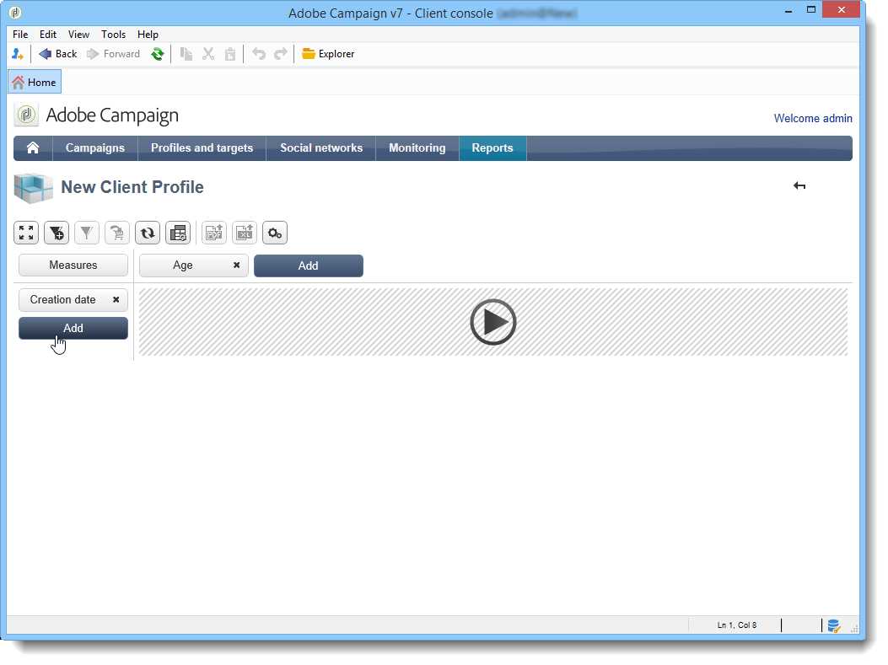

# Usare i cubi per esplorare i dati{#using-cubes-to-explore-data}

Marketing Analytics semplifica la creazione di rapporti e l’identificazione e la selezione dei dati dal database tramite cubi. Questo consente di:

* Crea rapporti basati su cubi. Il processo è descritto qui: [Esplorare i dati in un rapporto](#exploring-the-data-in-a-report).
* Raccogli i dati nel database e raggruppali in elenchi, ad esempio per identificare e creare destinazioni e consegne. Per ulteriori informazioni, consulta [Creare una popolazione target](#building-a-target-population).
* Inserire una tabella pivot in un report, fare riferimento a un cubo esistente al suo interno. Per ulteriori informazioni, consulta [Inserire una tabella pivot in un report](#inserting-a-pivot-table-into-a-report).

>[!NOTE]
>
>Per creare o modificare i cubi è necessario disporre di analisi di marketing. Per ulteriori informazioni, consulta [Informazioni sui cubi](../../reporting/using/ac-cubes.md).

## Esplorare i dati in un rapporto {#exploring-the-data-in-a-report}

### Passaggio 1: creare un rapporto basato su un cubo {#step-1---creating-a-report-based-on-a-cube}

Per creare un report basato su un cubo, fare clic sul pulsante **[!UICONTROL Create]** pulsante in **[!UICONTROL Reports]** e selezionare il cubo che si desidera utilizzare.

Il processo è descritto qui: [Creare un rapporto basato su un cubo](../../reporting/using/creating-indicators.md#creating-a-report-based-on-a-cube).

### Passaggio 2: selezionare righe e colonne {#step-2---selecting-lines-and-columns}

La visualizzazione predefinita mostra le prime due dimensioni del cubo (età e città, in questo caso).

Il **[!UICONTROL Add]** su ciascun asse consente di aggiungere dimensioni.

1. Selezionate le quote da visualizzare nelle linee e nelle colonne della tabella. A questo scopo, trascina e rilascia le dimensioni disponibili come mostrato di seguito:
1. Seleziona dall’elenco le dimensioni da aggiungere alla tabella:

   

1. Selezionate quindi i parametri di questa quota.

   

   I parametri dipendono dal tipo di dati della dimensione selezionata.

   Ad esempio, per le date, possono essere disponibili diversi livelli. Per ulteriori informazioni, consulta [Visualizza misure](../../reporting/using/concepts-and-methodology.md#displaying-measures).

   In questo caso sono disponibili le seguenti opzioni:

   

   Puoi effettuare le seguenti operazioni:

   * Espandi dati durante il caricamento: i valori vengono visualizzati per impostazione predefinita a ogni aggiornamento del rapporto (valore predefinito: no).
   * Visualizzare il totale alla fine della riga: quando i dati vengono visualizzati in colonne, un’opzione aggiuntiva consente di visualizzare il totale alla fine della riga: viene aggiunta una colonna alla tabella (valore predefinito: yes).
   * Applica un ordinamento: i valori della colonna possono essere ordinati in base al valore, all’etichetta o a una misura (valore predefinito: per valore).
   * Visualizza i valori in ordine crescente (a-z, 0-9) o decrescente (z-a, 9-0).
   * Modifica il numero di colonne da visualizzare al caricamento (per impostazione predefinita: 200).

1. Clic **[!UICONTROL Ok]** per confermare: la dimensione viene aggiunta alle dimensioni esistenti.

   Il banner giallo sopra la tabella mostra che hai apportato modifiche: fai clic sul pulsante **[!UICONTROL Save]** per salvarli.

   

### Passaggio 3: configurare le misure da visualizzare {#step-3---configuring-the-measures-to-display}

Una volta posizionate le linee e le colonne, indicare le misure da visualizzare e la relativa modalità di visualizzazione.

Per impostazione predefinita, viene visualizzata una sola misura. Per aggiungere o configurare le misure:

1. Fai clic sul pulsante **[!UICONTROL Measures]**.

   

1. Il **[!UICONTROL Use a measure]** consente di selezionare una delle misure esistenti.

   

   Selezionare le informazioni da visualizzare e il tipo di formattazione. L’elenco delle opzioni dipende dal tipo di misura configurato.

   

   La configurazione generale delle misure è disponibile anche tramite **[!UICONTROL Edit the configuration of the pivot table]** nell’intestazione.

   

   È quindi possibile scegliere se visualizzare o meno le etichette delle misure. Per ulteriori informazioni, consulta [Configurare la visualizzazione](../../reporting/using/concepts-and-methodology.md#configuring-the-display).

1. È possibile creare nuove misure utilizzando quelle esistenti. A questo scopo, fai clic su **[!UICONTROL Create a measure]** e configurarlo.

   

   Sono disponibili i seguenti tipi di misure:

   * Combinazione di misure: questo tipo di misura consente di creare la nuova misura utilizzando quelle esistenti:

     Gli operatori disponibili sono: somma, differenza, moltiplicazione e tasso.

   * Proporzione: questo tipo di misura consente di calcolare il numero di record misurati per una determinata dimensione. Puoi calcolare la proporzionalità in base a una dimensione o a una dimensione secondaria.
   * Variante: questa misura consente di calcolare la variazione dei valori di un livello.
   * Deviazione standard: questo tipo di misura consente di calcolare le deviazioni all&#39;interno di ogni gruppo di celle rispetto alla media dei valori. Ad esempio, puoi confrontare il volume di acquisto per tutti i segmenti esistenti.

   La misura creata viene aggiunta al rapporto.

   

   Dopo aver creato una misura, potete modificarla e, se necessario, modificarne la configurazione. A questo scopo, fai clic su **[!UICONTROL Measures]** , quindi passare alla scheda della misura da modificare.

   Quindi fai clic su **[!UICONTROL Edit the dynamic measure]** per accedere al menu delle impostazioni.

## Creare una popolazione target {#building-a-target-population}

I rapporti generati utilizzando i cubi consentono di raccogliere i dati dalla tabella e salvarli in un elenco.

A questo scopo, aggiungili a un carrello ed elaborane il contenuto.

Per raggruppare una popolazione in un elenco, attieniti alla seguente procedura:

1. Fai clic sulle celle contenenti la popolazione da raccogliere per selezionarle, quindi fai clic su **[!UICONTROL Add to cart]** icona.

   

   A questo scopo, quante volte è necessario raccogliere vari profili

1. Fai clic su **[!UICONTROL Show cart]** per visualizzarne il contenuto prima di eseguire l’esportazione.

   

1. Il **[!UICONTROL Export]** consente di raggruppare gli elementi nel carrello in un elenco.

   È necessario specificare il nome dell&#39;elenco e il tipo di esportazione da eseguire.

   

   Clic **[!UICONTROL Start]** per eseguire l&#39;esportazione.

1. Una volta completata l’esportazione, un messaggio conferma l’esecuzione e il numero di record elaborati.

   

   Puoi salvare il contenuto del carrello o svuotarlo.

   L&#39;elenco pertinente è accessibile tramite **[!UICONTROL Profiles and targets]** scheda.

   

## Inserire una tabella pivot in un report {#inserting-a-pivot-table-into-a-report}

Per creare una tabella ed esplorare i dati in un cubo, attenersi alla procedura descritta di seguito.

1. Crea un nuovo rapporto con una singola pagina e inserisci una tabella pivot al suo interno. Per ulteriori informazioni, consulta [questa pagina](../../reporting/using/creating-a-table.md#creating-a-breakdown-or-pivot-table).

   

1. In **[!UICONTROL Data]** della pagina, selezionare un cubo per elaborare le dimensioni in esso contenute e visualizzare le misure calcolate.

   

   Questo ti consente di creare il rapporto da visualizzare. Per ulteriori informazioni, consulta [Passaggio 2: selezione di righe e colonne](#step-2---selecting-lines-and-columns).
