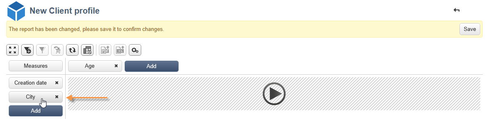

# Utilizzo dei cubi per esplorare i dati{#using-cubes-to-explore-data}

Marketing Analytics semplifica la creazione di rapporti e l&#39;identificazione e la selezione dei dati dal database tramite cubi. Questo consente di:

* Crea report basati su cubi. Il processo è descritto di seguito: [Esplorazione dei dati in un report](#exploring-the-data-in-a-report).
* Raccogliere i dati nel database e raggrupparli in elenchi, ad esempio per identificare e creare destinazioni e consegne. Per ulteriori informazioni, consulta [Creazione di una popolazione target](#building-a-target-population).
* Inserire una tabella pivot in un report, fare riferimento a un cubo esistente al suo interno. Per ulteriori informazioni, consulta [Inserimento di una tabella pivot in un rapporto](#inserting-a-pivot-table-into-a-report).

>[!NOTE]
>
>Marketing Analytics è necessario per creare o modificare i cubi. Per ulteriori informazioni, consulta [Informazioni sui cubi](../../reporting/using/about-cubes.md).

## Esplorazione dei dati in un rapporto {#exploring-the-data-in-a-report}

### Passaggio 1 - Creazione di un report basato su un cubo {#step-1---creating-a-report-based-on-a-cube}

Per creare un report basato su un cubo, fare clic sul pulsante **[!UICONTROL Create]** nella scheda **[!UICONTROL Reports]** e selezionare il cubo che si desidera utilizzare.

Il processo è descritto di seguito: [Creazione di un report basato su un cubo](../../reporting/using/creating-indicators.md#creating-a-report-based-on-a-cube).

### Passaggio 2 - Selezione di linee e colonne {#step-2---selecting-lines-and-columns}

La visualizzazione predefinita mostra le prime due dimensioni del cubo (età e città, in questo caso).

I pulsanti **[!UICONTROL Add]** su ciascun asse consentono di aggiungere dimensioni.

1. Selezionare le dimensioni da visualizzare nelle righe e nelle colonne della tabella. A questo scopo, trascina e rilascia le dimensioni disponibili come mostrato di seguito:
1. Seleziona dall’elenco le dimensioni da aggiungere alla tabella:

   

1. Quindi seleziona i parametri di questa dimensione.

   

   I parametri dipendono dal tipo di dati della dimensione selezionata.

   Ad esempio, per le date, possono essere disponibili diversi livelli. Per ulteriori informazioni, consulta [Visualizzazione di misure](../../reporting/using/concepts-and-methodology.md#displaying-measures).

   In questo caso sono offerte le seguenti opzioni:

   

   Puoi effettuare le seguenti operazioni:

   * Espandi i dati durante il caricamento: i valori verranno visualizzati per impostazione predefinita ogni volta che il rapporto viene aggiornato (valore predefinito: no).
   * Visualizza il totale alla fine della riga: quando i dati vengono visualizzati in colonne, un’opzione aggiuntiva consente di visualizzare il totale alla fine della riga: alla tabella viene aggiunta una colonna (valore predefinito: sì).
   * Applica un ordinamento: i valori della colonna possono essere ordinati in base al valore, all’etichetta o a una misura (valore predefinito: per valore).
   * Visualizza i valori in ordine crescente (a-z, 0-9) o decrescente (z-a, 9-0).
   * Modifica il numero di colonne da visualizzare al caricamento (per impostazione predefinita: 200).

1. Fai clic su **[!UICONTROL Ok]** per confermare: la dimensione viene aggiunta alle dimensioni esistenti.

   Il banner giallo sopra la tabella indica che sono state apportate modifiche: fai clic sul pulsante **[!UICONTROL Save]** per salvarli.

   

### Passaggio 3: configurazione delle misure da visualizzare {#step-3---configuring-the-measures-to-display}

Una volta posizionate le linee e le colonne, indicare le misure da visualizzare e la relativa modalità di visualizzazione.

Per impostazione predefinita viene visualizzata una sola misura. Per aggiungere o configurare misure:

1. Fai clic sul pulsante **[!UICONTROL Measures]**.

   

1. Il pulsante **[!UICONTROL Use a measure]** ti consente di selezionare una delle misure esistenti.

   

   Selezionare le informazioni da visualizzare e il tipo di formattazione. L’elenco delle opzioni dipende dal tipo di misura configurato.

   

   La configurazione complessiva delle misure è disponibile anche tramite l’ **[!UICONTROL Edit the configuration of the pivot table]** icona nell’intestazione.

   

   È quindi possibile scegliere se visualizzare o meno le etichette delle misure. Per ulteriori informazioni, consulta [Configurazione della visualizzazione](../../reporting/using/concepts-and-methodology.md#configuring-the-display).

1. È possibile creare nuove misure utilizzando quelle esistenti. A questo scopo, fai clic su **[!UICONTROL Create a measure]** e configuralo.

   

   Sono disponibili i seguenti tipi di misure:

   * Combinazione di misure: questo tipo di misura consente di creare la nuova misura utilizzando quelle esistenti:

      Gli operatori disponibili sono: somma, differenza, moltiplicazione e tasso.

   * Proporzione: questo tipo di misura consente di calcolare il numero di record misurati per una determinata dimensione. Puoi calcolare la proporzionalità in base a una dimensione o a una dimensione secondaria.
   * Variazione: questa misura consente di calcolare la variazione dei valori di un livello.
   * Deviazione standard: questo tipo di misura consente di calcolare le deviazioni all’interno di ciascun gruppo di celle rispetto alla media dei valori. Ad esempio, puoi confrontare il volume di acquisto per tutti i segmenti esistenti.

   La misura creata viene aggiunta al rapporto.

   

   Dopo aver creato una misura, puoi modificarla e, se necessario, modificarne la configurazione. A questo scopo, fai clic sul pulsante **[!UICONTROL Measures]** , quindi vai alla scheda della misura da modificare.

   Quindi fai clic su **[!UICONTROL Edit the dynamic measure]** per accedere al menu impostazioni.

## Creazione di una popolazione target {#building-a-target-population}

La generazione di rapporti tramite cubi consente di raccogliere i dati dalla tabella e salvarli in un elenco.

A questo scopo, aggiungili a un carrello ed elaborane il contenuto.

Per raggruppare una popolazione in un elenco, effettua le seguenti operazioni:

1. Fai clic sulle celle che contengono la popolazione da raccogliere per selezionarle, quindi fai clic sull&#39;icona **[!UICONTROL Add to cart]** .

   

   A questo scopo il numero di volte necessario per raccogliere vari profili

1. Fai clic sul pulsante **[!UICONTROL Show cart]** per visualizzarne il contenuto prima di eseguire l’esportazione.

   

1. Il pulsante **[!UICONTROL Export]** ti consente di raggruppare gli elementi nel carrello in un elenco.

   È necessario specificare il nome dell’elenco e il tipo di esportazione da eseguire.

   

   Fai clic su **[!UICONTROL Start]** per eseguire l’esportazione.

1. Una volta completata l’esportazione, un messaggio conferma la relativa esecuzione e il numero di record elaborati.

   

   Puoi salvare il contenuto del carrello o svuotarlo.

   L’elenco pertinente è accessibile tramite la scheda **[!UICONTROL Profiles and targets]** .

   

## Inserimento di una tabella pivot in un report {#inserting-a-pivot-table-into-a-report}

Per creare una tabella ed esplorare i dati di un cubo, eseguire i seguenti passaggi:

1. Crea un nuovo report con una singola pagina e inserisci una tabella pivot. Per ulteriori informazioni, consulta [questa pagina](../../reporting/using/creating-a-table.md#creating-a-breakdown-or-pivot-table).

   

1. Nella scheda **[!UICONTROL Data]** della pagina, seleziona un cubo per elaborare le dimensioni che contiene e visualizzare le misure calcolate.

   

   In questo modo puoi creare il rapporto da visualizzare. Per ulteriori informazioni, consulta [Passaggio 2 - Selezione di righe e colonne](#step-2---selecting-lines-and-columns).
