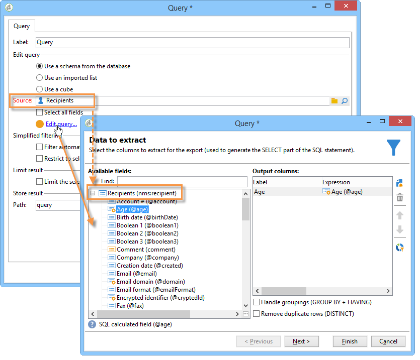

# Utilizzare il contesto nei rapporti{#using-the-context}

Quando si desidera rappresentare i dati sotto forma di **[!UICONTROL tables]** o **[!UICONTROL charts]**, può essere presa da due origini: una nuova query (consulta [Definire un filtro diretto per i dati](#defining-a-direct-filter-on-data)) o il contesto del rapporto (consultare [Utilizzare i dati contestuali](#using-context-data)).

## Definire un filtro diretto per i dati {#defining-a-direct-filter-on-data}

### Filtrare i dati {#filtering-data}

Utilizzo di un **[!UICONTROL Query]** l’attività di tipo non è obbligatoria durante la creazione di un rapporto. I dati possono essere filtrati direttamente nelle tabelle e nei grafici che compongono il rapporto.

Questo consente di selezionare i dati da visualizzare nel rapporto direttamente tramite **[!UICONTROL Page]** attività del rapporto.

A questo scopo, fai clic su **[!UICONTROL Filter data...]** collegamento in **[!UICONTROL Data]** scheda: questo collegamento ti consente di accedere all’editor delle espressioni per definire una query sui dati da analizzare.

### Esempio: utilizzare un filtro in un grafico {#example--use-a-filter-in-a-chart}

Nell’esempio seguente, vogliamo che il grafico mostri solo i profili dei destinatari che vivono in Francia e che hanno effettuato un acquisto durante l’anno.

Per definire questo filtro, inserisci una pagina nel grafico e modificala. Fai clic su **[!UICONTROL Filter data]** e creare il filtro corrispondente ai dati che desideri visualizzare. Per ulteriori informazioni sulla creazione di query in Adobe Campaign, consulta [questa sezione](../../platform/using/about-queries-in-campaign.md).

In questo caso, vogliamo visualizzare il raggruppamento per città dei destinatari selezionati.

Il rendering sarà simile al seguente:

### Esempio: utilizzare un filtro in una tabella pivot {#example--use-a-filter-in-a-pivot-table}

In questo esempio, il filtro consente di visualizzare solo i clienti non parigini nella tabella pivot, senza utilizzare prima un’altra query.

Applica i seguenti passaggi:

1. Posizionare una pagina nel grafico e modificarla.
1. Creare una tabella pivot.
1. Vai a **[!UICONTROL Data]** e selezionare il cubo da utilizzare.
1. Fai clic su **[!UICONTROL Filter data...]** collega e definisci la seguente query per rimuovere l’Adobe dall’elenco delle aziende.

   

Solo i destinatari che soddisfano i criteri di filtro verranno visualizzati nel rapporto.

## Utilizzare i dati contestuali {#using-context-data}

Per rappresentare i dati sotto forma di **[!UICONTROL table]** o un **[!UICONTROL chart]**, i dati possono provenire dal contesto del rapporto.

Nella pagina che contiene la tabella o il grafico, il **[!UICONTROL Data]** consente di selezionare l’origine dati.

* Il **[!UICONTROL New query]** consente di creare una query per la raccolta di dati. Per ulteriori informazioni, consulta [Definire un filtro diretto per i dati](#defining-a-direct-filter-on-data).
* Il **[!UICONTROL Context data]** consente di utilizzare i dati di input: il contesto del rapporto coincide con le informazioni contenute nella transizione in entrata della pagina che contiene il grafico o la tabella. Questo contesto può, ad esempio, contenere dati raccolti tramite un **[!UICONTROL Query]** attività effettuata prima del **[!UICONTROL Page]** e per i quali è necessario specificare la tabella e i campi interessati dal rapporto.

Ad esempio, in una casella di query, genera la seguente query per i destinatari:

Quindi indica l’origine dei dati nel rapporto, in questo caso: **[!UICONTROL Data from the context]**.

La posizione dei dati viene dedotta automaticamente. Se necessario, puoi forzare il percorso dati.

Quando selezioni i dati che saranno interessati dalle statistiche, i campi disponibili coincidono con i dati specificati nella query.

