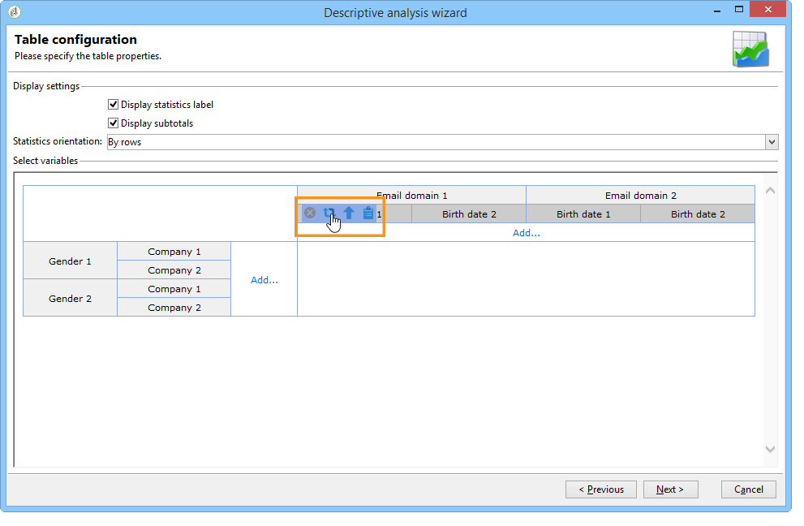
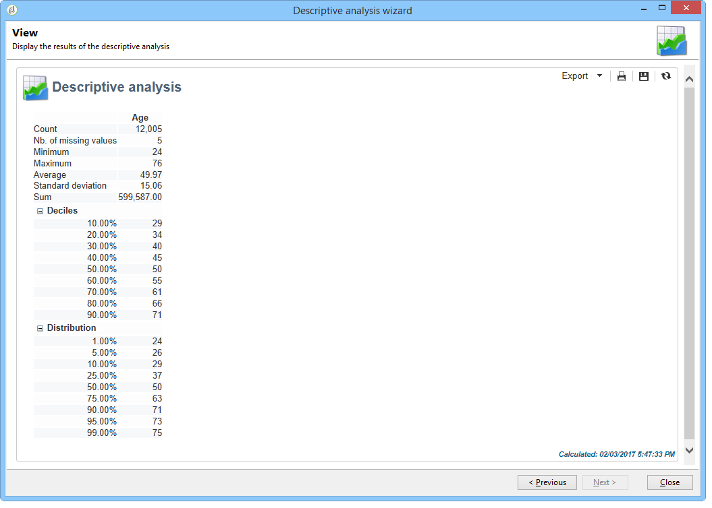

# Usare la procedura guidata di analisi descrittiva{#using-the-descriptive-analysis-wizard}

Per creare un rapporto di analisi descrittivo, utilizza la procedura guidata dedicata. La configurazione dipende dai dati da analizzare e dal rendering desiderato.

## Analizzare i dati nel database {#analyzing-data-in-the-database}

La procedura guidata di analisi descrittiva può essere avviata tramite **[!UICONTROL Tools > Descriptive analysis]** menu: in questo caso, l’analisi riguarda i destinatari per impostazione predefinita (**nms:destinatario**). Si applica a tutti i dati nel database di Adobe Campaign.

Per analizzare una tabella diversa da quella dei destinatari standard (**nms:destinatario**), fai clic su **[!UICONTROL Advanced settings...]** nell&#39;ultima fase della procedura guidata e selezionare la tabella corrispondente alle impostazioni, in questo caso **cus:individuale**:

Se desideri produrre statistiche su una parte dei dati, puoi definire un filtro: a questo scopo, fai clic sul pulsante **[!UICONTROL Advanced settings...]** e definisci il filtro da applicare, come illustrato di seguito:

L&#39;analisi riguarderà soltanto i destinatari di banche dati di età pari o superiore a 16 anni che vivono a Londra.

## Analizzare un set di dati {#analyzing-a-set-of-data}

Puoi utilizzare la procedura guidata di analisi descrittiva in un contesto diverso: un elenco, una transizione di flusso di lavoro, una o più consegne, una selezione di destinatari e così via.

È accessibile tramite diversi nodi della struttura Adobe Campaign che puntano alla tabella dei destinatari.

Apri la procedura guidata di analisi descrittiva selezionando gli elementi e facendo clic con il pulsante destro del mouse. Verranno analizzati solo i dati selezionati.

* Per un set di **destinatari**, seleziona i destinatari da analizzare, quindi fai clic con il pulsante destro del mouse e seleziona **[!UICONTROL Actions > Explore...]**, come mostrato sopra. Se all’elenco dei destinatari viene applicato un filtro, verrà analizzato solo il relativo contenuto.

  Per selezionare tutti i destinatari della cartella o del filtro corrente, utilizzare la scelta rapida CTRL+A. Ciò significa che verranno selezionati anche i destinatari non visualizzati.

  Per un esempio di analisi descrittiva dei destinatari, consulta: [Analisi qualitativa dei dati](../../reporting/using/use-cases.md#qualitative-data-analysis).

* Nell&#39;ambito di una **workflow**, posiziona il cursore su una transizione che punta verso la tabella dei destinatari, fai clic con il pulsante destro del mouse e seleziona **[!UICONTROL Analyze target]**. Per ulteriori informazioni, consulta l’esempio in [Analizzare un target di transizione in un flusso di lavoro](../../reporting/using/use-cases.md#analyzing-a-transition-target-in-a-workflow).
* Per **elenchi**, seleziona uno o più elenchi e applica lo stesso processo utilizzato per i destinatari.
* Nell&#39;ambito di una **consegna**, seleziona le consegne di cui desideri analizzare la destinazione, fai clic con il pulsante destro del mouse e seleziona **[!UICONTROL Actions > Explore the target]**, come illustrato di seguito:

  

  Di seguito sono riportati esempi di analisi descrittive per le consegne: [Analizzare una popolazione](../../reporting/using/use-cases.md#analyzing-a-population) e qui: [Analizzare i registri di tracciamento dei destinatari](../../reporting/using/use-cases.md#analyzing-recipient-tracking-logs).

## Configurare il modello di distribuzione qualitativa {#configuring-the-qualitative-distribution-template}

Il **[!UICONTROL Qualitative distribution]** Il modello ti consente di creare statistiche su tutti i tipi di dati (ad esempio nome della società, dominio e-mail).

Opzioni di configurazione disponibili per un rapporto creato tramite **[!UICONTROL Qualitative distribution]** i modelli sono descritti in [Visualizza dati nella tabella](#displaying-data-in-the-table). Un esempio completo è descritto in [Analizzare una popolazione](../../reporting/using/use-cases.md#analyzing-a-population).

Quando si utilizza la procedura guidata di analisi descrittiva per analizzare i dati, le opzioni disponibili dipendono dalle impostazioni scelte. Tali informazioni sono descritte di seguito.

### Binning dati {#data-binning}

Quando selezioni le variabili da visualizzare, puoi definire il binning dei dati, in altre parole configurare i criteri di raggruppamento per i dati selezionati.

>[!NOTE]
>
>Quando il campo interessato dal calcolo viene calcolato utilizzando un aggregato, controllare **[!UICONTROL The data is already aggregated]** per migliorare le prestazioni.

Le opzioni variano a seconda del contenuto del campo:

* **[!UICONTROL None]** : questa opzione ti consente di visualizzare tutti i valori disponibili per la variabile, senza binning.

  >[!CAUTION]
  >
  >Questa opzione deve essere utilizzata con cautela: può avere un impatto importante sul rapporto e sulle prestazioni della macchina.

* **[!UICONTROL Auto]** : questa opzione consente di visualizzare gli n valori rappresentati più di frequente. Vengono calcolati automaticamente e ognuno di essi rappresenta una percentuale delle variabili rispetto al numero di raccoglitori. Per i valori numerici, Adobe Campaign genera automaticamente n classi in cui ordinare i dati.
* **[!UICONTROL Manual]** : questa opzione funziona come il **[!UICONTROL Auto]** tranne per il fatto che è possibile impostare questi valori manualmente. A questo scopo, fai clic su **[!UICONTROL Add]** a destra della tabella dei valori.

  I valori possono essere inizializzati automaticamente da Adobe Campaign prima della personalizzazione: a questo scopo, inserisci il numero di raccoglitori che desideri generare e fai clic su **[!UICONTROL Initialize with]** come mostrato di seguito:

  

  Quindi adatta i contenuti in base alle tue esigenze:

  

  A seconda del livello di precisione desiderato, i campi contenenti date possono essere raggruppati per ora, giorno, mese, anno e così via.

  

* **[!UICONTROL Modulo]** : consente di creare gruppi di valori in caso di valori numerici. Ad esempio, un modulo con un valore di 10 consente di creare un intervallo di valori che cambiano di dieci per dieci.

  

  Questo esempio ti consente di visualizzare la suddivisione dei destinatari per gruppo di età.

  

### Visualizza dati nella tabella {#displaying-data-in-the-table}

Utilizza la barra degli strumenti per personalizzare la visualizzazione delle variabili nella tabella: elimina una colonna, visualizza i dati in righe anziché in colonne, sposta una colonna a sinistra o a destra, visualizza o modifica il calcolo dei valori.

La sezione superiore della finestra consente di selezionare le impostazioni di visualizzazione.

È possibile visualizzare o nascondere il nome delle statistiche e i totali parziali e scegliere l&#39;orientamento delle statistiche. Per ulteriori informazioni, consulta [Impostazioni di visualizzazione del rapporto di analisi](../../reporting/using/processing-a-report.md#analysis-report-display-settings).

### Visualizza dati nel grafico {#displaying-data-in-the-chart}

Nel primo passaggio della procedura guidata di analisi descrittiva, è possibile scegliere di visualizzare i dati solo in formato grafico, senza una tabella. In questo caso, la selezione delle variabili deve essere eseguita durante la configurazione dell&#39;immagine. Devi innanzitutto selezionare il numero di variabili da visualizzare e selezionare i campi dal database pertinente.

Selezionare quindi il tipo di grafico desiderato.

>[!NOTE]
>
>È possibile visualizzare le variabili contemporaneamente in un grafico e in una tabella. A questo scopo, immetti le variabili in **[!UICONTROL Table configuration]** finestra. Clic **[!UICONTROL Next]** e selezionare il tipo di grafico nella finestra di configurazione del grafico. Se nella tabella sono definite delle dimensioni secondarie, queste non vengono visualizzate nel grafico.

Fai clic su **[!UICONTROL Variants]** per modificare le proprietà del grafico.

Le opzioni disponibili dipendono dal tipo di grafico selezionato. Per ulteriori informazioni, consulta [questa pagina](../../reporting/using/creating-a-chart.md#chart-types-and-variants).

### Calcolo delle statistiche {#statistics-calculation}

La procedura guidata di analisi descrittiva consente di calcolare diversi tipi di statistiche sui dati. Per impostazione predefinita, è configurato un solo conteggio semplice.

Clic **[!UICONTROL Add]** per creare una nuova statistica.

Sono possibili le seguenti operazioni:

* **[!UICONTROL Count]** per contare tutti i valori non nulli del campo da aggregare, compresi i valori duplicati (del campo aggregato),
* **[!UICONTROL Average]** per calcolare la media dei valori in un campo numerico,
* **[!UICONTROL Minimum]** calcolare il minimo dei valori in un campo numerico,
* **[!UICONTROL Maximum]** per calcolare il massimo dei valori in un campo numerico,
* **[!UICONTROL Sum]** calcolare la somma dei valori in un campo numerico,
* **[!UICONTROL Standard deviation]** per calcolare la dispersione dei valori restituiti rispetto alla media,
* **[!UICONTROL Row percentage distribution]** per calcolare il rapporto tra il valore in una colonna e il valore in una riga (disponibile solo per le tabelle),
* **[!UICONTROL Column percentage distribution]** per calcolare il rapporto tra il valore di una riga e il valore di una colonna (disponibile solo per le tabelle),
* **[!UICONTROL Total percentage distribution]** calcolare la distribuzione dei destinatari interessati dai valori,

  

* **[!UICONTROL Calculated field]** per creare un operatore personalizzato (disponibile solo per le tabelle) Il **[!UICONTROL User function]** consente di immettere il calcolo da applicare ai dati.

  Esempio: calcolo dell’importo medio dell’acquisto per cliente in base al paese e all’origine

  

  Per visualizzare le informazioni di cui sopra in una tabella, devi creare un campo calcolato per memorizzare l’importo medio dell’acquisto per cliente.

  Per eseguire questa operazione:

   1. Calcola il totale degli acquisti.

      

   1. Questa statistica non verrà visualizzata nella tabella. È necessario deselezionare **[!UICONTROL Display in the table]** opzione del **[!UICONTROL Advanced]** scheda.

      

   1. Crea un nuovo **[!UICONTROL Calculated field]** digitare la statistica e immettere la formula seguente nel campo **[!UICONTROL User function]** campo: **@purchases/@count**.

      

### Visualizzare il rapporto {#displaying-the-report}

L’ultimo passaggio della procedura guidata consente di visualizzare il rapporto, ovvero la tabella o il grafico configurato.

Quando il report contiene una tabella, la cella dei risultati del calcolo è colorata. Più alto è il risultato, più intenso sarà il colore.

È possibile modificare il layout dei risultati. A tale scopo, fare clic con il pulsante destro del mouse sulla variabile interessata e selezionare l&#39;input dal menu di scelta rapida.

Quando il report include un grafico, le etichette della legenda ti consentono di filtrare le informazioni visualizzate: fai clic su un’etichetta per abilitare/disabilitare la visualizzazione nel grafico.

## Configurare il modello di distribuzione quantitativa {#configuring-the-quantitative-distribution-template}

Per generare autonomamente un’analisi descrittiva, seleziona la **Nuova analisi descrittiva da un modello** se non è impostata per impostazione predefinita.

Il **[!UICONTROL Quantitative distribution]** modello che consente di generare statistiche sui dati che possono essere misurati o conteggiati (ad esempio, importo della fattura, età dei destinatari).

La modalità di configurazione di un rapporto di analisi creato tramite **[!UICONTROL Quantitative distribution]** il modello è descritto in un esempio di implementazione [Analisi dei dati quantitativi](../../reporting/using/use-cases.md#quantitative-data-analysis).

Le opzioni disponibili quando si utilizza la procedura guidata di analisi descrittiva per creare un rapporto quantitativo sono descritte di seguito.

Per iniziare, seleziona la variabile oggetto dei calcoli:

Per impostazione predefinita, Adobe Campaign offre una serie di statistiche da calcolare per i dati selezionati. Puoi modificare questo elenco, aggiungerlo o eliminare statistiche in base alle tue esigenze.

Sono possibili le seguenti operazioni:

* **[!UICONTROL Count]** per contare tutti i valori non nulli del campo da aggregare, compresi i valori duplicati (del campo aggregato),
* **[!UICONTROL Average]** per calcolare la media dei valori in un campo numerico,
* **[!UICONTROL Minimum]** calcolare il minimo dei valori in un campo numerico,
* **[!UICONTROL Maximum]** per calcolare il massimo dei valori in un campo numerico.
* **[!UICONTROL Sum]** calcolare la somma dei valori in un campo numerico,
* **[!UICONTROL Standard deviation]** per calcolare la distribuzione dei valori restituiti attorno alla media.
* **[!UICONTROL Number of missing values]** per calcolare il numero di campi numerici senza valori definiti.
* **[!UICONTROL Decile distribution]** per distribuire i valori restituiti in modo che ciascuno di essi rappresenti 1/10 dei valori in un campo numerico.
* **[!UICONTROL Custom distribution]** per distribuire i valori restituiti in base alle soglie definite dall&#39;utente.

  Il **[!UICONTROL Detail...]** Questo pulsante consente di modificare una statistica e, se necessario, di personalizzarne il calcolo o la visualizzazione:

  

  L&#39;ultimo passaggio della procedura guidata mostra il rapporto di analisi quantitativa.

  

  Per apportare modifiche al rapporto, fare riferimento a [Elaborare un rapporto](../../reporting/using/processing-a-report.md).
