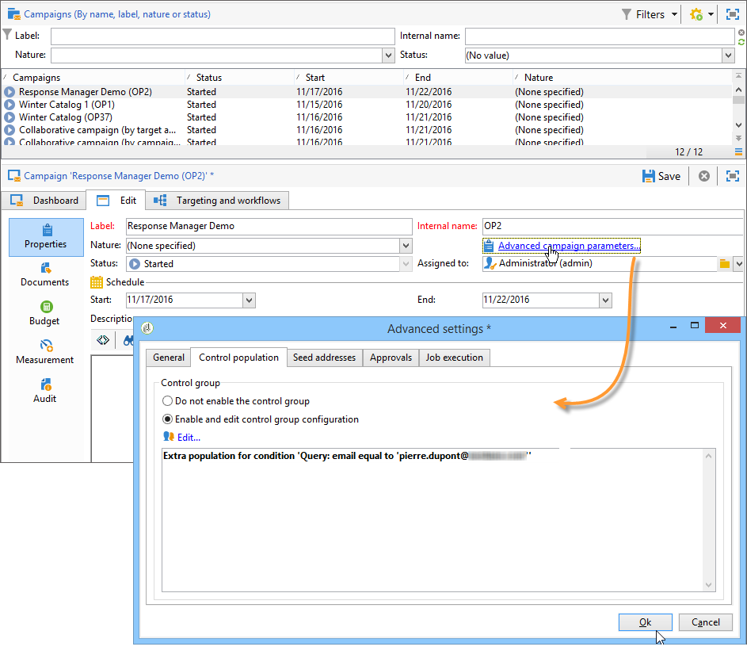
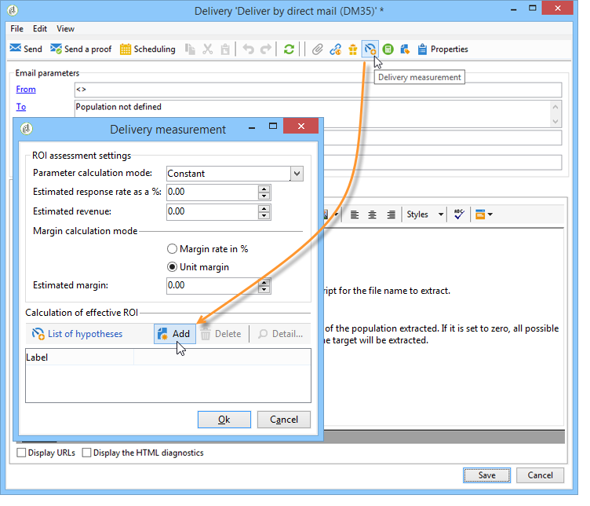

# Creare ipotesi{#creating-hypotheses}

Esistono diverse possibilità per creare/collegare ipotesi a un’offerta o a una consegna di una campagna:

* Tramite la cartella **[!UICONTROL Measurement hypotheses]** creando una nuova ipotesi basata su un modello esistente e collegandola a una consegna esistente.
* Tramite la scheda **[!UICONTROL Edit]** > **[!UICONTROL Measurement]** in una campagna.
* Tramite l’opzione **[!UICONTROL Measurement]** di una consegna creata da una campagna.

Le ipotesi possono essere calcolate solo dopo che la campagna di marketing è stata avviata e i destinatari hanno ricevuto la consegna. Se l’ipotesi si basa su una proposta di offerta, quest’ultima deve essere almeno presentata e rimanere attiva. Le ipotesi di offerta e consegna vengono create tramite la cartella **[!UICONTROL Measurement hypotheses]** e sono basate su un modello di ipotesi. Tuttavia, è possibile fare riferimento a un’ipotesi direttamente nella consegna o nella campagna prima dell’inizio di quest’ultima. In questo caso, le ipotesi vengono calcolate automaticamente una volta avviata la campagna di marketing, in base alle impostazioni di esecuzione. [Ulteriori informazioni](hypothesis-templates.md#hypothesis-template-execution-settings)

## Creare al volo un’ipotesi su una consegna {#creating-a-hypothesis-on-the-fly-on-a-delivery}

Per creare un’ipotesi su una consegna esistente, applica il seguente processo:

>[!NOTE]
>
>Questa operazione è possibile solo per le consegne in sospeso.

1. Nella struttura Adobe Campaign, passa a **[!UICONTROL Campaign management > Measurement hypotheses]**.
1. Fare clic sul pulsante **[!UICONTROL New]** o fare clic con il pulsante destro del mouse sull&#39;elenco delle ipotesi e selezionare **[!UICONTROL New]** nell&#39;elenco a discesa.

   

1. Nella finestra dell’ipotesi, seleziona un modello creato in precedenza. [Ulteriori informazioni](hypothesis-templates.md)

   

   Il contesto dell’ipotesi definito nel modello selezionato viene visualizzato nella finestra.

   >[!NOTE]
   >
   >Anche le impostazioni definite nel modello e non visibili in questo passaggio vengono mantenute nella memoria e riassegnate all’ipotesi in corso.

   

1. Seleziona la consegna per la quale desideri creare un’ipotesi.

   

1. È possibile personalizzare l&#39;ipotesi modificando le schede **[!UICONTROL General]**, **[!UICONTROL Transactions]** e **[!UICONTROL Scope]**. [Ulteriori informazioni](hypothesis-templates.md#creating-a-hypothesis-model)
1. Avviare l&#39;ipotesi facendo clic su **[!UICONTROL Start]**.

   Viene creato automaticamente un flusso di lavoro per eseguire la misurazione. Il nome viene definito automaticamente a seconda della configurazione dell’ipotesi.

   >[!CAUTION]
   >
   >È possibile accedere a questa casella se è stata selezionata la casella **[!UICONTROL Keep execution workflow]**.\
   >Questa opzione deve essere attivata solo a scopo di debug, in caso di errore durante l’esecuzione dell’ipotesi. I flussi di lavoro generati automaticamente vengono salvati nella cartella **[!UICONTROL Administration]** > **[!UICONTROL Production]** > **[!UICONTROL Objects created automatically]** > **[!UICONTROL Campaign workflows]** in Adobe Campaign Explorer.
   > 
   >Inoltre, i flussi di lavoro generati automaticamente non devono essere modificati. Eventuali modifiche non verranno prese in considerazione altrove per i calcoli successivi.
   >
   >Se hai selezionato questa opzione, elimina il flusso di lavoro dopo l’esecuzione.

   

   Una volta completato il calcolo, gli indicatori di misurazione vengono aggiornati automaticamente.

   

1. Se necessario, modifica le impostazioni e riavvia l’ipotesi.

## Riferimento a un’ipotesi in una consegna di campagna {#referencing-a-hypothesis-in-a-campaign-delivery}

Puoi fare riferimento a un’ipotesi in una campagna di marketing prima di avviarla. In questo caso, l’ipotesi viene avviata automaticamente una volta inviata la consegna, in base alle impostazioni di esecuzione definite nel modello di ipotesi. Per creare un’ipotesi in una consegna, applica il seguente processo:

1. A seconda delle tue esigenze, puoi creare uno o più modelli di tipo **[!UICONTROL Delivery]**, come descritto in [questa sezione](hypothesis-templates.md#creating-a-hypothesis-model)
1. Crea una campagna di marketing e flussi di lavoro di targeting.
1. Nella finestra di consegna, fare clic sull&#39;icona **[!UICONTROL Delivery measurement]**.
1. Seleziona il modello di ipotesi (la query configurata nel modello viene visualizzata nella finestra delle ipotesi).

   L’ipotesi verrà calcolata automaticamente al termine della campagna, in base alle date configurate nel modello. [Ulteriori informazioni](hypothesis-templates.md#hypothesis-template-execution-settings)

   

## Aggiungere un’ipotesi predefinita alle consegne per una campagna {#adding-a-default-hypothesis-to-deliveries-for-a-campaign}

Puoi fare riferimento diretto a un’ipotesi a livello di campagna. In questo caso, l’ipotesi verrà collegata automaticamente a tutte le consegne create nella campagna. Per eseguire questa operazione:

1. Passa alla scheda **[!UICONTROL Edit]** della campagna.
1. Nella sezione di misurazione fare clic sulla scheda **[!UICONTROL Default hypotheses]**.

   

1. Fare clic su **[!UICONTROL Add]** e selezionare un modello di ipotesi.

   

   Ora per impostazione predefinita in ogni nuova consegna per la campagna viene fatto riferimento a un’ipotesi basata su questo modello.

   

I risultati dell&#39;ipotesi possono essere visualizzati nelle schede **[!UICONTROL General]** e **[!UICONTROL Reactions]** dell&#39;ipotesi. [Ulteriori informazioni](hypothesis-tracking.md)

Per ulteriori informazioni, puoi anche fare riferimento a [questo esempio](#example--creating-a-hypothesis-linked-to-a-delivery).

## Creare un’ipotesi su un’offerta {#creating-a-hypothesis-on-an-offer}

La creazione di un’ipotesi su una proposta di offerta è simile alla creazione di un’ipotesi di consegna immediata. L’ipotesi può essere eseguita finché l’offerta è attiva. Il periodo di calcolo si basa sulla data della proposta di offerta. Quando l’ipotesi ti consente di collegare un destinatario a un acquisto, lo stato della proposta di offerta che potrebbe essere accettata può essere modificato automaticamente. [Ulteriori informazioni](hypothesis-templates.md#transactions)

1. Creare uno o più modelli di tipo **[!UICONTROL Offer]** come descritto in [questa sezione](hypothesis-templates.md#creating-a-hypothesis-model).
1. Passare al nodo **[!UICONTROL Campaign management > Measurement hypotheses]**.
1. Creare un&#39;ipotesi di tipo **[!UICONTROL Offers]** selezionando il modello creato in precedenza.

   

   La query creata nel modello viene visualizzata nella finestra.

   

1. Scegli l’offerta per la quale desideri creare un’ipotesi.

   

1. Se necessario, perfeziona la query.
1. Fare clic su **[!UICONTROL Start]** per eseguire l&#39;ipotesi.
1. I risultati dell&#39;ipotesi possono essere visualizzati nelle relative schede **[!UICONTROL General]** e **[!UICONTROL Reactions]**. [Ulteriori informazioni](hypothesis-tracking.md)

   Le ipotesi effettuate su un&#39;offerta sono riportate nella scheda **[!UICONTROL Measurement]**.

   

   Se l&#39;opzione **[!UICONTROL Update offer proposition status]** è stata abilitata nel modello di ipotesi, lo stato della proposta di offerta viene modificato automaticamente, fornendo in tal modo un feedback sull&#39;impatto della campagna (per ulteriori informazioni, consulta [Transazioni](hypothesis-templates.md#transactions)).

## Esempio: creare un’ipotesi collegata a una consegna {#example--creating-a-hypothesis-linked-to-a-delivery}

In questo esempio, vogliamo creare un’ipotesi collegata a una consegna. Questa ipotesi sarà basata sul modello creato in precedenza. [Ulteriori informazioni](hypothesis-templates.md#example--creating-a-hypothesis-template-on-a-delivery)

La query ereditata dal modello verrà quindi perfezionata per formulare un’ipotesi su un articolo specifico della tabella di acquisto.

1. Crea una campagna e una consegna. Consulta la [documentazione di Campaign v8](https://experienceleague.adobe.com/docs/campaign/automation/campaign-orchestration/set-up-campaigns.html?lang=it){target=_blank}.

   Nel nostro esempio, utilizzeremo una consegna di tipo direct mailing.

1. Configurare un indirizzo di seed: il modello di ipotesi creato in precedenza è stato configurato per tenere conto di un gruppo di controllo nei risultati della reazione.

   

   >[!NOTE]
   >
   >Per ulteriori informazioni, consulta la [Documentazione di Campaign v8](https://experienceleague.adobe.com/docs/campaign/automation/campaign-orchestration/marketing-campaign-target.html?lang=it#add-a-control-group){target="_blank"}.

1. Apri **[!UICONTROL Direct mail delivery]** e fai clic sull&#39;icona **[!UICONTROL Delivery measurement]**, quindi fai clic su **[!UICONTROL Add]**.

   

1. Scegli il modello di ipotesi creato in precedenza dall’elenco a discesa.

   

   Viene visualizzata la query creata nel modello.

   

1. Fare clic su **[!UICONTROL Edit query...]** e perfezionare la query immettendo il prodotto che verrà interessato dall&#39;ipotesi.

   

   Puoi verificare che l’ipotesi sia collegata alla consegna nella scheda **[!UICONTROL Edit]** > **[!UICONTROL Measurement]** della campagna.

   

1. Avvia il flusso di lavoro di targeting ed esegui i controlli necessari fino al termine della campagna. Consulta la [documentazione di Campaign v8](https://experienceleague.adobe.com/docs/campaign/automation/campaign-orchestration/marketing-campaign-deliveries.html?lang=it#start-a-delivery){target=_blank}.

   

1. Nella struttura Adobe Campaign, vai al nodo **[!UICONTROL Campaign management > Measurement hypotheses]** per controllare gli indicatori calcolati dall&#39;ipotesi.

   
