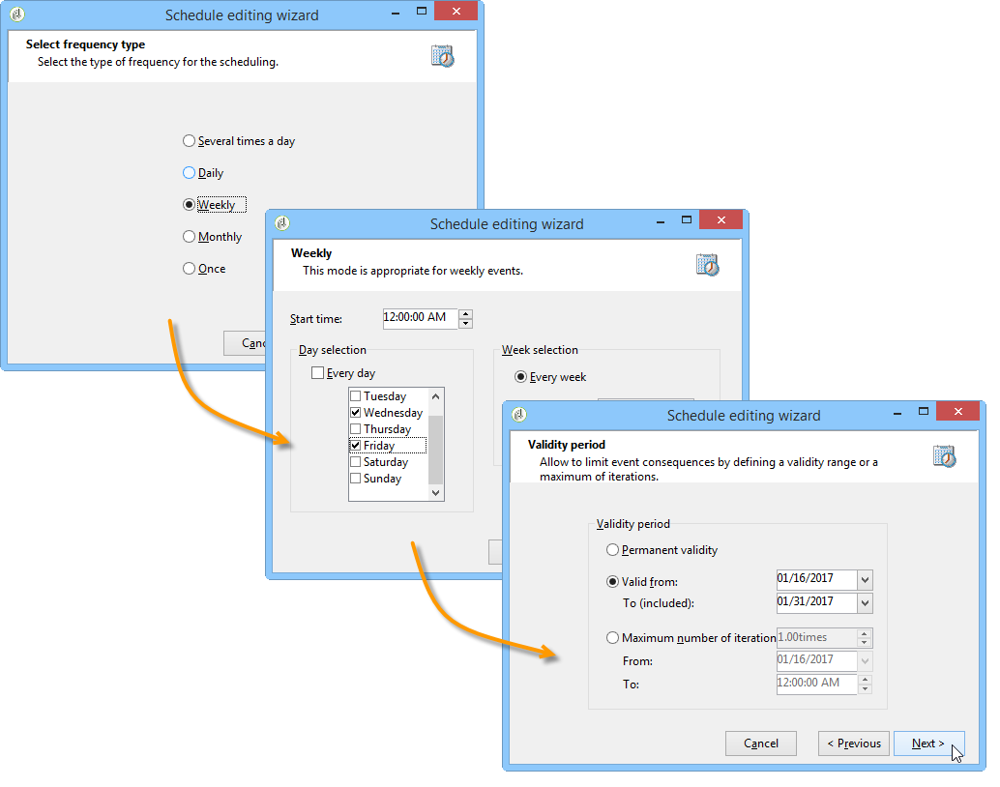
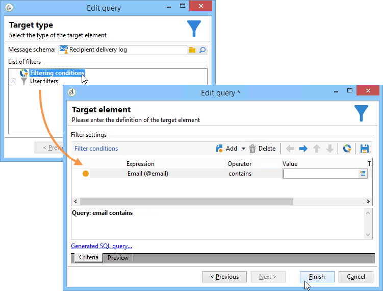

# Modelli di ipotesi{#hypothesis-templates}

## Creare un modello di ipotesi {#creating-a-hypothesis-model}

La configurazione del modello di ipotesi consente di definire il contesto per la misurazione delle reazioni, sia per una consegna che per un’offerta. Qui si fa riferimento alle varie tabelle di misurazione, comprese quelle per la definizione delle relazioni tra individui, ipotesi e tabella delle transazioni.

Per creare un modello di ipotesi, esegui i seguenti passaggi:

1. In Adobe Campaign Explorer, fai clic su **[!UICONTROL Resources>Templates>Hypothesis templates]**.

   

1. Fai clic su **[!UICONTROL New]** oppure fai clic con il pulsante destro del mouse nell’elenco dei modelli e scegli **[!UICONTROL New]** nell’elenco a discesa.
1. Inserisci l’etichetta dell’ipotesi.
1. Specifica se il modello è destinato a ipotesi su offerte o consegne tramite il **[!UICONTROL Hypothesis type]**.
1. Per **[!UICONTROL Delivery]** modelli di tipo, specificare se le misurazioni devono essere eseguite con o senza un gruppo di controllo. [Ulteriori informazioni](#properties-of-a-hypothesis-template)
1. Per **[!UICONTROL Delivery]** digita modelli, puoi scegliere un canale specifico o decidere di applicare il modello a tutti i canali disponibili in Adobe Campaign utilizzando **[!UICONTROL Channel]** elenco a discesa. [Ulteriori informazioni](#properties-of-a-hypothesis-template)
1. Seleziona la **[!UICONTROL Execution folder]** in cui si desidera creare ed eseguire automaticamente le ipotesi che verranno create da questo modello.
1. Scegli le impostazioni di esecuzione. [Ulteriori informazioni](#hypothesis-template-execution-settings)
1. Specificare il periodo di calcolo dell&#39;ipotesi. [Ulteriori informazioni](#hypothesis-template-execution-settings)

   >[!CAUTION]
   >
   >Questo periodo è determinato dalla data di contatto.

1. In **[!UICONTROL Transactions]** specificare le tabelle e i campi necessari per il calcolo dell&#39;ipotesi. [Ulteriori informazioni](#transactions)
1. Se il modello è configurato per **[!UICONTROL Offer]** digita le ipotesi, puoi abilitare **[!UICONTROL Update offer proposition status]** opzione: in questo caso, seleziona lo stato della proposta di offerta da modificare.
1. Specificare l&#39;ambito dell&#39;applicazione dell&#39;ipotesi. [Ulteriori informazioni](#hypothesis-perimeter)
1. Se necessario, utilizza uno script per completare il filtro. [Ulteriori informazioni](#hypothesis-perimeter)

### Proprietà di un modello di ipotesi {#properties-of-a-hypothesis-template}

Il modello è **[!UICONTROL General]** consente di specificare le opzioni generali del modello. I campi disponibili sono:

* **[!UICONTROL Hypothesis type]**: consente di determinare se il modello deve essere destinato a ipotesi su consegne o offerte.

   Puoi anche scegliere di creare un’ipotesi da applicare sia alle consegne che alle offerte.

   >[!NOTE]
   >
   >Se il modello si applica alle offerte, la **[!UICONTROL Update offer proposition status]** è disponibile nella **[!UICONTROL Transactions]** scheda .

* **[!UICONTROL Measurement with control group]**: consente di specificare se un gruppo di controllo è stato definito per la consegna o la campagna e di includerlo negli indicatori di misurazione. Il gruppo di controllo, che non riceve consegne, ti consente di misurare l’impatto della campagna dopo la consegna, confrontandola con la popolazione target che ha ricevuto la consegna.

   >[!NOTE]
   >
   >Se il modello è configurato per tenere conto di un gruppo di controllo, ma non è definito alcun gruppo nella consegna che riguarda le ipotesi, i risultati saranno basati solo su destinatari mirati.

   Per ulteriori informazioni sulla definizione e la configurazione di un gruppo di controllo, consulta [questa sezione](../../campaign/using/marketing-campaign-deliveries.md#defining-a-control-group).

* **[!UICONTROL Channel]**: puoi scegliere un canale specifico o rendere il modello di ipotesi disponibile a tutti i canali nella console Adobe Campaign selezionando **[!UICONTROL All channels]** nell’elenco a discesa. Se configuri il modello per un canale specifico, puoi filtrare automaticamente le consegne per canale al momento della creazione dell’ipotesi. [Ulteriori informazioni](creating-hypotheses.md)

   

* **[!UICONTROL Execution folder]**: consente di specificare la cartella di esecuzione per l’ipotesi.
* **[!UICONTROL Taken into account in campaign ROI calculation]**: prende in considerazione il risultato dell’ipotesi nel calcolo del ROI per la campagna correlata.

### Impostazioni di esecuzione del modello di ipotesi {#hypothesis-template-execution-settings}

Il modello è **[!UICONTROL General]** consente inoltre di specificare i parametri di esecuzione dell’ipotesi. Le opzioni disponibili sono le seguenti:

* **[!UICONTROL Schedule execution for a time of low activity]**: consente di pianificare il lancio delle ipotesi per ottimizzare le prestazioni di Adobe Campaign. Quando questa opzione è selezionata, il flusso di lavoro di elaborazione nelle campagne esegue il calcolo delle ipotesi durante i tempi di inattività.

   

* **[!UICONTROL Priority]**: livello applicato all&#39;ipotesi per definire gli ordini di calcolo dell&#39;ipotesi in caso di esecuzioni simultanee.

   

* **[!UICONTROL Automatic execution]**: se necessario, ti consente di pianificare il ricalcolo delle ipotesi (ad esempio, se desideri aggiornare regolarmente gli indicatori fino alla fine della consegna).

   

   Per specificare una pianificazione, attenersi alla seguente procedura:

   1. Fai clic sul pulsante **[!UICONTROL Frequency of execution...]** link, quindi il **[!UICONTROL Change...]** pulsante .

      

   1. Configura la frequenza, gli eventi correlati e il periodo di validità.

      

   1. Fai clic su **[!UICONTROL Finish]** per salvare la pianificazione.

      

* **[!UICONTROL Log SQL queries in journal]**: questa funzione è riservata agli utenti esperti. Consente di aggiungere una scheda al controllo di ipotesi di misurazione per mostrare le query SQL. Questo consente di individuare eventuali malfunzionamenti se una simulazione termina con errori.
* **[!UICONTROL Keep execution workflow]**: consente di mantenere il flusso di lavoro generato automaticamente all’inizio del calcolo dell’ipotesi. Nelle ipotesi create da un modello su cui è selezionata questa opzione, il flusso di lavoro generato è disponibile per seguire il processo.

   >[!CAUTION]
   >
   >Questa opzione deve essere attivata solo a scopo di debug, in caso di errore durante l&#39;esecuzione dell&#39;ipotesi.\
   >Inoltre, i flussi di lavoro generati automaticamente non devono essere modificati. Qualsiasi eventuale modifica non sarà presa in considerazione altrove per calcoli successivi.\
   >Se hai selezionato questa opzione, elimina il flusso di lavoro dopo l’esecuzione.

### Transazioni {#transactions}

Questa scheda contiene i vari campi e tabelle che ti consentono di salvare la cronologia delle reazioni dei destinatari in termini di transazioni. Fai riferimento a questo [sezione](../../configuration/using/about-schema-reference.md) per ulteriori informazioni sulle tabelle dedicate alla gestione delle risposte.

* **[!UICONTROL Schema (reaction log storage)]**: selezionare la tabella di reazione del destinatario. La tabella standard in Adobe Campaign è **NmsRemaMatchRcp**.
* **[!UICONTROL Transaction schema]**: scegliere la tabella che le ipotesi riguardano, ovvero la transazione o la tabella di acquisto.
* **[!UICONTROL Querying schema]**: scegli i criteri per filtrare l&#39;ipotesi.
* **[!UICONTROL Link to individuals]**: scegli il collegamento tra singoli utenti e la tabella utilizzata come schema di transazione.
* **[!UICONTROL Link to the household]**: selezionare il collegamento alla famiglia nello schema transazioni se si desidera includere in un&#39;ipotesi tutti i membri di una famiglia. Questo campo è facoltativo.
* **[!UICONTROL Transaction date]**: questo campo è facoltativo ma consigliato in quanto consente di definire un ambito per il calcolo delle ipotesi.
* **[!UICONTROL Measurement period]**: consente di configurare le date di inizio e di fine durante le quali vengono eseguite le ipotesi e le linee di acquisto vengono recuperate.

   Quando l’ipotesi è collegata a una consegna, la misurazione viene attivata automaticamente alcuni giorni dopo la data di contatto per le consegne di direct mailing o dopo la data di consegna per le consegne di e-mail o SMS.

   

   Se l&#39;ipotesi viene lanciata al volo, può essere forzata se vuole attivarla immediatamente. In caso contrario, viene attivato automaticamente in base alla data di fine del calcolo configurata, che si basa sulla data di creazione delle ipotesi. [Ulteriori informazioni](creating-hypotheses.md#creating-a-hypothesis-on-the-fly-on-a-delivery)).

* **[!UICONTROL Transaction/Margin amount]**: questi campi sono facoltativi e consentono di calcolare automaticamente gli indicatori del fatturato. [Ulteriori informazioni](hypothesis-tracking.md#indicators)
* **[!UICONTROL Unit amount]**: consente di impostare un importo per il calcolo dei ricavi. [Ulteriori informazioni](hypothesis-tracking.md#indicators)

   

* **[!UICONTROL Additional measures and data]**: consente di specificare ulteriori misure di reporting o assi dai campi delle diverse tabelle.
* **[!UICONTROL Update offer proposition status]**: consente di modificare lo stato della proposta di offerta se un destinatario dell’offerta è identificato dall’ipotesi.

   

### Perimetro ipotesi {#hypothesis-perimeter}

Una volta definita la tabella delle transazioni e i campi interessati dall’ipotesi, puoi perfezionare l’ambito delle tue ipotesi specificando le transazioni e le consegne mirate utilizzando i filtri. È inoltre possibile utilizzare uno script JavaScript per puntare esplicitamente a un prodotto a cui si fa riferimento nella tabella delle transazioni.

* **Filtrare le transazioni**: in **[!UICONTROL Scope]** è possibile configurare un filtro per l&#39;ipotesi. Per eseguire questa operazione:

   1. Fai clic sul collegamento **[!UICONTROL Edit query]**.

      

   1. Specifica le condizioni di filtro.

      

   1. Selezionare la transazione che l&#39;ipotesi riguarda.

      

* **Filtrare sui destinatari**: in **[!UICONTROL Scope]** scheda , puoi limitare l’ipotesi a qualsiasi informazione collegata a un messaggio (consegna, destinatario, indirizzo e-mail, servizio, ecc.):

   1. Fai clic sul pulsante **[!UICONTROL Add a filter]** link, quindi **[!UICONTROL Edit query]**.

      

   1. Specifica le condizioni di filtro.

      

   1. Fai clic su **[!UICONTROL Finish]** per salvare la query.

      

* **Script**: è possibile utilizzare uno script JavaScript per sovraccaricare dinamicamente le impostazioni delle ipotesi durante la relativa esecuzione.

   A questo scopo, fai clic sul pulsante **[!UICONTROL Advanced settings]** quindi inserisci lo script desiderato.

   >[!NOTE]
   >
   >Questa opzione è per gli utenti esperti.

   

## Esempio: creare un modello di ipotesi su una consegna {#example--creating-a-hypothesis-template-on-a-delivery}

In questo esempio, creeremo un modello di ipotesi su una consegna di tipo direct mailing. Tabella delle transazioni (**Acquisti** nel nostro esempio) su cui si baseranno le ipotesi contiene linee di acquisto collegate ad articoli o prodotti. Vogliamo configurare il nostro modello per creare ipotesi su articoli o prodotti nella tabella acquisti.

1. Nell’esploratore Adobe Campaign, passa a **[!UICONTROL Resources > Templates > Hypothesis templates]** nodo.
1. Fai clic su **[!UICONTROL New]** per creare un modello.

   

1. Modificare l’etichetta del modello.

   

1. Seleziona **[!UICONTROL Deliveries]** come tipo di ipotesi.
1. Specifica che la consegna può contenere un gruppo di controllo selezionando la casella corrispondente.
1. Scegli la **[!UICONTROL Direct mail]** canale.

   >[!NOTE]
   >
   >Poiché il modello è specifico per le consegne di direct mailing, le ipotesi create utilizzando questo modello potrebbero non essere collegate ad altri tipi di consegna.

1. In **[!UICONTROL Transactions]** seleziona la tabella delle reazioni dei destinatari.

   

1. In **[!UICONTROL Transactions schema]** scegliere la tabella di acquisto.

   

1. Seleziona le linee di acquisto nel **[!UICONTROL Querying schema]** campo .

   

1. Scegli i destinatari collegati alla tabella di acquisto.

   

1. Selezionare il campo collegato alla data di acquisto.

   Questo consente di definire un intervallo di tempo per le ipotesi. Questa fase non è obbligatoria, ma è consigliata.

   

1. Configura il periodo di calcolo per 5-25 giorni.

   

1. In **[!UICONTROL Scope]** scheda , fai clic su **[!UICONTROL Edit query]** per creare un filtro sulle ipotesi.

   

   Il modello creato consente quindi di eseguire ipotesi sui prodotti o sugli articoli nella tabella di acquisto.

1. Fai clic su **[!UICONTROL Save]** per registrare il modello.
