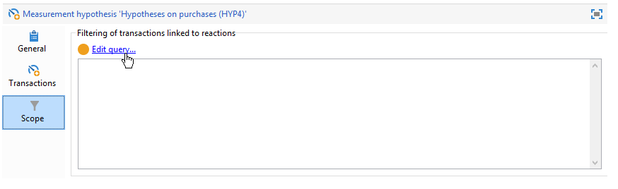
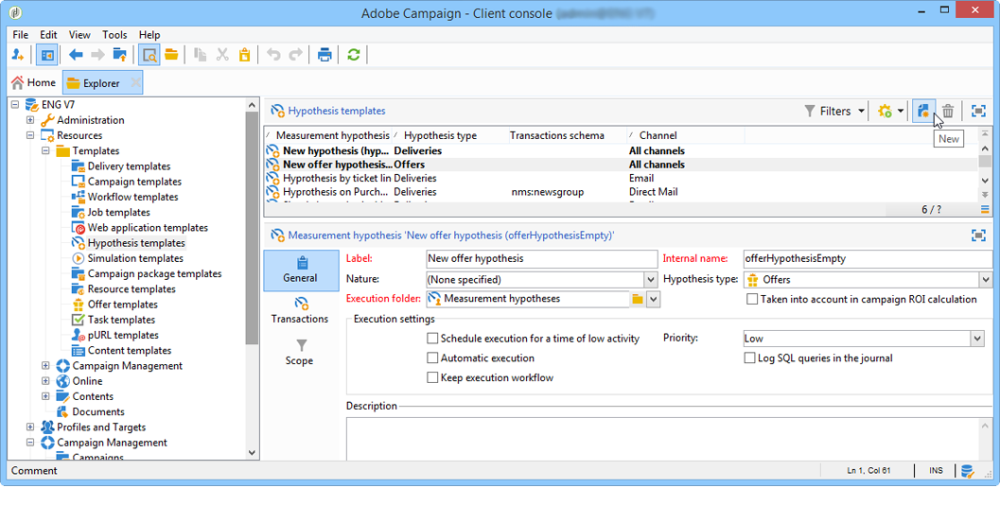

# Modelli di ipotesi{#hypothesis-templates}

## Creare un modello di ipotesi {#creating-a-hypothesis-model}

La configurazione del modello di ipotesi ti consente di definire il contesto per la misurazione delle reazioni, sia per una consegna che per un’offerta. Qui si fa riferimento alle varie tabelle di misurazione, comprese quelle per la definizione delle relazioni tra singoli individui, le ipotesi e la tabella delle transazioni.

Per creare un modello di ipotesi, effettua le seguenti operazioni:

1. In Adobe Campaign Explorer, fare clic su **[!UICONTROL Resources>Templates>Hypothesis templates]**.

   

1. Fare clic su **[!UICONTROL New]** o fare clic con il pulsante destro del mouse nell&#39;elenco dei modelli e scegliere **[!UICONTROL New]** nell&#39;elenco a discesa.
1. Inserisci l’etichetta dell’ipotesi.
1. Specifica se il modello è destinato a ipotesi su offerte o consegne tramite **[!UICONTROL Hypothesis type]**.
1. Per i modelli di tipo **[!UICONTROL Delivery]**, specificare se le misurazioni devono essere eseguite con o senza un gruppo di controllo. [Ulteriori informazioni](#properties-of-a-hypothesis-template)
1. Per i modelli di tipo **[!UICONTROL Delivery]**, è possibile scegliere un canale specifico o decidere di applicare il modello a tutti i canali disponibili in Adobe Campaign utilizzando l&#39;elenco a discesa **[!UICONTROL Channel]**. [Ulteriori informazioni](#properties-of-a-hypothesis-template)
1. Selezionare **[!UICONTROL Execution folder]** in cui si desidera creare ed eseguire automaticamente le ipotesi create da questo modello.
1. Scegli le impostazioni di esecuzione. [Ulteriori informazioni](#hypothesis-template-execution-settings)
1. Specifica il periodo di calcolo dell’ipotesi. [Ulteriori informazioni](#hypothesis-template-execution-settings)

   >[!CAUTION]
   >
   >Questo periodo è determinato dalla data di contatto.

1. Nella scheda **[!UICONTROL Transactions]**, specifica le tabelle e i campi necessari per il calcolo dell’ipotesi. [Ulteriori informazioni](#transactions)
1. Se il modello è configurato per le ipotesi di tipo **[!UICONTROL Offer]**, è possibile abilitare l&#39;opzione **[!UICONTROL Update offer proposition status]**: in questo caso, selezionare lo stato della proposta di offerta da modificare.
1. Specifica l’ambito dell’applicazione dell’ipotesi. [Ulteriori informazioni](#hypothesis-perimeter)
1. Se necessario, utilizza uno script per completare il filtro. [Ulteriori informazioni](#hypothesis-perimeter)

### Proprietà di un modello di ipotesi {#properties-of-a-hypothesis-template}

La scheda **[!UICONTROL General]** del modello consente di specificare le opzioni generali del modello. I campi disponibili sono:

* **[!UICONTROL Hypothesis type]**: consente di determinare se il modello deve essere destinato a ipotesi su consegne o offerte.

  Puoi anche scegliere di creare un’ipotesi da applicare sia alle consegne che alle offerte.

  >[!NOTE]
  >
  >Se il modello è applicabile alle offerte, l&#39;opzione **[!UICONTROL Update offer proposition status]** è disponibile nella scheda **[!UICONTROL Transactions]**.

* **[!UICONTROL Measurement with control group]**: consente di specificare se è stato definito un gruppo di controllo per la consegna o la campagna e di includerlo negli indicatori di misurazione. Il gruppo di controllo, che non riceve consegne, ti consente di misurare l’impatto della campagna dopo la consegna, confrontandola con la popolazione target che ha ricevuto la consegna.

  >[!NOTE]
  >
  >Se il modello è configurato per tenere conto di un gruppo di controllo, ma non è definito alcun gruppo nella consegna che le ipotesi riguardano, i risultati saranno basati solo sui destinatari target.

  Per ulteriori informazioni sulla definizione e la configurazione di un gruppo di controllo, consulta la [documentazione di Campaign v8](https://experienceleague.adobe.com/docs/campaign/automation/campaign-orchestration/marketing-campaign-target.html?lang=it#add-a-control-group){target=_blank}.

* **[!UICONTROL Channel]**: è possibile scegliere un canale specifico o rendere disponibile il modello di ipotesi per tutti i canali nella console Adobe Campaign selezionando **[!UICONTROL All channels]** nell&#39;elenco a discesa. Se configuri il modello per un canale specifico, questo ti consente di filtrare automaticamente le consegne per canale durante la creazione dell’ipotesi. [Ulteriori informazioni](creating-hypotheses.md)

  

* **[!UICONTROL Execution folder]**: consente di specificare la cartella di esecuzione per l&#39;ipotesi.
* **[!UICONTROL Taken into account in campaign ROI calculation]**: prende in considerazione il risultato dell&#39;ipotesi nel calcolo del ROI per la campagna correlata.

### Impostazioni di esecuzione del modello ipotesi {#hypothesis-template-execution-settings}

La scheda **[!UICONTROL General]** del modello consente inoltre di specificare i parametri di esecuzione dell&#39;ipotesi. Le opzioni disponibili sono le seguenti:

* **[!UICONTROL Schedule execution for a time of low activity]**: consente di pianificare il lancio dell&#39;ipotesi per ottimizzare le prestazioni di Adobe Campaign. Quando questa opzione è selezionata, il flusso di lavoro di elaborazione nelle campagne esegue il calcolo dell’ipotesi durante il tempo di inattività.

  

* **[!UICONTROL Priority]**: livello applicato all&#39;ipotesi per intervallare gli ordini di calcolo dell&#39;ipotesi in presenza di esecuzioni simultanee.

  

* **[!UICONTROL Automatic execution]**: se necessario, ti consente di pianificare il ricalcolo dell&#39;ipotesi (ad esempio, se desideri aggiornare gli indicatori regolarmente fino alla fine della consegna).

  

  Per specificare una pianificazione, attenersi alla procedura descritta di seguito.

   1. Fare clic sul collegamento **[!UICONTROL Frequency of execution...]**, quindi sul pulsante **[!UICONTROL Change...]**.

      

   1. Configura la frequenza, gli eventi correlati e il periodo di validità.

      

   1. Fare clic su **[!UICONTROL Finish]** per salvare la pianificazione.

      

* **[!UICONTROL Log SQL queries in journal]**: questa funzione è riservata agli utenti esperti. Consente di aggiungere una scheda al controllo dell’ipotesi di misurazione per visualizzare le query SQL. Ciò consente di rilevare eventuali malfunzionamenti se una simulazione termina con errori.
* **[!UICONTROL Keep execution workflow]**: consente di mantenere il flusso di lavoro generato automaticamente all&#39;inizio del calcolo dell&#39;ipotesi. Nelle ipotesi create da un modello in cui questa opzione è selezionata, il flusso di lavoro generato è disponibile per seguire il processo.

  >[!CAUTION]
  >
  >Questa opzione deve essere attivata solo a scopo di debug, in caso di errore durante l’esecuzione dell’ipotesi.\
  >Inoltre, i flussi di lavoro generati automaticamente non devono essere modificati. Eventuali modifiche non verranno prese in considerazione altrove per i calcoli successivi.\
  >Se hai selezionato questa opzione, elimina il flusso di lavoro dopo l’esecuzione.

### Transazioni {#transactions}

Questa scheda contiene i vari campi e tabelle che consentono di salvare la cronologia delle reazioni dei destinatari in termini di transazioni. Per ulteriori informazioni sulle tabelle dedicate alla gestione delle risposte, consulta questa [sezione](../../configuration/using/about-schema-reference.md).

* **[!UICONTROL Schema (reaction log storage)]**: selezionare la tabella di reazione del destinatario. La tabella predefinita in Adobe Campaign è **NmsRemaMatchRcp**.
* **[!UICONTROL Transaction schema]**: scegliere la tabella che le ipotesi riguarderanno, ovvero la transazione o la tabella acquisti.
* **[!UICONTROL Querying schema]**: scegliere i criteri per filtrare l&#39;ipotesi.
* **[!UICONTROL Link to individuals]**: scegliere il collegamento tra singoli utenti e la tabella utilizzata come schema di transazione.
* **[!UICONTROL Link to the household]**: selezionare il collegamento alla famiglia nello schema delle transazioni se si desidera includere in un&#39;ipotesi tutti i membri di una famiglia. Questo campo è facoltativo.
* **[!UICONTROL Transaction date]**: questo campo è facoltativo ma consigliato in quanto consente di definire un ambito per il calcolo dell&#39;ipotesi.
* **[!UICONTROL Measurement period]**: consente di configurare le date di inizio e fine durante le quali vengono eseguite le ipotesi e vengono recuperate le righe di acquisto.

  Quando l’ipotesi è collegata a una consegna, la misurazione viene attivata automaticamente alcuni giorni dopo la data di contatto per le consegne di direct mailing o dopo la data di consegna per le consegne e-mail o SMS.

  

  Se l’ipotesi viene lanciata al volo, può essere forzata se vuole attivarla immediatamente. In caso contrario, viene attivato automaticamente in base alla data di fine del calcolo configurata, che si basa sulla data di creazione dell’ipotesi. [Ulteriori informazioni](creating-hypotheses.md#creating-a-hypothesis-on-the-fly-on-a-delivery)).

* **[!UICONTROL Transaction/Margin amount]**: questi campi sono facoltativi e consentono di calcolare automaticamente gli indicatori di fatturato. [Ulteriori informazioni](hypothesis-tracking.md#indicators)
* **[!UICONTROL Unit amount]**: consente di impostare un importo per il calcolo delle entrate. [Ulteriori informazioni](hypothesis-tracking.md#indicators)

  

* **[!UICONTROL Additional measures and data]**: consente di specificare misure o assi di reporting aggiuntivi da campi di tabelle diverse.
* **[!UICONTROL Update offer proposition status]**: consente di modificare lo stato della proposta di offerta se un destinatario dell&#39;offerta è identificato dall&#39;ipotesi.

  

### Perimetro ipotesi {#hypothesis-perimeter}

Dopo aver definito la tabella delle transazioni e i campi che l’ipotesi riguarderà, puoi definire l’ambito delle ipotesi specificando le transazioni e le consegne mirate utilizzando i filtri. È inoltre possibile utilizzare uno script di JavaScript per puntare in modo esplicito a un prodotto a cui si fa riferimento nella tabella delle transazioni.

* **Filtro sulle transazioni**: nella scheda **[!UICONTROL Scope]** puoi configurare un filtro in base all&#39;ipotesi. Per eseguire questa operazione:

   1. Fai clic sul collegamento **[!UICONTROL Edit query]**.

      

   1. Specifica le condizioni di filtro.

      

   1. Seleziona la transazione interessata dall’ipotesi.

      

* **Filtro sui destinatari**: nella scheda **[!UICONTROL Scope]** puoi limitare l&#39;ipotesi a qualsiasi informazione collegata a un messaggio (consegna, destinatario, indirizzo e-mail, servizio, ecc.):

   1. Fare clic sul collegamento **[!UICONTROL Add a filter]**, quindi su **[!UICONTROL Edit query]**.

      

   1. Specifica le condizioni di filtro.

      

   1. Fai clic su **[!UICONTROL Finish]** per salvare la query.

      

* **Script**: è possibile utilizzare uno script di JavaScript per sovraccaricare dinamicamente le impostazioni delle ipotesi durante la relativa esecuzione.

  A tale scopo, fare clic sul collegamento **[!UICONTROL Advanced settings]**, quindi immettere lo script desiderato.

  >[!NOTE]
  >
  >Questa opzione è destinata agli utenti esperti.

  

## Esempio: creare un modello di ipotesi su una consegna {#example--creating-a-hypothesis-template-on-a-delivery}

In questo esempio, creeremo un modello di ipotesi su una consegna di tipo direct mailing. La tabella delle transazioni (**Acquisti** nel nostro esempio) su cui si baseranno le ipotesi contiene righe di acquisto collegate ad articoli o prodotti. Vogliamo configurare il nostro modello per creare ipotesi su articoli o prodotti nella tabella degli acquisti.

1. In Adobe Campaign Explorer, passa al nodo **[!UICONTROL Resources > Templates > Hypothesis templates]**.
1. Fare clic su **[!UICONTROL New]** per creare un modello.

   

1. Modifica l’etichetta del modello.

   

1. Selezionare **[!UICONTROL Deliveries]** come tipo di ipotesi.
1. Specifica che la consegna può contenere un gruppo di controllo selezionando la casella pertinente.
1. Scegli il canale **[!UICONTROL Direct mail]**.

   >[!NOTE]
   >
   >Poiché il modello è specifico per le consegne di direct mailing, le ipotesi create utilizzando questo modello potrebbero non essere collegate ad altri tipi di consegna.

1. Nella scheda **[!UICONTROL Transactions]** selezionare la tabella delle reazioni dei destinatari.

   

1. Nel campo **[!UICONTROL Transactions schema]**, scegli la tabella acquisti.

   

1. Selezionare le righe acquisto nel campo **[!UICONTROL Querying schema]**.

   

1. Scegli i destinatari collegati alla tabella degli acquisti.

   

1. Seleziona il campo collegato alla data di acquisto.

   Questo consente di definire un intervallo di tempo per le ipotesi. Questa fase non è obbligatoria, ma è consigliata.

   

1. Configurare il periodo di calcolo da 5 a 25 giorni.

   

1. Nella scheda **[!UICONTROL Scope]**, fare clic su **[!UICONTROL Edit query]** per creare un filtro in base alle ipotesi.

   

   Il modello creato consente di eseguire ipotesi sui prodotti o sugli articoli nella tabella di acquisto.

1. Fai clic su **[!UICONTROL Save]** per registrare il modello.
