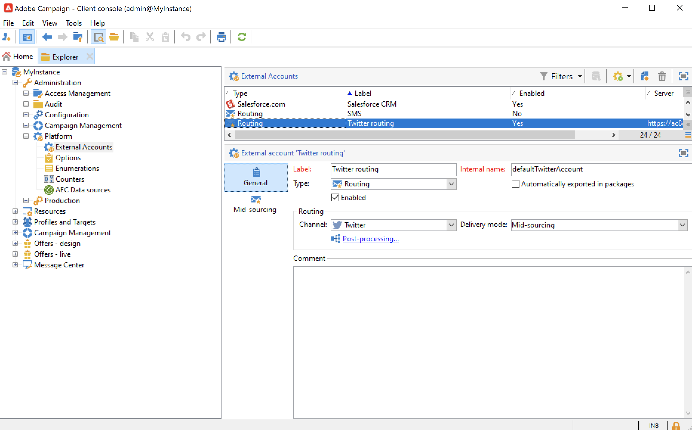

# Informazioni sul social marketing{#about-social-marketing}

La **Gestione dei social network** (Social Marketing) applicazione progettata per la gestione delle reti sociali consente di interagire con clienti e potenziali clienti tramite Twitter.

Scopri i passaggi chiave per integrare Campaign e Twitter in [Documentazione di Campaign v8](https://experienceleague.adobe.com/docs/campaign/campaign-v8/connect/ac-tw.html){target="_blank"}.

In qualità di cliente on-premise o ibrido, il tuo account esterno Twitter deve essere configurato e abilitato. Per le configurazioni ibride, il **Mid-sourcing** è inoltre necessario impostare una connessione attiva alla piattaforma di mid-sourcing.

