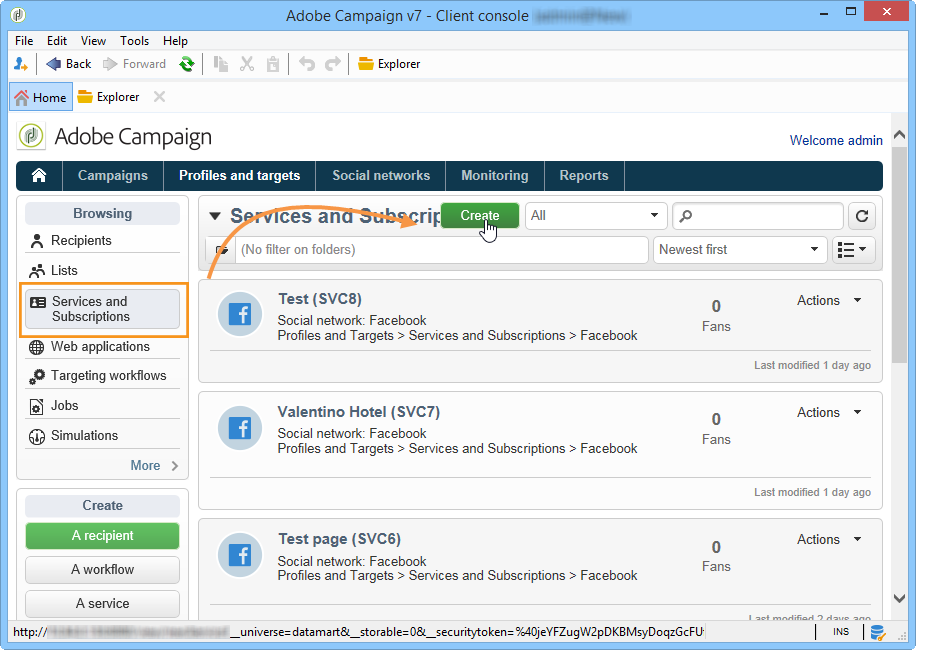
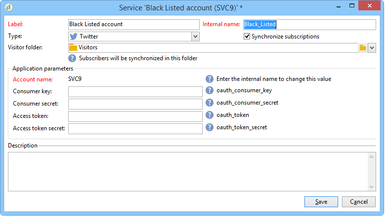

# Configurazione della pubblicazione su Twitter{#configuring-publishing-on-twitter}

Affinché  Adobe Campaign possa inviare tweet ai vostri account Twitter, dovete delegare l&#39;accesso in scrittura a  Adobe Campaign per questi account. A tal fine, eseguite i seguenti passaggi di configurazione:

* Create un account Twitter.
* Create un account Twitter di prova per l&#39;invio delle prove di stampa.
* Create un&#39;applicazione Twitter per account Twitter.
* Per ogni applicazione Twitter, create un nuovo servizio **[!UICONTROL Twitter]** tipo.

## Prerequisiti {#prerequisites}

Per iniziare, create uno o più account Twitter a cui inviare i tweet.

Per creare un account Twitter, visitate [https://twitter.com](https://twitter.com).

## Creazione di un account di prova su Twitter {#creating-a-test-account-on-twitter}

È inoltre consigliabile creare un account Twitter privato che possa essere utilizzato per inviare le prove su Twitter (per ulteriori informazioni, vedere [Invio delle prove](../../social/using/publishing-on-twitter.md#sending-the-proof)):

* Create un nuovo account Twitter.
* Fare clic sul menu nell&#39;angolo superiore destro e selezionare **[!UICONTROL Settings]**.
* Selezionare la **[!UICONTROL Security and privacy]** scheda e selezionare la **[!UICONTROL Protect my Tweets]** casella.
* Fate clic sul **[!UICONTROL Save Changes]** pulsante in fondo alla pagina.

## Creazione di un’applicazione su Twitter {#creating-an-application-on-twitter}

Affinché  Adobe Campaign possa inviare tweet ai vostri account Twitter, è necessario creare un&#39;applicazione Twitter per account Twitter. A questo scopo, eseguire i seguenti passaggi:

1. Accedete al vostro account Twitter.
1. Inserite il seguente indirizzo nel browser Internet: [https://apps.twitter.com/](https://apps.twitter.com/).
1. Fate clic sul **[!UICONTROL Create New App]** pulsante a destra.

   

1. Consentono alla procedura guidata di seguire il processo.

   Affinché questa applicazione consenta  Adobe Campaign di inviare tweet al tuo account, vai alla **[!UICONTROL Permissions]** scheda dell&#39;applicazione e seleziona **[!UICONTROL Read and Write]** per la **[!UICONTROL Access]** sezione. Nella **[!UICONTROL Settings]** scheda, è inoltre necessario lasciare vuoto il **[!UICONTROL Callback URL]** campo.

   

## Delega dell&#39;accesso in scrittura a  Adobe Campaign {#delegating-write-access-to-adobe-campaign}

Per ogni applicazione Twitter, è necessario creare un servizio di **[!UICONTROL Twitter]** tipo diverso che includa le impostazioni dell&#39;applicazione.

Questo passaggio richiede l’accesso simultaneo alla console  Adobe Campaign e a un browser Internet collegato al vostro account Twitter:

* **Twitter**: selezionate l’applicazione creata in precedenza ([https://dev.twitter.com/apps](https://dev.twitter.com/apps)) e fate clic sulla **[!UICONTROL Keys and Access Tokens]** scheda.

   

* **Adobe Campaign**: andare nell&#39; **[!UICONTROL Profiles and targets]** universo, fare clic sul **[!UICONTROL Services and Subscriptions]** collegamento e fare clic sul **[!UICONTROL Create]** pulsante.

   

1. Selezionare il **[!UICONTROL Twitter]** tipo.

   

   >[!NOTE]
   >
   >The **[!UICONTROL Synchronize subscriptions]** option is enabled by default. Quando la casella è selezionata, il flusso di lavoro per la sincronizzazione degli account Twitter (fare riferimento a [Sincronizzazione degli account](#synchronizing-twitter-accounts)Twitter) recupera l&#39;elenco dei follower Twitter in modo da poter inviare loro messaggi diretti (fare riferimento a [Invio di messaggi diretti agli abbonati](../../social/using/publishing-on-twitter.md#sending-direct-messages-to-subscribers)). Se non si desidera recuperare l&#39;elenco dei follower, deselezionare questa casella.

1. Immettete l’etichetta e il nome interno del servizio.

   

   >[!IMPORTANT]
   >
   >Il nome **[!UICONTROL Internal name]** del servizio deve essere identico al nome dell&#39;account Twitter. Per essere certi che non si verifichino errori di immissione, attenetevi alla seguente procedura.

   * Fai clic sul pulsante **[!UICONTROL Save]**.
   * Nella panoramica dei servizi, fai clic sul servizio Twitter appena creato.
   * Seleziona la scheda **[!UICONTROL Twitter page]**. L&#39;account Twitter deve essere visualizzato.

      

1. Nel **[!UICONTROL Visitor folder]** campo, selezionate la cartella del visitatore in cui verranno creati i follower. For more on this, refer to [Operating principle](../../social/using/publishing-on-twitter.md#operating-principle). Per impostazione predefinita, i follower vengono creati nella directory principale della **[!UICONTROL Visitors]** cartella.

   

1. Su Twitter, copiate il contenuto dei **[!UICONTROL Consumer Key (API Key)]** campi e **[!UICONTROL Consumer Secret (API Secret)]** incollatelo nei **[!UICONTROL Consumer key]** campi e **[!UICONTROL Consumer secret]** nella console.

   

1. Su Twitter, copiate il contenuto dei **[!UICONTROL Access Token]** campi e **[!UICONTROL Access Token Secret]** incollatelo nei **[!UICONTROL Access token]** campi e **[!UICONTROL Access token secret]** nella console.

   

1. Nella  console Adobe Campaign, fate clic su **[!UICONTROL Save]**. La delega dell&#39;accesso in scrittura a  Adobe Campaign è ora completa.

   

>[!NOTE]
>
>È necessario creare un servizio di **[!UICONTROL Twitter]** tipo per ogni applicazione Twitter.

Il **[!UICONTROL Twitter account Synchronization]** flusso di lavoro sincronizza gli account Twitter in  Adobe Campaign. Per ulteriori informazioni, consultate [Sincronizzazione delle pagine](../../social/using/publishing-on-facebook-walls.md#synchronizing-facebook-pages)Facebook.

## Sincronizzazione degli account Twitter {#synchronizing-twitter-accounts}

>[!IMPORTANT]
>
>Affinché il flusso di lavoro possa recuperare l’elenco degli utenti Twitter iscritti, la **[!UICONTROL Twitter account synchronization]** casella deve essere selezionata nella sezione di modifica del servizio collegato all’account. Per ulteriori informazioni, vedere [Delega dell&#39;accesso in scrittura a  Adobe Campaign](#delegating-write-access-to-adobe-campaign).

Il **[!UICONTROL Twitter account synchronization]** flusso di lavoro, a cui si accede tramite il **[!UICONTROL Administration > Production > Technical workflows > Managing social networks]** nodo, consente di sincronizzare gli account Twitter configurati in precedenza con  Adobe Campaign. Per impostazione predefinita, questo flusso di lavoro viene attivato ogni giovedì alle 7:30.

>[!NOTE]
>
>È possibile avviare il flusso di lavoro in qualsiasi momento eseguendo l&#39;elaborazione dell&#39;attività prevista. Potete inoltre modificare il pianificatore per modificare la frequenza di attivazione del flusso di lavoro. For more on the scheduler, refer to [this section](../../workflow/using/scheduler.md).

Ora puoi inviare tweet ai tuoi account Twitter e messaggi diretti ai tuoi follower. Per ulteriori informazioni, consulta: [Pubblicazione su Twitter](../../social/using/publishing-on-twitter.md).
