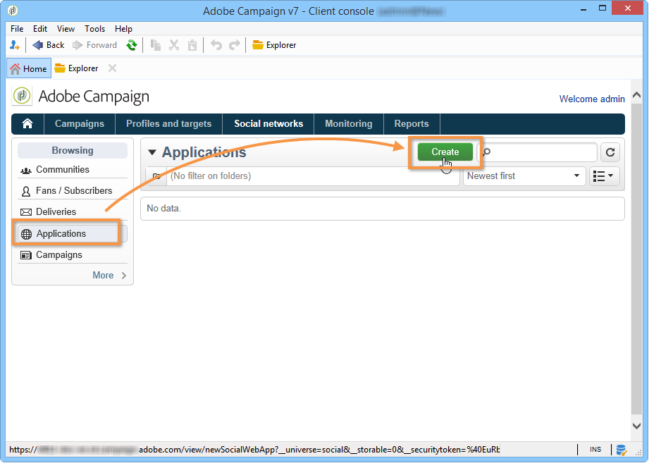
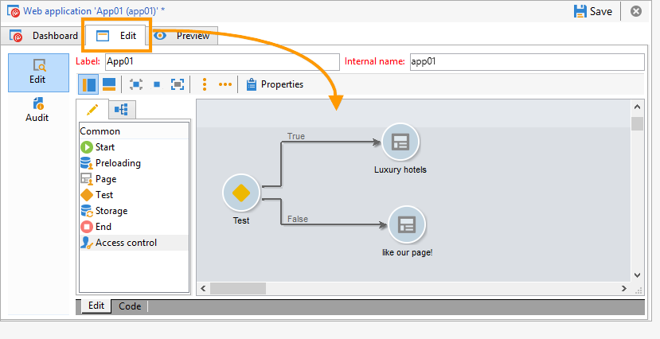
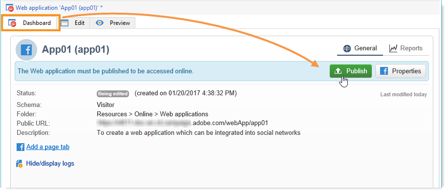

# Creazione di un’app Facebook{#creating-a-facebook-application}

Grazie alle applicazioni Web, Social Marketing consente di visualizzare contenuti personalizzati nelle applicazioni Facebook, semplificando l&#39;acquisizione di potenziali clienti tramite questo social network. Per ulteriori esempi di applicazioni Web di tipo Facebook, fare riferimento a [Esempi di app Facebook](../../social/using/examples-of-facebook-apps.md).

>[!NOTE]
>
>È inoltre possibile integrare  Adobe Campaign con un&#39;applicazione Facebook sviluppata da un partner. In questo caso, non è necessario utilizzare l&#39;applicazione Web  Adobe Campaign per acquisire i profili Facebook. Per ulteriori informazioni, vedere [Configurazione di account esterni](#configuring-external-accounts).

Effettuate le seguenti operazioni di configurazione:

1. Create una o più applicazioni Facebook. Per ulteriori informazioni, consulta: [Creazione di un&#39;applicazione Facebook](../../social/using/publishing-on-facebook-walls.md#creating-a-facebook-application).
1. Immettete i collegamenti **[!UICONTROL terms of service]** e **[!UICONTROL Privacy policy]** da visualizzare nella schermata di richiesta delle autorizzazioni di Facebook. Per ulteriori informazioni, consulta: [Inserire i collegamenti alle Condizioni del servizio e all&#39;Informativa sulla privacy](#entering-the-terms-of-service-and-privacy-policy-links).
1. Per ogni applicazione Facebook, create un account esterno di tipo **[!UICONTROL Facebook Connect]**. Per ulteriori informazioni, consulta: [Configurazione di account esterni](#configuring-external-accounts).
1. Per ogni applicazione Facebook, create un’applicazione Web di tipo Facebook in  Adobe Campaign. Per ulteriori informazioni, consulta: [Creazione di un&#39;applicazione Web di tipo Facebook](#creating-a-facebook-type-web-application).
1. Configurate le applicazioni Facebook in modo che vengano visualizzate come schede sulla pagina Facebook. Per ulteriori informazioni, consulta: [Configurazione delle schede di Facebook](#configuring-facebook-tabs).

## Configurazione di account esterni {#configuring-external-accounts}

Per ogni applicazione Facebook, è necessario creare un account esterno di tipo **[!UICONTROL Facebook Connect]**.

Questo passaggio richiede l’accesso sia alla console Adobe Campaign  che a un browser Internet connesso all’account Facebook che utilizzate per l’amministrazione delle pagine:

* **Facebook**: selezionate l&#39;applicazione creata in precedenza (  [https://developers.facebook.com/apps](https://developers.facebook.com/apps)), quindi selezionate la  **[!UICONTROL Settings]** >  **[!UICONTROL Basic]** scheda.

   

   >[!NOTE]
   >
   >Se la sezione **[!UICONTROL Facebook Web Games]** non viene visualizzata, fare clic sul pulsante **[!UICONTROL Add Platform]**, nella parte inferiore della pagina, quindi selezionare **[!UICONTROL Facebook Web Games]**.

* **Adobe Campaign**: andare al  **[!UICONTROL Administration > Platform > External accounts]** nodo della struttura ad albero e fare clic su  **[!UICONTROL New]**.

   

1. Immettete un&#39;etichetta e un nome interno e selezionate il tipo **[!UICONTROL Facebook Connect]**.

   

1. Selezionate una modalità di hosting per l&#39;applicazione: **[!UICONTROL hosted by a partner]** o **[!UICONTROL hosted by this instance]**.

   

   **Applicazione ospitata da un partner**

   È possibile integrare  Adobe Campaign con un&#39;applicazione Facebook sviluppata da un partner. In questo caso, non è necessario utilizzare le applicazioni Web Adobe Campaign  per acquisire i profili Facebook. Quando l&#39;utente Facebook installa l&#39;applicazione, viene generata una chiave (token di accesso). Il partner inoltra questo token di accesso a  Adobe Campaign chiamando un servizio Web.  Adobe Campaign utilizza quindi questo token per accedere al database di Facebook e raccogliere i dati condivisi dall&#39;utente tramite l&#39;applicazione.

   >[!NOTE]
   >
   >I parametri del servizio Web sono descritti nel file WSDL disponibile qui: **`https://<Instance name>/nl/jsp/schemawsdl.jsp?schema=nms:visitor`**

   Per integrare l&#39;applicazione di terze parti in  Adobe Campaign, è necessario copiare il contenuto dei campi **[!UICONTROL App ID]** e **[!UICONTROL App Secret]** di Facebook e incollarlo nei campi **[!UICONTROL Application ID]** e **[!UICONTROL Application secret]** della console.

   

   **Applicazione ospitata da questa istanza**

   Se desiderate ospitare l&#39;applicazione in questa istanza (se non disponete di un&#39;applicazione di terze parti), dovete utilizzare le applicazioni Web Adobe Campaign  per acquisire i profili Facebook. Per ulteriori informazioni, fare riferimento a [Esempi di app Facebook](../../social/using/examples-of-facebook-apps.md).

   Nella console Adobe Campaign , copiate l&#39;indirizzo contenuto nel campo **[!UICONTROL Secure Canvas URL]** e incollatelo nel campo **[!UICONTROL Facebook Web games (https)]** su Facebook (nella sezione **[!UICONTROL Facebook Web Games]**).

   

   >[!IMPORTANT]
   >
   >Non è necessario utilizzare l&#39;URL non sicuro in nessun caso.

   Su Facebook, copiate il contenuto dei campi **[!UICONTROL App ID]** e **[!UICONTROL App Secret]** e incollatelo nei campi **[!UICONTROL Application ID]** e **[!UICONTROL Application secret]** della console.

   

1. Su Facebook, fate clic sul pulsante **[!UICONTROL Save Changes]** in fondo alla pagina.
1. Nella  console Adobe Campaign, fare clic sul pulsante **[!UICONTROL Subscribe]** per consentire  Adobe Campaign di recuperare i dati in tempo reale ogni volta che una ventola accede tramite questa applicazione. Per ulteriori informazioni, consulta: [Esempi di app Facebook](../../social/using/examples-of-facebook-apps.md).

   

## Inserimento dei collegamenti alle condizioni del servizio e all&#39;informativa sulla privacy {#entering-the-terms-of-service-and-privacy-policy-links}

È vivamente consigliato aggiungere i collegamenti **[!UICONTROL Terms of service]** e **[!UICONTROL Privacy policy]** per essere visualizzati nella schermata di richiesta delle autorizzazioni di Facebook.

Le fasi di configurazione sono le seguenti:

1. Inserite il seguente indirizzo: [https://developers.facebook.com/apps](https://developers.facebook.com/apps), quindi selezionare l&#39;applicazione Facebook.
1. Selezionare la scheda **[!UICONTROL Settings > Basic]** e immettere i campi **[!UICONTROL Privacy Policy URL]** e **[!UICONTROL Terms of Service URL]**.

   

## Creazione di un&#39;applicazione Web di tipo Facebook {#creating-a-facebook-type-web-application}

L’applicazione Adobe Campaign Facebook  consente di visualizzare contenuto personalizzato nell’applicazione Facebook. Per ogni applicazione Facebook, è necessario creare un&#39;applicazione Web in  Adobe Campaign. Per creare un’applicazione Web Facebook, effettuate le seguenti operazioni:

1. Passare all&#39;universo **[!UICONTROL Social networks]**, fare clic sul collegamento **[!UICONTROL Applications]**, quindi sul pulsante **[!UICONTROL Create]**.

   

1. Selezionate un modello di applicazione Web Facebook dall’elenco e immettete l’etichetta.

   

   >[!NOTE]
   >
   >Per impostazione predefinita, sono disponibili quattro modelli di applicazione Web per Facebook:
   >
   >* **[!UICONTROL New Facebook application]**: selezionate questo modello se desiderate iniziare da un’applicazione vuota.
   >* **[!UICONTROL Pre-entered form]**: Applicazione Facebook con un modulo e un pulsante di accesso Facebook che consente agli utenti di compilare automaticamente i campi del modulo utilizzando i dati del proprio profilo. Questo consente agli utenti di compilare il modulo più rapidamente e ai marchi di ottenere informazioni di qualità migliore.
   >* **[!UICONTROL "Canvas page" competition]**: Applicazione Facebook visualizzata sullo schermo per una migliore esperienza visiva per gli utenti.
   >* **[!UICONTROL "Page Tab" competition]**: Applicazione Facebook completamente integrata nelle schede delle marche.

1. Nel campo **[!UICONTROL Application]**, immettete l&#39;account esterno collegato all&#39;applicazione Facebook. Per ulteriori informazioni, consulta: [Configurazione di account esterni](#configuring-external-accounts).

   

1. Selezionate la scheda **[!UICONTROL Edit]**, quindi modificate l&#39;applicazione Web. Per ulteriori informazioni, consulta: [Esempi di app Facebook](../../social/using/examples-of-facebook-apps.md).

   

1. Al termine dell&#39;applicazione Web, selezionate la scheda **[!UICONTROL Dashboard]**, quindi fate clic su **[!UICONTROL Publish]** per eseguire la pubblicazione online.

   

## Configurazione delle schede Facebook {#configuring-facebook-tabs}

Potete configurare le applicazioni Facebook in modo che vengano visualizzate come schede sulla pagina Facebook. A questo scopo, eseguire i seguenti passaggi:

1. Selezionate l&#39;applicazione Facebook ([https://developers.facebook.com/apps](https://developers.facebook.com/apps)), quindi selezionate la scheda **[!UICONTROL Settings > Basic]**.

   

1. Nella parte inferiore della pagina, fare clic sul pulsante **[!UICONTROL Add Platform]**, quindi selezionare **[!UICONTROL Page Tab]**.

   

1. Nel campo **[!UICONTROL Page Tab Name]** della sezione **[!UICONTROL Page Tab]**, immettere l&#39;etichetta come si desidera venga visualizzata sulla pagina Facebook.

   

1. Nel campo **[!UICONTROL Secure Page Tab URL]**, immettete l&#39;URL pubblico dell&#39;applicazione Web, accessibile tramite la scheda **[!UICONTROL Dashboard]** dell&#39;applicazione Web. Per ulteriori informazioni sulla creazione di applicazioni Web di tipo Facebook, vedere [Creazione di un&#39;applicazione Web di tipo Facebook](#creating-a-facebook-type-web-application).

   

1. In **[!UICONTROL Dashboard]** dell&#39;applicazione Web, fare clic sul collegamento **[!UICONTROL Add a page tab]**.

   

1. Selezionate la pagina Facebook a cui desiderate aggiungere la scheda e fate clic su **[!UICONTROL Add Page Tab]**.

   

