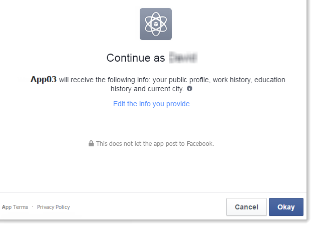
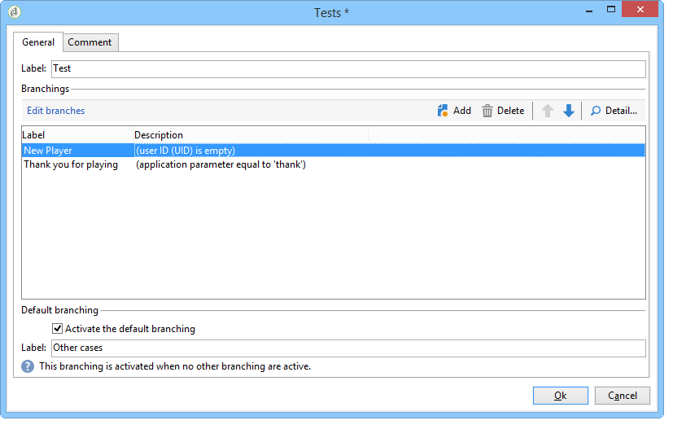
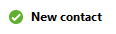
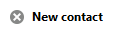

# Esempi di app Facebook{#examples-of-facebook-apps}

Quando un utente fa clic sulla scheda di un’applicazione Facebook, questa viene visualizzata in uno spazio largo 810 pixel.  Adobe Campaign utilizza un’applicazione Web di tipo Facebook per definire e personalizzare il contenuto visualizzato nell’applicazione Facebook, facilitando così l’acquisizione dei profili.

>[!NOTE]
>
>È inoltre possibile integrare  Adobe Campaign con un&#39;applicazione Facebook sviluppata da un partner. In questo caso, non è necessario utilizzare l&#39;applicazione Web  Adobe Campaign per acquisire i profili Facebook. Per ulteriori informazioni, vedere [Configurazione di account esterni](../../social/using/creating-a-facebook-application.md#configuring-external-accounts).

>[!IMPORTANT]
>
>Attenetevi ai passaggi di configurazione descritti in [Creazione di un&#39;applicazione Facebook](../../social/using/creating-a-facebook-application.md).

>[!NOTE]
>
>In questa sezione vengono descritti gli elementi collegati alle applicazioni Web di tipo Facebook. Tutti gli elementi condivisi con le applicazioni Web standard sono descritti in [questa sezione](../../web/using/about-web-applications.md).

Gli esempi di applicazioni Web di tipo Facebook descritti di seguito sono:

* Come creare un’applicazione Facebook in 7 passaggi. Fare riferimento a [Avvio rapido: creazione di un&#39;applicazione Facebook in 7 passaggi](#quick-start--creating-a-facebook-application-in-7-steps).
* Come inoltrare le impostazioni a un&#39;applicazione Facebook. Fare riferimento a [Come inoltrare le impostazioni a un&#39;applicazione Facebook?](#how-to-forward-settings-to-a-facebook-application-).
* Come acquisire i dati del ventilatore. Fare riferimento a [Come acquisire i dati della ventola?](#how-to-acquire-fan-data-).

>[!IMPORTANT]
>
>Questi casi d’uso semplici sono forniti come esempi per illustrare le funzionalità delle applicazioni Web di tipo Facebook.

## Raccomandazioni {#recommendations}

Le seguenti limitazioni sono collegate direttamente a Facebook:

* È necessario creare tutte le applicazioni Web in HTTPS.
* Un’applicazione Facebook visualizzata tramite una scheda ha una larghezza di 810 pixel.

## Avvio rapido: creazione di un&#39;applicazione Facebook in 7 passaggi {#quick-start--creating-a-facebook-application-in-7-steps}

Questo esempio fornisce un processo passo passo per visualizzare un&#39;applicazione integrata  Adobe Campaign in Facebook. In questo caso, vogliamo creare un&#39;applicazione che consenta di visualizzare il messaggio **Welcome** quando l&#39;utente fa clic sulla scheda dell&#39;applicazione (**App01**).

Per creare questa applicazione, eseguire i seguenti passaggi:

1. Creare un&#39;applicazione su Facebook ( [https://developers.facebook.com/apps](https://developers.facebook.com/apps)). Per ulteriori informazioni, consulta: [Creazione di un&#39;applicazione Facebook](../../social/using/publishing-on-facebook-walls.md#creating-a-facebook-application).

   

1. Create un account esterno di tipo **[!UICONTROL Facebook Connect]** e inserite i parametri dell&#39;applicazione Facebook. Per ulteriori informazioni, consulta: [Configurazione di account esterni](../../social/using/creating-a-facebook-application.md#configuring-external-accounts).

   

1. Immettete i collegamenti **[!UICONTROL Terms of service]** e **[!UICONTROL Privacy policy]** da visualizzare nella schermata di richiesta delle autorizzazioni di Facebook. Per ulteriori informazioni, consulta: [Inserire i collegamenti alle Condizioni del servizio e all&#39;Informativa sulla privacy](../../social/using/creating-a-facebook-application.md#entering-the-terms-of-service-and-privacy-policy-links).

   

1. Create un’applicazione Web di tipo Facebook in  Adobe Campaign. Per ulteriori informazioni, consulta: [Creazione di un&#39;applicazione Web di tipo Facebook](../../social/using/creating-a-facebook-application.md#creating-a-facebook-type-web-application).

   

1. Modificate l’applicazione Web. In questo esempio, abbiamo aggiunto un&#39;attività **[!UICONTROL Page]** e definito un titolo per essa.

   

1. Implementate l&#39;applicazione.

   

1. Configurate l’applicazione Facebook in modo che venga visualizzata come una scheda sulla pagina Facebook. Per ulteriori informazioni, consulta: [Configurazione delle schede di Facebook](../../social/using/creating-a-facebook-application.md#configuring-facebook-tabs).

   

Verificate che la scheda dell&#39;applicazione **App01** venga visualizzata sulla pagina Facebook. Facendo clic su di esso, è possibile visualizzare un messaggio **Welcome**.

## Come inoltrare le impostazioni a un&#39;applicazione Facebook? {#how-to-forward-settings-to-a-facebook-application-}

>[!IMPORTANT]
>
>Seguite i passaggi di configurazione descritti in [Creazione di un&#39;applicazione Facebook](../../social/using/creating-a-facebook-application.md).

Nell&#39;esempio 1, abbiamo personalizzato la visualizzazione della pagina Facebook in base al valore nel campo **[!UICONTROL Fan of the page]**. È inoltre possibile elaborare il campo **[!UICONTROL Application settings]**. Questo campo consente di recuperare i dati contenuti in un collegamento generato da  Adobe Campaign, tramite Facebook.

Prendiamo l&#39;esempio di una società che decide di inviare una campagna e-mail. Nella consegna, un collegamento punta all’applicazione Facebook. Questo collegamento è personalizzato grazie al parametro **[!UICONTROL app_data]** aggiunto alla fine dell&#39;URL. Il valore di questo parametro potrebbe essere un indicatore che rifletta l&#39;importanza del cliente. Nel nostro esempio, i valori del parametro **[!UICONTROL app_data]** sono **[!UICONTROL big]** (cliente significativo) e **[!UICONTROL small]** (cliente meno importante).

Una volta personalizzato, l’URL sarà simile al seguente:

* `http://<path of the Facebook application>&app_data=big` (per un cliente significativo)
* `http://<path of the Facebook application>&app_data=small` (per un cliente meno significativo)

Tra i dati anonimi inviati a  Adobe Campaign da Facebook, viene raccolto il valore del campo **[!UICONTROL Application parameters]**, consentendo  Adobe Campaign di personalizzare la visualizzazione dell&#39;applicazione in base a questo parametro.

Se l&#39;utente è un cliente significativo (il valore del parametro **[!UICONTROL app_data]** è **[!UICONTROL big]**), viene visualizzata la seguente immagine:

Se l&#39;utente è un cliente meno significativo (il valore del parametro **[!UICONTROL app_data]** è **[!UICONTROL small]**), viene visualizzata la seguente immagine:

Per ricreare questo caso di utilizzo, abbiamo creato un&#39;applicazione Web composta dai seguenti elementi:

* Un&#39;attività **[!UICONTROL Test]** basata sul campo **[!UICONTROL Application parameter]**.
* due pagine che contengono le immagini da visualizzare in base al valore del campo **[!UICONTROL Application parameter]**.

## Come acquisire i dati del ventilatore? {#how-to-acquire-fan-data-}

>[!IMPORTANT]
>
>Seguite i passaggi di configurazione descritti in [Creazione di un&#39;applicazione Facebook](../../social/using/creating-a-facebook-application.md).

Questo esempio mostra come contattare gli utenti di Facebook e offrire loro la condivisione delle informazioni sul loro profilo. Prendiamo l&#39;esempio di un&#39;azienda che vuole acquisire prospettive e organizza un concorso sulla sua pagina Facebook per attrarle.

Ogni volta che un utente fa clic sulla scheda **[!UICONTROL App03]**, gli viene chiesto se desidera partecipare al concorso.

Se decidono di partecipare al concorso, offriamo loro di condividere le loro informazioni di profilo.

Se accettano di condividere le informazioni, viene visualizzata la schermata seguente.

Per creare questo caso di utilizzo, abbiamo creato un&#39;applicazione Web che include i seguenti elementi:

* un’attività **[!UICONTROL Test]**
* tre pagine
* un&#39;attività **[!UICONTROL Access control]**
* un’attività **[!UICONTROL Pre-loading]**
* un’attività **[!UICONTROL Save]**
* un&#39;attività **[!UICONTROL End]**

### Attività di test {#test-activity}

L&#39;attività **[!UICONTROL Test]** è basata sul campo **[!UICONTROL ID]** e **[!UICONTROL Application parameters]**.

È costituito da tre rami:

* **[!UICONTROL identifier (UID) is empty]** : l’identificatore viene inoltrato da Facebook solo se l’utente ha già accettato di condividere le proprie informazioni. Il primo ramo dell&#39;attività **[!UICONTROL Test]** consente di rendere disponibile il concorso solo agli utenti che non sono mai entrati, ad esempio quelli con un ID vuoto.
* **[!UICONTROL application parameter equals 'thanks']** : per ignorare un errore di visualizzazione collegato a Facebook, la pagina finale dell’applicazione Web punta all’URL dell’applicazione Facebook a cui viene aggiunto il  **[!UICONTROL app_data]** parametro utilizzando il  **[!UICONTROL thanks]** valore (per ulteriori informazioni, fare riferimento a:  [End activity](#end-activity)). Il secondo ramo consente di verificare se l&#39;utente proviene dall&#39;attività **[!UICONTROL End]** del primo ramo (e ha appena partecipato al concorso) per visualizzare un messaggio di ringraziamento. Per ulteriori informazioni sull’utilizzo di parametri URL aggiuntivi, consultate: [Come inoltrare le impostazioni a un&#39;applicazione Facebook?](#how-to-forward-settings-to-a-facebook-application-).
* **[!UICONTROL Default branch]** : se l&#39;utente ha già partecipato al concorso (ID già inserito) in una data precedente (parametro applicazione diverso da  **[!UICONTROL thanks]**), verrà visualizzata una pagina in cui si informa che è già stato immesso.

### Pagina concorrenza {#competition-page}

Per ignorare l&#39;errore di visualizzazione collegato a Facebook, è inoltre necessario selezionare **[!UICONTROL Parent window]** o **[!UICONTROL In the top window]** nel campo **[!UICONTROL Window]** della pagina del concorso.

### Attività di controllo degli accessi {#access-control-activity}

L&#39;attività **[!UICONTROL Access control]** consente di visualizzare la pagina della richiesta di autorizzazione Facebook quando l&#39;utente partecipa al concorso. Se accettano di condividere le informazioni, queste vengono recuperate durante il precaricamento. Per ulteriori informazioni, consulta: [Attività di precaricamento](#pre-loading-activity).

Se in precedenza avete inserito l&#39;account esterno al momento della creazione dell&#39;applicazione Web (fate riferimento a [Creazione di un&#39;applicazione Web di tipo Facebook](../../social/using/creating-a-facebook-application.md#creating-a-facebook-type-web-application)) non è necessario modificare l&#39;attività. In caso contrario, andate al campo **[!UICONTROL Application]** e selezionate l&#39;account esterno collegato all&#39;applicazione Facebook.

### Attività di precaricamento {#pre-loading-activity}

Selezionare l&#39;origine dati da utilizzare per il precaricamento:

* **[!UICONTROL Marketing database]** : questa opzione consente di precaricare i dati tramite il database Adobe Campaign .
* **[!UICONTROL Facebook]** : questa opzione consente di precaricare i dati tramite Facebook.

**Database di Marketing**

Questa opzione consente di recuperare i dati di un profilo esistente nella tabella dei visitatori. La verifica viene eseguita in base all&#39;ID Facebook esterno recuperato quando l&#39;utente fa clic sulla scheda dell&#39;applicazione Facebook. Se si aggiunge un modulo dopo l&#39;attività **[!UICONTROL Pre-loading]**, i campi che contengono informazioni nel database vengono precaricati.

>[!NOTE]
>
>Per ulteriori informazioni sul precaricamento dei dati tramite il database Adobe Campaign , consultare [questa sezione](../../web/using/publishing-a-web-form.md#pre-loading-the-form-data).

**Facebook**

Questa opzione consente di definire le informazioni del profilo Facebook da raccogliere, tra quelle che l&#39;utente ha accettato di condividere, al fine di salvarle.

L&#39;opzione **[!UICONTROL Database information]** consente di raccogliere i dati seguenti:

* **[!UICONTROL External ID]**: ID utente
* **[!UICONTROL Gender]**: genere dell&#39;utente
* **[!UICONTROL Verified]** : questo campo specifica se l&#39;utente dispone o meno di un account Facebook verificato.
* **[!UICONTROL Full name]**: nome completo dell&#39;utente
* **[!UICONTROL First name]**: nome utente
* **[!UICONTROL Last name]**: cognome utente
* **[!UICONTROL Language]**: lingua dell&#39;utente

È inoltre possibile scegliere di raccogliere la foto del profilo, l&#39;elenco degli amici, l&#39;indirizzo e-mail, la data di nascita, gli interessi e la posizione selezionando le caselle corrispondenti.

Prima di fare clic su **[!UICONTROL Ok]**, selezionare la casella **[!UICONTROL I agree to comply with Facebook conditions of use]**.

>[!NOTE]
>
>Se selezionate una o più caselle nella sezione **[!UICONTROL Private information]**, nella schermata di richiesta delle autorizzazioni di Facebook verrà visualizzata automaticamente la richiesta di accesso per questi dati.
>
>Per poter raccogliere le informazioni selezionate, l&#39;utente deve accettare di condividerle.
>
>Se desiderate entrambi i tipi di precaricamento (tramite  Adobe Campaign e tramite Facebook), aggiungete due caselle di precaricamento una dopo l’altra.

### Salva attività {#save-activity}

L&#39;attività **[!UICONTROL Save]** consente di memorizzare le informazioni raccolte durante le fasi precedenti nella tabella dei visitatori.

Se il profilo esiste già nella tabella dei visitatori, i loro dati vengono aggiornati con i nuovi dati raccolti.

Se il profilo non esiste nel database e l&#39;indirizzo e-mail dell&#39;utente Facebook è stato raccolto, un visitatore verrà creato nella tabella dei visitatori.

1. Nel campo **[!UICONTROL Visitor creation folder]**, selezionate la cartella in cui verrà creato il profilo. Nel caso di un’applicazione Web di tipo Facebook, la cartella di creazione predefinita è **[!UICONTROL Visitors]**.
1. Nel campo **[!UICONTROL Reconciliation mode]**, selezionare la modalità di riconciliazione da utilizzare:

   * **[!UICONTROL Automatic]** : La quadratura è effettuata sulla base di email, cognome, nome e data di nascita.
   * **[!UICONTROL Manual]** : Selezionare una o più chiavi di riconciliazione.
   * **[!UICONTROL None]** : Non ci sarà alcuna riconciliazione.

1. Nel campo **[!UICONTROL Mapping]**, selezionare lo schema su cui si desidera eseguire la riconciliazione.

   >[!IMPORTANT]
   >
   >Verificate che i campi della scheda **[!UICONTROL Social networks]** siano immessi correttamente nel mapping di consegna. Le mappature di distribuzione sono accessibili tramite il nodo **[!UICONTROL Administration > Campaign management > Target mappings]**.

1. Potete selezionare una cartella di ricerca per la riconciliazione e una cartella di creazione per i nuovi profili. Se i campi sono vuoti, la ricerca e la creazione dei profili vengono effettuate nella cartella predefinita dello schema di mappatura.

### Attività fine {#end-activity}

Per ignorare l&#39;errore di visualizzazione collegato a Facebook, è necessario selezionare la casella **[!UICONTROL Use an external URL]** e immettere l&#39;URL dell&#39;applicazione Facebook, seguito dal parametro **[!UICONTROL app_data]** e da un valore. Questo valore verrà utilizzato nell&#39;attività **[!UICONTROL Test]** per rilevare se l&#39;utente è appena entrato nel concorso e per visualizzare un messaggio di ringraziamento, se applicabile. Per ulteriori informazioni, consulta: [Attività di test](#test-activity).

Nel nostro esempio, il valore utilizzato è **Ringraziamenti**.

### Schermata dei dettagli di un visitatore {#details-screen-of-a-visitor}

Come per i follower su Twitter (consulta: [Principio operativo](../../social/using/publishing-on-twitter.md#operating-principle)), i profili Facebook recuperati sono memorizzati nella tabella dei visitatori. Per visualizzare l&#39;elenco dei visitatori, andate al nodo **[!UICONTROL Profiles and Targets > Visitors]**.

Ogni potenziale Facebook che accetta di condividere le proprie informazioni sul profilo viene aggiunto all&#39;elenco dei visitatori. Se la casella **[!UICONTROL Friends]** è selezionata nell&#39;attività **[!UICONTROL Pre-load]** (fare riferimento a: [Attività di precaricamento](#pre-loading-activity)), vengono aggiunti anche gli amici.

Nella sezione **[!UICONTROL Summary]** della finestra dei dettagli del visitatore, vi sono due stati possibili per l&#39;indicatore **[!UICONTROL New Contact]**:

Se viene visualizzato un segno di spunta verde, significa che il visitatore non è stato riconciliato con i destinatari. In questo caso, nell&#39;elenco dei destinatari viene creato un nuovo profilo.

Una croce rossa indica che il visitatore è stato riconciliato con un destinatario. È possibile fare clic sulla lente di ingrandimento a destra del campo **[!UICONTROL Recipient]** per visualizzare il destinatario corrispondente.

Vai alla finestra dei dettagli di un destinatario per visualizzare il visitatore corrispondente, se applicabile. Selezionate la scheda **[!UICONTROL Others]**, quindi fate doppio clic sul nome del visitatore nella sezione **[!UICONTROL Web identities]**.

La schermata **[!UICONTROL Activities]** della pagina dei dettagli di un visitatore contiene le seguenti informazioni:

* &quot;Open Graph&quot; tipo attività ventilatore: musica giocata, video guardati, articoli letti e deduzioni delle applicazioni installate (Deezer, Spotify, Dailymotion, Yahoo News, ecc.)

   

* &quot;Mi piace&quot; e commenti aggiunti dalla ventola in seguito alle consegne inviate da  Adobe Campaign
* pagine apprezzate dal fan
* check-in della ventola

   

   >[!NOTE]
   >
   >Affinché  Adobe Campaign possa raccogliere i check-in di una ventola, è necessario fare clic sul pulsante **[!UICONTROL Subscribe]** nella schermata di configurazione del servizio. Per ulteriori informazioni, vedere [Configurazione di account esterni](../../social/using/creating-a-facebook-application.md#configuring-external-accounts).

## Come precaricare i campi di un modulo utilizzando i dati del profilo di Facebook {#how-to-pre-load-the-fields-of-a-form-using-facebook-profile-data}

L&#39;applicazione **[!UICONTROL Social Marketing]** consente inoltre di aggiungere un pulsante a un modulo per precaricare i campi utilizzando le informazioni del profilo Facebook. Questa opzione, disponibile in tutti i modelli di applicazione Web (attività di tipo **[!UICONTROL Page]**), è descritta in [questa sezione](../../web/using/static-elements-in-a-web-form.md#inserting-html-content).

>[!NOTE]
>
>Prima di iniziare a utilizzare questa funzione, è necessario creare un&#39;applicazione Facebook e un account esterno di tipo **[!UICONTROL Facebook Connect]**. Per ulteriori informazioni, vedere [Configurazione di account esterni](../../social/using/creating-a-facebook-application.md#configuring-external-accounts).

