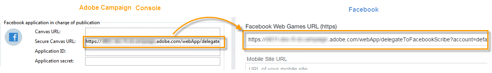

# Pubblicazione su bacheche Facebook{#publishing-on-facebook-walls}

Affinché  Adobe Campaign possa inviare pubblicazioni alle mura di Facebook, è necessario delegare l&#39;accesso in scrittura per queste pagine a  Adobe Campaign. Sono previsti i seguenti passaggi di configurazione:

1. Create un account Facebook con una o più pagine.
1. Create una pagina Facebook di prova per l’invio delle prove.
1. Creare un’applicazione Facebook.
1. Immettete le impostazioni dell’applicazione Facebook in  Adobe Campaign, nell’account **[!UICONTROL Facebook routing]** esterno.

## Prerequisiti {#prerequisites}

Per iniziare, create un account Facebook e diverse pagine: verranno utilizzati per inviare pubblicazioni.

* Per creare un account Facebook, usate il collegamento [https://www.facebook.com](https://www.facebook.com) .
* Per creare una pagina Facebook, usate il collegamento [https://www.facebook.com/pages/create](https://www.facebook.com/pages/create) .

   È consigliabile utilizzare lo stesso account Facebook per amministrare tutte le pagine. In questo modo, avrete bisogno solo di un&#39;applicazione Facebook e di un account esterno per scrivere su tutte le pagine dell&#39;account.

   

## Creazione di una pagina Facebook di prova {#creating-a-test-facebook-page}

È consigliabile creare una pagina Facebook privata per la distribuzione delle prove di pubblicazione (per ulteriori informazioni, vedere [Invio delle prove](../../social/using/publishing-on-facebook.md#sending-the-proof).

1. Accedete all&#39;account Facebook che utilizzate per amministrare le pagine.
1. Create una nuova pagina Facebook.
1. Fate clic sul **[!UICONTROL Settings]** pulsante nell’angolo in alto a destra.
1. Nella **[!UICONTROL General]** scheda, modificate i parametri di visibilità della pagina: selezionate la **[!UICONTROL Page unpublished]** casella.
1. Fai clic sul pulsante **[!UICONTROL Save Changes]**.

## Creazione di un’app Facebook {#creating-a-facebook-application}

Affinché  Adobe Campaign possa pubblicare le pagine sui muri, è necessario creare un’applicazione Facebook. A questo scopo, eseguire i seguenti passaggi:

1. Accedete all’account Facebook che utilizzate per amministrare le pagine.
1. Inserite il seguente indirizzo nel browser: [https://developers.facebook.com/apps](https://developers.facebook.com/apps).

   >[!IMPORTANT]
   >
   >A seconda del tipo di account in uso, potrebbe essere necessaria una o più autorizzazioni.
   >
   >Per creare un&#39;applicazione Facebook, è necessario un account Facebook **verificato** .

1. Fate clic sul **[!UICONTROL Add a New App]** pulsante nell’angolo in alto a destra della pagina. Immettete un nome app e un messaggio e-mail di contatto, quindi passate il controllo di sicurezza.

   

1. In **[!UICONTROL Settings > Basic]**, fare clic su **[!UICONTROL Add a platform]** e selezionare il **[!UICONTROL Facebook Web Games]** tipo.

   

1. Nella **[!UICONTROL Products]** sezione, nel menu a sinistra, verificate di aver visto il **[!UICONTROL Facebook Login]** prodotto. In caso contrario, aggiungete un nuovo prodotto e selezionate **[!UICONTROL Facebook Login]**.

   

1. Una volta creata l&#39;applicazione, selezionate la **[!UICONTROL App Review]** scheda e pubblicate l&#39;applicazione.

   

## Delega dell&#39;accesso in scrittura a  Adobe Campaign {#delegating-write-access-to-adobe-campaign}

Per delegare l&#39;accesso in scrittura a  Adobe Campaign per la pubblicazione sui muri delle pagine, è necessario immettere i parametri dell&#39;applicazione Facebook creata in precedenza.

Questo passaggio richiede l’accesso sia alla console Adobe Campaign  che a un browser Internet connesso all’account Facebook che utilizzate per l’amministrazione delle pagine:

>[!IMPORTANT]
>
>L&#39;operatore Adobe Campaign  deve disporre dei diritti di amministrazione per eseguire questa configurazione.

* **Facebook**: selezionate l’applicazione creata in precedenza ( [https://developers.facebook.com/apps](https://developers.facebook.com/apps)), quindi selezionate la **[!UICONTROL Settings > Basic]** scheda.

   

   >[!NOTE]
   >
   >Se la **[!UICONTROL Facebook Web Games]** sezione non viene visualizzata, fate clic sul **[!UICONTROL Add Platform]** pulsante, nella parte inferiore della pagina, quindi selezionate **[!UICONTROL Facebook Web Games]**.

* **Adobe Campaign**: andate al **[!UICONTROL Administration > Platform > External Accounts]** nodo della struttura, selezionate l&#39;account **[!UICONTROL Facebook routing]** esterno e fate clic sulla **[!UICONTROL Connector]** scheda.

   

1. Nella console Adobe Campaign , copiate l’indirizzo contenuto nel **[!UICONTROL Secure Canvas URL]** campo e incollatelo nel **[!UICONTROL Secure Web Games URL (https)]** campo su Facebook (nella **[!UICONTROL Facebook Web Games]** sezione).

   

   >[!IMPORTANT]
   >
   >Non è necessario utilizzare l&#39;URL non sicuro in nessun caso.

   Copiate e incollate questo URL anche in **[!UICONTROL Products]** > **[!UICONTROL Facebook Login]** > **[!UICONTROL Settings]** > **[!UICONTROL Valid OAuth Redirect URIs]**. Per verificare la validità dell’URL, salvate l’applicazione, copiate e incollate l’URL nel **[!UICONTROL Redirect URI to Check]** campo e fate clic su **[!UICONTROL Check URI]**.

   

1. In Facebook, copiate il contenuto dei **[!UICONTROL App ID]** campi e **[!UICONTROL App Secret]** incollatelo nei campi corrispondenti della console.

   

1. Su Facebook, fate clic sul **[!UICONTROL Save Changes]** pulsante in fondo alla pagina.
1. Passate alla  console Adobe Campaign e salvate l’account esterno.

   >[!NOTE]
   >
   >The **[!UICONTROL Marketing URL]** field is optional.

1. Nella console Adobe Campaign , fate clic sul **[!UICONTROL Request the authorization from the application]** collegamento nella parte inferiore della **[!UICONTROL Connector]** scheda. Il **[!UICONTROL Synchronize Facebook pages]** flusso di lavoro viene attivato automaticamente e raccoglie tutte le pagine Facebook gestite dall’amministratore. Per ulteriori informazioni, consultate [Sincronizzazione delle pagine](#synchronizing-facebook-pages)Facebook.

   

   >[!NOTE]
   >
   >Per impostazione predefinita, le pagine vengono aggiunte alla cartella del **[!UICONTROL Facebook]** servizio, disponibile tramite il **[!UICONTROL Profiles and Targets > Services and Subscriptions]** nodo. Il **[!UICONTROL Folder]** campo della **[!UICONTROL Connector]** scheda consente di modificare la cartella del servizio in cui vengono create le pagine Facebook dopo la sincronizzazione. È inoltre possibile selezionare le pagine Facebook da sincronizzare in  Adobe Campaign grazie al **[!UICONTROL Filter]** campo. Se lasciate vuoto questo campo, tutte le pagine Facebook gestite dall’amministratore verranno sincronizzate.

1. Viene visualizzata una finestra di dialogo con le varie impostazioni di autorizzazione di Facebook. Questi consentono  Adobe Campaign di inviare pubblicazioni alle pagine dell&#39;account Facebook.

   Accettate le varie richieste di autorizzazione.

   

1.  Adobe Campaign ha il diritto di pubblicare le pagine dell&#39;account Facebook.

   

>[!NOTE]
>
>Se l&#39;account Facebook gestisce diverse pagine, è sufficiente configurare un account esterno per scrivere su qualsiasi pagina dell&#39;account Facebook. Per ogni nuovo account Facebook, dovrete creare un nuovo account esterno di tipo **[!UICONTROL Routing]** Facebook.

Il **[!UICONTROL Synchronization of Facebook pages]** flusso di lavoro sincronizza tutte le pagine amministrate dall&#39;account Facebook, per consentirvi di pubblicare direttamente sulla loro bacheca tramite  Adobe Campaign. Per ulteriori informazioni, consultate [Sincronizzazione delle pagine](#synchronizing-facebook-pages)Facebook.

## Sincronizzazione delle pagine Facebook {#synchronizing-facebook-pages}

Il **[!UICONTROL Synchronization of Facebook pages]** flusso di lavoro, a cui si accede tramite il **[!UICONTROL Administration > Production > Technical workflows > Managing social networks]** nodo, consente di sincronizzare (in  Adobe Campaign) le pagine dell&#39;account Facebook configurato in precedenza. Per impostazione predefinita, questo flusso di lavoro è configurato per essere eseguito una volta al giorno o ogni volta che un amministratore fa clic sul **[!UICONTROL Request an authorization from the application]** collegamento nella schermata di configurazione del servizio (vedere [Delega dell&#39;accesso in scrittura a  Adobe Campaign](#delegating-write-access-to-adobe-campaign)).

Una volta completata la sincronizzazione, le pagine raccolte vengono visualizzate nella cartella del servizio inserita nell&#39;account esterno (vedere [Delegazione dell&#39;accesso in scrittura a  Adobe Campaign](#delegating-write-access-to-adobe-campaign)). Per impostazione predefinita, le pagine vengono aggiunte alla directory principale della cartella del **[!UICONTROL Facebook]** servizio, disponibile tramite il **[!UICONTROL Profiles and Targets > Services and subscriptions]** menu.

È ora possibile pubblicare contenuti sulle pareti delle pagine Facebook direttamente tramite  Adobe Campaign. Per ulteriori informazioni, consultate [Pubblicazione su Facebook](#publishing-on-facebook-walls).
