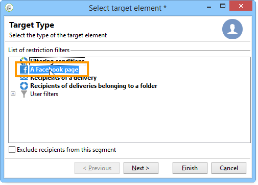
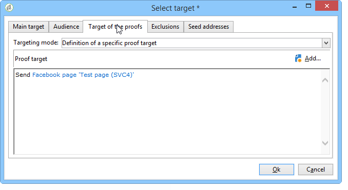
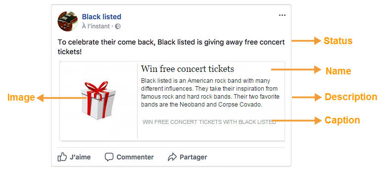

# Pubblicazione su Facebook{#publishing-on-facebook}

Una volta completata la configurazione, Social Marketing vi consente di pubblicare pubblicazioni sui muri delle vostre pagine Facebook.

## Limitazioni {#limitations}

Le seguenti limitazioni sono inerenti a Facebook.

* I messaggi non possono superare i 1.000 caratteri.
* HTML non è supportato.

## Creazione della consegna {#creating-the-delivery}

Create una nuova consegna utilizzando il modello di consegna **[!UICONTROL Publish to a brand page]**.

## Selezione della destinazione principale {#selecting-the-main-target}

È necessario selezionare le pagine sulle quali si desidera pubblicare la pubblicazione.

1. Fare clic sul collegamento **[!UICONTROL To]**.

   

1. Fai clic sul pulsante **[!UICONTROL Add]**.

   

1. Seleziona **[!UICONTROL A Facebook page]**.

   

1. Nel campo **[!UICONTROL Folder]**, selezionate la cartella del servizio che contiene la pagina Facebook. Per impostazione predefinita, le pagine sono memorizzate nella directory principale della cartella **[!UICONTROL Facebook]** del servizio. Selezionate quindi la pagina Facebook sulla quale desiderate pubblicare i post.

   

## Selezione della destinazione della prova {#selecting-the-proof-target}

La scheda **[!UICONTROL Target of the proofs]** consente di definire la pagina Facebook da utilizzare per testare le consegne prima di inviarle. È consigliabile creare a tal fine una pagina Facebook privata dedicata. Per ulteriori informazioni sulla creazione di una pagina Facebook privata, vedere [Creazione di una pagina Facebook di prova](../../social/using/publishing-on-facebook-walls.md#creating-a-test-facebook-page). Per selezionare la destinazione di prova, eseguire le stesse operazioni della destinazione principale: [Selezione della destinazione principale](#selecting-the-main-target).

>[!NOTE]
>
>Se utilizzate la stessa pagina di test Facebook per tutte le consegne, potete salvare la destinazione della prova nel modello di consegna **[!UICONTROL Publish to a brand page]**, a cui si accede tramite il nodo **[!UICONTROL Resources > Templates > Delivery templates]**. La destinazione della prova verrà immessa per impostazione predefinita per ogni nuova consegna.

## Definizione dell&#39;audience {#defining-the-audience}

Se desiderate utilizzare i segmenti locali per definire il tipo di pubblico autorizzato a visualizzare la pubblicazione, è consigliabile creare una pagina Facebook per segmento (ad esempio:  Adobe Campaign Paris,  Adobe Campaign London, ecc.).

Tuttavia è anche possibile utilizzare i filtri per l&#39;audience utilizzati da Facebook. La scheda **[!UICONTROL Audience]** di **[!UICONTROL Select target window]** offre quattro filtri:

* **[!UICONTROL Country]**
* **[!UICONTROL Regions]**
* **[!UICONTROL Cities]**
* **[!UICONTROL Languages]**

>[!IMPORTANT]
>
>Utilizzate questa funzione con attenzione. Nei report di consegna, l&#39;indicatore **[!UICONTROL Number of fans]** non terrà conto di questi filtri Facebook.
>
>Facebook può modificare l&#39;elenco dei filtri per l&#39;audience e i relativi valori.

## Definizione del contenuto del messaggio {#defining-message-content}

Selezionare il tipo di pubblicazione utilizzando il menu a discesa **[!UICONTROL Content type]**.

Sono disponibili i seguenti tipi di consegne:

* a **[!UICONTROL Status]**
* a **[!UICONTROL Status with a link]**
* a **[!UICONTROL Status with a YouTube link]**
* a **[!UICONTROL Photo album]**

### Pubblicazione di uno stato {#publishing-a-status}

Un recapito del tipo di stato può contenere solo testo, come nell&#39;esempio seguente:

Inserire lo stato di pubblicazione nella zona di input.

### Pubblicazione di uno stato con un collegamento {#publishing-a-status-with-a-link}

Un tipo di stato fornito con un collegamento può contenere testo, immagini e un collegamento. Nella sezione seguente viene descritta la simmetria tra i campi della schermata di distribuzione e la pubblicazione finale su Facebook:

Immettete i vari campi:

>[!IMPORTANT]
>
>Tutti gli URL devono iniziare con **&quot;http://&quot;** o **&quot;https://&quot;**.

1. Nel campo **[!UICONTROL Status]**, inserite il testo che verrà visualizzato sotto il nome della pagina.
1. Nel campo **[!UICONTROL Name]**, inserire il titolo della pubblicazione.
1. Nel campo **[!UICONTROL Link]**, inserite l&#39;URL a cui punta la pubblicazione.

   >[!NOTE]
   >
   >Se desiderate aggiungere il campo **[!UICONTROL Link]** all&#39;URL di un&#39;applicazione Facebook per promuoverlo, vi consigliamo di adattarlo ai criteri di visualizzazione dello smartphone:
   >
   >1. Selezionate l&#39;applicazione Facebook [https://developers.facebook.com/apps](https://developers.facebook.com/apps), quindi selezionate la scheda **[!UICONTROL Settings > Basic]**.
   >1. Immettere il campo **[!UICONTROL Namespace]**.
   >1. Immettere il campo **[!UICONTROL Mobile Site URL]**: quando un utente fa clic sul collegamento della pubblicazione sul proprio smartphone, viene automaticamente reindirizzato da Facebook all&#39;URL definito in questo campo.
   >1. Create l&#39;applicazione Web in modo che il display di Facebook sia personalizzato in funzione del dispositivo utilizzato (smartphone o PC).
   >1. Andate al campo **[!UICONTROL Link]** della pubblicazione tramite la console Adobe Campaign , immettete l&#39;URL del campo **[!UICONTROL Canvas page]**.

1. Nel campo **[!UICONTROL Image]**, immettete l&#39;URL dell&#39;immagine che verrà visualizzata a sinistra della pubblicazione.

   >[!IMPORTANT]
   >
   >L&#39;immagine deve essere ospitata su un sito Internet pubblico per poter essere caricata da Facebook.

1. Nel campo **[!UICONTROL Caption]**, inserite il testo che verrà visualizzato alla fine della pubblicazione.
1. Andate al campo **[!UICONTROL Description]** e immettete il testo da visualizzare sotto il titolo.

### Pubblicazione di uno stato con un collegamento YouTube {#publishing-a-status-with-a-youtube-link}

Questo tipo di contenuto consente di pubblicare un collegamento a un video di YouTube. Come per uno stato con un collegamento regolare, potete definire uno stato, un nome, una didascalia, una descrizione e un collegamento aggiuntivo. L’immagine viene aggiunta automaticamente da Facebook. Le simmetrie tra i campi della schermata di distribuzione e la pubblicazione finale su Facebook sono descritte di seguito:

Immettete i vari campi:

>[!IMPORTANT]
>
>Tutti gli URL devono iniziare con **&quot;http://&quot;** o **&quot;https://&quot;**.

1. Nel campo **[!UICONTROL Status]**, inserite il testo che verrà visualizzato sotto il nome della pagina.
1. Nel campo **[!UICONTROL Name]**, inserire il titolo della pubblicazione.
1. Nel campo **[!UICONTROL Video code]**, inserite il codice del video YouTube. Ad esempio, per il collegamento https://www.youtube.com/watch?v=abc123456&#39;, il codice video sarà &#39;abc123456&#39;.
1. Nel campo **[!UICONTROL Caption]**, inserite il testo che verrà visualizzato alla fine della pubblicazione.
1. Andate al campo **[!UICONTROL Description]** e immettete il testo da visualizzare sotto il titolo.

### Pubblicazione di un album fotografico {#publishing-a-photo-album}

Questo tipo di contenuto consente di pubblicare un album fotografico. Potete aggiungere un nome e una descrizione per l&#39;album, nonché una didascalia per ogni foto. Le simmetrie tra i campi della schermata di distribuzione e la pubblicazione finale su Facebook sono descritte di seguito:

Immettete i vari campi:

1. Iniziate immettendo la **[!UICONTROL Album name]**.
1. Quindi immettete il **[!UICONTROL Description]** da visualizzare sopra le foto.
1. Per aggiungere una foto, fate clic sul pulsante **[!UICONTROL Add]**, selezionate la foto e fate clic su **[!UICONTROL Open]**.
1. È possibile aggiungere una didascalia a ogni foto.

## Anteprima di {#previewing}

La scheda **[!UICONTROL Preview]** consente di visualizzare il rendering della pubblicazione.

1. Fare clic sulla scheda **[!UICONTROL Preview]**.
1. Fare clic sul menu a discesa **[!UICONTROL Test personalization]** e selezionare **[!UICONTROL Service]**.
1. Nel campo **[!UICONTROL Folder]**, selezionate la cartella del servizio che contiene le pagine Facebook. Per impostazione predefinita, le pagine sono memorizzate nella directory principale della cartella del servizio **[!UICONTROL Facebook]**.
1. Selezionate la pagina Facebook sulla quale desiderate testare l’anteprima.

>[!NOTE]
>
>L’anteprima potrebbe essere leggermente diversa dalla pubblicazione finale su Facebook. Si consiglia vivamente di inviare una prova prima della consegna finale per un rendering esatto della pubblicazione. Fare riferimento a [Invio della prova](#sending-the-proof).

## Configurazione del tracciamento {#configuring-tracking}

Il tracciamento può essere visualizzato nei rapporti di consegna e nella scheda **[!UICONTROL Edit > Tracking]** della consegna e del servizio.

I clic sull’URL contenuto nella consegna vengono misurati da  Adobe Campaign. Il numero di clic sul pulsante **[!UICONTROL Like]**, il numero di commenti e il numero di fan sono misurati da Facebook.

La configurazione del tracciamento è la stessa di una distribuzione tramite e-mail. Per ulteriori informazioni al riguardo, consulta [questa sezione](../../delivery/using/about-delivery-monitoring.md).

>[!NOTE]
>
>Nel modello di consegna **[!UICONTROL Publish to a brand page]**, il tracciamento è attivato per impostazione predefinita.

## Invio della prova {#sending-the-proof}

Si consiglia vivamente di inviare una prova della pubblicazione prima della consegna finale per visualizzare l&#39;esatto rendering della pubblicazione su una pagina di test Facebook privata. Per ulteriori informazioni sulla creazione di una pagina di test Facebook privata, fare riferimento a [Creazione di una pagina Facebook di test](../../social/using/publishing-on-facebook-walls.md#creating-a-test-facebook-page). I passaggi per selezionare la prova di destinazione sono descritti in [Selezione della prova di destinazione](#selecting-the-proof-target).

La consegna della prova è identica alle consegne tramite e-mail. Fai riferimento a [questa sezione](../../delivery/using/steps-validating-the-delivery.md#sending-a-proof).

## Invio del messaggio {#sending-the-message}

1. Una volta approvato il contenuto, fate clic sul pulsante **[!UICONTROL Send]**.
1. Selezionare **[!UICONTROL Deliver as soon as possible]** e fare clic sul pulsante **[!UICONTROL Analyze]**.

   >[!NOTE]
   >
   >L&#39;opzione **[!UICONTROL Postpone the delivery]** consente di posticipare la consegna a una data successiva.

   

1. Una volta completata l&#39;analisi, verificare il risultato.
1. Fare clic su **[!UICONTROL Confirm delivery]**, quindi su **[!UICONTROL Yes]**.

   

