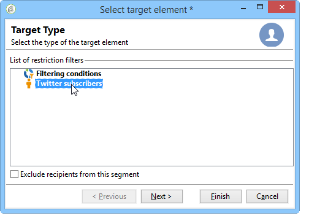
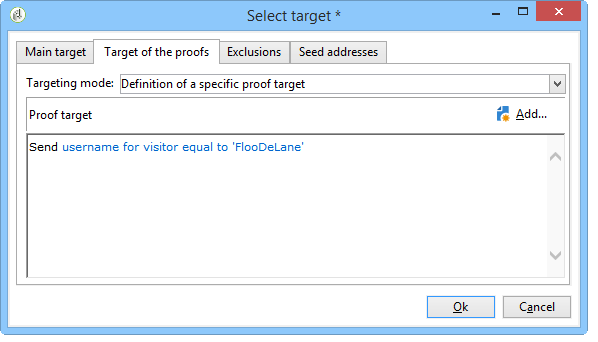
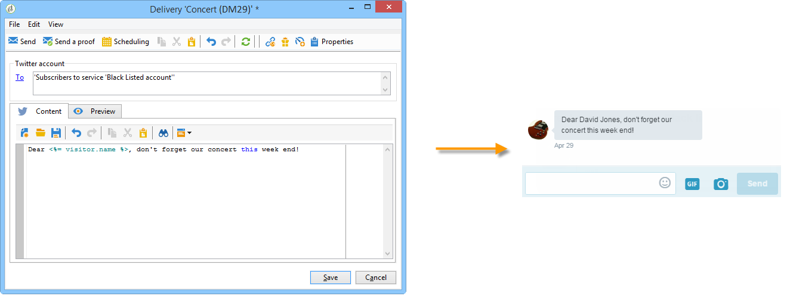

# Pubblicazione su Twitter{#publishing-on-twitter}

## Pubblicazione sugli account Twitter {#publishing-on-your-twitter-accounts}

Una volta completata la configurazione, Social Marketing vi consente di inviare tweet ai vostri account Twitter.

### Limitazioni {#limitations}

Le seguenti limitazioni sono limitazioni inerenti a Twitter.

* Il messaggio non può contenere più di 140 caratteri.
* Il formato HTML non è supportato.

### Creazione della consegna {#creating-the-delivery}

Create una nuova consegna basata sul modello di **[!UICONTROL Tweet (twitter)]** consegna.

### Selecting the main target {#selecting-the-main-target}

Selezionate gli account a cui desiderate inviare i tweet.

1. Fate clic sul **[!UICONTROL To]** collegamento.

   

1. Fai clic sul pulsante **[!UICONTROL Add]**.

   

1. Seleziona **[!UICONTROL A Twitter account]**.

   

1. Nel **[!UICONTROL Folder]** campo, selezionate la cartella del servizio che contiene l’account Twitter. Selezionate quindi l’account Twitter a cui desiderate inviare il tweet.

   

### Selezione della destinazione della prova {#selecting-the-target-of-the-proof}

La **[!UICONTROL Target of the proofs]** scheda consente di definire l&#39;account Twitter da utilizzare per le consegne di test prima della consegna finale. Si consiglia pertanto di creare un account Twitter privato dedicato all&#39;invio di prove. Per ulteriori informazioni su come creare un account Twitter privato, consultate [Creazione di un account di prova su Twitter](../../social/using/configuring-publishing-on-twitter.md#creating-a-test-account-on-twitter). La selezione della destinazione di prova avviene nello stesso modo della selezione della destinazione principale. Fate riferimento a [Creazione di un account di prova su Twitter](../../social/using/configuring-publishing-on-twitter.md#creating-a-test-account-on-twitter).

>[!NOTE]
>
>Se utilizzate lo stesso account di test Twitter per tutte le consegne, potete salvare la destinazione della prova nel modello di **[!UICONTROL Tweet]** consegna, a cui accedete tramite il **[!UICONTROL Resources > Templates > Delivery templates]** nodo. La destinazione della prova verrà quindi immessa per impostazione predefinita per ogni nuova consegna.

### Definizione del contenuto del messaggio {#defining-the-message-content}

Digita il contenuto del tweet nella **[!UICONTROL Content]** scheda.

### Visualizzazione dell’anteprima {#viewing-the-preview}

La **[!UICONTROL Preview]** scheda consente di visualizzare un rendering del tweet.

1. Fate clic sulla **[!UICONTROL Preview]** scheda.
1. Fare clic sul **[!UICONTROL Test personalization]** menu a discesa e selezionare **[!UICONTROL Service]**.
1. Nel **[!UICONTROL Folder]** campo, selezionate la cartella del servizio che contiene il vostro account Twitter.
1. Scegliete l’account Twitter con cui testare l’anteprima.

>[!NOTE]
>
>L’anteprima può essere leggermente diversa dal tweet finale. Si consiglia vivamente di inviare una prova prima della consegna finale per visualizzare un rendering esatto del tweet. Fare riferimento a [Invio della prova](#sending-the-proof).

### Configurazione del tracciamento {#configuring-tracking}

Il tracciamento può essere visualizzato nei rapporti di consegna e nella **[!UICONTROL Edit > Tracking]** scheda della consegna e del servizio.

La configurazione del tracciamento è la stessa di una distribuzione tramite e-mail. Per ulteriori informazioni al riguardo, consulta [questa sezione](../../delivery/using/monitoring-a-delivery.md).

>[!NOTE]
>
>Nel modello di **[!UICONTROL Tweet]** consegna, il tracciamento è attivato per impostazione predefinita.

>[!IMPORTANT]
>
>Non riusciamo a distinguere tra robot che analizzano tweet e utenti che stanno cliccando.

### Invio della prova {#sending-the-proof}

Si consiglia vivamente di inviare una prova della pubblicazione prima della consegna finale per ottenere un rendering esatto della pubblicazione su una pagina privata di test Twitter. Per ulteriori informazioni sulla creazione di un account Twitter privato, consultate [Creazione di un account di prova su Twitter](../../social/using/configuring-publishing-on-twitter.md#creating-a-test-account-on-twitter). I passaggi per selezionare la destinazione della prova sono descritti in [Selezione della destinazione della prova](#selecting-the-target-of-the-proof).

La consegna della prova è identica alle consegne tramite e-mail. Fai riferimento a [questa sezione](../../delivery/using/steps-validating-the-delivery.md#sending-a-proof).

### Invio del messaggio {#sending-the-message}

1. Una volta approvato il contenuto, fate clic sul **[!UICONTROL Send]** pulsante .
1. Selezionate **[!UICONTROL Deliver as soon as possible]** e fate clic sul **[!UICONTROL Analyze]** pulsante.

   >[!NOTE]
   >
   >L&#39; **[!UICONTROL Postpone the delivery]** opzione consente di posticipare la consegna a una data successiva.

   

1. Al termine dell&#39;analisi, verificare il risultato.
1. Fate clic **[!UICONTROL Confirm delivery]**, quindi fate clic **[!UICONTROL Yes]**.

## Invio di messaggi diretti agli abbonati {#sending-direct-messages-to-subscribers}

### Principio di funzionamento {#operating-principle}

Il **[!UICONTROL Synchronize Twitter accounts]** flusso di lavoro (fare riferimento a [Sincronizzazione degli account](../../social/using/configuring-publishing-on-twitter.md#synchronizing-twitter-accounts)Twitter) recupera l&#39;elenco degli utenti Twitter in modo da poter inviare loro messaggi diretti. I follower recuperati sono memorizzati in una tabella specifica: la tabella dei visitatori. Per visualizzare l&#39;elenco dei follower di Twitter, andate al **[!UICONTROL Profiles and Targets > Visitors]** nodo.

>[!IMPORTANT]
>
>Affinché il flusso di lavoro possa recuperare l’elenco dei follower di Twitter, la **[!UICONTROL Synchronize Twitter accounts]** casella deve essere selezionata nella schermata Modifica del servizio collegato all’account. Per ulteriori informazioni, consulta: [Delega dell&#39;accesso in scrittura a  Adobe Campaign](../../social/using/configuring-publishing-on-twitter.md#delegating-write-access-to-adobe-campaign).

Per ciascun follower,  Adobe Campaign recupera le informazioni seguenti:

* **[!UICONTROL Origin]**: nome del social network (**Twitter** in questo caso)
* **[!UICONTROL External ID]**: user identifier
* **[!UICONTROL User name]**: nome account dell&#39;utente
* **[!UICONTROL Full name]**: nome dell’utente
* **[!UICONTROL Language]**: lingua utente
* **[!UICONTROL Number of friends]**: numero di follower
* **[!UICONTROL Time zone]**: fuso orario utente
* **[!UICONTROL Verified]**: questo campo indica se l&#39;utente dispone di un account Twitter verificato

### Limitazioni {#limitations-1}

Le seguenti limitazioni sono limitazioni inerenti a Twitter.

* Il messaggio non può contenere più di 140 caratteri.
* HTML non è supportato.
* Non è possibile inviare più di 250 messaggi diretti al giorno. Per evitare di superare questa soglia, potete eseguire diverse operazioni. Le consegne nelle onde sono configurate come le consegne tramite e-mail. Per ulteriori informazioni al riguardo, consulta [questa sezione](../../delivery/using/steps-sending-the-delivery.md#sending-using-multiple-waves).

### Creazione della consegna {#creating-the-delivery-}

Create una nuova consegna basata sul modello di **[!UICONTROL Tweet (Direct Message)]** consegna.

### Selecting the main target {#selecting-the-main-target-1}

Seleziona i follower a cui inviare il messaggio diretto.

1. Fate clic sul **[!UICONTROL To]** collegamento.

   

1. Fai clic sul pulsante **[!UICONTROL Add]**.

   

1. Selezionate un tipo di targeting.

   

   * Selezionate questa opzione **[!UICONTROL Twitter subscribers]** per inviare un messaggio diretto a tutti i follower dell&#39;account.

      >[!IMPORTANT]
      >
      >Non è possibile inviare più di 250 messaggi al giorno. Se il vostro account Twitter ha più di 250 follower, consigliamo vivamente di fornire ondate di messaggi. Ciò implica lo stesso processo delle comunicazioni e-mail. Fai riferimento a [questa sezione](../../delivery/using/steps-sending-the-delivery.md#sending-using-multiple-waves).

   * Selezionare **[!UICONTROL Filter conditions]** per definire una query e visualizzarne il risultato. Questa opzione è identica a quella per le consegne tramite e-mail. Per ulteriori informazioni, consulta [questa sezione](../../platform/using/defining-filter-conditions.md) .

      

### Selezione della destinazione della prova {#selecting-the-target-of-the-proof-1}

La **[!UICONTROL Target of the proofs]** scheda consente di selezionare il follower che riceverà la prova del messaggio diretto. Il processo di selezione è lo stesso del target principale. Fare riferimento a [Selezione della destinazione](#selecting-the-main-target)principale.

>[!NOTE]
>
>Se desiderate inviare tutte le prove del messaggio diretto allo stesso follower di Twitter, potete salvare la destinazione della prova nel modello di **[!UICONTROL Tweet (Direct Message)]** consegna, a cui accedete tramite il **[!UICONTROL Resources > Templates > Delivery templates]** nodo. La destinazione della prova verrà quindi immessa per impostazione predefinita per ogni nuova consegna.

### Definizione del contenuto del messaggio {#defining-message-content-}

Immettete il contenuto del tweet nella **[!UICONTROL Content]** scheda.

I campi di personalizzazione possono essere utilizzati come per le comunicazioni e-mail, ad esempio per aggiungere il nome del follower nel corpo del messaggio. La personalizzazione dei contenuti è dettagliata in [questa sezione](../../delivery/using/about-personalization.md).

La procedura seguente è la stessa per l&#39;invio di un tweet a un account Twitter. Fate riferimento a [Pubblicazione sui vostri account](#publishing-on-your-twitter-accounts)Twitter.
