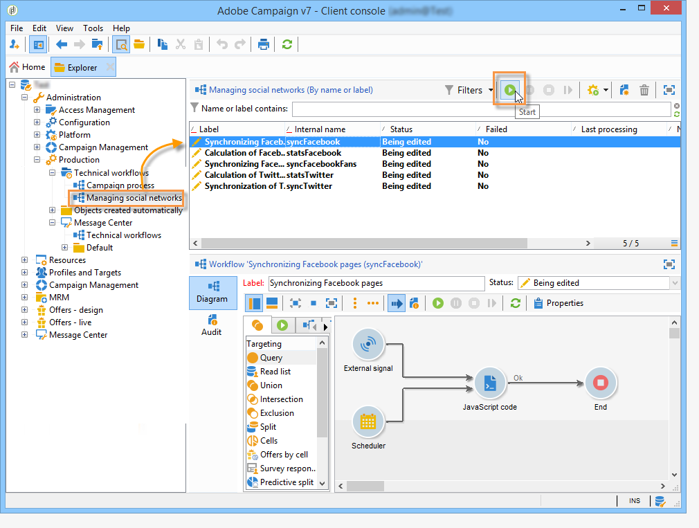

# Avvio dei flussi di lavoro{#starting-workflows}

I **[!UICONTROL Managing social networks]** flussi di lavoro a cui si accede tramite il **[!UICONTROL Administration > Production > Technical workflows > Managing social networks]** nodo consentono di sincronizzare  Adobe Campaign con Twitter e Facebook.

La prima volta che utilizzate Social Marketing, questi flussi di lavoro vengono interrotti per impostazione predefinita. Per avviarle, fare clic sul **[!UICONTROL Start]** pulsante nella barra degli strumenti.

Se esiste un social network che non desideri usare, consigliamo di non avviare i flussi di lavoro corrispondenti. Per evitare di ricevere un avviso che indica che i flussi di lavoro di produzione vengono interrotti, selezionate il livello di gravità **[!UICONTROL Normal]** nella **[!UICONTROL Execution]** scheda delle proprietà dei flussi di lavoro interessati.

