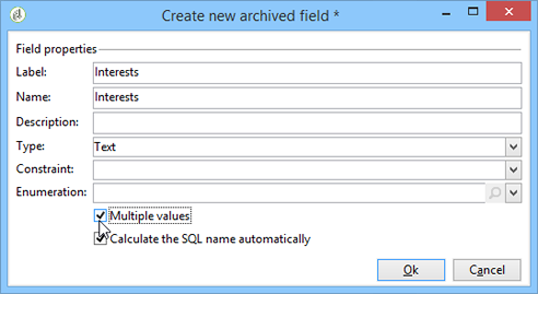

# Progettare un sondaggio{#building-a-survey}

## Crea un nuovo sondaggio {#creating-a-new-survey}

Questo capitolo descrive la progettazione di un **Sondaggio** digita il modulo utilizzando Adobe Campaign, nonché le opzioni e le configurazioni disponibili. Adobe Campaign consente di rendere questo sondaggio disponibile agli utenti e di raccogliere e archiviare le risposte nel database.

I moduli web sono accessibili tramite **[!UICONTROL Resources > Online > Web applications]** dell&#39;albero. Per creare un sondaggio, fai clic su **[!UICONTROL New]** sopra l&#39;elenco delle applicazioni oppure fare clic con il pulsante destro del mouse sull&#39;elenco e scegliere **[!UICONTROL New]**.

Seleziona il modello del sondaggio (**[!UICONTROL newSurvey]** per impostazione predefinita).

Le pagine del modulo vengono create utilizzando un editor speciale che consente di definire e configurare campi di input (testo), campi di selezione (elenchi, caselle di controllo, ecc.) ed elementi statici (immagini, contenuto HTML, ecc.). Essi possono essere raccolti in &quot;contenitori&quot; e disposti secondo i requisiti. [Ulteriori informazioni](#adding-questions)).

>[!NOTE]
>
>Per ulteriori informazioni su come definire il contenuto e creare layout di schermo per un modulo Web, fare riferimento a [questo documento](../../web/using/about-web-forms.md).

## Aggiungi campi {#adding-fields}

I campi di un modulo consentono agli utenti di immettere informazioni e selezionare opzioni. Per ogni pagina del modulo, vengono create tramite il primo pulsante nella barra degli strumenti utilizzando **[!UICONTROL Add using the wizard]** menu.

>[!NOTE]
>
>È inoltre possibile fare clic con il pulsante destro del mouse e inserire un&#39;area di input. Per impostazione predefinita, la zona viene inserita alla fine della struttura selezionata. Utilizza le frecce nella barra degli strumenti per spostarla.

### Tipi di campi {#types-of-fields}

Quando si aggiunge un campo a un sondaggio, è necessario selezionarne il tipo. Sono disponibili le seguenti opzioni:

1. **[!UICONTROL Answer a question]**: questa opzione ti consente di dichiarare un nuovo campo (noto come &quot;campo archiviato&quot;) per memorizzare le risposte. In questo caso, tutti i valori raccolti vengono salvati, anche quando un partecipante compila il modulo più di una volta. Questa modalità di archiviazione è disponibile solo in **Sondaggi**. [Ulteriori informazioni](../../surveys/using/managing-answers.md#storing-collected-answers).
1. **[!UICONTROL Edit a recipient]**: questa opzione consente di selezionare un campo nel database. In questo caso, le risposte dell&#39;utente verranno memorizzate in questo campo. Per ogni partecipante, viene mantenuto solo l’ultimo valore salvato e aggiunto ai dati del profilo.
1. **[!UICONTROL Add a variable]**: questa opzione consente di creare una configurazione in modo che le informazioni non vengano memorizzate nel database. Le variabili locali possono essere dichiarate a monte. Puoi anche aggiungerli direttamente durante la creazione del campo.
1. **[!UICONTROL Import an existing question]**: questa opzione consente di importare le domande esistenti create in altri sondaggi.

   >[!NOTE]
   >
   >Le modalità di archiviazione e le importazioni sul campo sono descritte in dettaglio nella [questa sezione](../../surveys/using/managing-answers.md#storing-collected-answers).

La natura del campo da aggiungere (elenco a discesa, campo di testo, caselle di controllo e così via) si adatta alla modalità di archiviazione selezionata. È possibile modificarlo utilizzando **[!UICONTROL Type]** campo del **[!UICONTROL General]** , ma assicurati di rimanere coerente con il tipo di dati.

I vari tipi di campi disponibili sono descritti in [questa sezione](../../web/using/about-web-forms.md).

## Elementi specifici del sondaggio {#survey-specific-elements}

I sondaggi online si basano sulle funzionalità delle applicazioni web. Le funzionalità specifiche del sondaggio sono descritte di seguito.

### Scelte multiple {#multiple-choice}

Per **[!UICONTROL Multiple choice]** controlli di tipo, è possibile definire un numero minimo e massimo di selezioni. Ad esempio, questa opzione consente di forzare la selezione ad almeno **2** valori e al massimo **4** valori dalle opzioni disponibili:

Se il numero di selezioni è troppo grande o troppo piccolo, viene visualizzato il messaggio appropriato.

>[!NOTE]
>
>In questo caso, le opzioni vengono selezionate utilizzando le caselle di controllo. Quando è possibile utilizzare una sola opzione, vengono utilizzati i pulsanti di scelta.

La configurazione corrispondente è la seguente:

Inoltre, la posizione di archiviazione per questo campo di input deve essere **[!UICONTROL Multiple values]** tipo **campo archiviato**:

>[!CAUTION]
>
>* Questa funzionalità è disponibile solo per **Sondaggio** digita i moduli.
>* Questa opzione non è compatibile con la visualizzazione casuale delle domande. [Ulteriori informazioni](#adding-questions).

### Aggiungi domande {#adding-questions}

Esistono due tipi di contenitori: standard e domanda. I contenitori Standard vengono utilizzati per configurare il layout di pagina e la visualizzazione condizionale in una pagina. [Ulteriori informazioni](../../web/using/about-web-forms.md).

Utilizza un **Domanda** Contenitore per aggiungere una domanda alla pagina e inserire le possibili risposte di seguito nella gerarchia. Le risposte degli utenti alle domande poste in questo tipo di contenitore possono essere analizzate nei rapporti.

>[!CAUTION]
>
>Non inserire mai **Domanda** contenitore sotto un altro **Domanda** contenitore nella gerarchia.

L&#39;etichetta della domanda viene immessa nel campo etichetta. In questo caso, verrà applicato lo stile del foglio di stile del modulo. Seleziona la **[!UICONTROL Enter the title in HTML format]** per personalizzarlo. In questo modo potrai accedere all’editor di HTML.

>[!NOTE]
>
>Fai riferimento a [questo documento](../../web/using/about-web-forms.md) per ulteriori informazioni sull’utilizzo dell’editor di HTML.

Ad esempio:

Nell’esempio precedente, il rendering sarà il seguente:

>[!NOTE]
>
>Ogni domanda ha un **Domanda** tipo di contenitore.

Puoi abilitare il disegno casuale delle domande in Adobe Campaign. È quindi possibile specificare il numero di domande da visualizzare nella pagina, nel campo che si trova nella parte inferiore della finestra di configurazione.

Il rendering sarà simile al seguente:

Quando la pagina viene aggiornata, le domande visualizzate non sono le stesse.

>[!CAUTION]
>
>Quando si visualizza una domanda in modo casuale (**[!UICONTROL Display randomly]** opzione selezionata nella pagina), fai attenzione a non utilizzare domande a scelta multipla per le quali una o più selezioni sono obbligatorie.
